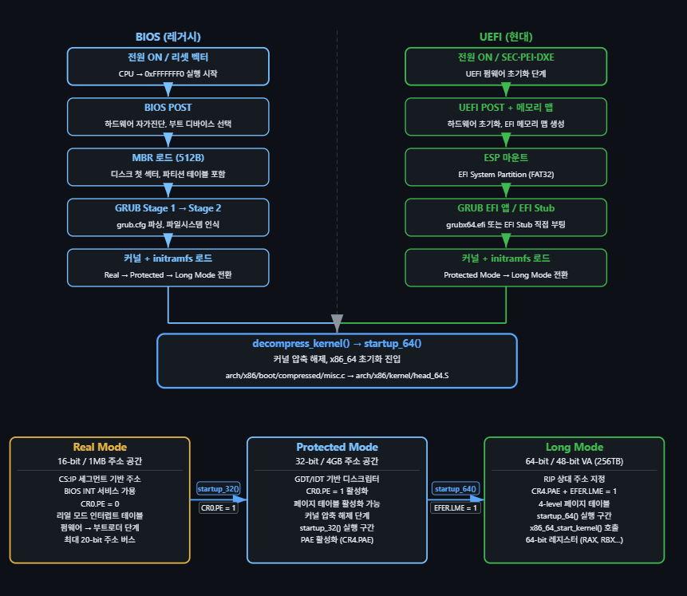
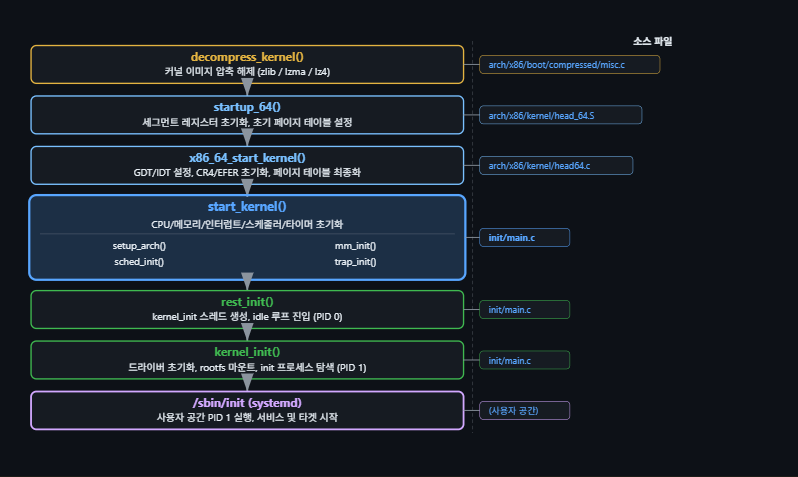
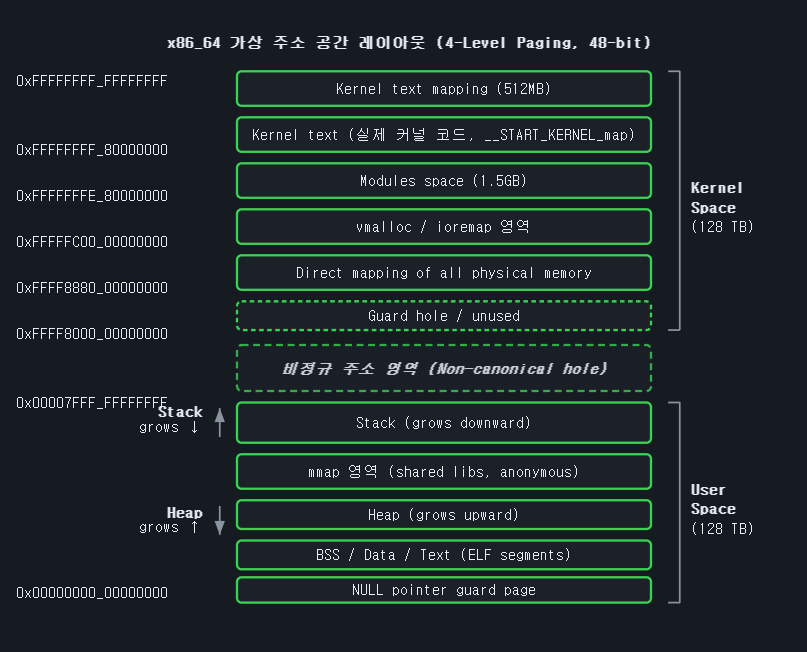
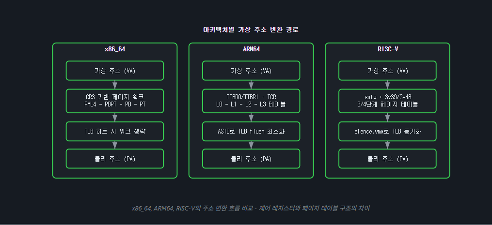
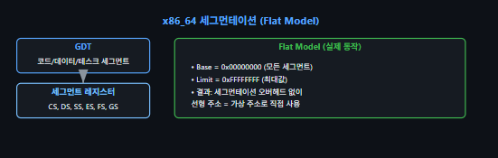
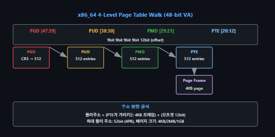
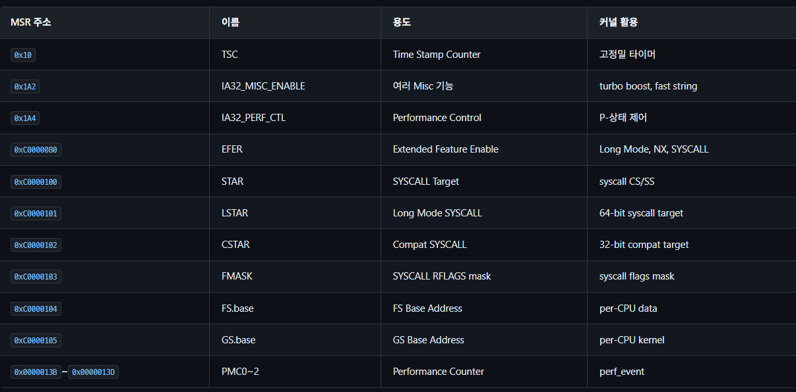
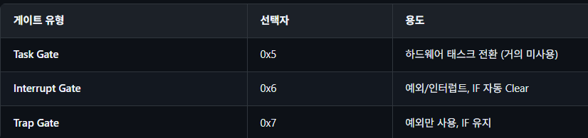
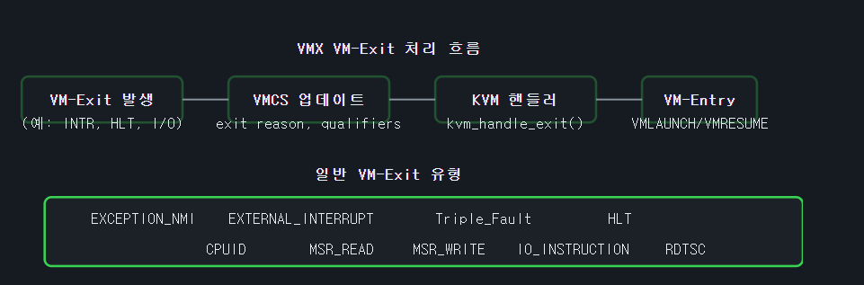
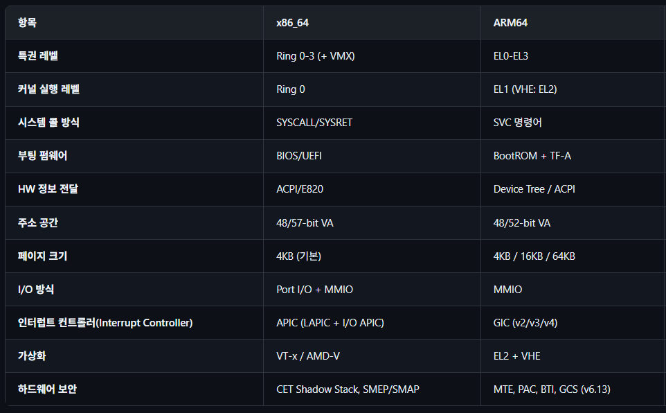

# 부팅 단계





1단계: 하드웨어의 기상과 펌웨어 초기화 (Power ON)
컴퓨터에 전원이 공급되면, CPU는 하드웨어적으로 고정된 메모리 주소(0xFFFFFFF0, 리셋 벡터)로 이동해 첫 번째 명령어를 찾습니다. 여기서부터 시스템의 뼈대를 세우는 작업이 레거시(BIOS) 방식과 현대(UEFI) 방식으로 나뉘어 진행됩니다.

BIOS (레거시 환경)
BIOS POST: 메모리, 키보드, 디스크 등 기본 하드웨어가 정상인지 자가 진단(POST)을 수행합니다.

MBR 로드: 부팅 디스크의 맨 첫 번째 512바이트(MBR)를 읽어옵니다. 여기에는 파티션 테이블과 아주 작은 부트로더 코드가 들어있습니다.

GRUB Stage 1 -> 2: MBR의 작은 용량 한계 때문에, GRUB은 여러 단계를 거쳐 몸집을 불립니다. 최종적으로 grub.cfg를 읽고 파일 시스템을 인식합니다.

UEFI (현대 환경)
SEC-PEI-DXE 단계: 레거시 BIOS의 한계를 극복한 일종의 미니 OS처럼 동작하며, 훨씬 빠르고 복잡하게 하드웨어와 메모리 맵을 초기화합니다.

ESP 마운트: 디스크에 있는 FAT32 포맷의 EFI 시스템 파티션(ESP)을 직접 읽어냅니다.

GRUB EFI 앱 / EFI Stub: MBR 같은 복잡한 과정 없이, ESP 파티션에 있는 .efi 확장자의 부트로더(grubx64.efi)나 커널 자체를 직접 실행합니다.

이 단계의 최종 목표는 부트로더가 디스크에 잠들어 있던 커널(Kernel)과 필수 드라이버 압축 파일(initramfs)을 메모리(RAM)로 끌어올리는 것입니다.

2단계: CPU의 진화와 커널 로드 (모드 전환의 연속)
부트로더가 커널에 제어권을 넘겨주는 과정에서, CPU는 과거의 족쇄를 하나씩 풀며 64비트 완전체로 거듭납니다. (UEFI는 이 과정의 일부를 건너뛰지만, 구조적 이해를 위해 전체 흐름을 짚습니다.)

Real Mode (16-bit):
CPU가 처음 깨어난 상태입니다. 주소 버스가 20비트라 최대 1MB의 메모리만 볼 수 있습니다 (CS:IP 세그먼트 기반). 보안 개념이 없고 BIOS 인터럽트를 의존하는 원시적인 상태입니다. 여기서 startup_32()를 호출하며 다음 단계로 넘어갈 준비를 합니다.

Protected Mode (32-bit):
CR0 레지스터의 PE (Protection Enable) 비트를 1로 바꾸면서 진입합니다. 드디어 4GB의 메모리를 볼 수 있으며, GDT(Global Descriptor Table)와 IDT(Interrupt Descriptor Table)의 기초를 세워 메모리 접근 권한을 통제하기 시작합니다. 여기서 64비트 페이징을 위해 CR4 레지스터의 PAE (Physical Address Extension)를 활성화합니다.

Long Mode (64-bit):
EFER 레지스터의 LME (Long Mode Enable) 비트를 1로 켜면서 64비트 모드로 변신합니다. 이제 RAX, RBX 같은 64비트 범용 레지스터를 사용할 수 있고, 무려 256TB의 가상 주소 공간(VA)을 다루는 4단계 페이지 테이블(4-level Page Table) 체제가 활성화됩니다.

3단계: 커널 압축 해제와 로우레벨 뼈대 구축 (어셈블리 영역)
CPU가 64비트로 달릴 준비를 마쳤으니, 메모리에 올라와 있던 커널이 기지개를 켭니다.

decompress_kernel():
압축 상태(zlib, lzma, lz4 등)로 메모리에 올라와 있던 커널 이미지 본체의 압축을 쫙 풀어냅니다. (arch/x86/boot/compressed/misc.c)

startup_64():
압축이 풀린 진짜 커널이 실행되는 첫 지점입니다. 과거의 잔재인 세그먼트 레지스터들을 0으로 싹 밀어버리고 'Flat Memory Model'을 적용합니다. 그리고 당장 커널 코드가 실행되다 죽지 않도록, 가상 주소와 물리 주소를 1:1로 잇는 '임시 초기 페이지 테이블(Early Page Table)'을 뚝딱 만들어냅니다. (arch/x86/kernel/head_64.S)

x86_64_start_kernel():
이제 C 언어 코드로 진입합니다. 여기서 시스템 전체가 쓸 '최종 정밀 페이지 테이블'을 완성합니다. 임시로 만들었던 GDT와 IDT도 완벽한 구조로 다시 설정하여 보안 검색대와 비상 연락망을 최종 확정합니다. (arch/x86/kernel/head64.c)

4단계: 진짜 운영체제의 가동 (C 언어 - start_kernel)
시스템의 하드웨어/로우레벨 세팅이 끝났습니다. 이제 리눅스 커널의 진짜 메인 함수인 start_kernel()이 실행되며 운영체제의 핵심 부품들을 하나씩 조립합니다. (init/main.c)

setup_arch(): x86_64 아키텍처에 맞는 CPU 세부 설정을 마무리합니다.

trap_init(): 0으로 나누기, 페이지 폴트 같은 예외 상황을 처리할 인터럽트 핸들러를 등록합니다.

mm_init() (메모리 관리자 가동):
이곳에서 리눅스 메모리 관리의 양대 산맥이 켜집니다.

버디 시스템(Buddy System): 물리 메모리를 4KB 단위의 큰 덩어리(도매)로 2등분씩 쪼개고 합치며 관리합니다.

슬랩 할당자(Slab Allocator): 버디 시스템의 메모리 낭비를 막기 위해, 큰 덩어리를 다시 100바이트 등 아주 작은 '맞춤형 얼음 틀(소매)'로 쪼개어 캐싱하고 재사용합니다.

sched_init(): 수많은 프로그램이 CPU를 공평하게 나눠 쓸 수 있게 해주는 프로세스 스케줄러를 초기화합니다.

5단계: 닭과 달걀 딜레마 해결과 유저 공간 진입
커널 초기화가 끝나면, 드디어 인간(사용자)이 사용할 수 있는 환경을 만들어야 합니다. 이 대미를 장식하는 것이 rest_init()과 kernel_init()입니다.

PID 0과 새로운 스레드 (rest_init):
지금까지 이 모든 작업을 수행한 최초의 실행 흐름은 훗날 CPU가 할 일이 없을 때 뺑뺑이를 도는 'idle 루프(PID 0)'가 되어 휴식에 들어갑니다. 대신 새로운 커널 스레드(kernel_init)를 하나 파생시켜 다음 임무를 맡깁니다.

initramfs 임시 공간 마운트 (kernel_init):
디스크를 읽으려면 드라이버가 필요하고, 드라이버를 가져오려면 디스크를 읽어야 하는 모순이 발생합니다. 이를 해결하기 위해 부트로더가 커널과 함께 올려준 initramfs를 '임시 루트 파일 시스템'으로 마운트합니다.

드라이버 로드 및 물리 디스크 인식:
initramfs 안에 들어있던 핵심 스토리지 드라이버(NVMe, SSD 등)를 커널에 장착합니다. 이제 드디어 진짜 물리 하드디스크를 눈으로 볼 수 있게 됩니다.

switch_root (뿌리 바꿔치기):
진짜 디스크의 파티션을 찾아내어 마운트한 뒤, 시스템의 뿌리 경로(/)를 임시 램디스크에서 진짜 물리 디스크로 순식간에 바꿔치기 합니다. 역할을 다한 initramfs는 메모리에서 삭제됩니다.

PID 1의 탄생 (/sbin/init 또는 systemd):
루트 디스크를 읽게 된 커널은 시스템의 첫 번째 사용자 프로그램인 /sbin/init을 찾아 실행합니다. 이 순간, 제어권이 커널 공간(Kernel Space)에서 사용자 공간(User Space)으로 넘어옵니다!
이 프로세스가 무적의 PID 1을 부여받고, 네트워크, 오디오, 그래픽 등 모든 백그라운드 서비스를 줄줄이 깨우면서 마침내 우리가 아는 로그인 화면을 모니터에 띄우게 됩니다.

```c
/* arch/x86/kernel/head_64.S - x86_64 커널 엔트리 포인트 (간략화) */

SYM_CODE_START_NOALIGN(startup_64)
    /* 세그먼트 레지스터 초기화, 전부 0으로 만듬. */
    xorl    %eax, %eax
    movl    %eax, %ds
    movl    %eax, %es
    movl    %eax, %ss
    movl    %eax, %fs
    movl    %eax, %gs
    /* 초기 페이지 테이블 설정 (Identity mapping),임시지도*/
    leaq    early_top_pgt(%rip), %rax
    movq    %rax, %cr3
    /* 스택 포인터 설정, 커널이 사용할 초기 스택 공간의 끝 주소 계산 */
    leaq    init_thread_union+THREAD_SIZE(%rip), %rsp
    /* C 코드로 점프, 다음 초기화 함수 시작 */
    call    x86_64_start_kernel
SYM_CODE_END(startup_64)
```

### 주소 공간 레이아웃
x86_64에서는 48비트 가상 주소 공간(256TB)을 사용합니다. 이 공간은 사용자 영역(하위)과 커널 영역(상위)으로 명확하게 분리됩니다. 최신 커널에서는 5-level paging을 통해 57비트(128PB) 주소 공간도 지원합니다. 다음 다이어그램은 4-level paging 기준 주소 공간 레이아웃을 보여줍니다.



모든 프로그램은 각 프로그램마다 사용자 가상 공간인 128TB를 가지고 있고 커널 영역은 공유한다.

1. 사용자 공간 (User Space, 하위 128TB)
우리가 실행하는 일반 프로그램(웹 브라우저, 게임 등)이 갇혀서 노는 공간입니다. 가장 낮은 주소인 0x00000000_00000000부터 위로 올라가며 채워집니다.

NULL pointer guard page: 맨 밑바닥 공간입니다. 프로그래머가 실수로 비어있는(NULL) 포인터에 접근하면 바로 에러를 띄워 프로그램이 뻗게 만드는 함정 구역입니다.

BSS / Data / Text: 프로그램의 실제 코드(Text)와 전역 변수들이 올라가는 자리입니다.

Heap (위로 자람): 프로그램이 실행 중에 동적으로 메모리를 할당(malloc)할 때 쓰는 공간입니다. 데이터가 쌓일수록 위쪽 주소로 자라납니다.

Stack (아래로 자람): 함수의 지역 변수들이 저장되는 공간입니다. 위쪽(0x00007FFF_FFFFFFFF)에서 시작해서 데이터가 쌓일수록 아래쪽 주소로 자라납니다. (Heap과 Stack이 서로 마주 보고 자라나는 구조입니다.)

2. 비정규 주소 영역 (Non-canonical hole)
사용자 공간의 끝과 커널 공간의 시작 사이에는 아무도 쓸 수 없는 거대한 구멍(Hole)이 존재합니다.

만약 해커나 버그 걸린 프로그램이 잘못된 주소를 참조해서 이 공간을 건드리면, CPU가 즉각적으로 차단(Page Fault)을 걸어 시스템을 보호합니다. 완충 지대이자 보안 구역인 셈입니다.

3. 커널 공간 (Kernel Space, 상위 128TB)
운영체제의 심장인 커널만이 접근할 수 있는 절대 권력의 구역입니다. 주소의 맨 앞자리가 항상 0xFFFF...로 시작합니다.

Direct mapping of all physical memory: 커널은 컴퓨터에 꽂힌 실제 RAM(물리 메모리) 전체를 이 공간에 1:1로 싹 다 매핑해 둡니다. 커널이 언제든 가장 빠르게 물리 메모리에 접근하기 위한 꼼수(?)이자 필수적인 설계입니다.

vmalloc / ioremap 영역: 물리적으로는 떨어져 있는 메모리 조각들을 가상 주소상에서는 연속된 것처럼 이어 붙여서 쓸 때 사용하는 공간입니다. 하드웨어 장치(그래픽 카드 등)의 메모리를 연결할 때도 쓰입니다.

Modules space: 그래픽 카드 드라이버, 랜카드 드라이버 같은 커널 모듈들이 꽂히는 자리입니다.

Kernel text: 1번 이미지에서 압축을 풀고 세팅했던 리눅스 커널의 핵심 코드 본체가 실제로 둥지를 틀고 앉아있는 가장 은밀한 꼭대기 공간입니다.

### 아키텍처별 주소 변환 경로 비교
가상 주소(Virtual Address)를 물리 주소(Physical Address)로 변환하는 핵심 경로는 세 아키텍처 모두 유사하지만, 제어 레지스터(Register)와 페이지 테이블 포맷이 다릅니다. 아래 다이어그램은 x86_64, ARM64, RISC-V의 변환 경로를 한 화면에서 비교합니다.

- 제어 레지스터 = 시작점
- 페이지 테이블 포맷 = 형식



1. 지도를 찾는 과정 (페이지 테이블 워크)
가상 주소를 물리 주소로 바꾸려면 메모리에 있는 '페이지 테이블'이라는 지도를 여러 단계에 걸쳐 넘겨봐야 합니다. 사진의 두 번째 칸이 바로 이 과정을 뜻합니다.

- x86_64 (인텔/AMD): 변환을 시작할 때 CR3 레지스터를 기반으로 페이지 워크를 수행합니다. 지도는 총 4단계로 쪼개져 있으며, PML4 - PDPT - PD - PT 순서로 거쳐 갑니다.
- ARM64 (스마트폰, 애플 실리콘 등): TTBR0/TTBR1 레지스터와 TCR을 사용해 변환을 시작합니다. 여기서는 지도의 단계를 L0 - L1 - L2 - L3 테이블이라고 부릅니다.
- RISC-V: satp 레지스터를 사용합니다. Sv39 또는 Sv48 포맷을 사용하여 3단계 또는 4단계 페이지 테이블을 거쳐 물리 주소를 찾습니다.

2. 변환 속도 올리기 (TLB 캐시)
매번 3~4단계씩 지도를 뒤지면 컴퓨터가 너무 느려지겠죠? 그래서 한 번 찾아본 가상 주소-물리 주소 짝꿍은 TLB(Translation Lookaside Buffer)라는 초고속 캐시에 기억해 둡니다. 사진의 세 번째 칸은 이 TLB를 다루는 각자의 특징입니다.

- x86_64: 만약 찾으려는 주소가 이미 TLB에 있다면(TLB 히트), 복잡한 페이지 워크 과정을 아예 생략하고 곧바로 물리 주소로 넘어갑니다.
- ARM64: 프로세스가 바뀔 때마다 캐시(TLB)를 싹 다 지우면 비효율적이므로, 프로세스마다 번호표를 붙여주는 ASID(주소 공간 ID)를 활용하여 TLB flush(초기화)를 최소화합니다.
- RISC-V: 페이지 테이블 내용이 바뀌었을 때 TLB가 옛날 정보를 들고 있지 않도록, sfence.vma라는 특수 명령어를 사용해 TLB를 최신 상태로 동기화해 줍니다.

### 세그먼테이션과 페이징(Segmentation & Paging)
x86_64에서 세그먼테이션은 사실상 flat model로 사용됩니다. 모든 세그먼트의 베이스가 0이고 리미트가 최대값으로 설정되어, 세그먼테이션은 사실상 비활성화된 상태입니다. 그러나 GDT(Global Descriptor Table)는 여전히 존재하며, 커널/사용자 모드 전환과 TSS(Task State Segment)를 위해 필수적입니다.

- flat model: 메모리 구역을 나누는 세그먼테이션과 달리 그냥 0번지부터 최대까지 같다 하고 쓴다.
- GDT: 그래도 다 같게 하면 커널, 유저 구분이 안가니 모드 전환, TSS를 위해서 쓴다. 즉, 인터럽트 같은게 나면 GDT -> TSS -> 커널 스택에서 일 처리를 하는 것이다.



페이징은 4단계 페이지 테이블을 사용합니다 (5단계 페이징은 CONFIG_X86_5LEVEL=y로 활성화).

#### 가상 주소 -> 물리 주소

1단계: PGD (Page Global Directory) - 512 엔트리로 구성되며 CR3 레지스터가 이를 가리킵니다. 주소 변환 시 48비트 가상 주소 중 47~39번째 비트(9bit)를 사용합니다.

2단계: PUD (Page Upper Directory) - 512 엔트리로 구성됩니다. 가상 주소의 38~30번째 비트(9bit)를 사용합니다.

3단계: PMD (Page Middle Directory) - 512 엔트리로 구성됩니다. 가상 주소의 29~21번째 비트(9bit)를 사용합니다.

4단계: PTE (Page Table Entry) - 512 엔트리로 구성됩니다. 가상 주소의 20~12번째 비트(9bit)를 사용하며 최종 물리 페이지 매핑을 담당합니다.



### 링 구조(Protection Rings)
x86_64는 4개의 특권 레벨(Ring 0 ~ Ring 3)을 제공하지만, 리눅스에서는 실제로 Ring 0(커널 모드)와 Ring 3(사용자 모드) 두 레벨만 사용합니다. Ring 1과 Ring 2는 사용되지 않으며, 가상화(Virtualization) 확장(VT-x)에서는 Ring -1(VMX root mode)이라는 개념이 추가됩니다.

### MSR (Model-Specific Register)
프로세서 모델별로 정의되는 특수 레지스터입니다. 이름 그대로 인텔이나 AMD 같은 CPU 제조사가 자신들의 특정 모델(Model)에만 특별한 기능들을 제어하기 위해 몰래 파놓은 전용 레지스터입니다.

일반적인 계산용이 아니라, CPU의 핵심 성능이나 상태를 제어합니다. 대표적으로 성능 카운터, 전원 관리, 터보 부스트, 가상화(virtualization) 기능 등을 제어하는 스위치 역할을 합니다.

리눅스 커널은 rdmsr/wrmsr 명령어로 MSR에 접근합니다.



- TSC (0x10): 고정밀 타이머(Time Stamp Counter)입니다. 컴퓨터가 켜진 후 CPU 클럭이 몇 번이나 뛰었는지 아주 정밀하게 세어주는 초정밀 시계입니다.
- IA32_MISC_ENABLE (0x1A2): 터보 부스트(turbo boost) 같은 여러 부가 기능을 켜고 끌 수 있습니다.
- EFER (0xC0000080): 우리가 앞서 부팅 과정에서 CPU를 64비트(Long Mode)로 변신시킬 때 켰던 바로 그 레지스터입니다.
- STAR / LSTAR (0xC0000100, 0xC0000101): 유저 프로그램이 커널에 도움을 요청하는 '시스템 콜(syscall)'을 할 때, 커널의 어느 주소로 점프해야 하는지 그 목적지(target)를 지정해 두는 곳입니다.

```c
/* arch/x86/include/asm/msr.h - MSR 접근 매크로 */
// 리눅스 커널은 MSR에 접근하기 위해 rdmsr (읽기) 및 wrmsr (쓰기)라는 전용 특수 명령어를 사용해야 합니다.
/* MSR 읽기 */
static inline u64 rdmsrl(unsigned int msr)
{
    u64 val;
    asm volatile("rdmsr" : "=A"(val) : "c"(msr));
    return val;
}

/* MSR 쓰기 */
static inline void wrmsrl(unsigned int msr, u64 val)
{
    asm volatile("wrmsr" : : "c"(msr), "A"(val));
}

/* 시스템 콜 진입 MSR 설정 예시 */
wrmsrl(MSR_LSTAR, (unsigned long)entry_SYSCALL_64);
wrmsrl(MSR_FMASK, 0);
wrmsrl(MSR_STAR, ((u64)__KERNEL_CS << 32) | (__USER_CS << 16));
```

##### MSR 접근 주의
일부 MSR은 특권 레벨(Ring 0)에서만 접근 가능합니다. 유저 공간에서 rdmsr을 시도하면 #GP 예외가 발생합니다. 커널 드라이버에서는 wrmsr()을 사용하기 전에 capable(CAP_SYS_RAWIO)로 권한을 검사해야 합니다.


### x86_64 시스템 콜 Internals
x86_64 시스템 콜은 SYSCALL 명령어로 진입하며, MSR에 설정된 핸들러 주소로 점프합니다. (MSR_LSTAR (0xC0000101) 여기 안에 커널이 부팅될 때 entry_SYSCALL_64 주소를 넣어놓는다.)

복귀는 SYSRET 명령어로 수행됩니다.

```c
/* arch/x86/entry/entry_64.S - syscall 진입 흐름 (핵심 부분) */
/* 사용자 공간에서 SYSCALL */
    syscall                    /* RAX=syscall 번호, RDI, RDI, RDX, RSI, R8, R9 = 인자 */
                                /* RIP → MSR_LSTAR에 저장된 주소 */
entry_SYSCALL_64:
    /* 레지스터 저장 (pt_regs 구조체): 다 작업하고 다시 돌아가기 위해 프롤로그 작업 */
    push   %rax           /* RAX 저장 (syscall 번호) */
    cld
    push   %r15
    push   %r14
    push   %r13
    push   %r12
    push   %r11           /* RFLAGS 저장 */
    push   %r10
    push   %r9
    push   %r8
    push   %rcx           /* RIP 저장 (복귀 주소) */
    push   %r11          /* RFLAGS 재저장 */
    push   %rdx
    push   %rsi
    push   %rdi
    push   %rbp
    push   %rax           /* syscall 번호 */

    /* GS 기반 per-CPU 접근 시작 */
    SWAPGS                /* GS → 커널 GS로 교체 */
    /* 시스템 콜 테이블에서 핸들러 호출 */
    mov    %rsp, %gs:thread_struct.sp0  /* 커널 스택 설정 */
    mov    %rsp, %rsp
    test   $3, %rsp          /* Ring 3에서 호출? */
    jz     1f
    swapgs
    /* 멀티코어 환경에서는 코어마다 MSR(GS.base)을 다르게 써서 자기 정보를 찾는다
    유저 프로그램도 자기 마음대로 %gs 레지스터를 쓰고 있었을 텐데, 커널 모드로 들어왔으니 SWAPGS 명령어를 써서 순식간에 %gs 레지스터가 가리키는 곳을 '해당 코어의 커널 전용 데이터 주소'로 확 바꿔치기합니다.
    이제 커널은 안심하고 자기 코어 전용 변수들을 가져다 쓸 수 있습니다.
    */
1:
    and    $-16, %rsp // 스택 정렬
    mov    %rsp, %gs:cpu_tss.x86_tss.sp1 // 비상용 스택 백업
    leaq   -RED_ZONE_SIZE(%rsp), %rsp // 레드 존 회피(유저가 숨겨둔 공간 밟지 않기)
    push   %rsp
    push   %gs:cpu_tss.x86_tss.sp0
    /* syscall 테이블 호출 */
    mov    %rax, %rsp
    sub    $SIZEOF(pt_regs), %rsp
    mov    %rax, %rsp        /* pt_regs 빌드 */
    mov    %rsp, %rdi
    call   do_syscall_64 // 실제 c 함수 호출
    /* 복귀 */
    ret
syscall_return:
    SWAPGS
    sysretq              /*Ring 3 복귀, RIP=RCX, RFLAGS=RDX */
```
요약
1. 유저: "커널아, 파일 좀 읽어줘!" 하고 syscall 발동
2. CPU (하드웨어): MSR_LSTAR를 보고 커널 코드로 강제 점프! (이때 돌아갈 주소는 %rcx에 슬쩍 킵해둠)
3. 커널 (어셈블리): 유저 레지스터들 스택에 다 백업(pt_regs)하고, SWAPGS로 커널 전용 모드로 전환. 커널에서 GS는 세그먼테이션 구역 나누기가 폐지되었지만 FS와 함께 특별한 용도로 쓴다. CPU 코어의 데이터 주소를 가리키는 포인터이다. 따라서 쓸 수 밖에 없고 커널 모드에 들어가기 전에 특정 값으로 세팅해야한다. SWAPGS로 유저가 쓰는 것은 숨기고 커널 전용 GS 주소로 바꿔치기 한다.
4. 커널 (C 언어): do_syscall_64에서 요청한 작업(파일 읽기) 처리. 레지스터 세팅하고 sys_call_table을 rax로 참조한다.
5. 커널 (어셈블리): 백업했던 유저 레지스터 복구하고 sysretq 발동.
6. 유저: 아무 일도 없었던 것처럼, 파일이 읽힌 상태로 다음 줄 코드 실행.

### x86_64 인터럽트 처리
x86_64의 인터럽트 처리는 IDT(Interrupt Descriptor Table)과 LAPIC(Local APIC)가 담당합니다. 예외, IRQ, NMI 모두 IDT 게이트를 통해 처리됩니다.



```c
/* arch/x86/include/asm/desc.h - IDT 게이트 구조 */
struct gate_struct {
    u16 offset_low;         /* offset [15:0] */
    u16 selector;           /* 코드 세그먼트 셀렉터 */
    u8  ist;                /* Interrupt Stack Table: 유저스택,커널스택이 박살나서 메모리 오염이 되어도 ist값에 특정 번호를 적어두면 IST로 강제 이동해서 기존 스택 무시하고 에러를 처리한다. */
    u8  type_attr;         /* Type (0x6=Interrupt, 0x7=Trap) | DPL | P : 게이트 종류, 권한 명시*/
    u16 offset_mid;       /* offset [31:16] */
    u32 offset_high;       /* offset [63:32] */
    u32 reserved;       /* 보존 */
} __attribute__((packed));
//offset 조각 난 이유 : 16->32->64비트 CPU 호환성 때문.

/* IRQ 벡터 할당 */
#define FIRST_EXTERNAL_VECTOR    0x20  /* IRQ0 */
#define FIRST_SYSTEM_VECTOR  0xE0  /* Local APIC */
#define GLOBAL_INTR_VECTORS    224    /* IRQ0~15 + IOAPIC */
```

gate_struct = 인터럽트가 발생했을 때 실행할 커널 함수의 주소를 적어두는 구조체

Interrupt Gate (0x6):
- 특징: 이 문으로 들어가면 CPU가 IF(Interrupt Flag)라는 스위치를 자동으로 꺼버립니다(Clear).
- 의미: "지금 키보드 입력이나 마우스 클릭 같은 진짜 급한 하드웨어 인터럽트를 처리 중이니까, 작업 끝날 때까지 다른 알람은 다 울리지 마!" 하고 귀를 막아버리는 독재자 모드입니다.

Trap Gate (0x7):
- 특징: 이 문으로 들어가면 IF 스위치를 그대로 유지합니다.
- 의미: 주로 프로그램이 0으로 나누거나 에러를 뿜었을 때(예외 상황) 사용합니다. 에러를 처리하긴 하겠지만, "처리 도중에 진짜 급한 하드웨어 알람이 오면 그건 받을게!" 하고 귀를 열어두는 모드입니다.

0번 ~ 31번 (0x1F): 인텔 CPU가 "이 번호는 우리 CPU에서 터지는 치명적인 에러(0으로 나누기, 페이지 폴트 등) 전용 번호니까 아무도 쓰지 마!" 하고 찜해둔 고정 번호입니다.

FIRST_EXTERNAL_VECTOR 0x20 (32번):
CPU가 찜해둔 번호가 딱 끝나는 32번(0x20)부터 비로소 키보드, 마우스, 네트워크 카드 같은 외부 하드웨어 기기들의 인터럽트(IRQ) 번호로 할당하기 시작한다는 뜻입니다.

FIRST_SYSTEM_VECTOR 0xE0 (224번):
이 뒤쪽 번호들은 리눅스 커널이 자기들끼리 신호를 주고받거나(IPI), CPU 코어 간 통신을 위해 쓰는 시스템 전용 특수 번호로 사용됩니다.

- 정리
1. 256칸짜리 아파트 짓기 (IDT 배열 생성)
리눅스 커널은 부팅 초반에 메모리(RAM) 빈 공간을 하나 잡고, 방금 보신 gate_struct 명함 256장을 쭈르륵 이어서 거대한 배열(Array)을 하나 만듭니다.

0번째 칸에는 0으로 나누기 에러 함수 주소

33번째 칸에는 키보드 처리 함수 주소...
이런 식으로 256개의 칸을 다 채워 넣습니다. 이 거대한 아파트 전체가 바로 우리가 계속 부르던 IDT(Interrupt Descriptor Table)의 실체입니다.

2. CPU에게 수첩 위치 알려주기 (IDTR 레지스터)
아파트를 다 지었으면, 하드웨어(CPU)에게 "비상사태 터지면 여기 있는 주소록을 보고 뛰어!"라고 알려줘야겠죠?

CPU 내부에는 IDTR (Interrupt Descriptor Table Register)이라는 아주 특별한 레지스터가 딱 하나 있습니다.

이 레지스터의 유일한 임무는 "방금 커널이 만든 256칸짜리 IDT 아파트의 시작 메모리 주소"를 기억하는 것입니다.

커널은 초기화 과정에서 lidt (Load IDT)라는 어셈블리 명령어를 써서, 이 아파트의 시작 주소를 CPU의 IDTR 레지스터에 콱 박아 넣습니다.

3. 인터럽트 쾅! (CPU의 하드웨어적인 본능)
이제 사용자가 마우스를 휙 움직여서 하드웨어 인터럽트(예: 40번 알람)가 터졌다고 가정해 봅시다. 이때부터는 커널 코드가 아니라 CPU 하드웨어가 자동으로 움직입니다.

시작점 확인: CPU는 비상 알람을 듣자마자 자신의 IDTR 레지스터를 열어 IDT 아파트의 시작 메모리 주소를 확인합니다.

명함 위치 계산: 40번 알람이니까 시작 주소로부터 40번째 칸으로 이동합니다. (명함 1장인 gate_struct가 16바이트 크기이므로, 시작 주소 + (40 * 16)을 계산해서 한 번에 찾아갑니다.)

목적지 추출 및 점프: 40번째 명함(gate_struct)을 쓱 읽고, 거기에 3조각으로 나뉘어 적혀있던 주소(offset_low, mid, high)를 딱 하나로 합칩니다. 그리고 그 주소(마우스 처리 함수)로 묻지도 따지지도 않고 바로 점프해 버립니다!

### VMX(Virtualization) Internals
VMX는 Intel의 하드웨어 가상화 확장입니다. VMX root mode(Ring -1)와 VMX non-root mode(게스트)를 지원합니다.
- 컴퓨터 1대에서 여러 개의 os를 돌릴 수 있는 이유이다.

1. 신을 넘어선 창조주, Ring -1 (VMX Root Mode)
리눅스 커널이 일반 프로그램(Ring 3)을 통제하는 절대 권력(Ring 0)이라고 했었죠?
그런데 가상 머신(VM) 안에서 돌아가는 Ubuntu나 Windows의 커널도 자기가 Ring 0인 줄 알고 있습니다.
```c
/* arch/x86/kvm/vmx.h - VMX 주요 MSR */
#define MSR_IA32_VMX_BASIC             0x480
#define MSR_IA32_VMX_PINCTRL         0x481
#define MSR_IA32_VMX_PROCCTRL        0x482
#define MSR_IA32_VMX_EXITCTRL       0x483
#define MSR_IA32_VMX_ENTRYCTRL        0x484
/* VMCS 필드 */
#define VMCS_GUEST_RIP               0x00001602
#define VMCS_GUEST_RSP               0x00001603
#define VMCS_GUEST_CR3               0x00001602
#define VMCS_HOST_CR3               0x00001902
#define VMCS_HOST_RSP               0x00001903
#define VMCS_HOST_RIP               0x00001904
/* VMX 실행 상태 (VMCS field: VMCS_GUEST_ACTIVITY_STATE) */
#define VMX_GUEST_STATE_ACTIVE       0
#define VMX_GUEST_STATE_HLT          1
#define VMX_GUEST_STATE_SHUTDOWN      2
#define VMX_GUEST_STATE_WAIT_SIPI     3
```



```c
/* arch/x86/include/asm/segment.h - GDT 세그먼트 정의 */
/*
 * x86_64 GDT 레이아웃 (간략화):
 *  Entry 0: NULL 디스크립터 (CPU 요구사항)
 *  Entry 1: Kernel 32-bit Code Segment (호환 모드용)
 *  Entry 2: Kernel 64-bit Code Segment
 *  Entry 3: Kernel Data Segment
 *  Entry 4: User 32-bit Code Segment (ia32 compat)
 *  Entry 5: User Data Segment
 *  Entry 6: User 64-bit Code Segment
 *  Entry 7+: TSS, TLS 등
 */
#define GDT_ENTRY_KERNEL32_CS       1
#define GDT_ENTRY_KERNEL_CS         2
#define GDT_ENTRY_KERNEL_DS         3
#define GDT_ENTRY_DEFAULT_USER32_CS 4
#define GDT_ENTRY_DEFAULT_USER_DS   5
#define GDT_ENTRY_DEFAULT_USER_CS   6
/* 세그먼트 셀렉터 값 (index << 3 | RPL) */
#define __KERNEL32_CS (GDT_ENTRY_KERNEL32_CS * 8)      /* 0x08, Ring 0 */
#define __KERNEL_CS   (GDT_ENTRY_KERNEL_CS * 8)        /* 0x10, Ring 0 */
#define __KERNEL_DS   (GDT_ENTRY_KERNEL_DS * 8)        /* 0x18, Ring 0 */
#define __USER32_CS   (GDT_ENTRY_DEFAULT_USER32_CS * 8 + 3) /* 0x23, Ring 3 */
#define __USER_DS     (GDT_ENTRY_DEFAULT_USER_DS * 8 + 3)   /* 0x2B, Ring 3 */
#define __USER_CS     (GDT_ENTRY_DEFAULT_USER_CS * 8 + 3)   /* 0x33, Ring 3 */
```

##### SYSCALL/SYSRET
x86_64에서 시스템 콜(System Call)은 SYSCALL 명령어를 사용합니다. 이 명령어는 Ring 3에서 Ring 0으로 전환하며, MSR_LSTAR 레지스터에 저장된 시스템 콜 핸들러(Handler) 주소로 점프합니다. SYSRET으로 사용자 모드로 복귀합니다. 이전의 int 0x80 방식보다 훨씬 빠릅니다. 시스템 콜에 대한 자세한 내용은 시스템 콜 (System Call) 문서를 참고하세요.

하드웨어는 진짜 하나인데, 두 명의 권력자가 충돌하면 안 되겠죠? 그래서 인텔은 CPU에 'VMX (Virtual Machine eXtensions)'라는 기술을 넣고, 권력의 계급을 하나 더 만들어 버렸습니다.

VMX Root Mode (Ring -1): 진짜 물리 컴퓨터에 깔린 원래 운영체제(호스트 커널, KVM 등)가 머무는 '창조주'의 공간입니다.

VMX Non-root Mode (게스트): 가상 머신 안의 운영체제가 머무는 공간입니다. 이곳에 갇힌 게스트 OS는 자기가 컴퓨터 하드웨어를 통째로 지배하고 있다고 착각하지만, 사실은 매트릭스(가상 세계) 안에 갇혀 있는 상태입니다.

2. 코드 블록 해부: 가상 세계의 '세이브 파일' (VMCS)
사진의 C 언어 코드 블록을 보면 낯익은 단어들이 보일 겁니다.

VMX 주요 MSR (0x480 ~ 0x484):
앞서 MSR이 'CPU의 숨겨진 고급 스위치'라고 했죠? 호스트 커널은 이 특정 MSR 스위치들을 조작해서 CPU에게 "지금부터 가상화 기능(VMX) 켠다!"라고 지시하고 세부 설정을 만집니다.

VMCS 필드 (가장 중요!):
VMCS(Virtual Machine Control Structure)는 가상 머신을 껐다 켰다 할 때 사용하는 거대한 '세이브 파일'입니다.

VMCS_GUEST_RIP, VMCS_GUEST_CR3: 가상 머신(게스트)이 실행 중이던 코드 위치(RIP)와 가상 머신의 페이지 테이블 지도의 시작점(CR3)입니다.

VMCS_HOST_RIP, VMCS_HOST_CR3: 진짜 컴퓨터(호스트)의 코드 위치와 진짜 페이지 테이블 지도의 시작점입니다.

즉, 매트릭스(게스트)로 들어갈 때와 현실(호스트)로 빠져나올 때, 이 VMCS라는 세이브 파일에 레지스터 값들을 백업하고 복구하는 과정을 거치게 됩니다.

##### 흐름도 해부: 매트릭스의 출입구 (VM-Entry & VM-Exit)
가상 머신의 핵심 원리는 "가둬놓고 평범한 계산은 직접 하게 두되, 선을 넘는 짓을 하면 일시 정지시키고 가로채기"입니다. 이 과정이 사진의 흐름도에 완벽하게 나와 있습니다.

1. VM-Entry (매트릭스 접속):
호스트 커널(KVM)이 VMLAUNCH나 VMRESUME라는 특수 어셈블리 명령어를 때립니다.
CPU는 VMCS 세이브 파일에서 게스트의 레지스터 값(CR3, RIP 등)을 쫙 불러와서 CPU에 덮어씌웁니다.
이제 가상 머신(게스트)이 신나게 실행됩니다.

2. VM-Exit 발생 (매트릭스 탈출 / 가로채기):
게스트 OS가 안에서 단순한 덧셈, 뺄셈을 할 때는 호스트가 신경 쓰지 않습니다. 물리 CPU가 100% 제 속도로 직접 연산합니다.
하지만! 게스트가 감히 진짜 하드웨어를 건드리려 하거나, 치명적인 명령어를 실행하려 하면 CPU 하드웨어가 멱살을 잡고 게스트의 시간을 멈춰버립니다. 그리고 강제로 현실 세계(호스트)로 튕겨냅니다. 이것이 VM-Exit입니다.

3. VMCS 업데이트 & KVM 핸들러 (kvm_handle_exit()):
CPU는 게스트를 튕겨내면서 "얘가 왜 튕겨 나왔는지(Exit Reason)"를 VMCS에 꼼꼼하게 적어둡니다.
현실로 돌아온 호스트 커널(KVM)은 이 메모를 보고 상황을 파악합니다. 그리고 '진짜 하드웨어가 동작한 것처럼 가짜 결과'를 정성스럽게 만들어서 게스트의 레지스터에 슬쩍 밀어 넣습니다.
처리가 끝나면 다시 1번(VM-Entry)으로 돌아가 게스트의 시간을 다시 흐르게 합니다. 게스트는 자신이 잠시 멈췄었다는 사실조차 모릅니다.

##### 어떤 짓을 하면 튕겨 나올까? (일반 VM-Exit 유형)
맨 밑의 초록색 박스는 게스트가 '선을 넘어서' 강제로 튕겨 나오는(VM-Exit) 대표적인 이유들입니다.

- CPUID: 게스트가 "내 CPU 모델명이 뭐야?"라고 묻는 명령어입니다. 이걸 그냥 놔두면 진짜 CPU 이름(예: Intel Core i9)이 뜨겠죠? 그래서 호스트가 튕겨낸 다음, "넌 QEMU 가상 CPU야"라는 가짜 답변을 만들어서 돌려보냅니다.
- MSR_READ / MSR_WRITE: 게스트가 감히 진짜 물리 CPU의 절대 권력 스위치(MSR)를 끄고 켜려 하는 상황입니다. 호스트가 기겁하며 막아서고 가상의 MSR 값을 던져줍니다.
- HLT: 게스트 OS가 "지금 할 일 없으니 CPU 전원 좀 재울게(절전모드)" 하는 상황입니다. 진짜 CPU 전원을 끄면 호스트까지 다 죽어버리니까, 호스트가 가로채서 "그래, 네 가짜 CPU 스레드만 쉴 수 있게 빼줄게" 하고 진짜 CPU는 다른 작업을 돌립니다.
- IO_INSTRUCTION: 게스트가 가상의 마우스나 가상의 하드디스크를 읽고 쓰려 할 때, 호스트가 튕겨내서 실제 물리 디스크의 특정 파일(예: .vmdk 파일)에 대신 써주는 역할을 합니다.

이처럼 하드웨어 가상화(VMX)는 "어떻게 하면 게스트 OS를 완벽하게 속이면서, CPU의 성능 저하 없이 효율적으로 굴릴 수 있을까?"에 대한 인텔 엔지니어들의 집념이 만들어낸 예술적인 아키텍처입니다!

### 요약


1. 계급 체계: Ring vs EL (특권 레벨 & 커널)
운영체제와 유저를 나누는 권한(신분) 시스템의 이름이 다릅니다.

x86_64 (Ring 방식):
가장 높은 권한을 Ring 0(커널), 가장 낮은 권한을 Ring 3(유저)로 부릅니다. 숫자가 낮을수록 권한이 높습니다. 가상화를 위해 Ring -1(VMX)이라는 개념을 나중에 억지로 끼워 넣었습니다.

ARM64 (EL 방식):
EL(Exception Level)이라는 직관적인 방식을 씁니다. EL0(유저) -> EL1(커널) -> EL2(가상화/하이퍼바이저) -> EL3(최상위 보안 모드) 순서이며, 숫자가 높을수록 권한이 강력해집니다. 설계가 훨씬 깔끔합니다.

2. 커널 호출과 장치 제어 (시스템 콜 & I/O)
시스템 콜 방식:

x86_64: 우리가 앞서 딥다이브했던 SYSCALL 명령어를 씁니다. (내부적으로 MSR을 조회해 점프)

ARM64: SVC (Supervisor Call)라는 명령어를 씁니다. 이름만 다를 뿐, 유저 모드에서 커널 모드(EL1)로 넘어가며 번호표를 전달하는 원리는 똑같습니다.

I/O (입출력) 방식:

x86_64: 옛날 16비트 시절부터 쓰던 하드웨어 제어용 별도 통로(Port I/O, in/out 명령어)와 최신 방식인 메모리 매핑 방식(MMIO)을 섞어 씁니다.

ARM64: 레거시(과거 유산)가 없기 때문에 오직 MMIO(Memory Mapped I/O)만 씁니다. 하드웨어 장치를 그냥 메모리 주소 다루듯이 깔끔하게 읽고 씁니다.

3. 부팅과 하드웨어 인식 (펌웨어 & HW 정보)
부팅 과정:
x86_64는 전통적인 메인보드의 BIOS/UEFI 펌웨어를 거쳐 부팅됩니다. 반면 ARM64는 기기마다 칩셋(SoC) 구조가 달라서, 칩에 내장된 BootROM과 신뢰 실행 환경인 TF-A를 거쳐 부팅되는 방식이 주를 이룹니다.

하드웨어 정보 전달:
운영체제 커널이 "이 컴퓨터에 램이 얼마 있고, 장치가 뭐뭐 꽂혀있지?"를 알아내는 방법입니다. x86_64는 표준화된 ACPI/E820 테이블을 읽습니다. ARM64는 하드웨어 스펙을 텍스트 트리 형태로 적어둔 Device Tree(.dtb 파일)를 커널에 넘겨주는 방식을 아주 많이 사용합니다.

4. 메모리와 인터럽트
페이지 크기:
x86_64는 기본적으로 메모리를 4KB 단위로 쪼개어 관리합니다. ARM64는 유연해서 4KB, 16KB, 64KB 중 하나를 선택해 세팅할 수 있습니다. (예: 애플 실리콘인 M1/M2 맥북은 페이지 크기를 16KB로 써서 성능을 극한으로 끌어올립니다.)

인터럽트 컨트롤러:
마우스 클릭, 타이머 등 비상 알람을 관리하는 칩셋의 이름입니다. x86_64는 APIC(Advanced Programmable Interrupt Controller)을 쓰고, ARM64는 GIC(Generic Interrupt Controller)를 씁니다. 역할은 같습니다.

5. 가상화와 시스템 보안 (시스템 해킹의 최대 장벽)
포너블(Pwnable)이나 익스플로잇 개발 관점에서 가장 중요한 차이점입니다.

가상화:
x86_64는 VT-x (인텔) / AMD-V라는 확장 기술을 켭니다. ARM64는 아예 EL2라는 가상화 전용 특권 레벨을 하드웨어적으로 할당해 두었습니다.

하드웨어 보안 기술:
해킹을 막기 위해 CPU 하드웨어 단에서 지원하는 최신 방어 기법들입니다.

x86_64: 커널이 유저 메모리를 함부로 실행/접근하지 못하게 막는 SMEP/SMAP, ROP(Return-Oriented Programming) 공격을 막기 위해 섀도우 스택을 운영하는 CET가 있습니다.

ARM64: 메모리 태그를 검사하는 MTE, 그리고 최신 아이폰/맥북 탈옥이나 익스플로잇을 미치게(?) 만드는 포인터 암호화 기술인 PAC (Pointer Authentication Code)가 대표적입니다.