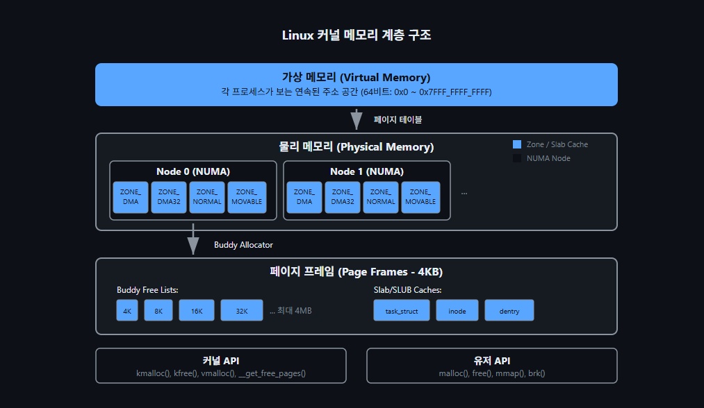
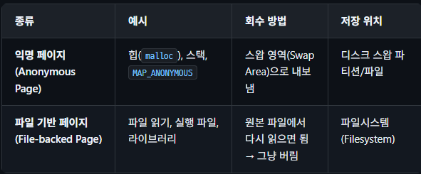
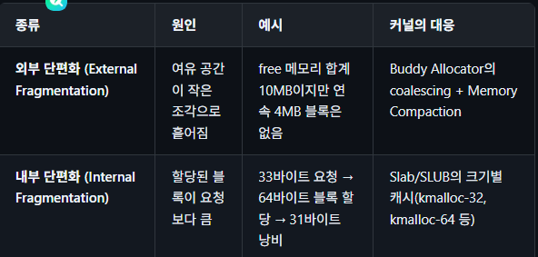
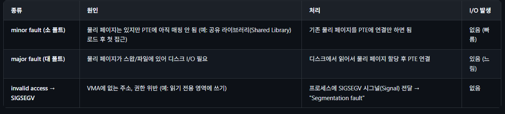
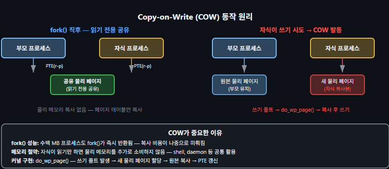
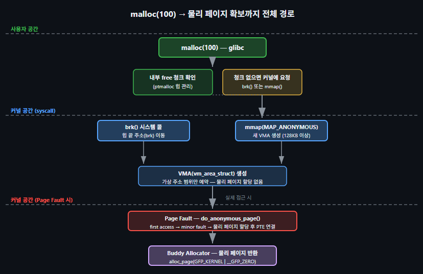
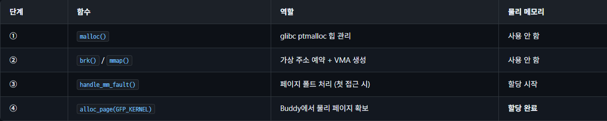
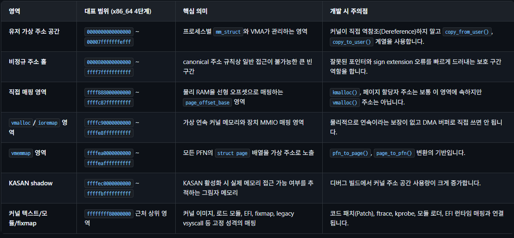
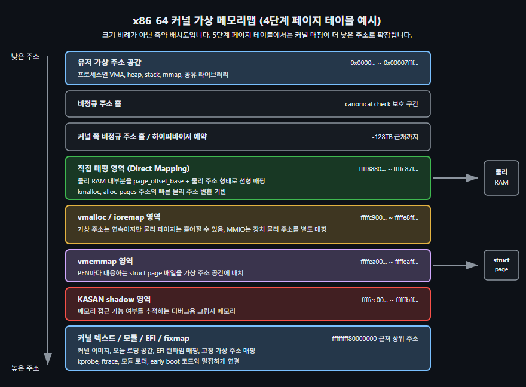

# 메모리 관리(Memory Management) 개요
### 1. 하드웨어 및 기본 아키텍처
- Physical Memory (물리 메모리): 기판에 실제로 꽂혀 있는 하드웨어 RAM 공간 전체입니다.
- DDR / HBM 하드웨어: RAM의 물리적 규격입니다. 대중적인 DDR과, 대역폭을 극대화한 고성능 HBM(주로 GPU/AI에 사용)이 있습니다.
- NUMA: 다중 CPU 환경에서, 각 CPU마다 더 빠르게 접근할 수 있는 '자기 구역 메모리'가 따로 존재하는 구조입니다.
- CXL / PMEM: PCIe 기반으로 메모리를 무한정 확장하게 해주는 차세대 인터페이스(CXL)와, 전원이 꺼져도 데이터가 날아가지 않는 영구 메모리(PMEM)입니다.
- MMU / TLB: 가상 주소를 물리 주소로 바꿔주는 하드웨어 칩(MMU)과, 그 변환 공식을 잠깐 기억해 두는 초고속 캐시(TLB)입니다.

### 2. 프로세서별 주소 변환 (페이지 테이블)
- x86_64 4/5단계 페이지 테이블: PC나 서버(Intel/AMD)에서 가상 주소를 물리 주소로 찾아갈 때 거치는 4~5번의 다단계 구조입니다.
- ARM64 VA_BITS: 안드로이드 스마트폰(ARM)에서 사용하는 가상 주소 공간의 크기(비트 수)를 뜻합니다. (예: 39비트, 48비트)
- RISC-V Sv39/Sv48/Sv57: 최신 오픈소스 프로세서인 RISC-V에서 사용하는 가상 주소 체계 표준들입니다.
- PTI (Page Table Isolation): 해커가 유저 공간에서 커널 메모리를 훔쳐보는 것(멜트다운 취약점)을 막기 위해 커널용/유저용 지도를 완전히 분리하는 보안 기술입니다.

### 3. 커널 메모리 구조 (Memory Map)
- Kernel Memory Map: 전체 가상 주소 공간 중 커널이 사용하는 영역이 어떻게 나뉘어 있는지 보여주는 전체 조감도입니다.
- 조건별/환경별 메모리맵: 시스템 RAM 크기나 KASAN 같은 디버깅 옵션을 켰는지 여부에 따라 커널 지도의 모양이 유동적으로 바뀝니다.
- Direct Mapping (직접 매핑): 커널이 물리 메모리에 가장 빠르게 접근하기 위해, 가상 주소와 물리 주소를 1:1로 단순하게 연결해 둔 거대한 영역입니다. 
- vmemmap: 시스템의 모든 물리 페이지들의 상태 정보를 담고 있는 거대한 장부(struct page 배열)가 놓이는 공간입니다. 시스템에 16GB의 RAM이 있다면, 커널은 이 메모리를 4KB 단위의 '페이지'라는 네모난 타일로 쪼개서 관리합니다. 16GB면 타일이 약 400만 개입니다.
커널은 이 400만 개의 타일 각각이 현재 누가 쓰고 있는지, 비어 있는지 기록하기 위해 struct page라는 구조체를 만듭니다. 타일이 400만 개니 이 구조체도 400만 개가 담긴 거대한 배열이 필요하겠죠? 이 어마어마하게 큰 물리 메모리 관리 장부(배열)가 통째로 올라가 있는 가상 메모리 공간의 이름이 바로 vmemmap입니다.
- vmalloc / ioremap: 물리적으로는 흩어져 있는 메모리를 연속된 것처럼 묶어서 쓰거나(vmalloc), 하드웨어 장치(GPU, 카메라 등)의 레지스터를 메모리로 매핑할 때(ioremap) 씁니다. 그래픽 카드(GPU)나 카메라 같은 하드웨어를 제어하려면 그 장치들의 물리적인 '레지스터 주소'에 직접 값을 써야 합니다. 하지만 커널은 가상 주소만 사용하므로 물리 주소에 직접 접근할 수 없습니다. ioremap은 이 하드웨어의 물리 주소를 커널의 가상 주소 공간으로 매핑해 줍니다. 덕분에 커널은 C 언어 포인터로 변수에 값을 넣듯 하드웨어를 제어할 수 있게 됩니다. (IO memory remapping)

### 4. 실행 환경 및 플랫폼
- Bare Metal (베어메탈): 가상머신이나 안드로이드 OS 없이 하드웨어 위에서 커널만 직접 돌아가는 날것의 환경입니다. (OS 없이 하드에어 조작.)
- Embedded Device Tree (디바이스 트리): 안드로이드 등 임베디드 기기에서, 커널에게 "이 폰에는 어떤 칩과 메모리가 어디에 붙어있다"고 알려주는 하드웨어 명세서입니다. 하드웨어 구성 정보를 커널 소스에서 분리해 독립된 파일로 기술하는 데이터 구조이다.
- Virtual Machine (가상머신): 하나의 물리 장비를 쪼개 여러 개의 가상의 컴퓨터를 띄우는 기술입니다.
- Container / memcg: 프로세스들을 컨테이너라는 상자에 격리하고, 상자별로 "메모리는 최대 몇 GB까지만 써라"라고 통제(memcg)하는 기능입니다.

### 5. 메모리 할당자와 API
- Buddy Allocator (버디 할당자): 메모리를 페이지 단위(주로 4KB)로 반씩 쪼개거나 다시 합치면서 빌려주는, 커널의 가장 기초적이고 핵심적인 도매상입니다.
- Slab Allocator (슬랩 할당자): 4KB 페이지는 너무 크니까, 그 안을 잘게 쪼개서 커널이 자주 쓰는 작은 객체들(수십~수백 바이트)을 빠르게 나눠주는 소매상입니다.
- GFP 플래그: 메모리를 달라고 요청할 때 "어디서 꺼내줄까? 메모리 부족하면 잠시 대기할까?" 등을 지정하는 주문표입니다. 커널 코드 내부에서 메모리를 할당받을 때(예: kmalloc() 함수 호출) 인자로 넘겨주는 요구사항 체크리스트(비트마스크)입니다.
- CMA (Contiguous Memory Allocator): 안드로이드에서 카메라나 비디오 디코더가 요구하는 '물리적으로 끊기지 않은 엄청나게 큰 메모리'를 미리 예약해 두고 빌려주는 기술입니다.
CPU는 MMU(메모리 관리 장치)가 있어서 흩어진 메모리도 연속된 것처럼 쓸 수 있습니다. 하지만 카메라 렌즈나 비디오 디코더 같은 하드웨어 장치들은 데이터를 RAM으로 직접 쏠 때(DMA) MMU를 거치지 않는 경우가 많습니다. 즉, 얘네들은 반드시 물리적으로 쫙 이어진(연속된) 찐 메모리가 필요합니다.
그래서 부팅할 때 미리 "여긴 카메라가 쓸 거니까 256MB 정도 통째로 비워둬!"라고 예약해 두는 공간이 CMA입니다. 평소에는 일반 앱들이 캐시 데이터 용도로 빌려 쓰다가, 카메라가 켜져서 "내 자리 내놔!" 하면 일반 앱들의 데이터를 다른 곳으로 쫓아내고 카메라에게 연속된 물리 메모리를 통째로 넘겨줍니다.

### 6. 유저 공간과 메모리 관리
- VMA / mmap: 앱이 사용하는 가상 메모리 영역들(VMA)과, 파일이나 장치를 메모리에 올려 마치 배열처럼 쓰게 해주는 시스템 콜(mmap)입니다.
- Huge Pages (휴지 페이지): 기본 4KB 단위 대신 2MB, 1GB 단위의 큼직한 페이지를 써서 관리 부담과 TLB(캐시) 미스를 줄이는 성능 최적화 기법입니다.

### 7. 메모리 부족 대응 및 최적화
- Memory Reclaim (메모리 회수): 램이 부족해질 때, 파일 캐시를 버리거나 당장 안 쓰는 페이지를 압수해서 빈 공간을 확보하는 과정입니다.
- OOM Killer (Out Of Memory Killer): 회수를 해도 메모리가 부족해 시스템이 뻗을 위기일 때, 우선순위가 낮은 앱을 강제로 죽여서 폰을 살려내는 저승사자입니다.
- Swap / zswap: 램이 꽉 차면 안 쓰는 데이터를 저장장치(디스크)로 내리거나(Swap), 내리기 전에 램 한구석에 압축해서(zswap) 보관합니다.
- KSM (Kernel Samepage Merging): 폰 안에 켜진 여러 앱에서 내용이 100% 똑같은 메모리 페이지를 찾아내 하나로 합쳐서 메모리를 아끼는 짠돌이 기술입니다. 안드로이드에서 카카오톡, 유튜브, 인스타그램을 켰을 때, 이 앱들이 공통으로 사용하는 시스템 라이브러리(libc 등)나 동일한 데이터가 메모리에 각각 중복으로 올라간다면 엄청난 낭비입니다.
커널 내부의 KSM 스레드가 백그라운드에서 메모리 전체를 훑어보면서 내용이 100% 똑같은 메모리 페이지(블록)들을 찾아냅니다. 똑같은 걸 발견하면, 하나만 남겨두고 나머지는 싹 지운 뒤 모두가 그 하나의 메모리 페이지를 같이 바라보게 만듭니다. (만약 누군가 그 데이터를 수정하려고 하면, 그 순간 복사본을 새로 만들어주는 Copy-On-Write 방식을 써서 안전합니다.)
- DAMON: 시스템에 무리를 주지 않으면서 앱들이 메모리의 어느 부분을 자주 쓰고 안 쓰는지 정확하게 감시하는 최신 커널 모니터링 기능입니다.

### 8. 디버깅 및 분석
- KASAN / KFENCE: 커널 개발자들이 메모리 오염이나 해제된 메모리를 다시 쓰는 등의 위험한 버그를 잡아내기 위해 켜는 디버깅 툴입니다.

## 메모리 계층 구조

핵심 포인트:
1. 가상 메모리 → 페이지 테이블 → 물리 메모리: 각 프로세스는 독립된 가상 주소 공간을 가지며, MMU가 페이지 테이블을 통해 물리 주소로 변환
2. Node (NUMA): 멀티 소켓(Socket) 시스템에서 각 CPU 소켓에 가까운 메모리 뱅크. 로컬 액세스가 빠름
3. Zone: 하드웨어 제약에 따른 구분 (DMA: 24비트, NORMAL: 일반, MOVABLE: 메모리 압축(Memory Compaction)/핫플러그(Hotplug) 가능)
4. Buddy Allocator: 2^n 페이지 블록 단위로 할당. 외부 단편화 최소화
5. Slab/SLUB: 커널 오브젝트 캐시. 빈번한 할당/해제 최적화 (내부 단편화 감소)

### 메모리 관리 기초 개념 (Memory Management Fundamentals)
가상 주소와 물리 주소 — 왜 가상 메모리가 필요한가
컴퓨터에는 단 하나의 물리 메모리(RAM)가 있지만, 수십 개의 프로세스(Process)가 동시에 실행됩니다. 가상 메모리(Virtual Memory)가 없다면 두 가지 치명적인 문제가 생깁니다.

- 충돌 문제: 프로세스 A가 주소 0x1000에 데이터를 쓰면 같은 주소를 쓰는 프로세스 B의 데이터가 덮어써집니다.
- 크기 제한: 물리 RAM이 4GB라면 각 프로세스가 쓸 수 있는 주소 공간(Address Space)의 합이 4GB를 넘을 수 없습니다.

가상 메모리는 각 프로세스에게 "내가 전체 메모리를 독점한다"는 착각을 제공합니다. 프로세스가 보는 주소는 가상 주소(Virtual Address)이며, CPU 내부의 MMU(Memory Management Unit)가 이를 실제 RAM의 위치인 물리 주소(Physical Address)로 변환합니다. 이 변환표가 바로 페이지 테이블(Page Table)입니다.

##### 장점
- 프로세스 격리: 한 프로세스의 버그가 다른 프로세스 메모리를 침범할 수 없음
- 주소 공간 독립성: 모든 프로세스가 동일한 가상 주소 범위(예: 0~128TB)를 독립적으로 사용 가능
- Demand Paging: 실제로 접근된 페이지만 물리 메모리에 로드 — RAM을 초과하는 가상 주소 공간 허용
- 공유 메모리: 여러 프로세스가 같은 물리 페이지를 각자 다른 가상 주소로 공유 가능 (예: libc.so)
- 메모리 보호: 페이지별 읽기/쓰기/실행 권한 설정으로 커널/사용자 공간 분리

### 페이지와 프레임 — 메모리의 기본 단위
가상 주소 공간과 물리 메모리는 모두 고정 크기 블록으로 나뉩니다.

- 페이지(Page): 가상 주소 공간의 고정 크기 블록. 보통 4KB(x86_64 기본값).
- 페이지 프레임(Page Frame): 물리 메모리의 같은 크기 블록. 커널은 각 프레임을 struct page로 추적합니다. 실제 물리 메모리(RAM)를 일정한 크기로 자른 단위
- 페이지 테이블 엔트리(PTE): 가상 페이지와 물리 프레임의 매핑 기록 + 접근 권한.

왜 4KB인가: 4KB는 TLB 효율, 메모리 낭비, I/O 비용의 균형점입니다. 너무 작으면 페이지 테이블이 거대해지고, 너무 크면 내부 단편화가 심해집니다. x86_64는 2MB, 1GB의 거대 페이지(Huge Page)도 지원하며, 대용량 메모리 접근이 많은 애플리케이션에서 TLB 미스를 줄이는 데 씁니다. C, C++

```BASH
# 시스템의 기본 페이지 크기 확인
getconf PAGE_SIZE          # 보통 4096 (4KB)
getconf PAGESIZE           # 동일
# 프로세스가 현재 사용 중인 물리 프레임 수 확인
cat /proc/$$/status | grep -E "VmRSS|VmSize"
# VmSize: 가상 주소 공간 전체 크기
# VmRSS:  실제 물리 RAM에 올라온 부분(Resident Set Size)
```

### 커널 공간과 사용자 공간 — 분리의 이유
x86_64 리눅스에서 가상 주소 공간은 절반으로 나뉩니다.

- 사용자 공간(User Space): 0x0000_0000_0000_0000 ~ 0x0000_7FFF_FFFF_FFFF (128TB). 각 프로세스 전용.
- 커널 공간(Kernel Space): 0xFFFF_8000_0000_0000 ~ 0xFFFF_FFFF_FFFF_FFFF (128TB). 모든 프로세스가 공유하는 커널.

분리하는 이유는 두 가지입니다. 첫째, 보안: 사용자 프로세스가 커널 메모리를 직접 읽거나 쓸 수 없습니다. 둘째, 안정성: 사용자 프로세스의 버그나 악의적 코드가 커널 자료구조를 훼손할 수 없습니다. CPU는 권한 수준(Ring 0 = 커널, Ring 3 = 사용자)을 유지하며, 사용자 프로세스가 커널 주소에 접근하면 즉시 페이지 폴트 예외가 발생합니다.

### 익명 페이지와 파일 기반 페이지
커널은 메모리 회수(Reclaim) 방식에 따라 페이지를 두 종류로 구분합니다. 이 구분은 스왑(Swap), 페이지 캐시(Page Cache), 메모리 회수 경로 전반에서 핵심적으로 중요합니다.



메모리 부족 시 커널은 파일 기반 페이지를 먼저 회수하려 합니다. 버려도 파일에서 다시 읽을 수 있기 때문입니다. 반면 익명 페이지는 스왑 공간이 없다면 버릴 수 없으므로, 스왑이 없는 시스템에서는 결국 OOM Killer가 발동합니다. /proc/meminfo의 AnonPages와 Cached가 각각을 나타냅니다.

익명 예시 - int *arr = new int[1000]; 혹은 스택 내의 지역변수
파일 기반 예시 - File *fp = fopen("test.txt"); 혹은 실행파일이나 .so의 라이브러리

### 단편화(Fragmentation) — 내부와 외부의 차이
메모리 할당기에서 단편화(Fragmentation)는 메모리가 남아 있음에도 원하는 크기를 할당할 수 없는 현상입니다. 두 종류가 있으며, Linux 커널은 각각에 다른 메커니즘으로 대응합니다.



```BASH
# 외부 단편화 정도 확인 — 큰 order의 free 블록이 많을수록 단편화 낮음
cat /proc/buddyinfo
# Node 0, zone   Normal   2048 1024 512 256 128 64 32 16 8 4 0
#                          ord0 ord1 ... ... ... ...         ord10
# ord10(4MB 블록)이 0이면 큰 연속 메모리 확보 불가 상태
# 내부 단편화 확인 — objsize vs 실제 사용 비율
cat /proc/slabinfo | awk 'NR>2{printf "%s objsize=%s\n",$1,$4}' | head -5
```

### 페이지 폴트 3종류 - minor, major, invalid
페이지 폴트(Page Fault)는 프로세스가 접근한 가상 주소에 물리 페이지가 아직 연결되지 않았을 때 CPU가 발생시키는 예외입니다. 커널은 이 예외를 받아 적절한 처리를 한 뒤 프로세스를 재개합니다. 모든 페이지 폴트가 오류는 아닙니다 — 정상적인 Demand Paging 메커니즘의 일부입니다.

1. minor fault = 책장 안에 책은 있는데, 책 위치만 목록에 안 적혀 있음.
2. major fault = 책이 창고에 있어서 가져와야 함.
3. SIGSEGV = 애초에 존재하지 않는 책을 찾으려고 함.



```BASH
# 프로세스별 minor/major fault 통계
cat /proc/$$/status | grep -i fault
# voluntary_ctxt_switches: ...  (선택적 컨텍스트 전환)
# 또는 ps로 확인
ps -o pid,minflt,majflt -p $$
#   PID  MINFLT  MAJFLT
# 12345   15234       2
# → minflt가 압도적으로 많음: 대부분 정상적인 Demand Paging
# → majflt가 많으면 스왑 과다 사용 신호
# 시스템 전체 폴트 통계
cat /proc/vmstat | grep pgfault
# pgfault: 전체 minor fault 수
# pgmajfault: 전체 major fault 수
```

- Demand Paging 동작 예시: mmap()으로 100MB를 예약해도 실제로 접근하기 전까지 물리 RAM은 0바이트 사용합니다. 접근하는 순간 minor fault가 발생하고 커널이 제로 페이지를 할당합니다. 이것이 프로세스의 VmSize(가상 크기)와 VmRSS(실제 물리 사용량)가 크게 다른 이유입니다

### Copy-on-Write (COW) — 공유와 독립의 균형
Copy-on-Write(COW)는 "쓸 때만 복사한다"는 최적화 기법입니다. fork()로 자식 프로세스를 생성할 때, 부모의 메모리 전체를 즉시 복사하면 매우 비효율적입니다. 대신 커널은 모든 페이지를 읽기 전용으로 공유하고, 부모 또는 자식이 실제로 쓰려 할 때 그 페이지만 복사합니다.



```c
/* COW 발동 시 do_wp_page() 핵심 흐름 (mm/memory.c): write protect*/
static vm_fault_t do_wp_page(struct vm_fault *vmf)
{
    struct page *old_page = vm_normal_page(vmf->vma, vmf->address, vmf->orig_pte);
    /* 참조 카운트가 1이면 이 프로세스만 사용 → 복사 불필요 */
    if (page_count(old_page) == 1)
        return wp_page_reuse(vmf);  /* PTE 쓰기 권한만 활성화 */
    /* 여러 프로세스가 공유 중 → 새 페이지 복사 후 PTE 업데이트 */
    return wp_page_copy(vmf);
    /* alloc_page() → copy_user_highpage() → set_pte_at() */
}
```

### malloc()에서 커널까지 — 메모리 할당의 전체 경로
사용자 프로그램이 malloc(100)을 호출하면 실제로 무슨 일이 일어날까요? 아래는 할당 경로 전체를 한눈에 보여주는 흐름입니다.



핵심 포인트: malloc()은 즉시 물리 메모리를 소비하지 않습니다. 가상 주소 공간만 예약하고(VMA 생성), 실제로 그 주소에 처음 접근할 때 페이지 폴트가 발생하며 비로소 물리 페이지가 할당됩니다. 이것이 Demand Paging입니다.



### 커널 메모리맵 (Kernel Memory Map)
커널 메모리맵(Kernel Memory Map)은 물리 RAM 배치도와 커널 가상 주소 공간 배치도를 함께 이해해야 정확합니다. 펌웨어가 전달한 물리 메모리 맵은 "어느 물리 주소 범위가 RAM이고, 어느 범위가 예약 영역, ACPI/EFI 데이터, 장치 MMIO인지"를 알려줍니다. 커널은 이 정보를 부팅 초기에 memblock으로 받고, 이후 Node/Zone/Page 구조와 Buddy Allocator로 넘깁니다. 반면 커널 가상 주소 공간의 메모리맵은 "커널이 그 물리 메모리와 내부 자료구조를 어떤 가상 주소 범위에 배치해서 접근하는지"를 보여줍니다.

x86_64 기준으로 가장 중요한 구분은 직접 매핑(Direct Mapping, Linear Mapping), vmalloc/ioremap 영역, vmemmap 영역, 커널 텍스트/모듈/fixmap 영역입니다. 직접 매핑 영역에서는 물리 RAM 대부분이 일정한 오프셋을 더한 커널 가상 주소에 일대일로 대응하므로 __va(), __pa() 같은 변환이 빠릅니다. 그러나 vmalloc() 주소, ioremap() 주소, 모듈 주소, fixmap 주소는 직접 매핑 영역이 아니므로 단순 산술 변환 대상으로 취급하면 안 됩니다.

- 유저 가상 주소 공간: 일반적인 프로세스들이 사용, mm_struct, VMA라는 구조체로 프로세스마다 관리한다. 함부로 커널에서 역참조하면 안됨. copy_from_user(),copy_to_user() 써야함.
- 비정규 주소 홀: 잘못된 연산이 발생했을 때 오류 나게 함.
- direct 매핑 영역: 램 <-> 커널 가상주소랑 매핑해둠. kmalloc()이나 페이지 할당자 주소가 보통 여기 속함.
- vmalloc / ioremap 영역: 가상 주소상으로는 연속된 커널 메모리처럼 보이지만, 실제 물리적으로는 연속이라는 보장이 없는 영역이다. 장치 통신(MMIO) 매핑 등을 위해 쓰인다.
- vmemmap 영역: 물리 메모리의 각 페이지(PFN)를 관리하는 struct page 배열이 가상 주소로 노출된 곳이다.
- KASAN shadow: 커널의 메모리 버그(Use-After-Free, Out-Of-Bounds 등)를 추적하기 위한 그림자 메모리 영역이다.
- 커널 텍스트/모듈/fixmap: 메모리 가장 꼭대기에 위치하며, 실제 커널의 실행 코드(이미지), 로드된 모듈, EFI, fixmap 등이 고정된 성격으로 올라가는 자리이다.





- PFN (Page Frame Number): 쪼개진 물리 메모리 조각들에 매겨진 고유 번호

직접 매핑과 vmemmap의 차이: 직접 매핑 영역은 실제 RAM 내용을 접근하기 위한 가상 주소 범위입니다. vmemmap은 RAM 내용 자체가 아니라 RAM을 설명하는 struct page 메타데이터를 담는 가상 주소 범위입니다. 예를 들어 PFN 1000번 페이지의 실제 바이트를 읽을 때는 직접 매핑 주소나 임시 매핑을 사용하지만, 그 페이지의 참조 카운트, LRU 상태, 매핑 상태를 확인할 때는 pfn_to_page(1000)으로 struct page를 얻습니다. 즉, 데이터와 메타데이터 차이임.

```c
/* System RAM PFN 기준의 직접 매핑과 struct page 변환 개념 예시 */
static void inspect_pfn(unsigned long pfn)
{
    struct page *page;
    void *linear;
    phys_addr_t phys = (phys_addr_t)pfn << PAGE_SHIFT;
    if (!pfn_valid(pfn))
        return;
    page = pfn_to_page(pfn);       /* vmemmap의 struct page 메타데이터 */
    linear = __va(phys);             /* 직접 매핑 영역의 커널 가상 주소 */
    /* vmalloc/ioremap 주소에는 __pa()/__va() 산술 변환을 적용하지 않습니다. */
    pr_debug("pfn=%lu page=%p linear=%p ref=%d\n",
             pfn, page, linear, page_ref_count(page));
}
```

- 부팅 초기 흐름: BIOS E820, UEFI Memory Map, Device Tree의 /memory 노드 같은 펌웨어 정보는 처음부터 Buddy Allocator에 바로 들어가지 않습니다. 커널은 먼저 memblock으로 사용 가능 영역과 예약 영역을 정리하고, 커널 이미지, initrd, 페이지 테이블, ACPI/EFI 테이블, crashkernel 예약 영역을 제외합니다. 이후 free_area_init() 계열 초기화가 Node/Zone 경계를 만들고, memblock_free_all()이 남은 페이지를 Buddy Allocator로 넘깁니다. 그래서 "펌웨어 메모리맵"은 물리 주소 공간의 원천 데이터이고, "커널 가상 메모리맵"은 커널이 그 데이터를 접근하기 위해 만든 주소 공간 배치입니다.

```BASH
# 펌웨어/커널이 본 물리 주소 공간 확인
dmesg | grep -E 'BIOS-e820|efi: mem|Memory:'
cat /proc/iomem
# 커널 가상 주소 영역 관찰
grep -E 'Vmalloc|PageTables|DirectMap' /proc/meminfo
sudo cat /proc/vmallocinfo | head
# x86 CONFIG_X86_PTDUMP와 debugfs가 활성화된 경우
sudo cat /sys/kernel/debug/kernel_page_tables | head -40
```

디버깅 기준: 주소가 직접 매핑 영역인지, vmalloc 영역인지, 유저 포인터인지 먼저 분류하면 메모리 버그 원인 추적이 빨라집니다. virt_addr_valid()는 직접 매핑 RAM 주소 판별에 가깝고, is_vmalloc_addr()는 vmalloc 계열 주소 판별에 사용됩니다. 유저 주소는 access_ok()와 uaccess 계열 함수의 책임 범위로 다루어야 합니다.

#### x86-64의 4단계, 5단계 페이지 테이블
x86_64 4단계 페이지 테이블에서는 48비트 canonical 주소를 사용하며, 유저 공간은 하위 약 128TB에 놓이고 커널 매핑은 상위 -128TB 근처에서 시작합니다. 5단계 페이지 테이블(LA57)을 켜면 유저 공간이 약 64PB까지 확장되고, 커널 직접 매핑과 vmalloc/ioremap 영역도 PB 단위로 커집니다. 이 변화는 단순히 주소 상수만 바꾸는 것이 아니라 PGD→P4D→PUD→PMD→PTE 전체 경로에서 P4D가 실제 레벨로 동작하는지를 바꿉니다. 4단계 커널에서는 P4D가 접힌(folded) 레벨로 처리됩니다.

#### ARM64: VA_BITS, TTBR0/TTBR1, 52비트 주소
ARM64는 유저와 커널 주소 공간을 TTBR0/TTBR1 선택으로 나눕니다. 일반적으로 TTBR0은 유저 페이지 테이블, TTBR1은 커널 전역 매핑을 가리키며, 커널의 swapper_pg_dir은 커널 매핑만 담습니다. 4KB 페이지 설정에서는 39비트 또는 48비트 VA 구성이 흔하고, 64KB 페이지 설정에서는 42비트 구성이 사용될 수 있습니다. ARMv8.2 LVA와 64KB 페이지 조합에서는 52비트 VA를 사용할 수 있지만, 같은 커널 바이너리가 초기 부팅에서 48비트 fallback도 처리해야 하므로 PAGE_OFFSET, physvirt 오프셋, vmemmap 오프셋을 조기에 계산합니다.

드라이버 개발 관점: ARM64에서 디바이스 MMIO는 일반 RAM의 logical map과 같은 방식으로 접근하지 않습니다. Device Tree 또는 ACPI가 알려준 리소스를 devm_ioremap_resource() 같은 API로 매핑하고, 그 결과 주소는 vmalloc/ioremap 성격의 커널 가상 주소로 다루어야 합니다. DMA 버퍼는 다시 dma_alloc_coherent(), dma_map_single() 같은 DMA API의 주소 모델을 따라야 합니다.

### 