# 인터럽트(Interrupt) 
하드웨어 인터럽트 처리, Top/Bottom Half 아키텍처, softirq, tasklet, workqueue, threaded IRQ, NMI(Non-Maskable Interrupt)를 상세히 다룹니다.

이 문서는 인터럽트가  CPU 예외 벡터에 진입한 뒤 irq_desc와 irq_chip 계층을 거쳐 핸들러(Handler)가 실행되고, 이후 Bottom Half로 작업이 분리되는 전체 경로를 소스 코드 관점에서 설명합니다. 단순한 개념 소개를 넘어 공유 IRQ와 affinity, MSI/MSI-X, IPI, NMI, PREEMPT_RT 환경의 threaded IRQ 동작 차이, 그리고 /proc/interrupts·ftrace·perf를 이용한 병목(Bottleneck) 분석 절차까지 포함해 실제 드라이버 개발과 운영 장애 대응에 바로 적용할 수 있도록 구성했습니다.

### 핵심 요약
- 인터럽트 — 하드웨어가 CPU에 비동기적으로 이벤트를 알리는 메커니즘입니다.
- IDT — `Interrupt Descriptor Table.` 인터럽트 번호를 핸들러 함수에 매핑(Mapping)합니다.
- Top Half — 인터럽트 발생 즉시 실행. 빠르게 `최소한의 작업`만 수행합니다.
- Bottom Half — 나중에 `지연 실행`. `softirq, tasklet, workqueue` 세 가지 메커니즘이 있습니다.
- threaded IRQ — 인터럽트 핸들러를 커널 스레드(Kernel Thread)에서 실행하여 `선점(Preemption)` 가능하게 만듭니다.

### 단계별 이해
1. 인터럽트 발생 — 키보드 키를 누르면 키보드 컨트롤러가 `IRQ 라인`을 통해 CPU에 알립니다.
CPU는 현재 레지스터(Register)를 저장(아마 MSR이나 IDTR이었던거 같음)하고 `IDT에서 핸들러 주소`를 찾아 점프합니다.
2. Top Half 실행 — 핸들러에서 긴급한 작업(디바이스 레지스터 읽기, ACK 보내기)만 수행합니다.
인터럽트가 비활성화된 상태이므로 최대한 빠르게 끝내야 합니다. 
3. Bottom Half 예약 — 나머지 작업(데이터 처리, 프로토콜 스택 호출 등)을 Bottom Half로 위임합니다. (긴급한 Top Half가 끝나고 자세한 분석과 처리는 나중에 하기 위해 Bottom Half를 예약한다.)
softirq(고성능, 정적), tasklet(간편), workqueue(슬립(Sleep) 가능) 중 선택합니다.
4. 확인 — `cat /proc/interrupts`로 각 IRQ의 발생 횟수와 핸들러를 확인할 수 있습니다.
`cat /proc/softirqs`로 `softirq 타입별 처리 횟수`를 볼 수 있습니다.

### Bottom Half 예약 방식
1. Softirq (소프트 인터럽트):
가장 빠르고 강력한 방식입니다. 여러 CPU 코어에서 동시에 실행될 수 있어서 네트워크 패킷 처리처럼 초고속 대용량 처리가 필요한 곳에 커널 개발자들이 정적으로 박아넣어(Compile) 사용합니다. 단, 동시성 문제가 발생할 수 있어 스핀락(Spinlock) 같은 정교한 동기화 설계가 필요합니다.

2. Tasklet (태스크릿):
Softirq를 기반으로 만들어졌지만, 개발자가 쓰기 훨씬 편하게 만든 방식입니다. Tasklet은 한 번에 오직 하나의 CPU에서만 실행되도록 보장합니다. 덕분에 여러 CPU가 동시에 접근해서 메모리가 꼬이는 현상을 걱정하지 않고 비교적 안전하게 드라이버 코드를 짤 수 있습니다.

3. Workqueue (워크큐):
위의 두 가지(Softirq, Tasklet)는 '인터럽트 컨텍스트'라는 특별한 상태에서 돌기 때문에, 작업 도중 절대로 잠들면(Sleep/Block) 안 됩니다. 잠들면 시스템이 패닉에 빠집니다.
반면 Workqueue는 일반적인 커널 스레드(프로세스)로 동작합니다. 즉, 디스크 입출력을 기다리거나 메모리를 할당받기 위해 잠시 대기(Sleep)해야 하는 무거운 작업이라면 반드시 Workqueue를 사용해야 합니다.

## 인터럽트 개요
인터럽트는 `하드웨어가 CPU에 비동기적으로 이벤트를 알리는 메커니즘`입니다. CPU는 현재 실행 중인 코드를 중단하고, 인터럽트 핸들러를 실행한 뒤, 원래 코드로 복귀합니다.

### 인터럽트 유형
- 하드웨어 인터럽트 (External): 디바이스가 IRQ 라인을 통해 발생 (키보드, 네트워크, 디스크 등)
- 예외 (Exception): CPU 내부에서 발생 (page fault, divide-by-zero, general protection fault)
- 소프트웨어 인터럽트: int 명령 또는 시스템 콜(System Call) (syscall/sysenter)
- NMI: Non-Maskable Interrupt, 비활성화 불가 (하드웨어 오류, watchdog)

### x86 IDT (Interrupt Descriptor Table) 아키텍처
x86 아키텍처에서 `인터럽트`와 `예외`는 `IDT(Interrupt Descriptor Table)를 통해 처리`됩니다. IDT는 256개 엔트리로 구성되며, 각 엔트리는 게이트 디스크립터(Gate Descriptor)로 해당 벡터의 핸들러 주소를 가리킵니다. IDTR 레지스터가 IDT의 베이스(Base) 주소와 크기를 보관합니다.

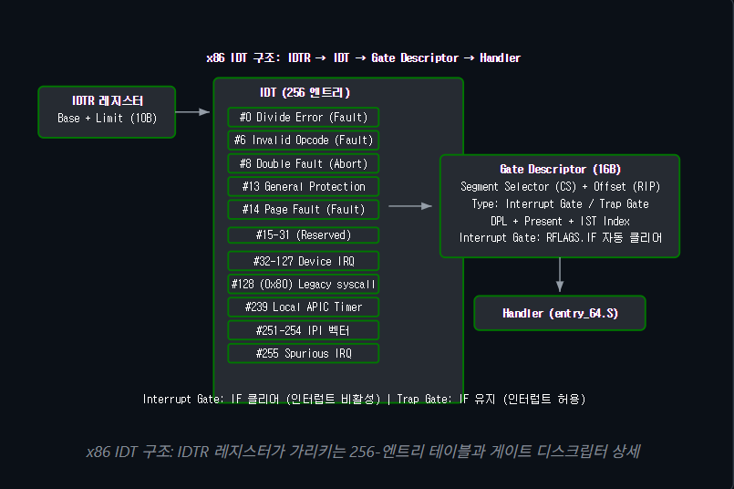

### x86 예외 벡터 테이블 (Vector 0-31)
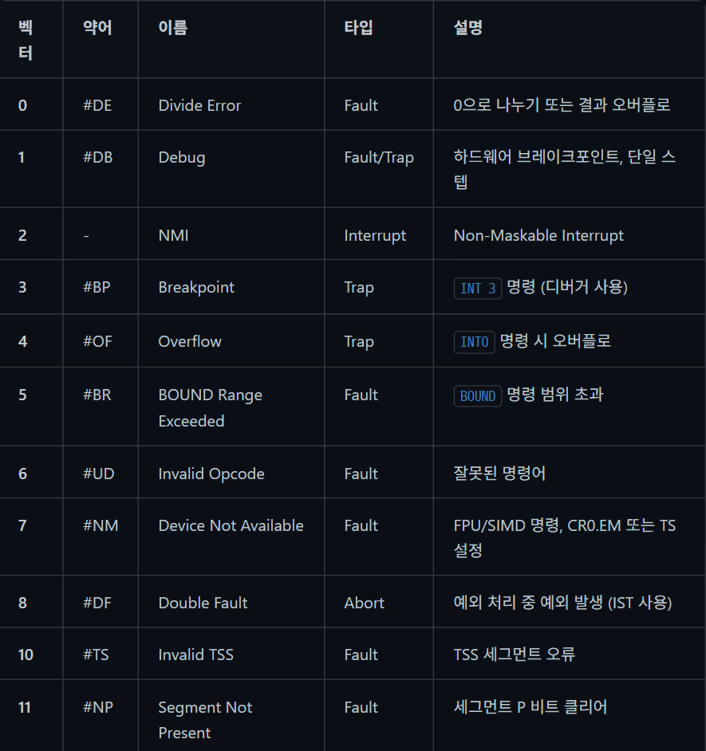

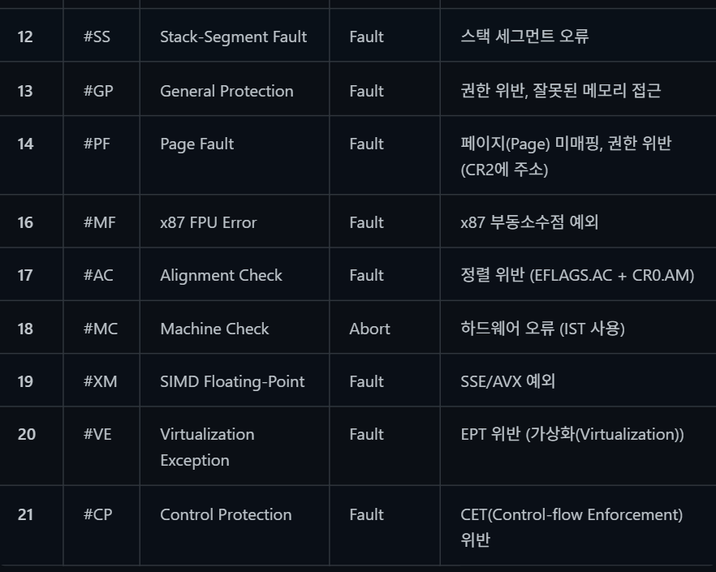

Fault vs Trap vs Abort: Fault는 원인 명령을 재실행합니다 (Page Fault 처리 후 같은 명령 재시도). Trap은 원인 명령 다음 명령부터 실행합니다 (Breakpoint 후 계속 진행). Abort는 정확한 원인 위치를 알 수 없어 복구가 불가능합니다 (Double Fault). 

### x86_64 Gate Descriptor 비트 필드 상세
IDT는 `CPU가 인터럽트를 받았을 때 "어떤 코드를, 어떤 권한으로 실행해야 하는가?"를 적어놓은 128비트(16바이트) 크기의 이정표`입니다. 이 이정표 하나를 `게이트 디스크립터(Gate Descriptor)`라고 부릅니다.

IDT의 각 엔트리는 16바이트(128비트)의 게이트 디스크립터(Gate Descriptor)입니다. 인터럽트 게이트(Interrupt Gate)와 트랩 게이트(Trap Gate)의 차이는 RFLAGS.IF 클리어 여부뿐입니다. 다음은 x86_64 Interrupt Gate의 비트 레이아웃입니다.

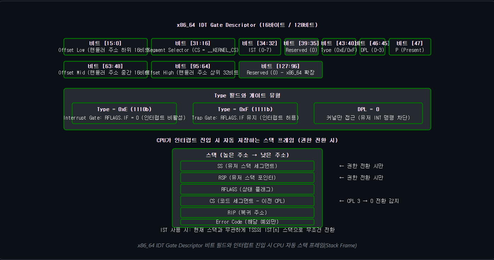

```c
/* arch/x86/include/asm/desc_defs.h — Gate Descriptor 구조체 */
struct gate_struct {
    u16 offset_low;      /* [15:0]  핸들러 주소 하위 16비트 */
    u16 segment;         /* [31:16] 코드 세그먼트 셀렉터 (__KERNEL_CS) */
    struct idt_bits bits; /* IST, Type, DPL, Present */
    u16 offset_middle;   /* [63:48] 핸들러 주소 중간 16비트 */
    u32 offset_high;     /* [95:64] 핸들러 주소 상위 32비트 */
    u32 reserved;        /* [127:96] 예약 (0) */
} __attribute__((packed));

struct idt_bits {
    u16 ist    : 3,      /* IST 인덱스 (0=미사용, 1-7=IST 스택) */
         zero   : 5,      /* 예약 비트 */
         type   : 4,      /* 0xE=Interrupt Gate, 0xF=Trap Gate */
         zero2  : 1,      /* S 비트 (시스템 세그먼트) = 0 */
         dpl    : 2,      /* DPL: 0=커널, 3=유저 접근 허용 */
         p      : 1;      /* Present 비트 (1=유효) */
} __attribute__((packed));
/*
 * INTG(n, handler)  → Interrupt Gate, DPL 0, IST 0
 * SYSG(n, handler)  → Trap Gate, DPL 3 (유저 INT 3 허용)
 * ISTG(n, handler, ist) → Interrupt Gate, DPL 0, IST 지정
 *
 * 핵심 차이:
 * - Interrupt Gate: CPU가 RFLAGS.IF를 자동 클리어 (인터럽트 비활성)
 * - Trap Gate: RFLAGS.IF 유지 (인터럽트 허용 상태로 핸들러 진입)
 * - DPL 3: 유저스페이스에서 INT 명령으로 호출 가능 (#BP 등)
 * - IST: 현재 스택과 무관하게 전용 스택으로 전환 (#DF, NMI, #DB, #MC)
 */
```
- offset 나눈것은 아키텍처 비트 수 변화에 대응하기 위해서임. offset은 해당 인터럽트의 시작 주소를 나타냄.
- segment: 인터럽트 핸들러(실행할 코드)가 메모리의 어느 구역(세그먼트)에 존재하는지 CPU에게 알려주는 역할 => x86 아키텍처에서는 메모리에 접근할 때 단순히 주소만 사용하는 것이 아니라, `GDT(Global Descriptor Table)`라는 표를 참조하여 해당 구역의 속성(읽기/쓰기/실행 권한 등)을 먼저 확인합니다. 인터럽트를 처리하는 코드는 `커널 영역에서 실행되어야 하므로`, 이 필드에는 보통 커널의 코드 세그먼트를 의미하는 `__KERNEL_CS` 값이 들어갑니다. 즉, CPU에게 "핸들러 코드를 실행할 때는 커널 권한의 메모리 구역을 사용해라"라고 지시하는 것입니다.

- idt_bits: 이 게이트를 통과할 때 적용할 보안 권한과 작동 방식(메타데이터)을 결정하는 16비트(2바이트) 크기의 비트 필드(Bit field)
    구조체 내부를 보면 : 기호를 사용해 비트 단위로 공간을 쪼개어 쓰고 있습니다. 메모리 공간을 극한으로 절약하고 하드웨어 레지스터와 일대일로 매핑하기 위해서입니다.
    
    `ist`: 비상용 스택(IST)을 사용할지 여부와 그 번호를 지정합니다. (뒤에 나옴.)

    `type`: 이 게이트가 인터럽트 게이트인지, 트랩 게이트인지(즉, 진입 시 다른 인터럽트를 차단할지 말지)를 결정합니다.

    `dpl`: Descriptor Privilege Level의 약자로, 가장 중요한 보안 검문소입니다. 유저 모드(3) 프로세스가 소프트웨어 인터럽트(INT)를 통해 이 게이트를 호출할 수 있는지, 아니면 커널(0)만 접근할 수 있는지를 여기서 통제합니다.

p: Present 비트로, 현재 이 게이트가 메모리에 유효하게 존재하는지(1)를 나타냅니다.
- reserved: 구조체의 크기와 정렬 맞추기 위해 0으로 채워두는 공간, 이제 64비트 시스템이라 안 씀.

### IST란?
`IST(Interrupt Stack Table)`는 한마디로 요약하면 `절대 무너지지 않는 최후의 비상 구명보트(전용 스택)`입니다.

CPU가 인터럽트나 예외(Exception)를 처리하려면, 작업 중이던 상태(레지스터 값들)를 어딘가에 백업해 두어야 합니다. 보통은 현재 사용 중이던 스택(유저 스택이든 커널 스택이든)을 사용하죠. 하지만 시스템에 치명적인 문제가 생겨 스택 자체가 망가져 버렸다면 어떻게 될까요?

이 문제를 해결하기 위해 x86_64 아키텍처에서 도입한 매우 강력한 하드웨어 메커니즘이 바로 IST입니다.

1. IST가 등장한 배경 (스택 오버플로의 공포)
만약 커널이 코드를 잘못 짜서 무한 재귀 호출에 빠졌다고 가정해 보겠습니다.
커널 스택(보통 8KB)이 점점 차오르다가 결국 한계를 넘어 넘쳐버립니다(Stack Overflow).
이때 허가되지 않은 메모리를 건드렸으므로 CPU는 Page Fault 예외를 발생시킵니다.
CPU는 예외를 처리하기 위해 핸들러로 이동하려고 현재 상태를 스택에 백업(Push)하려 시도합니다.
하지만 스택은 이미 꽉 차서 엉망진창인 상태입니다. 백업에 실패하고 또 다른 예외인 `Double Fault(#DF)`가 터집니다.

Double Fault 핸들러로 가기 위해 CPU는 또다시 스택에 상태를 저장하려고 시도합니다. 당연히 또 실패합니다.
이 상황을 `Triple Fault`라고 부르며, CPU는 더 이상 정상적인 연산이 불가능하다고 판단하여 컴퓨터를 강제로 `재부팅(Hardware Reset)` 시켜버립니다.

=> 커널 개발자 입장에서는 블루스크린이나 패닉 로그(어디서 에러가 났는지)조차 보지 못하고 컴퓨터가 픽 꺼져버리니 디버깅을 할 수 없는 최악의 상황입니다.

2. IST의 동작 원리 (무조건 갈아타기)
이런 참사를 막기 위해, 운영체제는 부팅될 때 `TSS(Task State Segment)`라는 특별한 메모리 공간에 1번부터 7번까지 총 `7개의 비상용 스택 주소`를 미리 꼼꼼하게 만들어 둡니다.

앞서 보셨던 IDT 게이트 디스크립터 구조체의 ist 필드에 1~7 사이의 숫자를 적어두면, CPU는 해당 인터럽트가 발생했을 때 다음과 같이 행동합니다.

- 일반 인터럽트 (ist = 0): "현재 스택(RSP)이 안전하다고 믿고, 거기에 데이터를 백업하자."
- 비상 인터럽트 (ist = 1~7): "현재 스택(RSP)은 오염되었을 확률이 100%다. 지금 쓰던 스택을 완전히 무시하고 버린 뒤, TSS에 적혀 있는 IST[n]번 비상 스택 주소로 점프해서 거기를 스택으로 쓰자!"

3. IST를 사용하는 대표적인 예외들
IST는 정말 끔찍한 비상사태에만 아껴서 사용합니다.

- Double Fault (#DF): 가장 대표적인 IST 단골손님입니다. `예외 처리 중 스택 문제`가 생겼을 때 호출되며, IST를 타고 들어와 커널 패닉 메시지("Stack Overflow가 발생했습니다!")를 화면에 무사히 출력하고 시스템을 안전하게 정지시킵니다.
- NMI (Non-Maskable Interrupt): `RAM 메모리에 물리적인 오류`가 생겼거나 `하드웨어 칩셋`에 치명적인 문제가 생겼을 때 날아오는 "차단 불가능한" 인터럽트입니다. 언제 어디서 날아올지 모르므로 항상 안전한 전용 스택(IST)을 사용해야 합니다.
- Machine Check (#MC): `CPU 코어` 자체에서 물리적인 결함을 감지했을 때 발생합니다.
- Debug (#DB): 커널 코드를 디버깅할 때, `디버거 자체가 스택을 꼬이게 만드는 현상`을 막기 위해 사용되기도 합니다.

### 인터럽트 스택 전환 메커니즘 상세
인터럽트 발생 시 CPU의 스택 전환은 인터럽트의 발생 컨텍스트(유저/커널)와 IST 설정에 따라 다르게 동작합니다. 이 메커니즘을 정확히 이해하면 스택 오버플로(Stack Overflow), Double Fault 디버깅(Debugging)에 큰 도움이 됩니다.

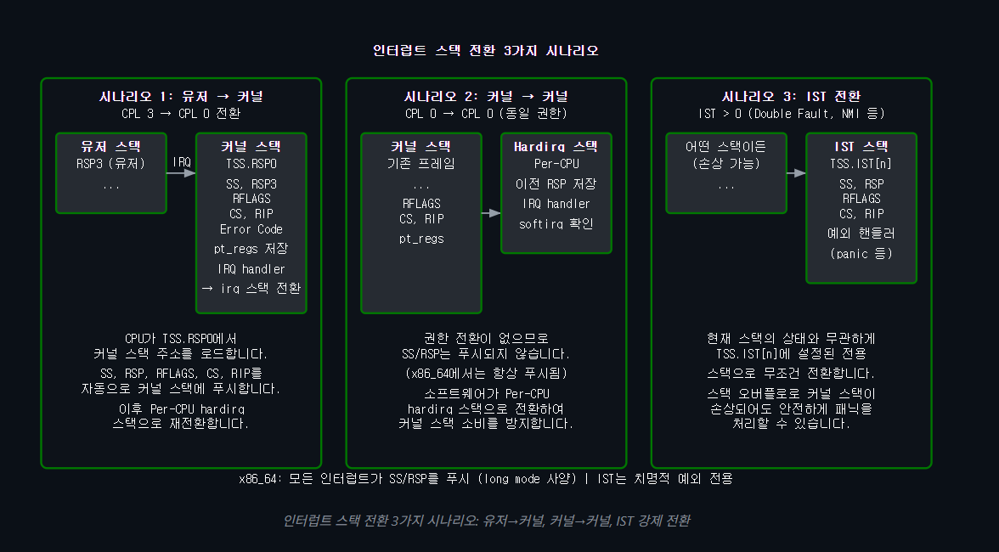

`시나리오 1`: 유저(CPL 3) → 커널(CPL 0) 진입
상황: 유저 프로그램이 실행되다가 인터럽트(또는 시스템 콜)가 발생했습니다.

동작: CPU는 현재 유저 스택(RSP3)을 절대 믿지 않습니다. 악의적으로 조작되었을 수도 있기 때문입니다.

전환: 즉시 커널이 미리 설정해 둔 안전한 커널 스택(TSS.RSP0)으로 스택 포인터를 바꿉니다. 그리고 그 안전한 스택에 유저가 쓰던 레지스터들(SS, RSP, RFLAGS, CS, RIP)을 백업합니다.

`시나리오 2`: 커널(CPL 0) → 커널(CPL 0) 중첩
상황: 이미 커널 코드가 실행 중인데, 또 다른 하드웨어 인터럽트가 겹쳐서 발생했습니다.

동작: 이미 신뢰할 수 있는 커널 영역이므로 권한 전환은 일어나지 않습니다.

전환: 기존 커널 스택을 그대로 사용하거나, 커널 스택의 크기(보통 8KB)를 낭비하지 않기 위해 소프트웨어적으로 각 CPU 코어 전용인 Hardirq 스택으로 잠시 갈아탑니다. (참고로 x86_64 아키텍처에서는 권한이 안 바뀌어도 포맷 통일을 위해 항상 SS와 RSP를 스택에 푸시합니다.)

`시나리오 3`: IST 강제 전환 (최악의 비상사태)
상황: 커널 스택 자체가 꽉 차서 넘쳐버렸거나(Stack Overflow), 너무 치명적인 하드웨어 오류(Double Fault, NMI)가 발생했습니다.

동작: 현재 스택 포인터(RSP)가 가리키는 곳이 이미 망가졌으므로, 여기에 무언가를 백업하려고 시도하는 순간 시스템은 완전히 죽어버립니다.

전환: IDT에 IST(Interrupt Stack Table) 값이 0보다 크게 설정되어 있다면, CPU는 현재 스택 상태를 완전히 무시하고 절대 안전한 구명보트 같은 스택(TSS.IST[n])으로 즉시 점프합니다. 이 덕분에 커널이 붕괴하더라도 왜 죽었는지 패닉 로그를 안전하게 남길 수 있는 마지막 기회를 얻게 됩니다.

##### 시나리오 3의 예외적인 상황: 커널 익스플로잇 (Kernel Exploit)
시스템 해킹(Pwnable) 관점에서 보면, 유저 프로세스가 단순히 에러를 내는 것이 아니라 커널의 취약점을 고의로 악용하는 예외 상황이 있을 수 있습니다.

정상적인 환경에서 유저는 하드웨어 레벨의 치명적인 인터럽트(예: NMI, Double Fault)를 직접 발생시킬 권한이 없습니다. 유저가 할 수 있는 건 0으로 나누기 연산을 하거나 이상한 메모리를 참조하는 정도이며, 이는 모두 얌전하게 시나리오 1(유저 → 커널)로 넘어가 프로세스 종료로 끝납니다.

하지만, 유저가 특정 시스템 콜이나 디바이스 드라이버의 취약점을 파고들어 커널 스택(Kernel Stack)을 덮어씌우는(Overflow) 페이로드를 주입했다고 가정해 보겠습니다.

이후 커널 스택이 망가진 상태에서 인터럽트가 발생하면, CPU는 커널 스택에 데이터를 저장하려다 실패하고 또 다른 예외를 발생시킵니다. 이것이 바로 `예외 처리 중 예외가 발생하는 Double Fault(#DF)`이며, 이 시점에서는 이미 커널이 치명상을 입었으므로 강제로 IST 스택으로 튕겨져 나간 뒤 `커널 패닉(DoS 상태)`에 빠지게 됩니다.

```c
/* arch/x86/kernel/cpu/common.c — TSS 초기화 (IST 스택 설정) */
// 유저에서 커널로 넘어올 때의 준비, 유저 스택 대신 커널 스택으로 갈아탐.
void __init cpu_init(void)
{
    struct tss_struct *tss = this_cpu_ptr(&cpu_tss_rw);
    /* TSS.RSP0: 유저→커널 전환 시 사용할 커널 스택 (프로세스별) */
    tss->x86_tss.sp0 = (unsigned long)task_stack_page(current) +
                        THREAD_SIZE;
    /* IST 스택 설정: 치명적 예외 전용 */
    tss->x86_tss.ist[IST_INDEX_DF]  = (unsigned long)&doublefault_stack;
    tss->x86_tss.ist[IST_INDEX_NMI] = (unsigned long)&nmi_stack;
    tss->x86_tss.ist[IST_INDEX_DB]  = (unsigned long)&debug_stack;
    tss->x86_tss.ist[IST_INDEX_MCE] = (unsigned long)&mce_stack;
    /*
     * 스택 전환 순서:
     * 1. 유저→커널: CPU가 TSS.RSP0 로드 → SS/RSP/RFLAGS/CS/RIP 자동 푸시
     * 2. 커널→커널: 현재 RSP에 RFLAGS/CS/RIP 푸시 (x86_64: SS/RSP도 포함)
     * 3. IST 사용: TSS.IST[n] 로드 → 현재 스택 무시 → 전용 스택으로 전환
     *
     * 이후 소프트웨어가 Per-CPU hardirq 스택으로 재전환:
     * call_on_irqstack() → 현재 RSP를 irq 스택 꼭대기에 저장 후 전환
     */
}
/* 프로세스 전환 시 TSS.RSP0 갱신 */
static __always_inline void __switch_to_extra(
    struct task_struct *next_p)
{
    struct tss_struct *tss = this_cpu_ptr(&cpu_tss_rw);
    /* 다음 프로세스의 커널 스택 꼭대기를 TSS.RSP0에 설정 */
    tss->x86_tss.sp0 = (unsigned long)task_stack_page(next_p) +
                        THREAD_SIZE;
}
```
### 1. TSS (Task State Segment)란?
CPU가 참고하는 "비상 연락망 및 안전 매뉴얼"

x86 CPU가 만들어질 당시, TSS는 원래 '프로세스(Task)의 모든 상태(레지스터 값 등)를 저장해 두는 큰 보관함'으로 설계되었습니다. 하지만 이 하드웨어 방식이 너무 느려서, 현대의 리눅스나 윈도우 같은 운영체제는 이 기능을 통째로 쓰지 않고 소프트웨어적으로 처리합니다.

하지만 CPU 구조상 몇 가지 필수적인 기능은 반드시 TSS를 통해서만 작동하도록 설계되어 있습니다. 그래서 현대의 운영체제는 TSS를 껍데기만 남겨두고, 딱 두 가지 핵심 용도로만 사용합니다.

1. 권한이 바뀔 때 쓸 스택 주소 제공 (sp0)
2. 치명적 에러 시 쓸 비상 스택 주소 제공 (이전 코드의 IST)

### 2. sp0 (Stack Pointer 0)란?
커널 모드(Ring 0) 전용 스택의 꼭대기 주소

sp: Stack Pointer (스택의 현재 위치를 가리키는 레지스터)

0: Ring 0 (최고 권한)

즉, `유저 모드에서 커널 모드로 진입할 때, CPU가 가장 먼저 찾아가야 할 안전한 커널 스택의 주소`를 적어두는 메모장입니다.

### 코드 설명
1. cpu_init(): 유저에서 커널로 넘어올 때의 준비
운영체제는 평소에 유저 모드(일반 프로그램 실행)로 돌다가, 인터럽트가 발생하거나 시스템 콜을 호출하면 커널 모드로 전환됩니다. 이때 CPU는 기존에 사용하던 유저 스택 대신 안전한 커널 스택으로 갈아타야 합니다.

tss->x86_tss.sp0 설정:
CPU 내부에는 `TSS(Task State Segment)`라는 구조체가 있습니다. 유저 모드에서 커널 모드로 넘어올 때, `CPU는 무조건 이 sp0에 적힌 주소를 보고 커널 스택을 찾습니다.` 코드를 보면 현재 실행 중인 프로세스의 커널 스택 꼭대기 주소를 이곳에 저장해 두는 것을 알 수 있습니다.

2. __switch_to_extra(): 프로세스가 바뀔 때의 갱신
컴퓨터에는 여러 프로세스가 동시에 돌아가며, 각 프로세스는 자신만의 고유한 커널 스택을 가지고 있습니다.

따라서 CPU가 A 프로세스에서 B 프로세스로 실행을 전환(Context Switch)할 때, 앞서 말한 sp0의 값도 B 프로세스의 커널 스택 주소로 업데이트해주어야 합니다. 이 함수가 바로 그 갱신 작업을 수행합니다.

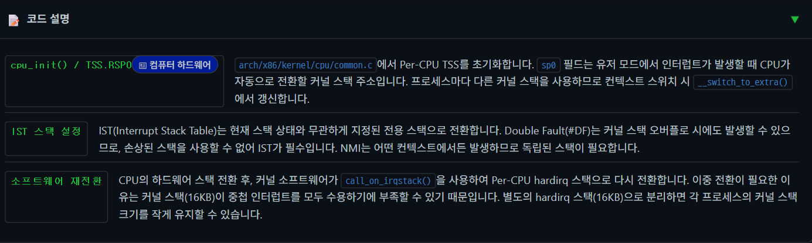

```c
/* arch/x86/kernel/idt.c — IDT 설정 (간략화) */
static const struct idt_data def_idts[] = {
    /* 예외 벡터 */
    INTG(0,   asm_exc_divide_error),           /* #DE */
    ISTG(1,   asm_exc_debug, IST_INDEX_DB),     /* #DB: IST3 사용 */
    ISTG(2,   asm_exc_nmi, IST_INDEX_NMI),      /* NMI: IST2 사용 */
    SYSG(3,   asm_exc_int3),                    /* #BP: 유저 접근 허용 */
    INTG(6,   asm_exc_invalid_op),              /* #UD */
    ISTG(8,   asm_exc_double_fault, IST_INDEX_DF), /* #DF: IST1 */
    INTG(13,  asm_exc_general_protection),      /* #GP */
    INTG(14,  asm_exc_page_fault),              /* #PF */
    ISTG(18,  asm_exc_machine_check, IST_INDEX_MCE), /* #MC: IST4 */
    /* ... */
};
/*
 * INTG: Interrupt Gate — DPL 0, IF 클리어 (인터럽트 비활성)
 * SYSG: System Gate — DPL 3, 유저 공간에서 INT 명령으로 호출 가능
 * ISTG: IST Gate — IST 스택 인덱스 지정
 */
void __init idt_setup_early_traps(void)
{
    idt_setup_from_table(idt_table, def_idts,
                         ARRAY_SIZE(def_idts), false);
    load_idt(&idt_descr);  /* LIDT 명령으로 IDTR 설정 */
}
```

### ARM 예외 모델 (Exception Model)
ARM64에서는 IDT 대신 예외 벡터 테이블(Exception Vector Table)을 사용합니다. VBAR_EL1(Vector Base Address Register) 레지스터가 테이블의 시작 주소를 가리키며, 예외 유형과 발생 소스(Source)에 따라 128바이트 간격의 오프셋(Offset)으로 벡터를 선택합니다.

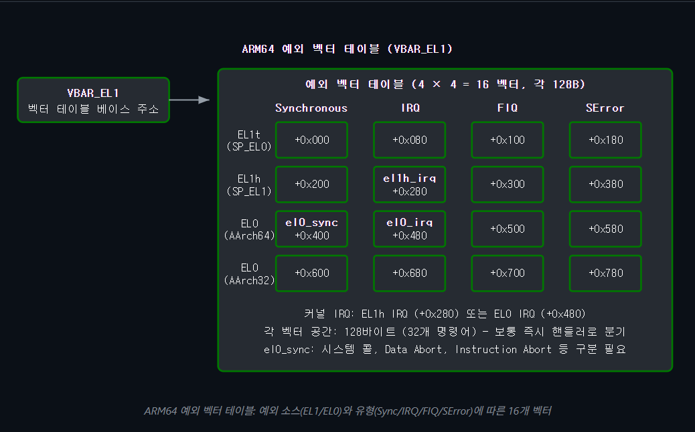

```c
// arch/arm64/kernel/entry.S — 예외 벡터 테이블 정의 (간략화)
/*
 * 벡터 테이블은 2KB 정렬, 각 벡터는 128B 간격
 * VBAR_EL1에 이 테이블 주소를 설정
 */
    .align  11  // 2KB 정렬
SYM_CODE_START(vectors)
    /* Current EL with SP_EL0 (EL1t) — 거의 사용하지 않음 */
    kernel_ventry   1, t, 64, sync        // Synchronous
    kernel_ventry   1, t, 64, irq         // IRQ
    kernel_ventry   1, t, 64, fiq         // FIQ
    kernel_ventry   1, t, 64, error       // SError
    /* Current EL with SP_ELx (EL1h) — 커널 실행 중 예외 */
    kernel_ventry   1, h, 64, sync        // Synchronous
    kernel_ventry   1, h, 64, irq         // IRQ ← 커널 모드 인터럽트
    kernel_ventry   1, h, 64, fiq         // FIQ
    kernel_ventry   1, h, 64, error       // SError
    /* Lower EL, AArch64 (EL0) — 유저 프로세스 예외 */
    kernel_ventry   0, t, 64, sync        // Synchronous (syscall 등)
    kernel_ventry   0, t, 64, irq         // IRQ ← 유저 모드 인터럽트
    kernel_ventry   0, t, 64, fiq         // FIQ
    kernel_ventry   0, t, 64, error       // SError
    /* Lower EL, AArch32 — 32비트 호환 */
    kernel_ventry   0, t, 32, sync
    kernel_ventry   0, t, 32, irq
    kernel_ventry   0, t, 32, fiq
    kernel_ventry   0, t, 32, error
SYM_CODE_END(vectors)
```

`x86 IDT vs ARM 예외 벡터 비교`: x86 IDT는 256개의 가변 크기 게이트 디스크립터로 각 벡터가 직접 핸들러 주소를 포함합니다. ARM은 16개의 고정 128바이트 벡터 슬롯(Slot)을 사용하며, 벡터 코드 내에서 예외 유형(ESR_EL1)을 읽어 세부 분기합니다. x86은 벡터 번호로 인터럽트를 구분하지만, ARM은 GIC에서 인터럽트 번호를 ACK 레지스터로 읽어야 합니다.

1. x86: "하드웨어가 다 해줄게" (CISC 철학)
x86은 하드웨어가 많은 일을 자동으로 처리해 주는 구조입니다.

장점 (직관적인 처리): 에러가 발생하면 하드웨어가 곧바로 IDT를 뒤져서 해당 핸들러로 점프합니다. 소프트웨어가 "무슨 에러지?" 하고 원인을 찾기 위해 추가 코드를 실행할 필요가 없습니다.

단점 (숨겨진 지연과 무거움): IDT에서 핸들러 주소를 읽어오는 작업 자체가 메모리 접근(Memory Access)입니다. 만약 이 값이 캐시에 없다면 메모리에서 가져오는 동안 CPU가 기다려야 합니다. 또한, x86 CPU는 인터럽트 발생 시 권한을 변경하고 레지스터 상태를 스택에 자동으로 밀어 넣는(Push) 등 복잡한 내부 로직을 꽤 무겁게 실행합니다. 이는 최적화가 생명인 현대 CPU의 파이프라인에서 병목을 일으킬 수 있습니다.

2. ARM: "단순하고 유연하게" (RISC 철학)
ARM은 하드웨어를 최대한 단순하게 만들고, 세부적인 처리는 소프트웨어(운영체제)에 맡기는 구조입니다.

장점 (캐시 친화성 & 날렵함): ARM의 128바이트 벡터 슬롯에는 주소가 아니라 실행 가능한 명령어 자체가 들어있습니다. 이 명령어들은 높은 확률로 CPU 내에서 가장 빠른 'L1 명령어 캐시(I-Cache)'에 적재되어 있습니다. 메모리에서 주소를 찾아올 필요 없이, 진입하자마자 즉시 코드가 실행됩니다.

단점 (소프트웨어 오버헤드): ESR_EL1 레지스터를 읽고 분기(if/switch)하는 코드를 소프트웨어가 직접 실행해야 하므로, x86에 비해 몇 개의 명령어(Instruction)를 더 실행해야 합니다.

🏆 결론: 무엇이 더 효율적인가?
과거에는 하드웨어가 모든 걸 알아서 해주는 x86 방식이 더 편하고 빠르다고 여겨졌습니다. 하지만 프로세서 기술이 고도화된 현재는 ARM의 방식이 구조적으로 더 효율적이라고 평가받습니다.

`파이프라인 최적화`: ARM처럼 단순한 명령어를 빠르게 여러 번 실행하는 것이, x86처럼 무겁고 복잡한 하드웨어 로직(메모리 참조 포함)을 한 번 거치는 것보다 현대 CPU의 파이프라인 및 분기 예측(Branch Prediction) 구조에 훨씬 유리합니다.

`전력 대비 성능 (효율성)`: x86의 복잡한 하드웨어 자동화 로직은 전력 소모를 늘리고 실리콘 칩 면적을 많이 차지합니다. 반면 ARM은 이 로직을 덜어내고 소프트웨어로 넘겼기 때문에, 발열 제어와 전력 효율성(Performance per Watt)에서 압도적인 우위를 가집니다.

요약하자면:
단순히 `'거치는 단계의 수'만 보면 x86이 더 빠를 것 같지만, 'CPU가 멈추지 않고 얼마나 매끄럽게 명령어를 처리하는가'를 따지는 뼈대(Architecture) 효율성 기준`에서는 ARM의 구조가 더 세련되고 유연하게 설계되었다고 볼 수 있습니다.

# Top Half / Bottom Half 아키텍처
인터럽트 핸들러에서 긴 작업을 수행하면 다른 인터럽트를 차단하여 시스템 응답성이 저하됩니다. Linux는 이를 해결하기 위해 인터럽트 처리를 두 단계로 분리합니다:

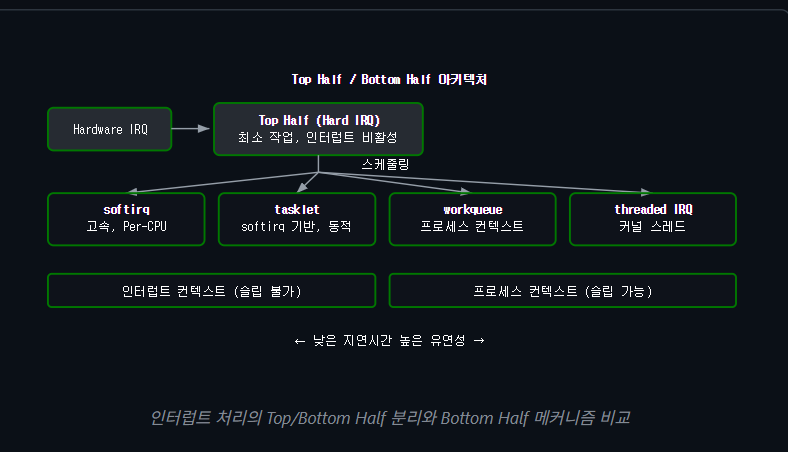

### 인터럽트 핸들러 등록
```c
#include <linux/interrupt.h>

/* IRQ 핸들러 등록 */
int request_irq(
    unsigned int irq,              /* IRQ number */
    irq_handler_t handler,         /* Top half handler */
    unsigned long flags,            /* IRQF_SHARED, IRQF_ONESHOT, etc. */
    const char *name,               /* /proc/interrupts에 표시되는 이름 */
    void *dev_id                    /* shared IRQ 구분용 */
);
/* Threaded IRQ 등록 (Top + Bottom half) */
int request_threaded_irq(
    unsigned int irq,
    irq_handler_t handler,         /* Top half (hardirq context) */
    irq_handler_t thread_fn,       /* Bottom half (thread context) */
    unsigned long flags,
    const char *name,
    void *dev_id
);
/* 핸들러 반환 값 */
/* IRQ_NONE     - 이 디바이스의 인터럽트가 아님 (shared IRQ) */
/* IRQ_HANDLED  - 정상 처리 완료 */
/* IRQ_WAKE_THREAD - bottom half 스레드 깨우기 */
```

1. request_irq : 하나의 핸들러가 모든 작업을 즉시 처리, 인터럽트 컨텍스트에서 실행, 작업이 매우 짧고 단순할 때 사용
2. request_threaded_irq : 작업을 두 단계(top/bottom)으로 나누어 처리, 인터럽트 + 프로세스 컨텍스트, 시간이 매우 오래 걸리거나 대기(sleep)가 필요할 때 사용

### IRQ 핸들러 예제
```c
static irqreturn_t my_irq_handler(int irq, void *dev_id)
{
    struct my_device *dev = dev_id;
    u32 status;
    /* Read interrupt status register */
    status = ioread32(dev->regs + IRQ_STATUS);
    if (!(status & MY_IRQ_MASK))
        return IRQ_NONE;  /* Not our interrupt */
    /* Acknowledge interrupt */
    iowrite32(status, dev->regs + IRQ_ACK);
    /* Schedule bottom half */
    tasklet_schedule(&dev->tasklet);
    return IRQ_HANDLED;
}
```
1. ioread32()로 디바이스의 인터럽트 상태 레지스터를 읽습니다. 공유 IRQ 환경에서는 이 값으로 자신의 인터럽트인지 판별해야 합니다. MY_IRQ_MASK에 해당하지 않으면 IRQ_NONE을 반환하여 커널이 체인의 다음 핸들러를 호출하도록 합니다.
2. iowrite32()로 상태 레지스터에 쓰기하여 인터럽트를 확인(Acknowledge) 처리합니다. ACK 없이 반환하면 레벨 트리거 인터럽트에서 인터럽트 스톰이 발생합니다. (하드웨어에게 인터럽트 신호 확인했다는 것을 보내지 않으면 커널이 못받은 줄 알고 계속 벨을 두드림.)
3. bottom half 처리를 위해 태스크(Task)릿을 스케줄링합니다. top half(hardirq 컨텍스트)에서는 최소한의 작업만 수행하고, 시간이 걸리는 데이터 처리는 softirq/tasklet/workqueue 등 bottom half로 위임하는 것이 핵심 패턴입니다. 호출 체인: do_IRQ() → handle_irq() → handle_irq_event() → 이 핸들러.

### IRQ 생명주기
운영체제에서 하드웨어 인터럽트를 사용하려면 커널에 특정 인터럽트를 사용하겠다고 권한을 요청해야한다. 그 중 request_irq()/free_irq()는 수동관리로, 사용할 때 등록하고 다 쓰면 반드시 해제해야한다. 해제할 때 고유 id인 dev_id를 정확히 넘겨줘야 여러 핸들러가 섞여 있을 때 엉뚱한 것을 해제하지 않는다. 만약 free_irq()를 빼먹으면 리소스 누수가 생긴다.

devm_request_irq()는 자동관리이다. 최신 드라이버에서 널리 쓰이고 `디바이스 장치가 제거될 때 커널이 알아서 free_irq()를 호출해준다.` 에러 처리 경로가 꼬이거나 드라이버 종료 시 실수로 해제를 누락하는 것을 방지해준다. (스마트 포인터와 비슷)

IRQ 핸들러의 등록과 해제는 리소스 관리의 핵심입니다. request_irq()/free_irq() 패턴과 managed 리소스 버전을 이해해야 합니다.

### IRQF 플래그
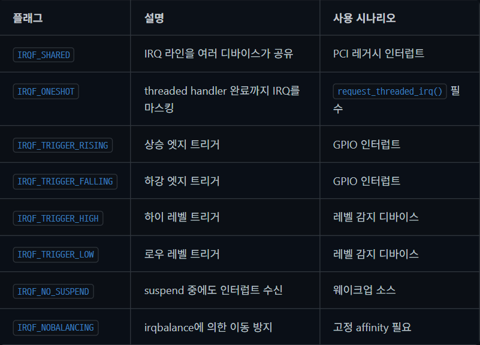

- IRQF_SHARED: 여러 장치가 하나의 인터럽트 라인을 공유해서 쓸 때 사용합니다. (예: 구형 PCI 레거시 인터럽트)
- IRQF_ONESHOT: 첫 번째 인터럽트 처리가 완전히 끝날 때까지, 중간에 새로운 인터럽트가 중복해서 발생하지 않도록 하드웨어적으로 막아(마스킹) 줍니다.
- IRQF_TRIGGER_RISING / FALLING: 하드웨어 신호가 0에서 1로 올라가는 순간(상승 엣지) 또는 1에서 0으로 떨어지는 순간(하강 엣지) 인터럽트를 발생시킵니다. 주로 GPIO 핀 제어에 쓰입니다.
- IRQF_TRIGGER_HIGH / LOW: 신호가 변하는 찰나가 아니라, 신호 전압 자체가 높은 상태인지 낮은 상태인지 지속되는 레벨을 감지합니다.
- IRQF_NO_SUSPEND: 시스템이 절전 모드(Suspend)에 들어가도 이 인터럽트는 살려둡니다. 마우스를 흔들면 화면이 켜지는 것처럼 절전 모드를 깨우는 웨이크업 소스로 쓰입니다.
- IRQF_NOBALANCING: 리눅스 커널은 보통 성능을 위해 인터럽트 처리를 여러 CPU 코어에 분산(irqbalance)시키는데, 이 플래그를 주면 특정 인터럽트는 지정된 CPU에서만 처리되도록 고정할 수 있습니다.

### Managed IRQ(Interrupt Request) 등록
```c
/* 기본 패턴: request_irq + free_irq */
ret = request_irq(irq, my_handler, IRQF_SHARED, "mydev", priv);
if (ret)
    return ret;
/* ... 드라이버 동작 ... */
free_irq(irq, priv);  /* 반드시 같은 dev_id로 해제 */

/* Managed 리소스 패턴: device 해제 시 자동 free */
ret = devm_request_irq(&pdev->dev, irq, my_handler,
                       IRQF_SHARED, "mydev", priv);
if (ret)
    return ret;
/* free_irq() 호출 불필요 — 디바이스 해제 시 자동 처리 */

/* IRQ 제어 */
disable_irq(irq);       /* 동기적: 진행 중인 핸들러 완료 대기 */
disable_irq_nosync(irq);/* 비동기: 즉시 반환 */
enable_irq(irq);        /* IRQ 재활성화 */
synchronize_irq(irq);   /* 진행 중인 핸들러 완료 대기 */
```

1. `request_irq() + free_irq()`: kernel/irq/manage.c에 구현된 기본 IRQ 등록/해제 패턴입니다. free_irq() 호출 시 반드시 등록할 때 사용한 것과 동일한 dev_id를 전달해야 합니다. 공유 IRQ에서 dev_id는 핸들러 체인에서 특정 핸들러를 식별하는 키 역할을 합니다.
2. `devm_request_irq()`: managed 리소스(devres) 버전으로, 디바이스가 해제될 때 free_irq()를 자동 호출합니다. 에러 경로에서 수동 해제를 빼먹는 실수를 방지하므로 최신 드라이버에서 권장됩니다.
3. `disable_irq() vs disable_irq_nosync()`: 동기와 비동기 차이다. disable_irq()는 현재 실행 중인 핸들러가 완료될 때까지 블로킹하므로 인터럽트 컨텍스트에서 호출하면 `DeadLock`이 발생합니다. 인터럽트 핸들러 내부에서는 disable_irq_nosync()를 사용하고, 필요 시 synchronize_irq()로 별도 동기화합니다.

## 인터럽트 진입/복귀 경로 상세
인터럽트가 발생하면 CPU는 하드웨어 수준에서 현재 상태를 저장하고, 아키텍처별 진입 코드(Entry Code)를 거쳐 커널의 공통 인터럽트 처리 경로에 도달합니다. 이 과정을 정확히 이해하면 인터럽트 지연시간(Latency) 분석과 디버깅에 큰 도움이 됩니다.

### x86 인터럽트 진입 경로
x86에서 인터럽트가 발생하면 CPU는 IDT에서 게이트 디스크립터(Gate Descriptor)를 찾아 해당 진입점(Entry Point)으로 점프합니다. 커널은 entry_64.S의 idtentry 매크로(Macro)로 레지스터를 저장하고, C 핸들러를 호출합니다.

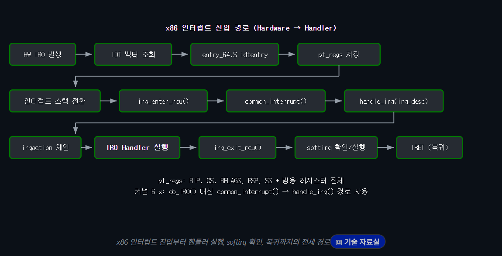

```c
/* arch/x86/entry/entry_64.S — idtentry 매크로 (간략화) */
/*
 * idtentry: 인터럽트/예외 진입 매크로, 현재 CPU의 상태를 스택에 백업함.
 * CPU가 자동으로 SS, RSP, RFLAGS, CS, RIP를 스택에 push한 상태에서 시작
 */
.macro idtentry sym do_sym has_error_code:req
SYM_CODE_START(\sym)
    /* error_code가 없으면 더미 push */
    .if \has_error_code == 0
        pushq   $-1              /* 더미 error code */
    .endif
    /* 범용 레지스터 저장 → pt_regs 구조체 완성 */
    pushq   %rdi
    pushq   %rsi
    pushq   %rdx
    pushq   %rcx
    pushq   %rax
    pushq   %r8
    pushq   %r9
    pushq   %r10
    pushq   %r11
    pushq   %rbx
    pushq   %rbp
    pushq   %r12
    pushq   %r13
    pushq   %r14
    pushq   %r15 // 매크로 내부에서 모든 범용 레지스터를 순서대로 스택에 저장합니다.

    movq    %rsp, %rdi           /* 첫 번째 인자: pt_regs 포인터 */
    call    \do_sym              /* C 핸들러 호출 */
    jmp     error_return        /* 복귀 경로 */
SYM_CODE_END(\sym)
.endm
```

결과적으로 C 함수의 원형은 void handler(struct pt_regs *regs) 형태가 됩니다.

```c
/* arch/x86/kernel/irq.c — common_interrupt (커널 6.x) */
DEFINE_IDTENTRY_IRQ(common_interrupt)
{
    struct pt_regs *old_regs = set_irq_regs(regs);
    struct irq_desc *desc;
    int vector = (u8)error_code;  /* 인터럽트 벡터 번호를 추출한다. */
    /* RCU 및 인터럽트 상태 진입 */
    irq_enter_rcu();
    desc = __this_cpu_read(vector_irq[vector]);
    if (likely(!IS_ERR_OR_NULL(desc))) {
        handle_irq(desc, regs);  /* irq_desc의 handle_irq 콜백 */
    } else {
        ack_APIC_irq();
        if (desc == VECTOR_UNUSED)
            pr_emerg_ratelimited("Spurious interrupt vector %d\n", vector);
    }
    /* 인터럽트 상태 복귀 + softirq 확인 */
    irq_exit_rcu();
    set_irq_regs(old_regs);
}
```

`인터럽트 벡터 확인` (int vector = (u8)error_code;):
수많은 하드웨어 중 어떤 녀석이 인터럽트를 걸었는지 식별하는 번호(Vector)를 추출합니다. 키보드인지, 네트워크 카드인지, 타이머인지 이 번호로 구분합니다.

`커널 상태 전환` (irq_enter_rcu();):
이제부터 본격적인 '인터럽트 컨텍스트'에서 코드가 실행됨을 커널의 스케줄러와 RCU(Read-Copy-Update) 시스템에 알립니다.

`실제 핸들러 호출` (handle_irq(desc, regs);):
앞서 추출한 벡터 번호를 이용해 vector_irq 배열에서 해당 인터럽트에 대한 정보(irq_desc)를 찾습니다. 정보가 유효하다면, 이전에 드라이버에서 request_irq()로 등록해 두었던 바로 그 실제 함수(예: my_handler)를 찾아 실행시킵니다.

`예외 처리` (Spurious Interrupt):
만약 인터럽트는 발생했는데 등록된 핸들러가 없다면(desc == VECTOR_UNUSED), 이는 하드웨어 노이즈나 칩셋 버그로 인한 가짜 인터럽트(Spurious Interrupt)일 수 있습니다. 이때는 하드웨어 인터럽트 컨트롤러(APIC)에 처리했다고 신호(ack_APIC_irq())만 보내고 로그를 남깁니다.

`인터럽트 종료 및 후반부 처리` (irq_exit_rcu();):
처리가 끝났음을 알립니다. 이 함수는 매우 중요한데, 인터럽트 핸들러가 미뤄둔 무거운 작업(SoftIRQ, Tasklet, Workqueue 등 - 'Bottom Half'라고 부름)이 있다면 바로 이 시점, 즉 완전히 유저 모드로 돌아가기 직전에 이들을 일괄적으로 처리하게 됩니다.

### 요약
하드웨어가 CPU 흐름을 가로채면 -> 어셈블리 코드가 현재 레지스터 상태를 스택에 덤프하여 pt_regs 구조체를 만들고 -> C 코드가 이를 넘겨받아 어떤 장치인지 판별한 후 -> 드라이버 개발자가 작성한 핸들러로 정확히 분기(Routing)해 주는 일련의 과정입니다.

### RCU란?
이름(Read, Copy, Update)에 그 동작 원리가 그대로 담겨 있다.

Read (읽기): 데이터를 읽으려는 쪽은 아무런 락을 걸지 않고 곧바로 데이터를 읽는다. 락을 획득하고 해제하는 과정이 없으니 지연 시간(Latency) 없이 엄청나게 빠르다.

Copy (복사): 만약 누군가 데이터를 수정(Write)해야 한다면, 원본 데이터를 직접 건드리지 않고 먼저 똑같은 복사본을 하나 만든다.

Update (수정): 복사본의 데이터를 수정한 뒤, 데이터 구조를 가리키고 있던 포인터를 새 복사본으로 '바꿔치기' 한다. 포인터 교체는 원자적(Atomic)으로 일어나기 때문에, 이후에 접근하는 새로운 '읽기' 작업들은 자연스럽게 새로 수정된 데이터를 보게 된다.

Reclaim (Grace Period 대기 및 삭제): 여기서 문제가 하나 있다. 포인터를 바꾸기 직전에 이미 옛날 원본 데이터를 읽기 시작한 '과거의 독자'들이 있다. RCU는 이 과거의 독자들이 작업을 완전히 끝마칠 때까지 기다리는 유예 기간(Grace Period)을 가진다. 이 기간이 지나면 옛날 데이터를 메모리에서 안전하게 해제(Free)한다.

# ARM64 인터럽트 진입 경로
- EL0: 유저 애플리케이션 모드
- EL1: 운영체제 커널 모드 (리눅스 커널이 도는 곳)

x86은 인터럽트가 발생하면 `IDT(Interrupt Descriptor Table)`를 참조하지만, ARM64는 `VBAR_EL1 (Vector Base Address Register)`이라는 특수 레지스터가 가리키는 예외 벡터 테이블(Exception Vector Table)의 특정 오프셋으로 하드웨어적인 점프를 수행합니다.

ARM은 인터럽트가 터진 순간 `CPU가 유저 모드(EL0)였는지, 커널 모드(EL1)였는지에 따라 완전히 다른 진입점(Vector)으로 점프하도록 설계`되어 있습니다.
```c
// arch/arm64/kernel/entry.S — 예외 벡터 엔트리 (간략화)
/*
 * EL1에서 IRQ 발생 시 진입점
 * SP_EL1 사용, 현재 커널 코드 실행 중에 인터럽트 발생
 */
SYM_CODE_START_LOCAL(el1h_64_irq) 
    kernel_entry 1          // 레지스터 저장 (x0-x30, sp, pc, pstate)
    mov     x0, sp                // pt_regs 포인터를 첫 번째 인자로 (ARM 호출 규약)
    bl      el1_interrupt        // C 핸들러 호출
    kernel_exit 1           // 레지스터 복원 + eret
SYM_CODE_END(el1h_64_irq)

/*
 * EL0에서 IRQ 발생 시 진입점
 * 유저 프로세스 실행 중에 인터럽트 발생
 */
SYM_CODE_START_LOCAL(el0t_64_irq)
    kernel_entry 0          // 유저 레지스터 저장
    mov     x0, sp
    bl      el0_interrupt
    b       ret_to_user          // 유저 복귀 (시그널 확인 포함)
SYM_CODE_END(el0t_64_irq)
```

##### GIC 처리 흐름 
```c
/* arch/arm64/kernel/irq.c — GIC 인터럽트 ACK 흐름 */
static void __gic_handle_irq(u32 irqstat, struct pt_regs *regs)
{
    u32 irqnr = irqstat & GICC_IAR_INT_ID_MASK;
    /* GIC에서 인터럽트 번호 읽기 (ACK) */
    if (likely(irqnr > 15 && irqnr < 1020)) {
        /* SPI(Shared Peripheral Interrupt) — irq_domain으로 매핑 */
        handle_domain_irq(gic_data.domain, irqnr, regs);
    } else if (irqnr < 16) {
        /* SGI(Software Generated Interrupt) — IPI 처리 */
        handle_IPI(irqnr, regs);
    }
    /* irqnr == 1023: spurious interrupt (무시) */
}
```
ARM 시스템의 핵심 인터럽트 컨트롤러인 GIC의 인터럽트 처리(ACK) 흐름을 보여줍니다. x86의 APIC 역할을 하는 것이 ARM의 GIC입니다.

GIC는 인터럽트의 종류를 번호(ID)로 구분하여 관리합니다. 코드를 보면 비트 마스킹(irqstat & GICC_IAR_INT_ID_MASK)을 통해 정확한 인터럽트 번호(irqnr)를 추출한 뒤, 번호 대역에 따라 다르게 처리합니다.

- SPI : 마우스, 키보드, 네트워크 카드 등 일반적인 `외부 하드웨어 장치`에서 발생하는 인터럽트
- SGI : `소프트웨어`가 명시적으로 발생시키는 인터럽트로, 주로 멀티코어 환경에서 `CPU 코어 간 통신(IPI: Inter-Processor Interrupt)`을 할 때 사용
- SI : 인터럽트 신호는 발생했지만 실제로 `처리할 내용이 없는 '가짜(Spurious)'` 인터럽트 번호

### irq_enter() / irq_exit() 내부
irq_enter()와 irq_exit()는 인터럽트 처리의 시작과 끝을 커널에 알리는 핵심 함수입니다. preempt_count의 HARDIRQ 비트를 조작하여 인터럽트 컨텍스트(Interrupt Context) 상태를 추적하고, irq_exit()에서는 pending softirq를 확인하여 실행합니다.

```c
/* kernel/softirq.c — irq_enter/irq_exit 내부 (간략화) */
void irq_enter_rcu(void)
{
    /*
     * preempt_count의 HARDIRQ 비트를 증가
     * → in_hardirq() == true
     * → 슬립 가능 함수 호출 시 BUG 감지
     */
    __irq_enter_raw();
    /* idle 상태였으면 tick 재시작 */
    if (is_idle_task(current) && !in_interrupt())
        tick_irq_enter();
    /* IRQ 시간 통계 시작 */
    account_irq_enter_time(current);
}
void irq_exit_rcu(void)
{
    /* IRQ 시간 통계 종료 */
    account_irq_exit_time(current);
    /* HARDIRQ 카운트 감소 */
    preempt_count_sub(HARDIRQ_OFFSET);
    /*
     * 핵심: HARDIRQ + SOFTIRQ가 모두 0이고
     * pending softirq가 있으면 즉시 실행
     */
    if (!in_interrupt() && local_softirq_pending())
        invoke_softirq();  /* → __do_softirq() 또는 ksoftirqd 깨움 */
    /* 선점 검사: preempt_count == 0이면 재스케줄링 가능 */
    tick_irq_exit();
}
```
1. preempt_count와 인터럽트 컨텍스트(Interrupt Context)
코드를 분석하기 전에 이미지 설명글에도 등장하는 preempt_count라는 변수의 역할을 아는 것이 중요합니다.

커널은 현재 CPU가 어떤 상태(유저 모드, 커널 모드, 하드웨어 인터럽트 처리 중 등)에 있는지 정확히 추적하기 위해 각 스레드 정보에 `preempt_count`라는 변수를 둡니다. 이 변수의 `HARDIRQ 비트`가 활성화되어 있으면 커널은 `"지금 CPU는 하드웨어 인터럽트를 처리하는 컨텍스트(Interrupt Context)에 있구나!"`라고 판단합니다. 이 상태에서는 `다른 프로세스로의 전환(스케줄링)이나 슬립(Sleep, 대기 상태)이 엄격하게 금지됩니다.`

2. irq_enter_rcu() : 인터럽트 처리의 시작
하드웨어 인터럽트가 발생해 커널로 진입할 때 가장 먼저 호출되어, 시스템 전체에 "지금부터 인터럽트 처리를 시작한다"고 알리는 역할입니다.

`__irq_enter_raw();`

이 함수의 가장 중요한 동작입니다. preempt_count의 HARDIRQ 비트를 1 증가시킵니다.

이 시점부터 커널은 in_hardirq() == true 상태가 됩니다. 주석에 적혀 있듯, 만약 이 상태에서 커널 개발자가 실수로 슬립(Sleep) 가능성이 있는 함수(예: 락 획득 대기, 타이머 대기 등)를 호출하면 커널은 치명적 오류(BUG)를 감지하고 시스템 경고를 냅니다.

`if (is_idle_task(current) && !in_interrupt()) tick_irq_enter();`

CPU가 할 일이 없어서 전력 소모를 줄이려 잠들어(idle) 있던 상태에서 인터럽트 신호가 들어와 깨어난 것이라면, 멈춰두었던 커널의 시간 측정 타이머(Tick)를 다시 시작합니다.

`account_irq_enter_time(current);`

통계 수집을 위해 타이머를 켭니다. "이 하드웨어 인터럽트 처리에 CPU 시간을 얼마나 썼는지" 측정하기 시작합니다. 우리가 리눅스에서 top 명령어를 쳤을 때 보이는 %hi (Hardware Interrupt) 사용량이 바로 여기서부터 측정됩니다.

3. irq_exit_rcu() : 인터럽트의 종료와 SoftIRQ 실행
하드웨어 장치가 요청한 급한 작업을 모두 마치고, 원래 실행되던 프로그램으로 돌아가기 직전에 호출됩니다.

`account_irq_exit_time(current);`

아까 켰던 통계 타이머를 끕니다. 하드웨어 인터럽트 처리에 소요된 시간 측정을 마칩니다.

`preempt_count_sub(HARDIRQ_OFFSET);`

preempt_count의 HARDIRQ 비트를 다시 감소시킵니다. 이제 "급한 하드웨어 인터럽트 처리는 공식적으로 끝났다"고 커널에 선언하는 것입니다.

`if (!in_interrupt() && local_softirq_pending()) invoke_softirq();`

이 함수의 존재 이유이자 가장 핵심적인 동작입니다.

인터럽트 처리는 시스템 지연을 막기 위해 1분 1초가 급하므로, 오래 걸리는 작업은 나중에 하도록 미뤄둡니다(Pending). 미뤄둔 덜 급한 후반부 작업을 SoftIRQ라고 합니다. (예: 네트워크 패킷 조립, 디스크 I/O 완료 통보 등)

`!in_interrupt()`: 현재 겹쳐서 실행 중인 또 다른 인터럽트가 완벽히 끝났고,

`local_softirq_pending()`: 미뤄둔 SoftIRQ 작업이 존재한다면,

`invoke_softirq()`: 원래 프로세스로 돌아가기 전에, 미뤄둔 작업들을 즉시 여기서 모두 실행하고 넘어갑니다.

`tick_irq_exit();`

마지막으로 선점(Preemption) 여부를 검사합니다. 만약 preempt_count == 0이 되어 다시 안전하게 스케줄링이 가능한 상태가 되었다면, 방금 인터럽트 처리 결과로 인해 깨어난 더 우선순위가 높은 다른 프로세스가 있는지 확인하고 스케줄링(재배치)을 수행할 준비를 합니다.

```
preempt_count 구조: preempt_count는 32비트 정수로, 비트 영역별로 다른 의미를 가집니다: 비트 0-7 = 선점 비활성 카운트, 비트 8-15 = softirq 카운트, 비트 16-19 = hardirq 카운트, 비트 20 = NMI. in_interrupt()는 hardirq + softirq + NMI 비트가 하나라도 설정되면 true를 반환합니다.
```

## 인터럽트 스택 아키텍처
인터럽트 핸들러는 프로세스의 커널 스택(Kernel Stack)이 아닌 별도의 인터럽트 스택(Interrupt Stack)에서 실행됩니다. 이는 스택 오버플로 방지와 인터럽트 처리의 독립성을 보장합니다.

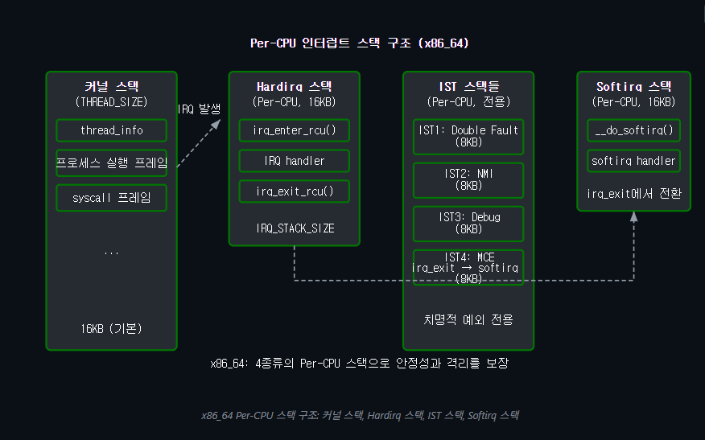

### x86 IST(Interrupt Stack Table)
IST(Interrupt Stack Table)는 x86_64에서 치명적 예외(Critical Exception)를 위한 전용 스택입니다. TSS(Task State Segment)에 최대 7개의 IST 포인터를 설정할 수 있으며, IDT 게이트 디스크립터에서 IST 인덱스를 지정하면 해당 예외 발생 시 무조건 지정된 스택으로 전환됩니다.

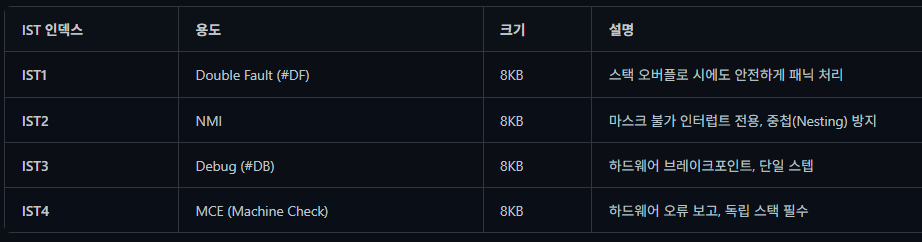

```c
/* arch/x86/include/asm/irq_stack.h — 인터럽트 스택 전환 (간략화) */
/*
 * call_on_irqstack: 현재 스택에서 Per-CPU hardirq 스택으로 전환하여 함수 실행
 * 커널 스택 소비를 최소화하고 스택 오버플로 위험을 줄임
 */
#define call_on_irqstack(func, asm_call)            \
{                                                       \
    register void *tos asm("r11");               \
                                                        \
    tos = __this_cpu_read(hardirq_stack_ptr);      \
                                                        \
    asm volatile(                                    \
        "movq   %%rsp, (%[tos])     \n"             \
        "movq   %[tos], %%rsp       \n"             \
        asm_call                                        \
        "popq   %%rsp               \n"             \
        :                                               \
        : [tos] "r" (tos), [func] "m" (func)        \
        : "memory"                                    \
    );                                                  \
}
```

### ARM64 인터럽트 스택
ARM64에서도 Per-CPU 인터럽트 스택을 사용합니다. EL1에서 IRQ가 발생하면 IRQ_STACK_SIZE(기본 16KB) 크기의 전용 스택으로 전환한 후 핸들러를 실행합니다. x86의 IST와 달리 별도의 예외 전용 스택은 없으며, 모든 인터럽트가 단일 IRQ 스택을 공유합니다.

```c
/* arch/arm64/kernel/irq.c — ARM64 IRQ 스택 전환 */
/* Per-CPU IRQ 스택 선언 */
DEFINE_PER_CPU(unsigned long *, irq_stack_ptr); // Per-CPU 변수 선언

// 인터럽트 발생 시 스택 전환 및 실행
static void ____do_IRQ(struct pt_regs *regs)
{
    /*
     * 인터럽트 스택으로 전환하여 handle_arch_irq 실행
     * 커널 스택 소비를 방지하고
     * 중첩 인터럽트로 인한 오버플로를 예방
     */
    call_on_irq_stack(regs, handle_arch_irq);
}

/* init 시점에 Per-CPU 스택 할당 */
// 시스템이 처음 켜질 때(초기화 시점) 모든 CPU 코어의 IRQ 스택 공간을 미리 확보합니다.
static void init_irq_stacks(void) // 시스템 부팅 시 스택 메모리 할당
{
    int cpu;
    for_each_possible_cpu(cpu) {
        unsigned long *p = (unsigned long *)__get_free_pages(
            GFP_KERNEL, IRQ_STACK_ORDER); //남는 메모리 할당
        // 할당 받은 메모리 블록에 IRQ 스택 사이즈를 더해 맨 위를 가리킴.
        per_cpu(irq_stack_ptr, cpu) = p + IRQ_STACK_SIZE / sizeof(long);
    }
}
```

# softirq, tasklet, workqueue, Threaded IRQ
### softirq
softirq는 커널에 정적으로 정의된 10가지 Bottom Half 메커니즘입니다. irq_exit()에서 pending 비트를 확인하여 실행되며, 같은 softirq가 여러 CPU에서 동시 실행될 수 있어 Per-CPU 데이터를 활용합니다. 부하가 높으면 ksoftirqd 커널 스레드로 위임됩니다.

### tasklet
tasklet은 softirq(TASKLET_SOFTIRQ, HI_SOFTIRQ) 위에 구축된 동적 Bottom Half 메커니즘입니다. 같은 tasklet은 절대 병렬 실행되지 않는 직렬화(Serialization)를 보장하지만, deprecated 추세이므로 새 코드에서는 workqueue 또는 threaded IRQ를 사용하세요.

### workqueue
workqueue는 Bottom Half 작업을 커널 스레드(프로세스 컨텍스트)에서 실행합니다. 슬립이 가능하므로 mutex 획득, 메모리 할당(GFP_KERNEL) 등이 가능하며, 새로운 Bottom Half 메커니즘 선택 시 기본 권장입니다.

### Threaded IRQ
Threaded IRQ는 인터럽트의 Bottom Half를 전용 커널 스레드에서 실행합니다. 프로세스 컨텍스트의 장점(슬립, mutex, GFP_KERNEL)을 가지면서도 workqueue보다 지연이 적습니다. PREEMPT_RT 커널에서는 모든 인터럽트 핸들러가 자동으로 threaded로 전환됩니다.
```c
/* Threaded IRQ 등록 */
ret = request_threaded_irq(irq,
    my_hardirq_handler,   /* top half: 빠른 ACK, IRQ_WAKE_THREAD 반환 */
    my_threaded_handler,  /* bottom half: 커널 스레드에서 실행 */
    IRQF_ONESHOT,         /* 스레드 완료까지 IRQ 마스킹 유지 */
    "mydev", priv);
/* Top half: 최소 작업만 수행 */
static irqreturn_t my_hardirq_handler(int irq, void *dev_id)
{
    struct my_device *dev = dev_id;
    u32 status = ioread32(dev->regs + IRQ_STATUS);
    if (!(status & MY_IRQ_MASK))
        return IRQ_NONE;
    /* ACK 인터럽트 */
    iowrite32(status, dev->regs + IRQ_ACK);
    dev->irq_status = status;
    return IRQ_WAKE_THREAD;  /* bottom half 스레드 깨우기 */
}
/* Bottom half: 스레드 컨텍스트 (슬립 가능!) */
static irqreturn_t my_threaded_handler(int irq, void *dev_id)
{
    struct my_device *dev = dev_id;
    mutex_lock(&dev->lock);
    /* I2C/SPI 통신, 대량 데이터 처리 등 가능 */
    process_data(dev, dev->irq_status);
    mutex_unlock(&dev->lock);
    return IRQ_HANDLED;
}
/* handler가 NULL이면 top half 없이 스레드만 실행 */
/* 이 경우 IRQF_ONESHOT 필수 (자동 unmask 방지) */
ret = request_threaded_irq(irq, NULL, my_threaded_handler,
    IRQF_ONESHOT | IRQF_TRIGGER_FALLING, "mydev", priv);
```

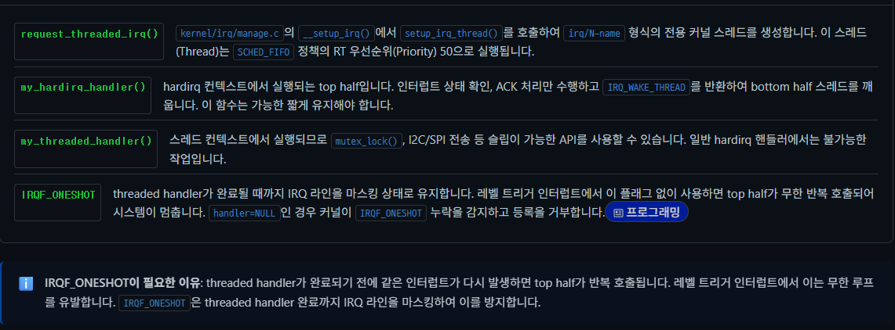

### 컨텍스트 비교
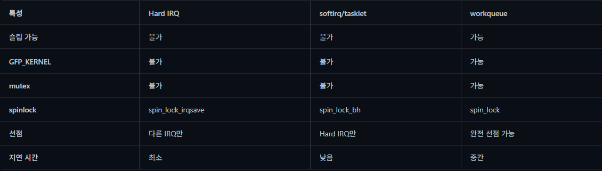

### 성능 비교
인터럽트 처리 메커니즘마다 지연와 처리량(Throughput)이 다릅니다. 다음은 실제 벤치마크 결과를 기반으로 한 성능 특성 비교입니다.

#### 지연 벤치마크
각 메커니즘의 평균/최악 지연를 측정한 결과입니다 (x86_64, 3.5 GHz  CPU 기준):

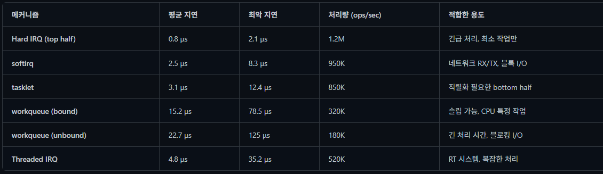

### Threaded IRQ vs 전통적 IRQ 성능 비교
Threaded IRQ는 인터럽트 핸들러를 커널 스레드에서 실행하여 선점 가능하게 만듭니다. RT 시스템에서는 지연 예측성이 향상되지만, 일반 시스템에서는 오버헤드(Overhead)가 있습니다:

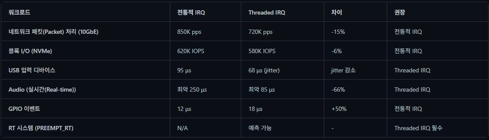

```BASH
# Threaded IRQ 레이턴시 측정
# IRQ 스레드 확인 (이름 패턴: irq/N-handler)
ps aux | grep 'irq/'

# 특정 IRQ 스레드의 우선순위 확인
chrt -p $(pgrep 'irq/16-')

# cyclictest로 IRQ 스레드 선점 레이턴시 측정
cyclictest -p 90 -m -n -i 200 -l 100000

# ftrace로 threaded IRQ 실행 시간 측정
echo function_graph > /sys/kernel/debug/tracing/current_tracer
echo irq_thread > /sys/kernel/debug/tracing/set_ftrace_filter
cat /sys/kernel/debug/tracing/trace
```

# 지금까지 내용 요약
핵심만 한 줄로 요약하면, `"하드웨어의 긴급한 호출(인터럽트)을 받으면, CPU는 최소한의 응급처치만 끝낸 뒤 무거운 작업은 뒤로 미루고 시스템의 응답성을 유지한다"`입니다.

1. 인터럽트 처리의 핵심 철학: 반으로 쪼개기 (Top / Bottom Half)
만약 택배기사(하드웨어)가 초인종을 눌렀을 때, 현관문에서 박스를 뜯고 물건을 조립(인터럽트 처리)까지 마친 뒤에야 집 안으로 돌아간다면 다른 중요한 일(스케줄링)이 올스톱됩니다. 커널은 이를 막기 위해 작업을 두 단계로 나눕니다.

1. Top Half (하드웨어 인터럽트): "택배 받았습니다!" 하고 서명(ACK)만 한 뒤 택배를 현관에 밀어 넣습니다. CPU의 인터럽트가 차단된 상태이므로 최대한 빠르고 짧게 끝내야 합니다.
2. Bottom Half (지연 실행): 현관에 둔 택배를 나중에 시간이 날 때 뜯어보고 정리합니다. 무거운 작업들을 여기서 처리하며, 3가지(+1) 주요 방법이 있습니다.

- Softirq: 가장 빠르고 여러 코어에서 동시 실행 가능. 단, 동시성 제어(스핀락)가 까다로움. (주로 네트워크 패킷 처리)
- Tasklet: 한 번에 하나의 CPU에서만 실행되도록 보장. 동시성 오류 걱정 없이 비교적 안전하게 코딩 가능.
- Workqueue: 유일하게 잠들 수 있는(Sleep) 방식. 커널 스레드로 동작하기 때문에 메모리 할당이나 디스크 I/O처럼 대기 시간이 필요한 작업에 필수적입니다.
- (최신 트렌드) Threaded IRQ: Top Half에서 최소한의 작업만 하고, 나머지 모든 처리를 아예 전용 커널 스레드로 넘겨버립니다. 우선순위 관리가 편하고 실시간성(RT)을 높이는 데 유리합니다.

2. 하드웨어가 문을 두드리는 방식 (x86 vs ARM64)
두 아키텍처는 인터럽트라는 이벤트를 받아들이는 철학이 다릅니다.

- x86 (`하드웨어 주도형` - IDT): 에러나 인터럽트가 발생하면 하드웨어가 알아서 IDT(인터럽트 디스크립터 테이블)를 뒤져 해당 주소로 점프하고 레지스터도 백업해 줍니다. '자동문' 같아서 직관적이지만 무겁고 복잡합니다.

- ARM64 (`소프트웨어 주도형` - Exception Vector): 하드웨어는 일단 지정된 128바이트짜리 진입점(Vector)으로 CPU를 빠르게 던져놓고 봅니다. 그러면 소프트웨어(커널)가 레지스터를 읽어 "무슨 일로 왔어?"라고 직접 판단하여 분기합니다. '수동문'이지만 캐시 친화적이고 날렵합니다.

3. 시스템 붕괴를 막는 최후의 보루와 감시자
운영체제가 하드웨어와 맞닿아 있다 보니 치명적인 오류에 대비한 안전장치가 필수적입니다.

- IST (비상 구명보트): 만약 커널 코드가 잘못 짜여 있거나 공격자(Exploit)에 의해 커널 스택이 덮어씌워져 망가졌다면(Stack Overflow), CPU가 상태를 저장하려다 실패해 시스템이 픽 꺼져버립니다(Triple Fault). 이를 막기 위해 x86은 평소 쓰던 스택을 버리고 무조건 점프하는 절대 안전 구역인 IST(Interrupt Stack Table)를 둡니다. 덕분에 왜 죽었는지 패닉 로그라도 남길 수 있습니다.

- Context 감시자 (preempt_count): 현재 CPU가 인터럽트를 처리 중인지(in_hardirq) 아닌지를 철저히 추적합니다. 만약 인터럽트 처리 도중에 절대 하면 안 되는 행동(예: 락을 기다리며 Sleep)을 하려고 하면 즉시 버그를 뿜어내어 데드락을 방지합니다.