# 프로세스(Process) 스케줄러(Scheduler)
Linux 커널 프로세스 스케줄러의 전체 아키텍처를 sched_class 계층 기준으로 추적합니다. CFS/EEVDF 선택 로직, RT/DEADLINE 우선순위(Priority) 규칙, per-CPU 런큐(Runqueue)와 PELT 부하 추적, sched_domain 로드 밸런싱, BPF 기반 sched_ext 확장, 선점(Preemption) 모델 차이, 관측·튜닝·디버깅(Debugging) 절차까지 포괄적으로 분석합니다.

### 왜 스케줄러가 필요한가?
현대 컴퓨터는 웹 브라우저, 음악 플레이어, 터미널, 시스템 데몬 등 수백 개의 프로세스를 동시에 실행하는 것처럼 보입니다. 그러나 CPU 코어 하나는 어느 순간에 정확히 하나의 프로세스만 실행할 수 있습니다.

스케줄러는 이 모순을 해결합니다. 각 프로세스에 매우 짧은 시간(약 1~10ms)의 CPU 시간을 번갈아 주어, 사람 눈에는 모든 프로세스가 동시에 실행되는 것처럼 보이게 합니다. 이를 시분할(Time-Sharing)이라 합니다.

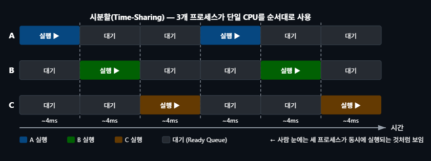

## 프로세스 상태 전이 (State Machine)
스케줄러를 이해하려면 프로세스가 어떤 상태를 가지는지 알아야 합니다. 프로세스는 언제나 아래 세 가지 상태 중 하나에 있으며, 스케줄러는 READY → RUNNING 전환을 결정합니다.

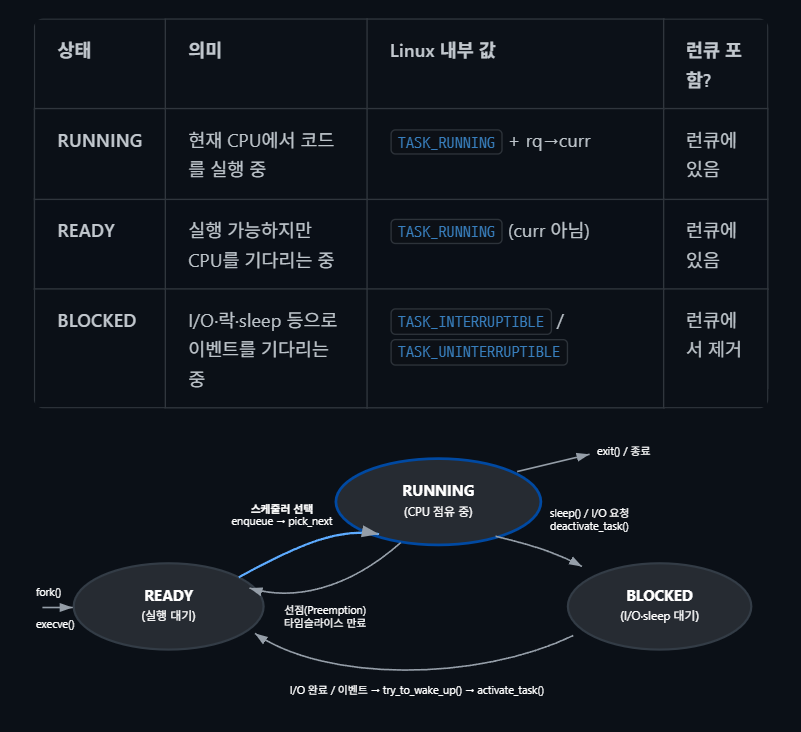

## 단계별 이해(현재 다 이해 못해도 뒤에 나옴.)
1. **스케줄러의 역할** — "다음에 어떤 프로세스를 실행할까?"를 결정합니다.
   
   CPU는 동시에 한 프로세스만 실행합니다. 스케줄러는 약 1~10ms마다 "지금 실행 중인 프로세스를 계속 실행할지, 아니면 다른 프로세스로 전환할지"를 결정합니다. 핵심 함수는 `kernel/sched/core.c`의 `__schedule()`입니다.

2. **타이머 인터럽트와 스케줄러 호출** — 스케줄러는 매 타이머 인터럽트(기본 4ms, `CONFIG_HZ=250`)마다 깨어납니다.
   
   타이머 인터럽트 핸들러(Handler)가 `scheduler_tick()`을 호출하고, 현재 태스크의 타임슬라이스가 다 되었거나 더 높은 우선순위 태스크가 깨어나면 `TIF_NEED_RESCHED` 플래그를 설정합니다. 인터럽트 복귀 시 커널이 이 플래그를 확인하고 `schedule()`을 호출합니다.

3. **CFS와 vruntime** — 각 태스크의 가상 실행 시간(vruntime)을 추적하여, 가장 적게 실행된 태스크를 다음에 선택합니다.
   
   nice 0 태스크가 10ms CPU를 쓰면 vruntime도 10ms 증가합니다. nice +5 태스크는 같은 10ms를 써도 vruntime이 더 빠르게 증가하도록 보정됩니다 (불리한 가중치). 결과적으로 nice 0 태스크가 자주 선택되고, nice +5 태스크는 덜 선택됩니다. 실행 가능한 태스크들은 vruntime을 키로 하는 Red-Black 트리에 저장되며, 항상 가장 왼쪽(최소 vruntime) 노드를 다음 실행 대상으로 O(1) 접근합니다.

4. **우선순위와 nice 값** — nice(-20~19) 값으로 프로세스의 CPU 시간 비중을 조정합니다.
   
   nice 0이 기본값입니다. 값이 낮을수록 더 많은 CPU 시간을 받습니다 (역직관적이지만, "nice하지 않다 = 욕심쟁이"). nice -5는 nice 0 대비 약 3배 더 많은 CPU 시간을 받습니다. `renice -n -5 -p "PID 쓰기"` 로 조정 가능합니다 (root 권한 필요). `ps -eo pid,ni,comm`으로 현재 프로세스의 nice 값을 확인합니다.

5. **실시간 스케줄링** — `SCHED_FIFO`/`SCHED_RR`은 일반 태스크보다 항상 우선합니다.
   
   실시간 태스크는 rtprio(1~99) 값으로 우선순위를 지정합니다. `SCHED_FIFO`는 자발적으로 양보(sleep/yield)하지 않으면 다른 태스크가 CPU를 받을 수 없습니다. `chrt -f 50 ./app`으로 실시간 우선순위 50으로 프로그램을 실행합니다. `SCHED_DEADLINE`은 최고 우선순위이며, 데드라인과 실행 예산(runtime)을 명시합니다.

6. **컨텍스트 스위치 비용** — 태스크를 전환할 때마다 레지스터·메모리 맵 등을 저장/복원하는 비용이 발생합니다.
   
   컨텍스트 스위치 한 번에 수 마이크로초(µs)가 걸립니다. `perf stat -e cs sleep 1`으로 초당 컨텍스트 스위치 횟수를 확인할 수 있습니다. 스위치가 너무 잦으면(초당 수만 회) CPU 시간의 상당 부분이 실제 작업 대신 전환 오버헤드에 소모됩니다. 스레드 수를 CPU 코어 수에 맞추거나 배치 크기를 키우는 것이 일반적인 해결책입니다.

# 핵심 요약
1. CFS / EEVDF — 일반 프로세스용 공정 스케줄러.`vruntime(가상 실행 시간)`으로 공평성을 유지합니다.
2. sched_class — 스케줄링 정책의 플러그인 구조. `dl → rt → fair → idle 우선순위`입니다.
3. 런큐(runqueue) — 각 CPU마다 하나씩 존재하며, `실행 대기 중인 태스크를 관리`합니다.
4. 선점(preemption) — 커널이 현재 실행 중인 태스크를 `강제로 중단하고 다른 태스크를 실행`합니다.
5. 로드 밸런싱 — CPU 간에 `태스크를 이동시켜 부하를 균등하게 분배`합니다.
6. 컨텍스트 스위치 — 태스크 전환 시 `레지스터·주소 공간을 교체`하는 과정으로, 수 µs의 오버헤드가 발생합니다.

## 스케줄러 개요 (Scheduler Overview)
Linux 커널 스케줄러는 시스템의 모든 CPU에서 어떤 태스크를 언제, 얼마나 실행할지 결정하는 핵심 서브시스템입니다. 스케줄러의 주요 목표는 다음과 같습니다.

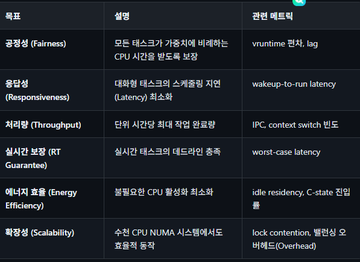

### 스케줄러 호출 경로 (Trigger Paths)
`__schedule()`은 직접 호출되지 않으며, 다음 네 가지 경로를 통해 간접적으로 호출됩니다. 각 경로를 이해하면 "언제 CPU가 다른 프로세스로 전환되는가"를 예측할 수 있습니다.

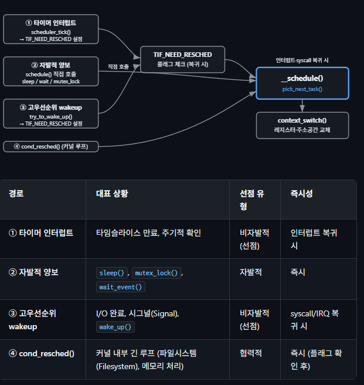

커널 스케줄러의 핵심 진입점(Entry Point)은 `kernel/sched/core.c`의 `__schedule()` 함수입니다. 이 함수는 현재 태스크를 중단하고 다음에 실행할 태스크를 선택하여 컨텍스트 스위치를 수행합니다.

런큐는 CPU마다 있다.

```c
/* kernel/sched/core.c — 스케줄러 핵심 진입점 (간략화) */
static void __sched notrace __schedule(unsigned int sched_mode)
{
    struct task_struct *prev, *next;
    struct rq_flags rf;
    struct rq *rq;
    int cpu;
    // 현재 코드를 실행하고 있는 CPU의 번호를 찾고, 해당 CPU 전용의 런큐(실행 대기열, rq)를 가져옵니다.
    cpu = smp_processor_id();
    rq  = cpu_rq(cpu);           /* per-CPU 런큐 획득 */
    prev = rq->curr;               /* 현재 실행 중인 태스크 */
    rq_lock(rq, &rf); // 런큐 상태 변경, 다른 인터럽트나 CPU가 간섭 못함.

    /* 이전 태스크의 상태 갱신 (dequeue 여부 결정) */
    // 현재 task가 선점이 아니라, I/O 대기나 sleep() 등으로 자발적으로 CPU를 양보하는지 확인한다.
    if (!(sched_mode & SM_MASK_PREEMPT) && prev_state) {
        if (signal_pending_state(prev_state, prev)) { 
            //처리해야할 시그널이 들어오면 다시 TASK_RUNNING으로 만듬.
            WRITE_ONCE(prev->__state, TASK_RUNNING);
        } else {
            prev->sched_contributes_to_load =
                (prev_state & TASK_UNINTERRUPTIBLE) &&
                !(prev_state & TASK_NOLOAD);

            //순수하게 자발적 슬립(Sleep) 상태로 들어가는 것이 맞다면, 런큐에서 이 태스크를 뺀다.
            deactivate_task(rq, prev, DEQUEUE_SLEEP);
        }
    }

    /* 다음 태스크 선택 — sched_class 계층을 순회 */
    next = pick_next_task(rq, prev, &rf);
    if (likely(prev != next)) { //기존 실행되던 task인 prev와 새로 뽑힌 next가 다르면 문맥교환함.
        rq->nr_switches++;
        rq_set_curr(rq, next);
        /* 컨텍스트 스위치 수행 */
        rq = context_switch(rq, prev, next, &rf);
    }
    //스케줄링 끝났으니 런큐의 lock을 풀어줌.
    rq_unlock_irq(rq, &rf);
    balance_callback(rq);
}
```

스케줄링 트리거: __schedule()은 다음 경로들에서 호출됩니다.

(1) 태스크가 자발적으로 `슬립(Sleep)`할 때 (schedule())

(2) 인터럽트/시스템 콜(System Call) 복귀 시 `TIF_NEED_RESCHED 플래그`가 설정된 경우

(3) `cond_resched()` 호출 시 `선점 필요한 경우`

(4) 선점형 커널에서 `선점 카운터가 0`이 될 때.

# sched_class 계층 구조
Linux 스케줄러는 모듈화된 클래스 기반 설계를 채택합니다. 각 스케줄링 정책은 `struct sched_class`를 구현하며, `우선순위가 높은 클래스부터 순서대로 탐색`합니다.

```c
/* include/linux/sched.h — sched_class 인터페이스 (주요 콜백) */
struct sched_class {
    /* 태스크를 런큐에 삽입/제거 */
    void (*enqueue_task)(struct rq *rq, struct task_struct *p, int flags);
    void (*dequeue_task)(struct rq *rq, struct task_struct *p, int flags);
    /* 다음에 실행할 태스크 선택 */
    // struct rq *를 받아 struct task_struct *를 반환하는 함수를 가리키는 포인터이다.
    struct task_struct *(*pick_next_task)(struct rq *rq);

    /* 현재 태스크가 선점되어야 하는지 검사 */
    void (*wakeup_preempt)(struct rq *rq, struct task_struct *p, int flags);

    /* 태스크가 CPU를 양보할 때 */
    void (*put_prev_task)(struct rq *rq, struct task_struct *p);

    /* 주기적 타이머 틱 처리 */
    void (*task_tick)(struct rq *rq, struct task_struct *p, int queued);

    /* 태스크 웨이크업 시 CPU 선택 */
    int (*select_task_rq)(struct task_struct *p, int prev_cpu, int wake_flags);

    /* 로드 밸런싱 관련 */
    int  (*balance)(struct rq *rq, struct task_struct *prev, struct rq_flags *rf);
    void (*task_woken)(struct rq *rq, struct task_struct *p);
};
```

### 클래스 우선순위 체인
스케줄러가 `pick_next_task()`를 호출하면, 가장 높은 우선순위의 클래스부터 순차적으로 실행 가능한 태스크를 찾습니다.

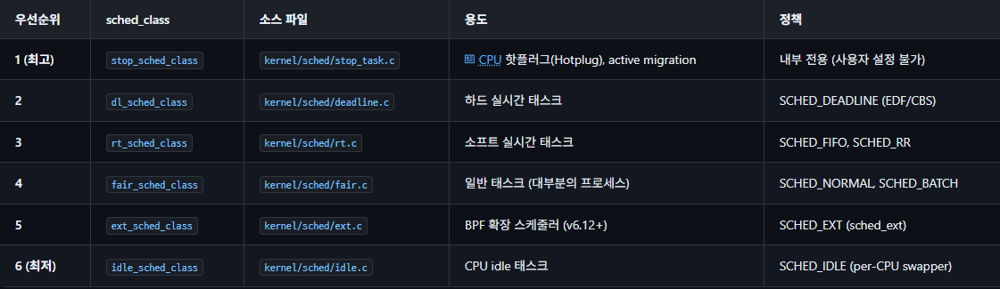

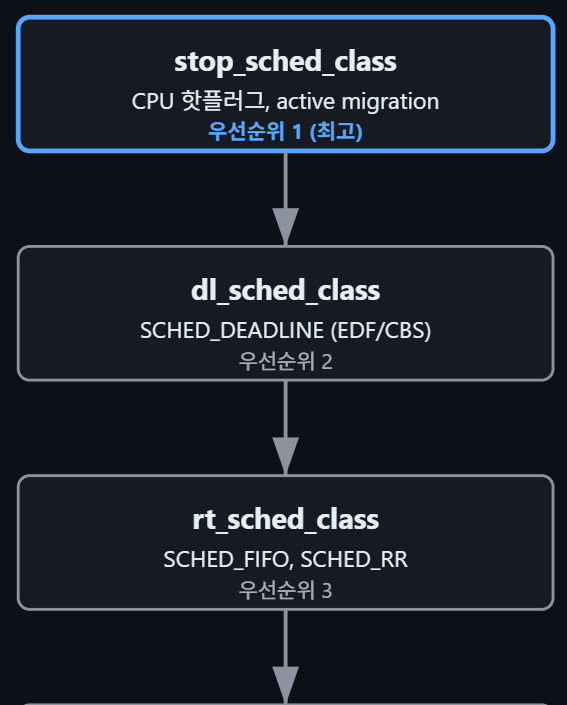

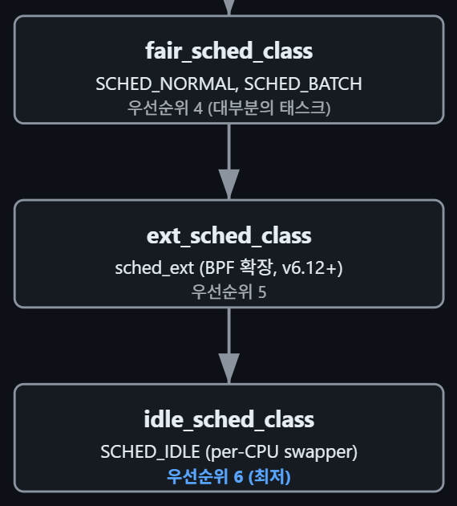

```c
/* kernel/sched/core.c — pick_next_task 최적 경로 */
static inline struct task_struct *
__pick_next_task(struct rq *rq, struct task_struct *prev, struct rq_flags *rf)
{
    const struct sched_class *class;
    struct task_struct *p;
    /*
     * 최적화: 런큐의 모든 태스크가 fair 클래스이면
     * (nr_running == cfs_rq.h_nr_running) fair만 검사
     */
    if (likely(rq->nr_running == rq->cfs.h_nr_running)) {
        p = pick_next_task_fair(rq, prev, rf);
        if (unlikely(p == RETRY_TASK))
            goto restart;
        return p;
    }
restart:
    put_prev_task_balance(rq, prev, rf);
    /* 우선순위 높은 클래스부터 순회 */
    for_each_class(class) {
        p = class->pick_next_task(rq);
        if (p)
            return p;
    }
    /* idle 클래스는 항상 태스크를 반환 (per-CPU idle thread) */
    BUG();
}
```

for_each_class 매크로(Macro): 이 매크로는 stop_sched_class → dl_sched_class → rt_sched_class → fair_sched_class → ext_sched_class (v6.12+) → idle_sched_class 순서로 순회합니다. 각 클래스의 pick_next_task()가 NULL을 반환하면 다음 클래스로 넘어갑니다. 

### 스케줄링 정책 선택 가이드
어떤 정책을 써야 할지 모를 때 아래 가이드를 참고하세요. 대부분의 애플리케이션은 기본값`(SCHED_NORMAL)`으로 충분합니다.

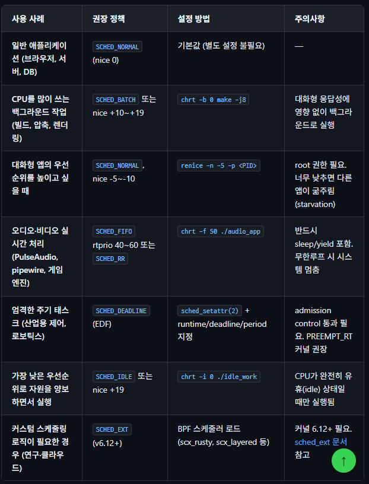

```c
/* 스케줄링 정책을 프로그래밍 방식으로 설정하는 예시 */
#include <sched.h>
/* SCHED_FIFO 설정 (rtprio=50) */
struct sched_param sp = { .sched_priority = 50 };
sched_setscheduler(0, SCHED_FIFO, &sp);
/* SCHED_DEADLINE 설정: 10ms 주기에 3ms 실행 예산 */
struct sched_attr attr = {
    .size         = sizeof(attr),
    .sched_policy = SCHED_DEADLINE,
    .sched_runtime  = 3 * 1000 * 1000,   /* 3ms (ns) */
    .sched_deadline = 10 * 1000 * 1000,  /* 10ms (ns) */
    .sched_period   = 10 * 1000 * 1000,  /* 10ms (ns) */
};
sched_setattr(0, &attr, 0);   /* 실패 시 EBUSY (admission 거부) */
/* nice 값 변경 (SCHED_NORMAL) */
setpriority(PRIO_PROCESS, 0, -5);  /* nice -5 (root 필요) */
nice(10);                           /* 현재 nice 값에서 +10 */
```

# CFS (Completely Fair Scheduler)
CFS는 커널 2.6.23에서 Ingo Molnar가 도입한 스케줄러로, `이상적인 멀티태스킹 프로세서(Ideal Multi-Tasking CPU)를 근사(approximate)`합니다. 이상적인 프로세서에서는 N개의 태스크가 각각 1/N의 CPU 시간을 동시에 받지만, 실제 하드웨어에서는 한 CPU에 하나의 태스크만 실행할 수 있으므로, CFS는 `vruntime(가상 실행 시간)`을 사용하여 공정성을 추적합니다.

### vruntime (가상 실행 시간)
`vruntime`은 태스크가 실제로 소비한 CPU 시간을 가중치로 보정한 값입니다. nice 값이 낮은(우선순위 높은) 태스크는 vruntime이 느리게 증가하고, nice 값이 높은(우선순위 낮은) 태스크는 빠르게 증가합니다. `update_curr()·calc_delta_fair()` 구현 코드와 nice 가중치 테이블은 CFS 스케줄러를 참고하세요.

### 수치 예제로 이해하는 vruntime
nice 가중치는 `kernel/sched/core.c`의 `sched_prio_to_weight[]` 테이블에 정의됩니다. nice 0의 가중치는 1024이며, nice 값이 1 증가할 때마다 약 1.25배씩 감소합니다. vruntime 증분 공식은 `delta_vruntime = delta_exec × (NICE_0_LOAD / weight)`입니다.

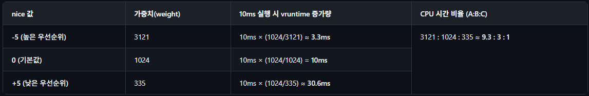

위 표의 의미: 세 태스크가 모두 런큐에 있을 때, `nice -5 태스크는 nice 0 태스크보다 약 3배, nice +5 태스크보다 약 9배 더 많은 실제 CPU 시간을 받습니다.` 같은 10ms 실제 실행 시간이 경과해도 각 태스크의 vruntime 증가폭이 다르므로, 스케줄러가 다음 태스크를 고를 때 항상 최소 vruntime을 가진 nice -5 태스크를 우선 선택합니다.

#### 예시
vruntime 타임라인 예시: 초기 vruntime이 모두 0인 세 태스크 A(nice -5), B(nice 0), C(nice +5)가 있을 때:
- 1회 실행(A): A vruntime=3.3ms, B=0, C=0 → 다음은 B(최소)
- 2회 실행(B): A=3.3ms, B=10ms, C=0 → 다음은 C(최소)
- 3회 실행(C): A=3.3ms, B=10ms, C=30.6ms → 다음은 A(최소)
- 4회 실행(A): A=6.6ms, B=10ms, C=30.6ms → 다음은 A(최소)
- 5회 실행(A): A=9.9ms, B=10ms, C=30.6ms → 다음은 B(최소)
- … A가 약 9번 실행될 때 B가 3번, C가 1번 실행됩니다.

## Red-Black Tree 기반 태스크 관리
CFS는 모든 실행 가능한(runnable) 태스크를 vruntime을 키로 하는 `Red-Black Tree`에 관리합니다. 트리의 가장 왼쪽(최소 vruntime) 노드가 다음 실행 대상입니다. 이 구조로 삽입/삭제/탐색이 모두 O(log N)이며, 가장 왼쪽 노드는 `rb_leftmost`에 캐싱되어 `O(1)` 접근이 가능합니다.

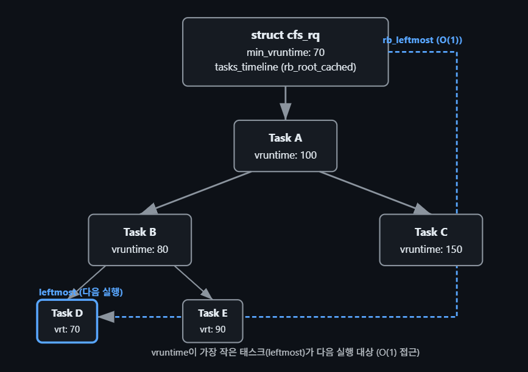

```c
/* include/linux/sched.h — CFS 런큐 구조 */
struct cfs_rq {
    struct load_weight  load;         /* 런큐 전체 가중치 합 */
    unsigned int        nr_running;   /* 실행 가능 태스크 수 */
    u64                 min_vruntime; /* 런큐 내 최소 vruntime */
    struct rb_root_cached tasks_timeline; /* RB-Tree, (leftmost 캐싱) */
    struct sched_entity *curr;  /* 현재 실행 중인 엔티티 */
    struct sched_entity *next;  /* 다음 실행 힌트 */
    struct sched_entity *skip;  /* 건너뛸 엔티티 (yield) */
};

/* include/linux/sched.h — 스케줄 엔티티 */
struct sched_entity { //얘도 노드인데 안에 run_node를 감싸고 있는거임.
    struct load_weight  load;       /* nice에 따른 가중치 */
    struct rb_node      run_node;   /* RB-Tree 노드 */
    unsigned int        on_rq;      /* 런큐에 있는지 여부 */
    u64  exec_start;                 /* 현재 실행 시작 시각 */
    u64  sum_exec_runtime;            /* 누적 실행 시간 */
    u64  vruntime;                    /* 가상 실행 시간 */
    u64  prev_sum_exec_runtime;       /* 이전 누적값 (preempt 체크용) */
};
```

참고로 tasks_timeline 안에 가장 왼쪽 노드 포인터가 있음.

```c
/* include/linux/rbtree.h */
struct rb_root_cached {
    struct rb_root rb_root;       /* 실제 트리의 루트 노드 */
    struct rb_node *rb_leftmost;  /* 가장 왼쪽 노드를 가리키는 캐시 포인터! */
};
```

### 타임 슬라이스 계산
CFS는 고정 타임 슬라이스를 사용하지 않습니다. 대신, 타겟 지연(sched_latency_ns)를 런큐의 태스크 수로 나누고 가중치를 반영합니다.

```c
/*
 * 타임 슬라이스 계산 공식:
 *
 *                  sched_latency_ns * weight_i
 * timeslice_i = ─────────────────────────────────
 *                     total_weight
 *
 * 예: sched_latency = 6ms, 태스크 A(nice 0, w=1024), B(nice 5, w=335)
 *
 * A의 슬라이스 = 6ms * 1024 / (1024+335) = 4.52ms
 * B의 슬라이스 = 6ms * 335  / (1024+335) = 1.48ms
 *
 * 태스크가 nr_latency(기본 8)개를 초과하면:
 * sched_min_granularity_ns(기본 0.75ms) * nr_running 사용
 */
/* kernel/sched/fair.c — sysctl 기본값 */
unsigned int sysctl_sched_latency            = 6000000ULL; /* 6ms */
unsigned int sysctl_sched_min_granularity     = 750000ULL;  /* 0.75ms */
unsigned int sysctl_sched_wakeup_granularity  = 1000000ULL; /* 1ms */
```

- `Target Latency (목표 지연 시간)`: 런큐에 있는 모든 태스크가 최소 한 번씩은 실행되도록 보장하는 전체 주기 시간입니다. `기본값이 커널 파라미터에 있음.`
- `Weight_{task}`: 해당 태스크의 가중치입니다. (nice 값이 낮을수록, 즉 우선순위가 높을수록 가중치가 큽니다.)
- `Weight_{rq}의 합`: 현재 런큐에 대기 중인 모든 태스크의 가중치 총합입니다.

1. 태스크는 자신의 가중치에 비례하여 계산된 `Timeslice만큼 CPU를 실제로 사용`합니다.
2. CPU를 사용하는 동안, 흐른 물리적 시간(exec)을 바탕으로 `vruntime이 실시간으로 계산`되어 누적됩니다.
3. 이때 가중치가 높은 태스크는 Timeslice를 길게 받아 CPU를 오래 쓰면서도, vruntime은 천천히 증가합니다.
4. 결과적으로 가중치가 높은 태스크는 RB-Tree의 왼쪽(vruntime이 작은 위치)에 더 오래 머물게 되어 CFS 스케줄러의 선택을 자주 받게 됩니다.

#### Timeslice, vruntime의 차이점
Timeslice: "이번 턴에 CPU를 얼마나 오래 쓸 수 있는가?"
vruntime: "다음에 누가 먼저 CPU를 쓸 것인가?" (정렬 기준)

CFS의 `한계`: CFS는 v6.6에서 EEVDF로 대체되었습니다.

1. 새로 깨어난(Wakeup) 태스크에 대한 과도한 보너스로 인한 불공정
문제의 배경: 수면 상태(I/O 대기, sleep() 등)에서 깨어난 태스크는 오랫동안 CPU를 쓰지 않았으므로 vruntime이 다른 태스크들에 비해 `한참 뒤처져(작아)` 있습니다. 만약 이를 그대로 방치하면, 깨어난 태스크의 vruntime이 너무 작아서 다른 태스크들이 선점당한 채 `해당 태스크가 CPU를 독점`하는 문제가 발생합니다. 반대로 vruntime을 현재 실행 중인 태스크들과 맞춰주지 않으면, 대응성(Interactive Task)이 극도로 떨어지는 문제가 생깁니다.

CFS의 임시방편: CFS는 깨어난 태스크의 vruntime을 `트리의 최소 vruntime 근처`로 끌어올려 조정해 주는 보너스 로직(place_entity())을 적용했습니다.

발생한 문제: 처리량 중심 태스크의 꼼수/불공정: `짧게 자주 수면`을 취하는 태스크가 이 보너스를 지속적으로 받아 필요 이상으로 CPU를 자주 선점하는 `기아(Starvation)` 현상이나 불공정이 발생했습니다.

- 보정이 작을 때: 대기열 뒤쪽에 갇혀 `타임 크리티컬한 작업(GUI, 소켓 I/O)의 반응 속도가 떨어짐`.
- 보정이 클 때: 기존에 `정직하게 CPU를 쓰던 계산 작업(CPU-bound) 태스크가 억울하게 CPU를 빼앗김`.

2. next/last 힌트 기반의 임시방편적 Wakeup 선점 로직
문제의 배경: CFS는 구조적으로 vruntime이 가장 작은 태스크를 RB-tree의 `맨 왼쪽`에서 뽑아 실행합니다. 하지만 현실에서는 "방금 깨어난 태스크"나 "서로 데이터를 주고받는 파이프라인 태스크(Producer-Consumer)"처럼 곧바로 연속해서 실행되어야 `캐시 효율(L1/L2 Cache locality)`이 높아지는 경우가 많습니다.

CFS의 임시방편 (Next / Last 힌트): CFS는 표준 RB-tree 로직 외에, 스케줄러 내부에 sched_feat(NEXT_BUDDY), LAST_BUDDY 같은 임시 힌트 포인터를 두었습니다.

- next 힌트: 방금 깨어난 태스크가 다음 스케줄링 틱에서 우선선점할 수 있도록 찜해두는 포인터.
- last 힌트: 방금 CPU를 내려놓은 태스크가 대기열 맨 뒤로 돌아가지 않고 가급적 다시 선택되도록 돕는 힌트.

발생한 문제: 
1. heuristic(경험칙)의 얽힘: 이 힌트들은 정교한 수학적 스케줄링 모델이 아니라 `"이렇게 하니 성능이 좀 나오더라"` 식으로 덧붙인 땜빵용 로직이었습니다.
2. 예측 불가능성: 특정 워크로드(예: 웹 서버, DB)에서는 이 힌트 때문에 특정 태스크가 `CPU를 계속 독점`하거나, 반대로 힌트 간 충돌로 인해 지연 시간 튀는 현상(Latency Spike)이 빈번하게 발생했습니다.

3. sched_latency 보장이 확률적(Best-Effort)이라는 점
문제의 배경: CFS에서 태스크의 지연 시간 목표(Latency Goal)는 sched_latency라는 주기(기본값 약 6ms~24ms) 동안 `"모든 실행 가능한 태스크가 적어도 한 번씩은 CPU를 나누어 갖는다"`는 개념이었습니다.

발생한 문제
1. 태스크 수에 비례한 지연 시간 증폭: 대기열에 실행 가능한 태스크가 N개 있다면, 특정 태스크가 다시 CPU를 할당받기까지 걸리는 시간은 최소 `N x min_granularity`로 늘어납니다. 즉, 시스템에 로드가 걸릴수록 지연 시간 보장이 무너집니다.
2. Nice 값의 한계: CFS의 nice 값은 태스크의 처리량 비율(Weight)만 결정할 뿐, `"이 태스크를 얼마나 빠르게 실행시켜야 하는가(Latency/Deadline)"`는 결정하지 못합니다.
결과적으로 `"우선순위가 높은 태스크가 CPU를 더 많이 쓰는 것"은 가능했지만, "원하는 시점에 즉시 실행되는 것"은 수학적으로 보장할 수 없었습니다.`

=> `EEVDF`는 이를 어떻게 해결했는가?
v6.6에서 Peter Zijlstra가 도입한 EEVDF는 1995년 Peter Ionchev 등이 제안한 논문 모델을 바탕으로 이 문제를 수학적으로 깔끔하게 정리했습니다.
1. `Eligible (자격 조건)`: 태스크가 지금까지 할당량보다 CPU를 적게 썼는가? (Lag 개념 도입) -> 불공정 보너스 축소
2. `Virtual Deadline (가상 데드라인)`: 태스크가 요청한 시간 slice 대입 -> `"Deadline" = "Eligible Time" + "Slice" / "Weight"`
3. 핵심 변화: EEVDF는 vruntime 단일 기준이 아니라, `"실행 자격(Eligible)이 갖춰진 태스크 중 데드라인이 가장 빠른 녀석"`을 선택합니다. 덕분에 nice 값과 별개로 태스크가 latency offset이나 slice 크기를 조절하여 실시간성(Latency)을 명확하게 수학적으로 요구할 수 있게 되었습니다.

CFS 심층: vruntime 수식, nice 가중치 테이블, RB-tree enqueue/dequeue, PELT, 로드 밸런싱 상세는 [CFS 스케줄러 파일 보기](8.%20CFS%20스케줄러.md)

### EEVDF (Earliest Eligible Virtual Deadline First)
EEVDF는 커널 v6.6에서 Peter Zijlstra에 의해 CFS를 대체한 fair 스케줄링 알고리즘입니다. 1995년 Stoica와 Abdel-Wahab이 제안한 이론적 모델을 기반으로 하며, CFS의 단순한 "최소 vruntime" 선택 대신 `적격 시각(eligible time)`과 `가상 데드라인(virtual deadline)`을 사용하여 지연 시간 보장을 강화합니다.

EEVDF 알고리즘의 이론적 기반, eligible 조건 판정, lag 추적, augmented RB-Tree, latency nice, 벤치마크 비교, CFS→EEVDF 마이그레이션 가이드는 [EEVDF 스케줄러 문서](9.%20EEVDF%20스케줄러.md)에서 상세히 다룹니다.

### 핵심 개념
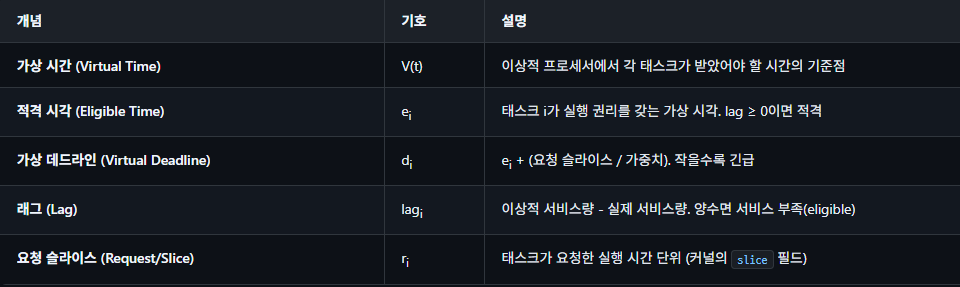

### 핵심 개념
EEVDF 알고리즘은 다음의 세 가지 지표를 기반으로 동작합니다.

1. 지연 (Lag): 태스크가 '원래 받았어야 할 이상적인 CPU 시간(공정 몫)'과 '실제 할당받아 실행된 CPU 시간'의 차이입니다. 시스템 가상 시간을 V, 특정 태스크 i의 가상 실행 시간을 Vi라고 할 때 다음과 같이 정의됩니다.  

`Lag_i = V - Vi`, vruntime = Vi

Lag_i > 0 이면 마땅히 받아야 할 시간보다 덜 실행되어 CPU를 더 받을 권리가 있다는 뜻이며, 음수이면 자신의 몫보다 더 많이 실행되었음을 의미합니다.

2. 적격성 (Eligibility): 현재 CPU를 점유할 자격이 있는지를 나타내는 기준입니다. EEVDF는 `Lag_i >= 0 인 태스크, 즉 자신의 몫을 초과해서 사용하지 않은 태스크만 적격(Eligible) 태스크`로 분류합니다. CFS가 단순히 Vi가 가장 작은 태스크를 무조건 선택했던 것과 달리, EEVDF는 이 필터를 통해 원천적으로 `불공정한 태스크를 스케줄링 대상에서 배제`합니다.  

3. 가상 데드라인 (Virtual Deadline): 적격성을 통과한 태스크들의 실행 우선순위를 결정하는 시간입니다.가상 데드라인 VDi는 태스크가 한 번에 실행되기를 요청한 타임 슬라이스(시간 할당량)를 ri, 태스크의 가중치(우선순위)를 wi라고 할 때 아래와 같이 계산됩니다.  `VDi = Vi + ri / wi`이 수식에 따라 요청한 타임 슬라이스(ri)가 짧을수록 데드라인이 현재 시간에 가깝게(빠르게) 잡히는 특징을 갖습니다.

## 알고리즘 동작 원리
EEVDF의 태스크 선택 과정은 두 단계입니다.

1. 적격성(Eligibility) 필터링: `vruntime ≤ V(t) (즉, lag ≥ 0, Vi ≤ V)`인 태스크만 후보로 선별
2. 데드라인 기반 선택: 적격 태스크 중 `virtual deadline이 가장 빠른 태스크를 선택`

EEVDF는 이 과정을 O(log n) 시간에 빠르게 수행하기 위해 커널 내부에 증강 레드-블랙 트리(Augmented Red-Black Tree)라는 자료구조를 사용합니다.

```c
/* kernel/sched/fair.c — EEVDF pick_eevdf() (v6.6+, 간략화) */
//다음에 실행할 태스크를 고르는 함수
static struct sched_entity *
pick_eevdf(struct cfs_rq *cfs_rq)
{
    struct rb_node *node = cfs_rq->tasks_timeline.rb_root.rb_node;
    struct sched_entity *best = NULL;
    while (node) { //루트부터 쭉 탐색
        struct sched_entity *se = __node_2_se(node);
        /*
         * 적격성 검사: entity의 vruntime이 cfs_rq의 avg_vruntime 이하인지
         * (lag >= 0 ⟺ vruntime <= V(t) ⟺ eligible)
         */
        if (entity_eligible(cfs_rq, se)) {
            /* 적격 태스크 중 deadline이 가장 빠른 것 선택 */
            if (!best || deadline_gt(deadline, best, se))
                best = se;
            node = node->rb_left;   /* 더 빠른 vruntime (eligible) 탐색 */
        } else {
            node = node->rb_right;  /* 아직 eligible 아님 → 오른쪽 */
        }
    }
    return best;
}

// se->vruntime <= cfs_rq->avg_vruntime 이면 1 반환
/* 적격성 판단 (O(1)) */
static int entity_eligible(struct cfs_rq *cfs_rq, struct sched_entity *se)
{
    /*
     * avg_vruntime은 런큐의 가중 평균 vruntime = V(t)
     * se->vruntime <= V(t) 이면 eligible (서비스 부족 상태)
     */
    return vruntime_eligible(cfs_rq, se->vruntime);
}
```

현재 노드가 적격하다면(평균보다 vruntime이 작다면), 그보다 왼쪽에 있는 노드들은 vruntime이 더 작으므로 무조건 적격합니다. 따라서 더 좋은(데드라인이 더 빠른) 후보가 있는지 찾기 위해 왼쪽(rb_left)으로 탐색을 이어갑니다. 만약 현재 노드가 적격하지 않다면, 오른쪽(rb_right)으로 이동하여 후보를 찾습니다.


### 슬라이스와 데드라인
EEVDF에서 각 태스크의 가상 데드라인은 `eligible time + slice / weight`로 계산됩니다. slice는 태스크가 한 번에 요청하는 실행 시간 단위입니다.

```c
/* kernel/sched/fair.c — 데드라인 갱신 */
// 자신에게 할당된 타임 슬라이스(요청 실행 시간)를 모두 소진했을 때, 다음 데드라인을 새롭게 설정
static void update_deadline(struct cfs_rq *cfs_rq, struct sched_entity *se)
{
    if ((s64)(se->vruntime - se->deadline) >= 0) {
        /*
         * 현재 슬라이스 소진 → 새 데드라인 설정
         * deadline = vruntime + calc_delta_fair(slice, se)
         *
         * calc_delta_fair: slice를 weight로 보정
         * nice 0: deadline = vruntime + slice
         * nice -5: deadline = vruntime + slice * 0.328
         */
        se->deadline = se->vruntime +
            calc_delta_fair(se->slice, se);
        /* 선점 검사: 새 태스크의 deadline이 현재보다 빠르면 resched */
        if (cfs_rq->nr_running > 1)
            resched_curr(rq_of(cfs_rq));
    }
}
```
프로세스가 주어진 시간을 다 쓰면 `update_deadline`을 호출해 다음 마감 기한을 정해주는데, 이때 `우선순위가 높은 태스크일수록 마감 기한을 덜 미뤄주어(가상 시간을 천천히 흐르게 하여)` CPU를 더 자주 배정받도록 설계되어 있습니다.

#### EEVDF vs CFS 핵심 차이
CFS는 `"가장 적게 실행된 태스크"`를 무조건 선택하지만, EEVDF는 `"서비스가 부족하면서(eligible) 데드라인이 가장 빠른 태스크"`를 선택합니다. 이로써 short-sleep 태스크(대화형)가 깨어나면 낮은 vruntime 덕분에 즉시 eligible이 되고, 짧은 slice로 인해 deadline이 빠르므로 우선 선택됩니다. 반면 CPU-bound 태스크는 긴 slice를 사용하여 컨텍스트 스위치를 줄입니다.

### avg_vruntime (가중 평균 가상 시간)
EEVDF는 런큐의 "현재 가상 시간" V(t)를 추적하기 위해 avg_vruntime을 유지합니다. 이는 모든 실행 가능한 엔티티의 vruntime 가중 평균입니다.

```c
/* kernel/sched/fair.c — 가중 평균 vruntime 계산 */
static u64 avg_vruntime(struct cfs_rq *cfs_rq)
{
    struct sched_entity *curr = cfs_rq->curr;
    s64 avg = cfs_rq->avg_vruntime;
    long load = cfs_rq->avg_load;
    if (curr && curr->on_rq) {
        unsigned long weight = scale_load_down(curr->load.weight);
        avg += entity_key(cfs_rq, curr) * weight;
        load += weight;
    }
    if (load)
        avg = div_s64(avg, load);
    return cfs_rq->min_vruntime + avg;
}
```

`avg_vruntime = sum(vj x wj) / sum(wj)`

## 실시간 스케줄링 (Real-Time Scheduling)
Linux는 POSIX.1b 실시간 스케줄링 정책을 지원합니다. RT 태스크는 fair 클래스보다 항상 높은 우선순위를 가지므로, RT 태스크가 실행 가능한 한 일반 태스크는 CPU를 받지 못합니다.

### RT 정책: SCHED_FIFO vs SCHED_RR
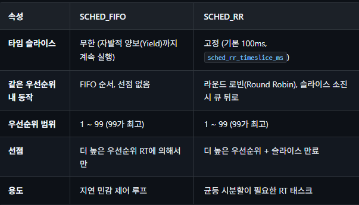

```c
/* RT 스케줄링 설정 예제 (사용자 공간) */
// 내가 프로세스를 하나 만들고 RT로 설정할 때 사용함.
#include <sched.h>

struct sched_param param;
param.sched_priority = 80;  /* 1-99, 높을수록 높은 우선순위 */

/* SCHED_FIFO 설정 */
sched_setscheduler(pid, SCHED_FIFO, m);

/* SCHED_RR 설정 (타임 슬라이스 포함) */
sched_setscheduler(pid, SCHED_RR, m);

/* 현재 RR 타임 슬라이스 확인 */
struct timespec ts;
sched_rr_get_interval(pid, &ts);  /* 기본 100ms */
```
### 다른 예시

```c
#include <stdio.h>
#include <sched.h>     // 스케줄링 관련 헤더
#include <unistd.h>
#include <errno.h>

int main() {
    // 1. 내 프로세스를 RT로 설정하기 위한 준비
    struct sched_param param;
    param.sched_priority = 80;  // 우선순위 80 설정

    // 2. 커널에게 나(pid = 0은 자기 자신을 의미)를 SCHED_FIFO로 바꿔달라고 요청!
    // 여기서 아까 질문하신 그 코드가 쓰입니다.
    if (sched_setscheduler(0, SCHED_FIFO, &param) == -1) {
        perror("RT 스케줄러 설정 실패 (sudo로 실행했나요?)");
        return -1;
    }

    printf("성공! 이제부터 이 프로그램은 RT(VIP) 프로세스로 동작합니다.\n");

    // 3. 실제 드론 모터 제어 무한 루프 (절대 CPU를 안 뺏김)
    while (1) {
        // 모터 센서 읽기
        // 자세 제어 계산
        // 모터 속도 조절
        // (매우 짧은 시간 sleep 후 반복)
    }

    return 0;
}
```

## RT 스케줄러 내부 구현
RT 스케줄러는 `우선순위별 연결 리스트(Linked List) 배열`을 사용합니다. `비트맵(Bitmap)`으로 `비어 있지 않은 우선순위를 O(1)`에 찾습니다.

```c
/* kernel/sched/rt.c — RT 런큐 구조 */
struct rt_prio_array {
    DECLARE_BITMAP(bitmap, MAX_RT_PRIO + 1); /* 100비트 비트맵 */
    struct list_head queue[MAX_RT_PRIO];     /* 우선순위별 리스트 */
};

struct rt_rq {
    struct rt_prio_array  active;        /* 활성 태스크 배열 */
    unsigned int         rt_nr_running; /* RT 태스크 수 */
    unsigned int         rr_nr_running; /* RT 태스크들 중에서도 SCHED_RR(타임 슬라이스) 태스크 수 */
    struct {
        int  curr;         /* 현재 최고 우선순위 */
        int  next;         /* 다음 최고 우선순위 */
    } highest_prio; //가장 높은 우선순위 캐싱
};

/* pick_next_task_rt — O(1) 최고 우선순위 태스크 선택 */
static struct task_struct *
pick_next_task_rt(struct rq *rq)
{
    struct rt_rq *rt_rq = &rq->rt;
    struct rt_prio_array *array = &rt_rq->active;
    int idx;
    idx = sched_find_first_bit(array->bitmap); /* 비트맵에서 최고 우선순위 */
    if (idx >= MAX_RT_PRIO)
        return NULL;
    //queue[idx]에서 첫 리스트 노드 가져옴.
    return list_first_entry(&array->queue[idx],
                             struct sched_rt_entity, run_list); 
}
```

### RT 쓰로틀링 (RT Throttling)
RT 태스크가 CPU를 독점하여 일반 태스크가 기아(starvation) 상태에 빠지는 것을 방지하기 위해, 커널은 `RT 대역폭(Bandwidth) 제한(RT bandwidth throttling)`을 적용합니다.

```BASH
# RT 쓰로틀링 기본값 확인
cat /proc/sys/kernel/sched_rt_period_us   # 1000000 (1초)
cat /proc/sys/kernel/sched_rt_runtime_us  # 950000 (950ms)

# 의미: 1초 주기 중 RT 태스크는 최대 950ms만 실행 가능
# 나머지 50ms는 일반(fair) 태스크에 할당
# RT 쓰로틀링 비활성화 (위험! 프로덕션에서 사용 금지)
echo -1 > /proc/sys/kernel/sched_rt_runtime_us
```

주의: RT 쓰로틀링을 비활성화하면(sched_rt_runtime_us = -1), `무한 루프 버그가 있는 RT 태스크가 시스템을 완전히 멈출 수 있습니다.` 반드시 개발/테스트 환경에서만 사용하고, 프로덕션 시스템에서는 적절한 RT 대역폭 제한을 유지하십시오.

## SCHED_DEADLINE
SCHED_DEADLINE은 커널 3.14에서 도입된 `CBS(Constant Bandwidth Server) + EDF(Earliest Deadline First)` 기반 스케줄링 정책입니다. RT 클래스보다도 높은 우선순위를 가지며, 태스크에 명시적인 실행 예산(runtime), 주기(period), 데드라인(deadline)을 할당합니다.

CBS와 EDF의 역할 분담: 두 알고리즘은 협동합니다.

- CBS는 태스크별 `실행 예산(Q)과 주기(T) 비율`로 대역폭을 `격리(Isolation)`합니다. 예산을 초과한 태스크는 다음 주기까지 실행 불가 상태로 전환되어, 과실행이 다른 태스크의 데드라인에 영향을 주지 않습니다. EDF만 있으면 어떤 프로세스가 버그에 걸려 무한 루프를 돌 경우, 1순위로 CPU를 독점해 시스템 전체가 멈춰버립니다. 이를 막기 위해 CBS가 "너 약속한 실행 시간(예산) 다 썼어? 그럼 이번 주기가 끝날 때까지 넌 강제 휴식이야"라며 칼같이 잘라버립니다. 덕분에 특정 태스크가 폭주해도 다른 태스크의 마감일에 피해를 주지 않습니다.
- EDF는 런큐에서 절대 데드라인이 가장 빠른 태스크를 선택합니다. `CBS가 "얼마나 실행할 수 있는가"를 결정하고, EDF가 "다음에 누가 실행되는가"를 결정`합니다. 런큐에 대기 중인 태스크들 중에서 "마감일(Deadline)이 가장 코앞으로 다가온 녀석"을 무조건 1순위로 CPU에 올립니다. 

### SCHED_DEADLINE 파라미터
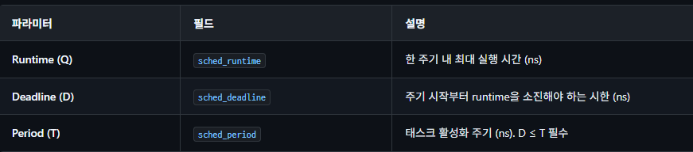

```c
/* SCHED_DEADLINE 설정 예제 (사용자 공간) */
#include <sched.h>
#include <linux/sched/types.h>
struct sched_attr attr = {
    .size           = sizeof(attr),
    .sched_policy   = SCHED_DEADLINE,
    .sched_runtime  = 10 * 1000 * 1000,   /* 10ms 실행 예산 (한 주기 동안 필요한 실제 CPU 사용 시간)*/
    .sched_deadline = 30 * 1000 * 1000,   /* 30ms 데드라인 */
    .sched_period   = 50 * 1000 * 1000,   /* 50ms 주기 */
};
/* sched_setattr 시스템 콜 사용 (glibc 래퍼 없음 → syscall 직접) */
syscall(SYS_sched_setattr, pid, &attr, 0);
/*
 * 대역폭 비율: Q/T = 10ms/50ms = 20%
 * 즉, 이 태스크는 CPU의 20%를 보장받으며,
 * 매 주기 시작 후 30ms 이내에 10ms를 실행
 */
```

코드 해석: 전체 CPU 코어 1개 성능의 정확히 `20%`를 어떤 상황에서도 흔들림 없이 이 프로세스에 떼어주겠다는 강력한 보장(Reservation)을 커널에 요청하는 코드

## 런큐 (Per-CPU Runqueue)
각 CPU에는 고유한 런큐(`struct rq`)가 있습니다. 이는 스케줄러의 핵심 자료구조로, 해당 CPU에서 실행 가능한 모든 태스크를 관리합니다. per-CPU 설계 덕분에 대부분의 스케줄링 결정이 로컬 잠금(Lock)만으로 가능합니다.

cfs_rq(EEVDF/CFS)나 dl_rq(SCHED_DEADLINE)는 특정 스케줄링 정책에 종속된 하위 큐인 반면, struct rq는 물리적인 CPU 코어 1개를 통째로 책임지는 총괄 매니저

```c
/* kernel/sched/sched.h — per-CPU 런큐 구조 (주요 필드) */
struct rq {
    /* --- 글로벌 상태 --- */
    raw_spinlock_t  __lock;        /* 런큐 락 */
    unsigned int    nr_running;    /* 총 실행 가능 태스크 수 */
    unsigned int    nr_switches;   /* 컨텍스트 스위치 카운터 */
    
    /* --- 현재 실행 중 --- */
    struct task_struct  *curr;     /* 현재 태스크 */
    struct task_struct  *idle;     /* per-CPU idle 태스크 */
    struct task_struct  *stop;     /* stop 태스크 (migration) */
    
    /* --- 클래스별 서브 런큐 --- */
    struct cfs_rq   cfs;           /* CFS/EEVDF 런큐 */
    struct rt_rq    rt;            /* RT 런큐 */
    struct dl_rq    dl;            /* DEADLINE 런큐 */
    
    /* --- 시간 관리 --- */
    u64             clock;         /* 런큐 시계 (ns) */
    u64             clock_task;    /* irq 시간 제외 태스크 시계: 순수하게 프로세스 실행에 사용할 수 있는 시간, vruntime 계산할 때 이걸 기준으로 함.*/
    
    // 특정 CPU만 과로사하는 것을 막고, 메모리 접근 효율을 높이기 위한 장치들
    /* --- 로드 밸런싱 --- */
    //CPU 캐시나 코어 구조(하이퍼스레딩 등)의 토폴로지 정보를 담고 있습니다. 프로세스를 다른 CPU로 넘길 때, 캐시 적중률(Cache hit)을 높이기 위해 최대한 가까운 코어로 넘기도록 판단하는 기준이 된다.
    struct sched_domain *sd;       /* 스케줄링 도메인 */
    unsigned long   cpu_capacity;  /* CPU 용량 (freq 반영) */
    
    /* --- 선점/리스케줄 --- */
    int             skip_clock_update; /* 시계 갱신 건너뛰기 */
    unsigned long   nr_uninterruptible; /* load avg 보정용 */
    
    /* --- NUMA 밸런싱 --- */
    unsigned int    nr_preferred_running; /* NUMA 선호 CPU 태스크 */
    struct cpu_stop_work active_balance_work; /* 능동 밸런싱 */
    int             active_balance;
    int             push_cpu;
};
```
1. 글로벌 상태 (Global State)
해당 CPU의 전반적인 상태와 동기화를 담당합니다.

raw_spinlock_t __lock: 멀티코어 환경에서 스케줄링 구조체를 보호하는 핵심 자물쇠입니다. Per-CPU 설계의 가장 큰 장점으로, CPU 0이 자신의 런큐를 조작할 때 전체 시스템 락을 걸지 않고 자신의 __lock만 잠그면 되므로 병목현상이 획기적으로 줄어듭니다.

nr_running / nr_switches: 현재 CPU에서 당장 실행할 수 있는 프로세스의 총개수와, 지금까지 발생한 문맥 교환(Context Switch)의 총 횟수입니다.

2. 현재 실행 중 (Currently Running)
CPU가 지금 당장 무엇을 하고 있는지 가리키는 포인터들입니다.

curr: 현재 이 CPU에서 명령어(Instruction)를 실행 중인 바로 그 태스크입니다.

idle: 런큐가 텅 비어서 할 일이 없을 때 실행되는 특수 태스크(PID 0, Swapper)입니다. CPU를 저전력 상태로 진입시키는 역할을 합니다.

stop: 시스템에서 가장 최상위 권한을 가진 특수 태스크입니다. 스케줄러가 특정 태스크를 다른 CPU로 강제 이주(Migration) 시키거나 CPU 전원을 끌 때(Hotplug), curr를 밀어내고 즉시 실행됩니다.

3. 클래스별 서브 런큐 (Class-specific Sub-Runqueues)
struct rq는 태스크를 직접 리스트로 들고 있지 않고, 스케줄링 정책별로 하위 큐에 위임(Delegation)합니다. 앞서 분석하셨던 구조체들이 바로 여기에 들어있습니다.

dl (DEADLINE): 가장 먼저 체크합니다. (예산과 마감일이 있는 실시간 태스크)

rt (Real-Time): 두 번째로 체크합니다. (FIFO, RR)

cfs (CFS/EEVDF): 앞선 두 큐가 비어있을 때 체크합니다. (일반적인 유저 프로세스)

스케줄러는 항상 dl -> rt -> cfs 순서로 태스크가 있는지 확인하여 curr를 교체합니다.

4. 시간 관리 (Time Management)
clock: 이 런큐가 유지하는 고유의 나노초(ns) 단위 시계입니다.

clock_task: 매우 중요한 필드입니다. 하드웨어 인터럽트(IRQ)를 처리하느라 빼앗긴 시간(Steal time)을 제외한, 순수하게 프로세스 실행에 온전히 사용할 수 있는 시간입니다. vruntime이나 실행 예산(Runtime)을 계산할 때는 억울함이 없도록 이 clock_task를 기준으로 삼습니다.

5. 로드 밸런싱 & NUMA (멀티코어 최적화)
특정 CPU만 과로사하는 것을 막고, 메모리 접근 효율을 높이기 위한 장치들입니다.

sd (Sched Domain): CPU 캐시나 코어 구조(하이퍼스레딩 등)의 토폴로지 정보를 담고 있습니다. 프로세스를 다른 CPU로 넘길 때, 캐시 적중률(Cache hit)을 높이기 위해 최대한 가까운 코어로 넘기도록 판단하는 기준이 됩니다.

cpu_capacity: 비대칭형 코어(예: ARM의 big.LITTLE 구조나 인텔의 P/E 코어) 환경에서 해당 CPU의 연산 능력을 수치화한 값입니다. 스케줄러는 이 값을 보고 무거운 태스크를 고성능 코어로 보냅니다.

NUMA 관련 필드 (active_balance_work 등): 프로세스가 사용하는 메모리 물리(RAM) 뱅크와 멀리 떨어진 CPU에서 코드가 실행되면 메모리 접근이 느려집니다(NUMA 패널티). 이를 감지하고 메모리와 가까운 CPU로 프로세스를 강제로 밀어내는(Push) 능동적 밸런싱 작업을 수행합니다.

### 컨텍스트 스위치 경로
컨텍스트 스위치는 현재 태스크의 CPU 상태(레지스터(Register), 스택 포인터)를 저장하고 다음 태스크의 상태를 복원하는 과정입니다.

### 컨텍스트 스위치 비용 이해
컨텍스트 스위치는 공짜가 아닙니다. 전환 한 번에 다음 두 종류의 비용이 발생합니다.

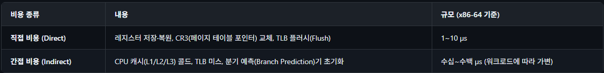

#### 컨텍스트 스위치 성능 측정
```BASH
# 1초 동안의 컨텍스트 스위치 횟수 확인
perf stat -e cs sleep 1
# 출력 예: 1,234 cs (= 1초에 1,234회 컨텍스트 스위치)

# vmstat으로 초당 컨텍스트 스위치(cs) 확인
vmstat 1
# cs 컬럼: 일반적으로 서버에서 수천~수만 회/초가 정상

# 스위치가 많은 프로세스 찾기
pidstat -w 1
# cswch/s: 자발적 스위치, nvcswch/s: 비자발적 스위치

# 스위치 지연 직접 측정 (lmbench)
lat_ctx -s 0 2
# 출력 예: "2 processes: 3.4 microseconds" (2-태스크 전환 지연)
```

컨텍스트 스위치가 `너무 잦을 때의 증상과 해결책`

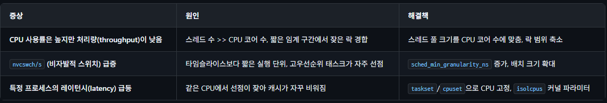

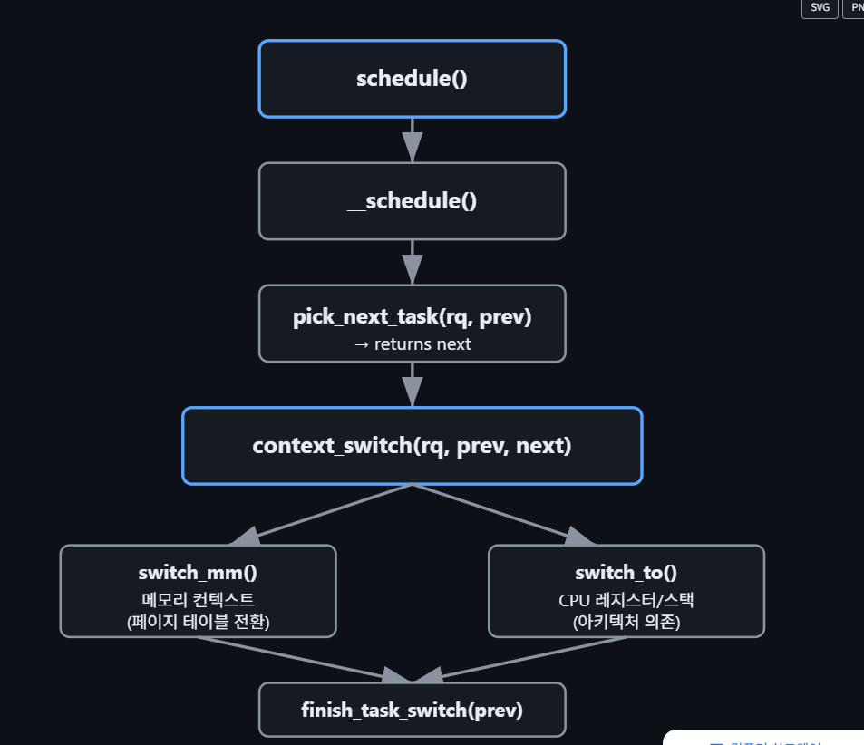

```c
/* kernel/sched/core.c — 컨텍스트 스위치 (간략화) */
static __always_inline struct rq *
context_switch(struct rq *rq, struct task_struct *prev,
               struct task_struct *next, struct rq_flags *rf)
{
    /* 1단계: 메모리 컨텍스트 전환 (mm_struct) */
    if (!next->mm) {
        /* 커널 스레드 → 이전 태스크의 mm 빌려씀 (lazy TLB) */
        enter_lazy_tlb(prev->active_mm, next);
        next->active_mm = prev->active_mm;
    } else {
        /* 사용자 프로세스 → 페이지 테이블 전환 */
        switch_mm_irqs_off(prev->active_mm, next->mm, next);
    }
    /* 2단계: CPU 레지스터/스택 전환 (아키텍처 의존) */
    switch_to(prev, next, prev);
    /* === 이 시점에서 CPU는 'next' 태스크를 실행 중 === */
    return finish_task_switch(prev);
}
```

switch_to 매크로: `switch_to(prev, next, last)`는 아키텍처별로 구현됩니다. x86에서는 RSP(스택 포인터)를 교체하고 RIP(명령어 포인터)를 `__switch_to_asm`에서 전환합니다. 세 번째 인자 last는 스위치 후 "이전에 실행 중이던 태스크"를 반환받기 위한 것으로, A→B→A 순환에서 A가 복귀했을 때 B를 정리하기 위해 필요합니다. 

## 로드 밸런싱 (Load Balancing)
SMP(Symmetric Multi-Processing, 대칭형 다중 처리) 시스템에서 CPU 간 부하를 균등하게 분배하는 것은 성능의 핵심입니다.  Linux 스케줄러는 sched_domain 계층 구조를 통해 토폴로지(Topology) 인식 로드 밸런싱을 수행합니다.

### sched_domain 계층 구조
스케줄링 도메인(Scheduling Domain)은 CPU의 물리적 토폴로지를 반영합니다. SMT(하이퍼스레딩), MC(멀티코어), NUMA 노드 수준으로 계층화됩니다.

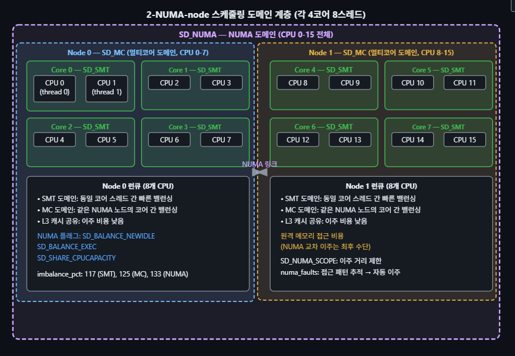

리눅스는 CPU들의 `거리`를 계산해서 일을 나눕니다.

1. SD_SMT (같은 조리대를 쓰는 요리사들): 하나의 코어 안의 스레드들입니다. 거리가 가장 가깝기 때문에 서로 일감을 덜어주고 넘겨받기가 아주 쉽고 빠릅니다.
2. SD_MC (같은 주방 안의 다른 조리대): 물리적으로 같은 칩 안에 있는 다른 코어들입니다. 가까운 편이라 일감을 나누기 좋습니다 (L3 캐시라는 창고를 공유하기 때문입니다).
3. SD_NUMA (아예 층이 다른 주방): 이미지의 좌우를 나누는 거대한 그룹입니다. 1층 주방(Node 0)과 2층 주방(Node 1)처럼 멀리 떨어져 있습니다. 여기서 일감을 넘겨받으려면 식재료(메모리)를 층간 이동시켜야 해서 '이주 비용'이 아주 높습니다. 그래서 커널은 웬만하면 각 노드 안에서 일을 해결하려고 하고, 다른 노드에서 일을 뺏어오는 건 최후의 수단으로 씁니다.

### 로드 밸런싱 알고리즘
로드 밸런싱은 주기적으로(`sched_balance_softirq`) 또는 idle CPU가 작업을 찾을 때(idle balancing) 트리거됩니다.

```c
/* kernel/sched/fair.c — 로드 밸런싱 핵심 흐름 (간략화) */
static int sched_balance_rq(struct rq *this_rq,
                              struct sched_domain *sd,
                              enum cpu_idle_type idle)
{
    struct lb_env env = {
        .sd         = sd,
        .dst_cpu    = this_rq->cpu,
        .dst_rq     = this_rq,
        .idle       = idle,
    };
    /* 1단계: 가장 바쁜 그룹 찾기 */
    struct sched_group *busiest_group =
        find_busiest_group(&env, &sds);
    if (!busiest_group)
        goto out_balanced;
    /* 2단계: 그룹 내 가장 바쁜 런큐 찾기 */
    struct rq *busiest =
        find_busiest_queue(&env, busiest_group);
    if (!busiest)
        goto out_balanced;
    /* 3단계: 태스크 이주 (busiest → this_rq) */
    detach_tasks(&env);
    if (env.imbalance && !env.loop_break) {
        attach_tasks(&env);
    }
    return 0;
out_balanced:
    return 0;
}
```

1. 가장 바쁜 그룹 찾기(`find_busiest_group`)
- 만약 모든 곳이 균형이라면 아무것도 하지 않고 out_balanced 한다.

2. 그룹 내 가장 바쁜 런큐 찾기(`find_busiest_queue`)
- 그룹 내에서 구체적으로 어떤 CPU(런큐,대기열)가 가장 많은 작업을 진행중인지 집어냄

3. 태스크 이동(`detach_tasks & attach_tasks`) 
- 가장 바쁜 CPU의 대기열에서 작업을 떼어내고(detach) 여유로운 CPU의 대기열로 가져와 붙임(attach)

### 밸런싱 메트릭
밸런싱 메트릭(Balancing Metric)은 리눅스 커널이 CPU 간에 작업을 배분할 때 `"어떤 CPU가 얼마나 바쁘고, 누가 일을 더 가져갈 수 있는지"`를 객관적으로 평가하기 위해 사용하는 `'수치화된 측정 지표'`들을 말합니다.

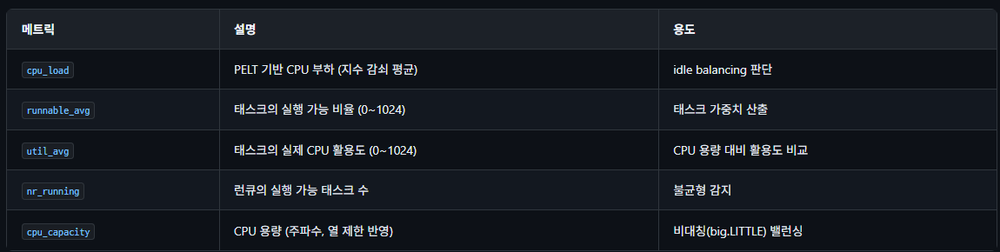

`cpu_load (CPU 전반적 부하)`

설명: PELT(Per-Entity Load Tracking)라는 기법을 사용하여 추적한 CPU의 부하량입니다. 찰나의 순간만 보는 것이 아니라, 과거에 얼마나 바빴는지도 기억해서 현재 수치에 부드럽게 반영(지수 감쇠 평균)합니다.

용도: 빈둥거리고 있는 CPU(idle 상태)가 다른 곳에서 일을 뺏어와도 될지 판단할 때 씁니다.

`runnable_avg (실행 대기 비율)`

설명: 특정 태스크(작업)가 잠들어 있지 않고 '언제든 실행될 수 있는 상태(Runnable)'로 머문 시간의 비율을 0~1024 사이의 수치로 나타냅니다.

용도: 이 작업이 시스템에서 얼마나 비중을 차지하는 무거운 녀석인지(가중치)를 계산할 때 사용합니다.

`util_avg (실제 CPU 활용도)`

설명: 대기만 한 시간이 아니라, 태스크가 실제로 CPU를 차지하고 땀 흘리며 연산한 시간의 비율입니다 (0~1024).

용도: 해당 CPU가 가진 최대 체력(용량) 대비 현재 얼마나 빡빡하게 일을 시키고 있는지 비교하는 데 쓰입니다.

`nr_running (실행 대기열 길이)`

설명: 현재 CPU의 런큐(대기열)에 쌓여서 실행을 기다리는 태스크의 단순 '개수'입니다.

용도: 1번 CPU에는 대기열이 5개, 2번 CPU에는 1개라면 직관적으로 불균형하다는 것을 바로 감지할 수 있습니다.

`cpu_capacity (CPU의 물리적 체력/용량)`

설명: 해당 CPU가 최대로 처리할 수 있는 '절대적인 연산 능력'입니다. 단순히 코어 성능만 보는 게 아니라, 현재 클럭 주파수나 발열로 인해 느려진 상태(쓰로틀링)까지 모두 반영된 현실적인 수치입니다.

용도: 고성능 코어(big)와 저전력 코어(LITTLE)가 섞여 있는 모바일이나 최신 프로세서 환경에서, 무거운 작업을 힘센 코어에게 정확히 전달하기 위해 사용합니다.

### CPU 마이그레이션
태스크가 한 CPU에서 다른 CPU로 이주하는 경로는 크게 세 가지입니다:

```c
/*
 * 1. Pull migration (주기적 밸런싱): 쉬고 있는 idle cpu가 바쁜 cpu한테서 가져옴.
 *    - 바쁜 CPU에서 idle CPU로 태스크를 "당겨옴"
 *    - softirq 컨텍스트에서 실행
 *    - sched_balance_rq() → detach_tasks() → attach_tasks()
 *
 * 2. Push migration (RT/DL 전용): 긴급 작업이라 적합한 고성능, 가까운 놈한테 밀어넣음.
 *    - 높은 우선순위 태스크가 깨어나면 적합한 CPU로 "밀어냄"
 *    - push_rt_task() / push_dl_task()
 *
 * 3. Wake-up migration: 
 *    - 태스크가 깨어날 때 select_task_rq()에서 최적 CPU 선택
 *    - 캐시 친화성 vs 부하 분산 트레이드오프
 * 캐시 친화성(Cache Affinity): "아까 이 주문을 썰던 1번 요리사(prev_cpu) 도마에 재료(캐시 데이터)가 그대로 세팅되어 있을 텐데, 그냥 1번한테 다시 줄까?"
 * 부하 분산(Load Balancing): "근데 1번 요리사 지금 딴 거 하느라 너무 바쁜데... 그냥 텅텅 비어있는 5번 요리사한테 줄까?"
*/
/* kernel/sched/fair.c — select_task_rq_fair (웨이크업 CPU 선택, 간략화) */
static int
select_task_rq_fair(struct task_struct *p, int prev_cpu, int wake_flags)
{
    struct sched_domain *sd;
    int new_cpu = prev_cpu;
    int want_affine = 0;
    /* 깨운 CPU가 prev_cpu와 같은 도메인이면 affinity 선호 */
    if (cpumask_test_cpu(smp_processor_id(), p->cpus_ptr))
        want_affine = 1;
    /* 도메인 계층을 올라가며 가장 idle한 CPU/그룹 선택 */
    for_each_domain(smp_processor_id(), sd) {
        //근처에서 처리하는 게 좋겠다고 판단했고(want_affine), 그 구역이 깨어날 때 같은 구역을 선호하는 설정(SD_WAKE_AFFINE)이라면?
        if (want_affine && (sd->flags & SD_WAKE_AFFINE)) { 
            //이전 cpu와 가까우면서 idle인것을 골라냄.
            new_cpu = select_idle_sibling(p, prev_cpu, new_cpu);
            break;
        }
    }
    return new_cpu;
}
```

## PELT (Per-Entity Load Tracking)
커널 3.8에서 도입된 PELT는 `스케줄러의 부하 측정 기`반`입니다. 이전의 per-CPU 부하 추적과 달리, 각 스케줄 엔티티(태스크, cgroup)별로 독립적으로 부하를 추적하여 정밀한 로드 밸런싱과 주파수 결정을 가능하게 합니다.

과거에는 매니저가 단순히 "1번 주방(CPU) 전체가 얼마나 바쁜가?"만 통째로 뭉뚱그려 측정했습니다. 하지만 PELT(Per-Entity Load Tracking)는 이름 그대로 '개별 주문표(Entity = 태스크나 프로세스) 하나하나에 타이머와 무게 추를 달아서 개별적으로 추적'하는 방식입니다.

### 핵심 메트릭: load_avg, runnable_avg, util_avg
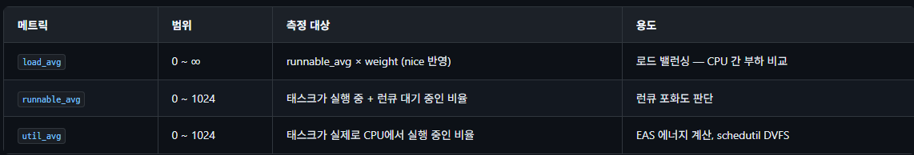

- util_avg (실제 사용량): 태스크가 실제로 CPU에서 실행 중인 비율을 나타내며 0에서 1024 사이의 값을 가집니다. 순수하게 요리사가 불을 켜고 이 주문을 요리한 시간만 따진 것입니다. 이 수치는 EAS(에너지 인지 스케줄링)에서 에너지를 계산하거나 schedutil을 통해 CPU의 주파수(성능)를 조절할 때 쓰입니다.
- runnable_avg (포화도): 태스크가 실행 중인 시간에 더해 런큐에서 대기 중인 시간까지 합친 비율입니다 (0~1024 범위). 요리하는 시간뿐만 아니라 도마 위에서 순서를 대기한 시간까지 포함되므로, 런큐(대기열)가 얼마나 꽉 차 있는지 포화도를 판단할 때 씁니다.
- load_avg (밸런싱의 절대 기준): runnable_avg에 해당 태스크의 중요도(weight, nice 값 반영)를 곱한 수치입니다. 중요한 VIP 주문이면 가중치가 곱해져 값이 확 커지기 때문에 범위의 한계가 없습니다 (0~∞). CPU 간에 누구의 부하가 더 큰지 묵직함을 비교하고 로드 밸런싱을 결정할 때 실질적인 기준이 됩니다.

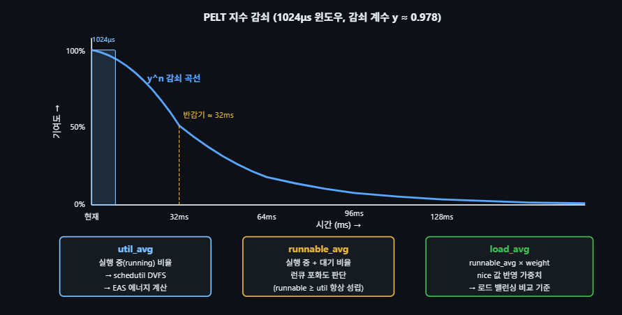

가장 왼쪽(현재)을 보시면 기여도가 100%입니다. 방금 들어온 작업 부하는 온전히 100%로 쳐줍니다.오른쪽으로 시간(ms)이 흐를수록 곡선이 뚝 떨어집니다.가운데 노란 점선 '반감기 $\approx$ 32ms'가 핵심입니다. 어떤 작업이 CPU를 100%로 썼더라도, 딱 32ms(약 0.03초)가 지나면 현재 스케줄러가 느끼는 체감 부하는 절반(50%)으로 깎입니다.64ms가 지나면 25%, 96ms가 지나면 12.5%로 계속 줄어들어 128ms쯤 되면 거의 0에 수렴합니다. 즉, *"과거에 아무리 바빴어도 최근 0.1초 동안 널널했다면, 이 CPU는 한가한 것으로 판단하겠다"*는 철학입니다.

```c
/* kernel/sched/pelt.c — PELT 감쇠 갱신 (간략화) */
/*
 * PELT 감쇠 공식:
 *
 * load_sum = Σ (기여값 × y^n)
 *
 * 여기서:
 *   y = (2^32 - 1) / 2^32 ≈ 0.978 (감쇠 계수)
 *   n = 경과한 1024μs 윈도우 수
 *
 * 각 1024μs 윈도우에서:
 *   - running 상태이면 기여값 = 1 (util, runnable, load 모두)
 *   - runnable(대기) 상태이면 기여값 = 1 (runnable, load만)
 *   - sleeping 상태이면 기여값 = 0 (기존 값에 감쇠만 적용)
 *
 * 반감기: y^32 ≈ 0.5 → 약 32ms(32 윈도우)마다 기여도 절반
 */
static u32
accumulate_sum(u64 delta, struct sched_avg *sa,
              unsigned long load, unsigned long runnable,
              int running)
{
    u32 contrib = (u32)delta;  /* 현재 윈도우 기여분 */
    u64 periods = delta / 1024;
    if (periods) {
        /* 과거 윈도우에 감쇠 적용 */
        sa->load_sum = decay_load(sa->load_sum, periods);
        sa->runnable_sum = decay_load(sa->runnable_sum, periods);
        sa->util_sum = decay_load(sa->util_sum, periods);
    }
    /* 현재 윈도우 기여분 추가 */
    sa->util_sum += running * contrib;       /* 실행 중일 때만 */
    sa->runnable_sum += runnable * contrib;   /* 실행 중 + 대기 */
    sa->load_sum += load * contrib;           /* 가중치 반영 */
    return periods;
}
/* 평균값 계산: sum / divider (PELT 기하급수 합의 상한) */
static void ___update_load_avg(struct sched_avg *sa,
                                unsigned long load)
{
    u32 divider = LOAD_AVG_MAX - 1024 + sa->period_contrib;
    sa->load_avg = div_u64(load * sa->load_sum, divider);
    sa->runnable_avg = div_u64(sa->runnable_sum, divider);
    sa->util_avg = sa->util_sum / divider;
}
```

```BASH
# PELT 메트릭 확인 (debugfs)
cat /proc/<pid>/sched | grep -E 'avg\.'
# se.avg.load_avg                      :            512
# se.avg.runnable_avg                   :            680
# se.avg.util_avg                       :            450

# CPU 전체 PELT (cfs_rq 레벨)
cat /proc/sched_debug | grep -A5 'cfs_rq\[0\]'
# .load_avg = 2048  (CPU 0 CFS 런큐의 총 가중 부하)
# .util_avg = 820   (CPU 0 CFS 런큐의 총 활용도)

# schedutil 연동: PELT util_avg → CPU 주파수 결정
cat /sys/devices/system/cpu/cpufreq/policy0/scaling_governor
# schedutil  ← PELT 기반 주파수 거버너
# util_avg와 주파수의 관계:
# freq_next = freq_max × (util_avg + margin) / capacity
```

PELT와 schedutil: `schedutil cpufreq 거버너`는 PELT의 util_avg를 직접 사용하여 CPU 주파수를 결정합니다. `util_avg`가 높으면 주파수를 올리고, 낮으면 내립니다. 이는 스케줄러가 주파수 결정에 직접 관여하여, 기존 ondemand/conservative 거버너보다 빠르고 정확한 DVFS를 가능하게 합니다. EAS가 schedutil을 필수로 요구하는 이유입니다.

# EAS (Energy Aware Scheduling)
EAS는 커널 5.0에서 메인라인에 병합된 에너지 효율 인식 스케줄링 프레임워크입니다 (Android 공통 커널에는 4.x부터 존재, 메인라인 진입은 5.0). 전통적인 로드 밸런싱이 "모든 CPU에 부하를 균등 분배"하는 것을 목표로 하는 반면, EAS는 성능 요구를 충족하면서 에너지 소비를 최소화하는 CPU를 선택합니다. ARM big.LITTLE, DynamIQ, Intel Hybrid(Alder Lake+) 등 비대칭 CPU 토폴로지에서 핵심적인 역할을 합니다.

EAS: "아하! schedutil은 util_avg에 비례해서 주파수를 올리는구나. 그럼 내가 이 프로세스(util_avg=800)를 1번 CPU에 넣으면, schedutil이 주파수를 2.5GHz로 올리겠네? 그때의 예상 전력 소모량은 5W겠군! 완벽하게 예측 가능해!"

즉, EAS가 `미래의 에너지 소모량을 정확히 수학적으로 모델링하고 시뮬레이션`하기 위해서는, 주파수 변화를 100% 예측할 수 있는 `스케줄러 직속 거버너(schedutil)`가 필수적인 것입니다.

### EAS 핵심 원리
EAS는 태스크를 배치할 때 에너지 모델(Energy Model, EM)을 참조하여 각 CPU에 태스크를 배치했을 때의 예상 에너지 소비를 계산하고, 가장 효율적인 배치를 선택합니다.

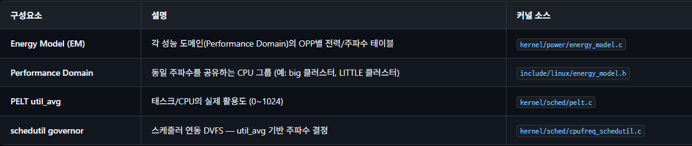

```c
/* kernel/sched/fair.c — find_energy_efficient_cpu() (간략화) */
static int
find_energy_efficient_cpu(struct task_struct *p, int prev_cpu)
{
    struct perf_domain *pd;
    unsigned long best_delta = ULONG_MAX;
    int best_cpu = -1;
    /* 모든 성능 도메인(클러스터)(Performance Domain)을 순회 */
    //저전력,고성능 코어 그룹(little,bi)이 나뉘어 있음.
    for_each_pd(pd) {
        unsigned long cur_energy, new_energy;
        int max_spare_cap_cpu = -1;

        /* 도메인 내에서 여유 용량이 가장 큰 CPU 찾기 */
        for_each_cpu(cpu, perf_domain_span(pd)) {
            unsigned long spare = cpu_cap(cpu) - cpu_util(cpu);
            if (spare > max_spare)
                max_spare_cap_cpu = cpu;
        }

        /* 현재 에너지 vs 태스크 배치 후 에너지 비교 */
        // 에너지 시뮬레이션
        cur_energy = compute_energy(p, -1, pd);    /* 태스크 없이 */
        new_energy = compute_energy(p, max_spare_cap_cpu, pd);
        unsigned long delta = new_energy - cur_energy;
        //가장 전기세 덜 나오는 곳 기록
        if (delta < best_delta) {
            best_delta = delta;
            best_cpu = max_spare_cap_cpu;
        }
    }

    /* 에너지 절감이 6% 미만이면 prev_cpu 유지 (마이그레이션 비용) */
    if (best_delta > prev_delta * 94 / 100)
        return prev_cpu;
    return best_cpu;
}
```

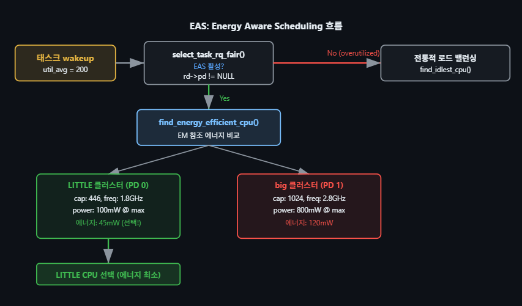

1. 태스크 Wakeup (util_avg = 200): 방금 깨어난 작업의 무거움(util_avg)이 200 정도 됩니다.
2. 분기점 (select_task_rq_fair): 여기서 시스템이 현재 '과부하(overutilized)' 상태인지 확인합니다.
    - 과부하 상태라면 (No): 전력 아끼고 자시고 할 때가 아닙니다. 빨리 빈 CPU 찾아서 던져넣는 `'전통적 로드 밸런싱'` 모드로 도망갑니다.
    - 여유가 있다면 (Yes): 드디어 EAS가 켜지고, 우리가 분석할 `find_energy_efficient_cpu()` 함수가 호출됩니다.
3. 에너지 시뮬레이션 (PD 0 vs PD 1):
    - LITTLE 클러스터 (저전력 코어들): 여기에 이 작업을 넣으면 총 45mW의 전력을 쓸 것으로 계산됩니다.
    - big 클러스터 (고성능 코어들): 여기에 이 작업을 넣으면 총 120mW의 전력을 쓸 것으로 계산됩니다.
4. 최종 선택: 성능은 big 코어가 좋겠지만, `LITTLE 코어에서도 충분히 소화할 수 있는 작업(util 200 < cap 446)`이므로 전력을 훨씬 적게 먹는(45mW) LITTLE 코어를 최종 선택합니다.

### EAS 활성화 조건
EAS는 다음 조건이 모두 충족될 때만 활성화됩니다:

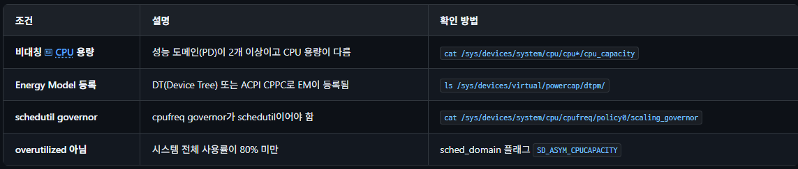

```BASH
# EAS 활성 상태 확인
# 성능 도메인 확인
cat /proc/schedstat | head -20

# CPU 용량 확인 (비대칭이면 값이 다름)
for cpu in /sys/devices/system/cpu/cpu[0-9]*; do
    echo "$(basename $cpu): $(cat $cpu/cpu_capacity)"
done

# schedutil governor 설정 (EAS 필수 조건)
echo schedutil > /sys/devices/system/cpu/cpufreq/policy0/scaling_governor

# overutilized 상태 추적
echo 1 > /sys/kernel/debug/tracing/events/sched/sched_overutilized_tp/enable
cat /sys/kernel/debug/tracing/trace_pipe
```

#### EAS vs 전통 밸런싱
EAS는 부하가 낮을 때(overutilized 아닐 때) 에너지 최적화를 수행합니다. 시스템 전체 사용률이 80%를 넘으면 overutilized 플래그가 설정되고, 전통적인 로드 밸런싱으로 자동 전환됩니다. 이는 높은 부하에서 에너지 최적화보다 성능 분배가 중요하기 때문입니다. 

### uclamp (Utilization Clamping, 사용률 클램핑)
Utilization Clamping(uclamp)은 태스크가 만들어내는 PELT 사용률(util_avg) 신호에 `하한`과 `상한`을 씌워, 스케줄러와 cpufreq 거버너에게 "이 태스크에 필요한 성능 범위"를 힌트로 전달하는 메커니즘입니다. Linux 5.3에서 도입되었으며(`CONFIG_UCLAMP_TASK`), 모바일·이기종 SoC의 전력/성능 균형 조정에서 핵심 역할을 합니다. 과거 안드로이드가 비공식 패치(SchedTune)로 해결하던 문제를 메인라인 표준으로 흡수한 결과입니다.

두 가지 경계가 핵심입니다. 값은 백분율이 아니라 `0~1024 척도의 성능 포인트(performance point)`이며, 1024가 시스템 최대 용량에 해당합니다.

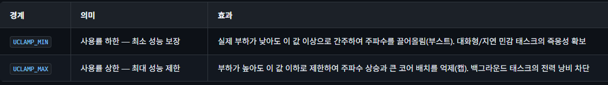

#### 태스크별 설정 (sched_setattr)
태스크 단위 uclamp는 `sched_setattr(2)` 시스템 콜로 `struct sched_attr`의 `sched_util_min·sched_util_max 필드`를 채워 설정합니다. 적용하려는 경계마다 `sched_flags`에 `SCHED_FLAG_UTIL_CLAMP_MIN` / `SCHED_FLAG_UTIL_CLAMP_MAX` 비트를 세워야 합니다.

```c
#include <sched.h>
#include <sys/syscall.h>
/* 지연 민감 태스크: 최소 성능 보장(부스트) */
struct sched_attr attr = { 0 };
attr.size           = sizeof(attr);
attr.sched_policy   = SCHED_NORMAL;
attr.sched_flags    = SCHED_FLAG_UTIL_CLAMP_MIN | SCHED_FLAG_UTIL_CLAMP_MAX;
attr.sched_util_min = 512;   /* 최소 50% 성능 포인트로 부스트 */
attr.sched_util_max = 1024;  /* 상한은 풀 성능 허용 */
if (syscall(SYS_sched_setattr, 0 /* self */, &attr, 0) < 0)
    perror("sched_setattr");
/* 시스템 기본값으로 복원: 값 -1 사용 (단, 현재 sysctl 기본을 따름) */
attr.sched_util_min = (__u32)-1;
attr.sched_util_max = (__u32)-1;
```

### -1 리셋의 비대칭성
sched_util_min/max에 -1을 넣으면 `"수동으로 1024를 지정"하는 것과 다릅니다.` -1은 시스템 `기본값`을 따른다는 의미라서, sysctl로 기본값이 바뀌면 함께 변합니다. 또한 `SCHED_FIFO/SCHED_RR(RT)` 태스크의 기본값은 `UCLAMP_MIN=UCLAMP_MAX=1024`로 설정되어 과거 RT 동작(항상 최대 주파수)을 보존합니다. 배터리 기반 시스템에서는 kernel.sched_util_clamp_min_rt_default sysctl로 이 RT 기본 하한을 낮춰 전력을 아낄 수 있습니다. 

### 런큐 집계와 버킷팅
스케줄러는 런큐의 유효 uclamp 값을 빠르게 계산하기 위해 0~1024 범위를 CONFIG_UCLAMP_BUCKETS_COUNT개(기본 5개, 각 약 205 단위)의 버킷(bucket)으로 나눕니다. 태스크가 enqueue될 때 해당 버킷 카운터를 증가시켜, 매번 런큐의 모든 태스크를 훑지 않고 부분 집합만으로 유효 값을 구합니다.

집계 방식은 최대 집계(max aggregation)입니다. 한 런큐에 여러 태스크가 있으면 런큐의 유효 UCLAMP_MIN·UCLAMP_MAX는 각각 모든 태스크 요청의 최댓값이 됩니다. 더 높은 성능을 요구하는 태스크가 덜 까다로운 이웃 때문에 제약받지 않도록 하기 위함입니다.

```
예) 동일 런큐 위 두 태스크
  p0: UCLAMP_MIN=300   p1: UCLAMP_MIN=500
  → rq->uclamp[UCLAMP_MIN] = max(300, 500) = 500
```

주파수/배치 연동: schedutil 거버너는 런큐의 유효 uclamp 값을 보고 CPU 주파수를 선택하고, 이기종 시스템의 EAS/CAS(Capacity Aware Scheduling)는 uclamp를 반영해 에너지 효율적인 코어에 태스크를 배치합니다. 즉 uclamp는 EAS·CPU 용량·schedutil을 잇는 핵심 힌트 채널입니다.

알려진 한계: (1) 최대 집계의 맹점 — 캡(UCLAMP_MAX)이 걸린 태스크가 있어도 같은 런큐에 캡이 없는 태스크가 있으면 주파수가 내려가지 않습니다(이를 개선하려는 합 집계(sum aggregation) 작업이 진행 중). (2) PELT 신호 왜곡 — UCLAMP_MAX로 과도하게 캡하면 태스크가 idle 시간을 갖지 못해 util_avg가 인위적으로 1024까지 부풀 수 있습니다. (3) 응답 지연 — 하드웨어 주파수 전환 지연과 schedutil의 rate-limit 때문에 즉시 반영되지는 않습니다.

# 이기종 CPU 스케줄링 (Heterogeneous Scheduling)
최신 SoC와 프로세서는 성능/전력 특성이 다른 CPU 코어를 혼합하는 이기종 아키텍처를 채택합니다.  Linux 스케줄러는 CPU 용량(capacity), 적합성(fitness), 비대칭 패킹(asymmetric packing) 등의 메커니즘으로 이를 지원합니다.

### 주요 이기종 아키텍처
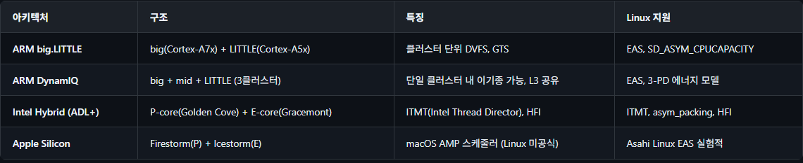

### CPU 용량(Capacity)과 적합성(Fitness)
스마트폰이나 최신 컴퓨터에는 힘센 코어(big)와 효율적인 코어(LITTLE)가 섞여 있습니다. 리눅스는 스케줄링을 계산하기 쉽게 '가장 일 잘하고 힘센 코어의 최대 체력을 1024'로 기준점을 잡습니다.

- 고성능 코어: 최대 체력 1024
- 저전력 코어: 성능에 따라 최대 체력 512(고성능의 절반), 256 등으로 상대적 평가

리눅스 스케줄러의 철학은 `"요리사 체력의 80%까지만 일을 시킨다"는 것`입니다. 나머지 20%의 체력(마진)을 항상 비워두는 이유는 다음과 같습니다.

1. 버스트(Burst) 대응: 손님이 갑자기 반찬을 더 달라고 하는 등 예상치 못하게 작업량이 순간적으로 폭주할 때 대처할 최소한의 여력이 필요합니다.
2. 주파수 변경 지연 대처: 일이 많아져서 매니저가 "가스불 당장 최대로 켜!"(주파수 상승 지시)라고 해도 물리적으로 화력이 끝까지 올라가기까지 아주 미세한 시간이 걸립니다. 그 짧은 시간 동안 주문이 밀려 터지지 않도록 방어하는 완충 지대입니다.

```c
/* kernel/sched/fair.c — CPU 적합성 검사 */
static inline int
task_fits_cpu(struct task_struct *p, int cpu)
{
    unsigned long cap = capacity_of(cpu);
    unsigned long util = task_util_est(p);
    /*
     * 태스크 활용도가 CPU 용량의 80% 이하이면 적합
     * 마진 20%: 주파수 변경 지연 + 버스트 대응
     */
    return fits_capacity(util, cap);
}
/* capacity 비교 매크로 */
#define fits_capacity(cap, max) ((cap) * 1280 < (max) * 1024)
//태스크 활용도 < CPU 용량 * (1024 / 1280) (80%임.)
```

### Intel Hybrid: ITMT와 HFI
Intel 12세대(Alder Lake)부터 P-core와 E-core를 혼합합니다. Linux는 ITMT(Intel Turbo Boost Max Technology 3.0)와 HFI(Hardware Feedback Interface)를 통해 이기종 스케줄링을 지원합니다.

```c
/* arch/x86/kernel/itmt.c — ITMT 우선순위 설정 */
void sched_set_itmt_core_prio(int prio, int cpu)
{
    /*
     * P-core: 높은 우선순위 (예: 2)
     * E-core: 낮은 우선순위 (예: 1)
     * → asym_packing 로직이 P-core를 먼저 채움
     */
    per_cpu(sched_core_priority, cpu) = prio;
}
/* SD_ASYM_PACKING: P-core를 먼저 채우는 비대칭 패킹 */
/* sched_domain 플래그에 SD_ASYM_PACKING 설정 시
 * 우선순위가 높은 CPU에 태스크를 몰아서 배치
 * → E-core는 P-core가 바쁠 때만 사용 */
```

```c
/* drivers/thermal/intel/intel_hfi.c — HFI 콜백 */
/*
 * HFI(Hardware Feedback Interface)는 하드웨어가 실시간으로
 * 각 CPU의 성능/효율 등급을 보고하는 인터페이스
 *
 * 열 제한 시 P-core 성능이 E-core 수준으로 떨어지면
 * HFI가 스케줄러에 알려 E-core 우선 사용으로 전환
 */
static void intel_hfi_online(unsigned int cpu)
{
    struct hfi_cpu_info *info = per_cpu_ptr(&hfi_cpu_info, cpu);
    /* perf_cap: 성능 등급 (0-255), ee_cap: 에너지 효율 등급 */
    info->perf_cap = hfi_read_perf(cpu);
    info->ee_cap = hfi_read_ee(cpu);
}
```

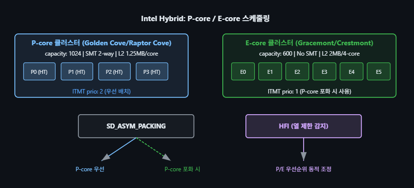


## 스케줄러 디버깅 (Scheduler Debugging)
스케줄러의 동작을 분석하고 성능 문제를 진단하기 위한 다양한 도구와 인터페이스가 있습니다.

### /proc/sched_debug
```BASH
# 전체 스케줄러 상태 덤프
cat /proc/sched_debug
# 출력 내용:
# - 글로벌 스케줄러 파라미터 (sched_latency, min_granularity 등)
# - per-CPU 런큐 상태 (nr_running, load, curr 태스크 등)
# - 각 CPU의 CFS 런큐 트리 (vruntime, deadline, weight 등)
# - RT 런큐 상태
# 특정 프로세스의 스케줄링 정보
cat /proc/<pid>/sched
# 출력 예:
# se.vruntime                         :         12345.678901
# se.sum_exec_runtime                 :        987654.321098
# se.nr_migrations                    :               42
# nr_switches                         :             1234
# nr_voluntary_switches               :              987
# nr_involuntary_switches             :              247
# prio                                :              120
# policy                              :                0  (SCHED_NORMAL)
```

### perf sched
```BASH
# 스케줄링 이벤트 기록 (10초간)
sudo perf sched record -- sleep 10
# 스케줄링 지연 분석 (wakeup → actually running)
sudo perf sched latency
# CPU별 타임라인 (ASCII art)
sudo perf sched map
# 스케줄링 통계 요약
sudo perf sched timehist
# 각 컨텍스트 스위치의 상세 타임스탬프, wait/run 시간 출력
# 스케줄링 이벤트 기반 통계
sudo perf stat -e 'sched:sched_switch,sched:sched_wakeup' -- sleep 5
```

`perf sched latency` 출력 예시:

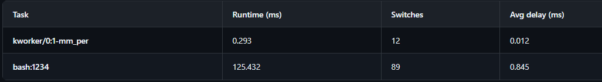

`perf sched map` 해석 예시: 시간축에서 `*`가 표시된 시점의 CPU별 실행 태스크를 보여줍니다. 예를 들어 `0: migration/0`, `1: ksoftirqd/1`, `2: bash:1234`처럼 CPU별 활성 태스크를 매칭해 확인합니다.

### ftrace 스케줄러 트레이싱
```BASH
# ftrace로 스케줄러 이벤트 트레이싱
cd /sys/kernel/debug/tracing
# 사용 가능한 스케줄러 이벤트 확인
ls events/sched/
# sched_switch  sched_wakeup  sched_wakeup_new  sched_migrate_task
# sched_process_fork  sched_process_exec  sched_process_exit
# sched_stat_wait  sched_stat_sleep  sched_stat_runtime
# 스케줄러 스위치 이벤트 활성화
echo 1 > events/sched/sched_switch/enable
echo 1 > events/sched/sched_wakeup/enable
# 트레이싱 시작
echo 1 > tracing_on
sleep 2
echo 0 > tracing_on
# 결과 확인
cat trace
# 출력 예:
# bash-1234 [002] 1234.567890: sched_switch: prev_comm=bash prev_pid=1234
#   prev_prio=120 prev_state=S ==> next_comm=kworker/2:1 next_pid=567
#   next_prio=120
#
# <idle>-0 [001] 1234.567895: sched_wakeup: comm=bash pid=1234
#   prio=120 target_cpu=002
# 특정 프로세스의 wakeup 지연 측정 (wakeup latency tracer)
echo wakeup > current_tracer
echo 1 > tracing_on
# ... 워크로드 실행 ...
echo 0 > tracing_on
cat trace
# 최대 wakeup 지연 시간 표시
```

### 스케줄러 디버그 기능 (sched_features)
```BASH
# 현재 활성화된 스케줄러 기능 확인
cat /sys/kernel/debug/sched/features
# 출력 예:
# GENTLE_FAIR_SLEEPERS  (슬리퍼에 대한 보상 제한)
# START_DEBIT           (새 태스크에 vruntime 불이익)
# NEXT_BUDDY            (wakeup 시 next 힌트)
# LAST_BUDDY            (yield 시 last 힌트)
# CACHE_HOT_BUDDY       (캐시 친화적 wakeup)
# WAKEUP_PREEMPTION     (wakeup 시 선점 허용)
# PLACE_LAG             (EEVDF: lag 기반 배치)
# PLACE_DEADLINE_INITIAL (EEVDF: 초기 deadline 설정)
# 기능 토글 (런타임)
echo WAKEUP_PREEMPTION > /sys/kernel/debug/sched/features   # 활성화
echo NO_WAKEUP_PREEMPTION > /sys/kernel/debug/sched/features # 비활성화
```

### schedstat 통계
```BASH
# schedstat 활성화 (CONFIG_SCHEDSTATS 필요)
echo 1 > /proc/sys/kernel/sched_schedstats
# CPU별 스케줄링 통계
cat /proc/schedstat
# cpu<N> <domain> <9개 필드>
# 필드: yld_count, sched_switch, sched_goidle, ttwu_count,
#       ttwu_local, rq_cpu_time, run_delay, pcount
# 프로세스별 스케줄링 통계
cat /proc/<pid>/schedstat
# 3개 필드: run_time(ns) wait_time(ns) nr_timeslices
# 모든 CPU의 로드 밸런싱 통계 확인
cat /proc/schedstat | grep domain
```

### 디버깅 도구 요약
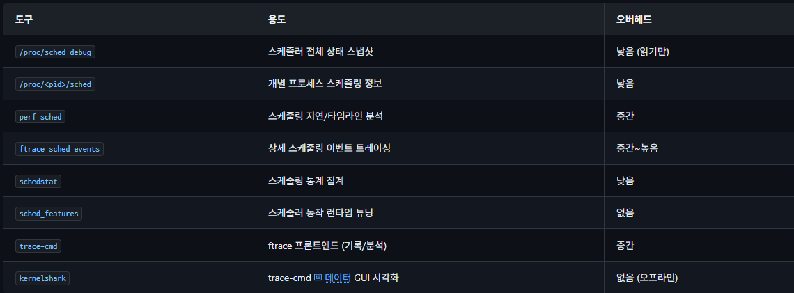

### 주요 커널 설정 옵션
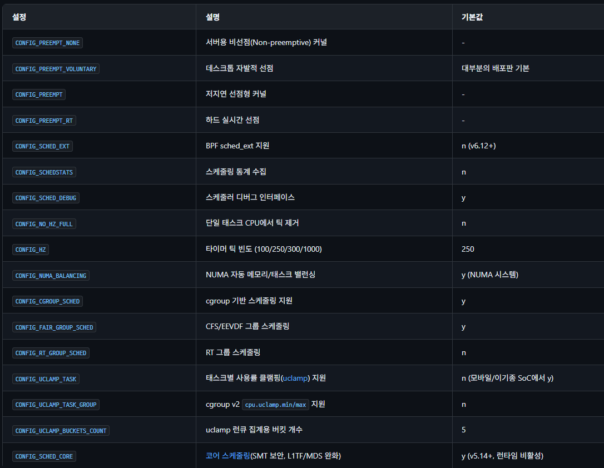

### sysctl 튜닝 파라미터
```BASH
# === CFS/EEVDF 파라미터 ===
# 타겟 레이턴시 (ns): 태스크들이 한 번씩 실행되는 목표 주기
sysctl kernel.sched_latency_ns=6000000        # 6ms (기본)

# 최소 그래뉼래리티 (ns): 태스크당 최소 실행 시간
sysctl kernel.sched_min_granularity_ns=750000 # 0.75ms (기본)

# EEVDF 기본 슬라이스 (ns, v6.6+)
sysctl kernel.sched_base_slice_ns=3000000     # 3ms (기본)

# 웨이크업 그래뉼래리티: 깨어난 태스크의 선점 임계값
sysctl kernel.sched_wakeup_granularity_ns=1000000  # 1ms (기본)

# === RT 파라미터 ===
# RT 대역폭 제한 (us)
sysctl kernel.sched_rt_period_us=1000000      # 1초 주기
sysctl kernel.sched_rt_runtime_us=950000      # 주기당 최대 950ms

# === 마이그레이션 비용 ===
sysctl kernel.sched_migration_cost_ns=500000 # 0.5ms (기본)
# 이 시간 이내에 실행된 태스크는 "캐시 핫"으로 간주, 마이그레이션 억제

# === uclamp(사용률 클램핑) 시스템 한계 (CONFIG_UCLAMP_TASK) ===
# 시스템 전역 UCLAMP_MIN/MAX 허용 상한 (0~1024)
sysctl kernel.sched_util_clamp_min=1024
sysctl kernel.sched_util_clamp_max=1024
# RT 태스크의 기본 UCLAMP_MIN (배터리 시스템은 낮춰 절전)
sysctl kernel.sched_util_clamp_min_rt_default=1024

# === CPU Affinity (명령줄) ===
taskset -c 0,1 ./my_app                      # CPU 0,1에만 바인딩
taskset -p -c 2-5 1234                       # PID 1234를 CPU 2-5로 변경

# === isolcpus (커널 부트 파라미터) ===
# 특정 CPU를 스케줄러에서 격리 (RT 워크로드 전용)
# GRUB: isolcpus=2,3 nohz_full=2,3 rcu_nocbs=2,3
```

성능 튜닝 팁: 
- (1) 대화형 워크로드(데스크톱): sched_latency_ns 줄이기, CONFIG_PREEMPT 사용. 
- (2) 서버/배치 워크로드: sched_min_granularity_ns 늘리기, CONFIG_PREEMPT_NONE 사용. 
- (3) RT 워크로드: isolcpus + SCHED_FIFO + CONFIG_PREEMPT_RT. 
- (4) 컨테이너(Container) 환경: cgroup cpu.max로 대역폭 제한, CONFIG_FAIR_GROUP_SCHED 필수.
