# Android 커널
Android GKI 아키텍처, Binder IPC, 메모리 관리(Memory Management)(ashmem/lmkd), HAL 인터페이스, SELinux 정책, 부팅 과정(Boot Process), 프로세스(Process) 모델, 스토리지, 커널 디버깅(Debugging)과 보안까지 Android 플랫폼의 커널 레벨 종합 가이드.

## 핵심 요약
- GKI(Generic Kernel Image) — 공통 커널 이미지와 벤더 모듈을 분리하여 Android 기기 간 커널 파편화를 해소합니다.
- Binder IPC — Android의 핵심 프로세스 간 통신 메커니즘으로, 커널 드라이버(/dev/binder)가 직렬화(Serialization)·트랜잭션(Transaction)을 처리합니다.
- HAL(Hardware Abstraction Layer) — 커널 드라이버와 Android 프레임워크 사이의 인터페이스 계층으로, HIDL/AIDL을 통해 안정적 ABI를 보장합니다.
- Android 부팅 과정 — 부트로더(Bootloader) → 커널 → init → Zygote 순서로 진행되며, dm-verity/AVB가 무결성(Integrity)을 검증합니다.
- Android SELinux — 모든 프로세스와 파일에 보안 레이블을 부여하는 강제 접근 제어(MAC) 정책으로, Android 보안의 핵심입니다.
- LMKD/메모리 관리 — PSI(Pressure Stall Information) 기반 유저스페이스 메모리 킬러와 DMA-BUF 힙으로 Android 메모리를 관리합니다.
- pKVM(Protected KVM) — Android 가상화(Virtualization) 프레임워크로, 호스트 커널로부터도 게스트 메모리를 보호하는 기밀 컴퓨팅(Confidential Computing)을 제공합니다.

## 단계별 이해
1. 메인라인과 Android 커널 차이 파악 — Android가 Linux 메인라인에서 분기한 역사와 GKI 통합 과정을 먼저 이해합니다.
```
wakelocks, ashmem, ION 등 Android 전용 기능이 어떻게 메인라인에 통합되거나 대체되었는지 흐름을 따라가면 현재 구조를 파악할 수 있습니다.
왜? Android 커널이 메인라인과 별도 기능을 유지할 때마다 업스트림 보안 패치를 수동으로 백포트(backport)해야 하는 비용이 누적됩니다. 이 역사를 이해하면 GKI 구조의 동기가 명확해지고, 벤더 커널이 수백 개의 out-of-tree 패치를 갖게 된 이유를 납득할 수 있습니다.

* wakelock: 스마트폰이 함부로 절전 상태에 들어가지 못하게 막는 기능(백그라운드에서 CPU 실행을 위함)
* ashmem: Anonymous Shared Memory의 약자로, 프로세스들이 메모리를 공유하기 위한 Android 전용 방식
* ION 메모리 관리자: 카메라, GPU, 디스플레이 등 하드웨어 장치 간에 효율적인 메모리 공유와 할당을 담당하던 커널 프레임워크(서로 가상 주소가 다르니..)
```
2. GKI 아키텍처와 모듈 구조 학습 — 공통 커널 이미지(GKI)와 벤더 모듈 분리 구조, KMI(Kernel Module Interface) 안정성 보장 메커니즘을 학습합니다.
```
gki_defconfig로 공통 설정을 빌드하고, 벤더 훅(vendor hook)으로 SoC별 기능을 주입하는 방식을 실습합니다.
왜? 벤더 드라이버가 커널 내부 심볼에 직접 의존하면 커널 업그레이드 시 모든 드라이버를 재컴파일해야 합니다. KMI로 안정적인 인터페이스를 정의하면 벤더가 GKI 커널 버전과 독립적으로 드라이버를 배포할 수 있어 OTA(Over-The-Air) 업데이트 주기를 단축할 수 있습니다.
```

3. Binder IPC 동작 원리 분석 — ioctl() 기반 트랜잭션 흐름, BC_/BR_ 프로토콜, 공유 메모리 매핑(Mapping) 구조를 코드 수준에서 추적합니다.
```
adb shell service list와 /sys/kernel/debug/binder/를 통해 실제 바인더 통신을 관찰합니다.
왜? Android의 모든 서비스 호출(Camera, Audio, Wi-Fi 등)이 Binder를 통해 이루어집니다. Binder를 이해하지 않으면 시스템 서비스 지연(latency)이나 ANR(Application Not Responding) 문제의 원인을 커널 수준에서 추적할 수 없습니다.
```
4. 부팅·보안·메모리 서브시스템 연결 — dm-verity/AVB 부팅 검증, SELinux 정책 적용, LMKD 메모리 관리가 커널 수준에서 어떻게 연동되는지 통합 관점으로 분석합니다.
```
각 서브시스템의 커널 로그(dmesg)와 sysfs 인터페이스를 교차 확인하며 전체 그림을 완성합니다.
왜? 실제 제품에서 발생하는 문제는 대부분 서브시스템 경계에서 생깁니다. SELinux 정책 오류가 dm-verity 실패로 나타나거나, LMKD 설정 오류가 부팅 루프를 유발하는 등 통합 시각 없이는 원인 파악이 어렵습니다.
```
5. VTS/CTS로 호환성 검증 — GKI 호환성 테스트(VTS)와 Android 호환성 테스트(CTS)를 실행하여 커널 변경이 Android 플랫폼 요구사항을 충족하는지 확인합니다.
```Android CDD(Compatibility Definition Document)를 기준으로 커널 설정과 ABI 안정성을 점검합니다.
왜? GKI 호환성 요구사항을 충족하지 않으면 Android 인증을 받을 수 없어 Google Play Store 접근이 불가능합니다. VTS/CTS는 단순 테스트가 아닌 제품 출시의 관문입니다.
```

# Android 커널 개요
Android는 Linux 커널을 기반으로 하는 모바일/임베디드 운영체제입니다. 초기에는 메인라인 커널에서 크게 `분기(fork)`하여 다수의 `out-of-tree 패치(Patch)`를 유지했으나, Google의 지속적인 업스트리밍 노력으로 `GKI(Generic Kernel Image) 시대에는 메인라인과의 차이가 크게 줄었습니다.`

* out-of-tree 패치: 새 Linux 커널 + Android 패치들

## Android 소프트웨어 스택 구조
Android는 `5계층`으로 구성된 소프트웨어 스택입니다. 각 계층은 명확한 인터페이스를 통해 상위·하위 계층과 통신하며, `커널 개발자는 가장 아래 두 계층(HAL + 커널)을 주로 다룹니다.`

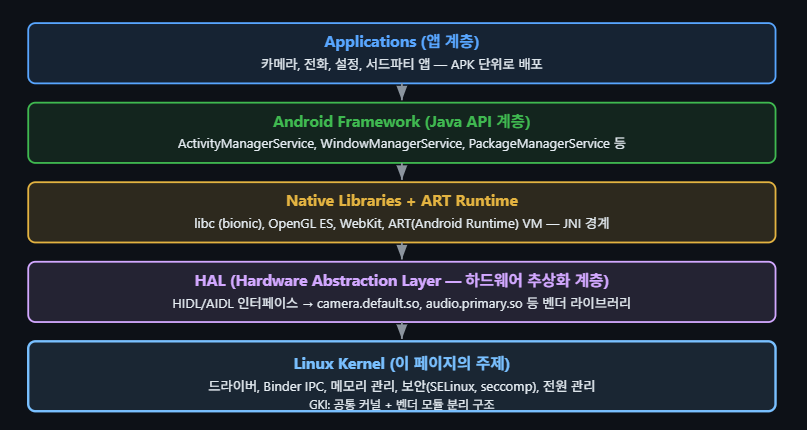

```
예시:
① 카메라 앱
    │
    ▼
② Android Framework
   (CameraManager)
    │
    ▼
③ Native Library
   (필요 시 이미지 처리, JNI 등)
    │
    ▼
④ HAL
   (camera.default.so)
    │
    ▼
⑤ Linux Kernel
   (카메라 드라이버)
    │
    ▼
카메라 센서(하드웨어)
```

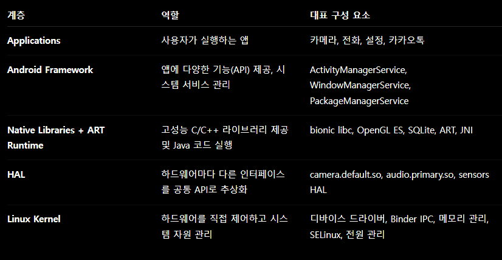

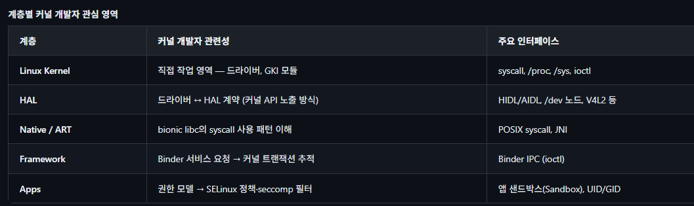

### 업스트리밍 역사
Android가 독자적으로 유지하던 커널 기능들은 점진적으로 메인라인 Linux에 통합되거나 대체되었습니다.

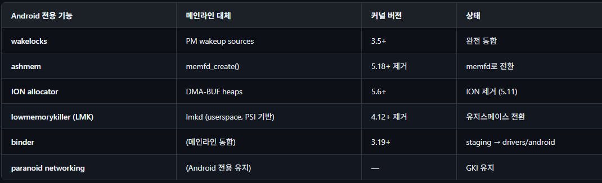

### Android 버전별 커널 매핑(Mapping)
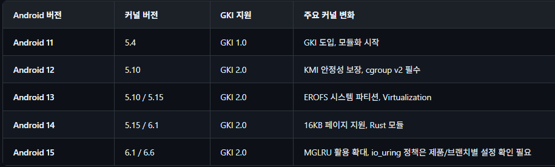

# GKI(Generic Kernel Image)
GKI는 Android 기기의 커널 파편화(Fragmentation) 문제를 해결하기 위한 Google의 전략입니다. `단일 커널 바이너리(GKI 커널)`가 모든 ARM64 디바이스에서 부팅되고, 벤더별 하드웨어 지원은 `로드 가능한 모듈`로 분리됩니다.

### GKI 등장 배경 — 커널 파편화 문제
GKI 이전 Android 생태계에서는 SoC 벤더(Qualcomm, MediaTek 등)마다 메인라인에서 수백~수천 개의 패치를 추가한 벤더 커널을 각기 유지했습니다. 이 구조는 세 가지 심각한 문제를 낳았습니다.

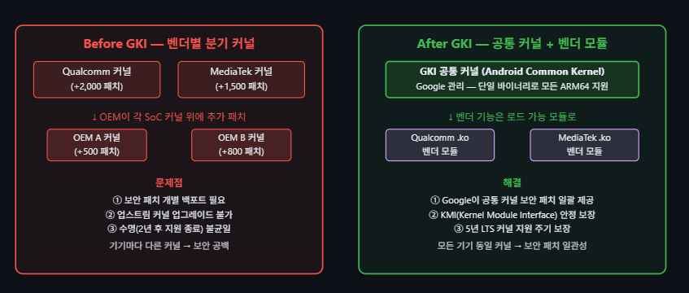

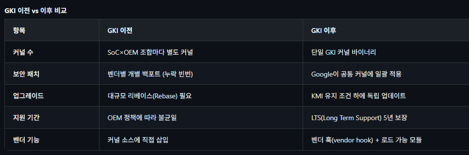

## GKI 아키텍처
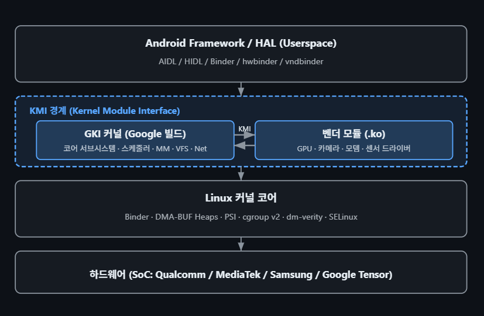

`GKI 2.0 (Android 13+)`: GKI 1.0은 Android 11(커널 5.4)에 도입되었고, GKI 2.0은 Android 13(커널 5.10/5.15)부터 본격 적용되었습니다. GKI 2.0에서는 `벤더 확장을 가능한 한 로드 가능 모듈 형태로 분리해 KMI 경계를 지키는 방향`이 권장됩니다. KMI 심볼 리스트에 없는 커널 함수는 일반적으로 모듈에서 호출할 수 없습니다.

### KMI (Kernel Module Interface)
KMI: 벤더 모듈이 GKI 커널에서 `어떤 함수와 전역 데이터를 사용할 수 있는지 정한 인터페이스`

KMI는 GKI 커널이 벤더 모듈에 제공하는 안정적인 심볼 집합입니다. `LTS 커널의 수명 동안 KMI ABI가 유지되어`, 벤더 모듈을 GKI 커널과 독립적으로 업데이트할 수 있습니다.

```BASH
/* KMI 심볼 리스트 예시 (abi_gki_aarch64) */
/* 이 파일에 등록된 심볼만 벤더 모듈에서 사용 가능 */
[abi_symbol_list]
  alloc_chrdev_region
  __alloc_pages
  cdev_add
  class_create
  dma_buf_export
  device_register
  module_layout
  ...

/* ABI 모니터링: abigail 도구로 변경 감지 */
$ stgdiff --abi abi_prev.xml abi_curr.xml
```

### 커널 브랜치 구조
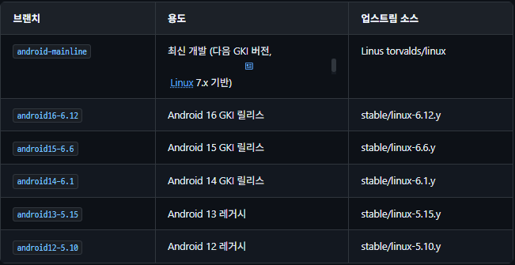

`android<Android 세대>-<Linux LTS 버전>`

### Bazel(Kleaf) 빌드 시스템(Build System)
GKI 커널은 전통적인 make 대신 Bazel(Kleaf)로 빌드합니다. Kleaf는 재현 가능한 빌드를 보장하고, 벤더 모듈과 GKI 커널을 별도로 빌드·결합할 수 있게 합니다. 

* Bazel: Bazel은 Google이 만든 범용 빌드 시스템(kbuild,make을 내부적으로는 쓰지만 상위 제어를 이걸로 함)
* Kleaf: Kleaf는 Android 커널을 Bazel로 빌드하기 위한 Bazel 규칙과 도구 모음

```BASH
# GKI 커널 빌드 (Bazel/Kleaf)
$ tools/bazel run //common:kernel_aarch64_dist -- --dist_dir=out/dist

# 벤더 모듈 빌드 (예: Pixel)
$ tools/bazel run //private/google-modules/soc/gs:slider_dist -- --dist_dir=out/dist

# gki_defconfig 기반 설정
$ tools/bazel run //common:kernel_aarch64_config -- menuconfig
```

## Binder IPC
Binder는 Android의 핵심 IPC 메커니즘으로, `프로세스 간 단일 복사(single-copy) 데이터 전송`, 호출자 PID/UID 추적, 참조 카운팅 기반 객체 수명 관리, 사망 통지(death notification) 기능을 제공합니다. 커널 드라이버 `drivers/android/binder.c`가 핵심 구현입니다.

### 왜 Unix IPC가 아닌 Binder인가?
Linux에는 이미 pipe, socket, shared memory 등 다양한 IPC 메커니즘이 있습니다. Android가 이를 쓰지 않고 별도 Binder 드라이버를 구현한 이유는 모바일 환경의 세 가지 요구사항 때문입니다.

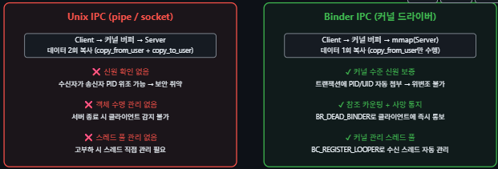

일반 socket에서는 상대가 자신이 누구라고 주장하는 데이터를 메시지 안에 넣을 수 있다.
하지만 메시지 내용은 송신자가 만든 것이기 때문에 그대로 신뢰하면 안됨.
Binder에서는 커널 드라이버가 실제 트랜잭션을 보낸 프로세스의 PID와 UID를 알고 있다.

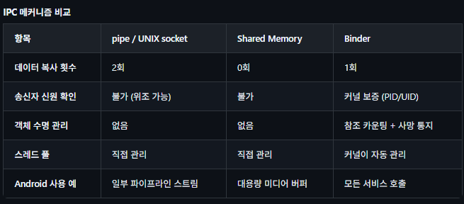

단일 복사의 원리: Binder는 수신 프로세스의 `mmap()` 영역을 커널 버퍼와 직접 매핑합니다. 송신자 데이터를 `copy_from_user()`로 커널 버퍼에 1회 복사하면, 수신자는 별도 `copy_to_user()` 없이 같은 물리(Physical) 페이지를 읽습니다.

```
클라이언트 프로세스
        ↓ Binder 요청
커널 Binder 드라이버
        ↓ 기존 서버 스레드를 깨움
서버 프로세스의 Binder 스레드
        ↓
서비스 함수 실행
```

## Binder 핵심 특성
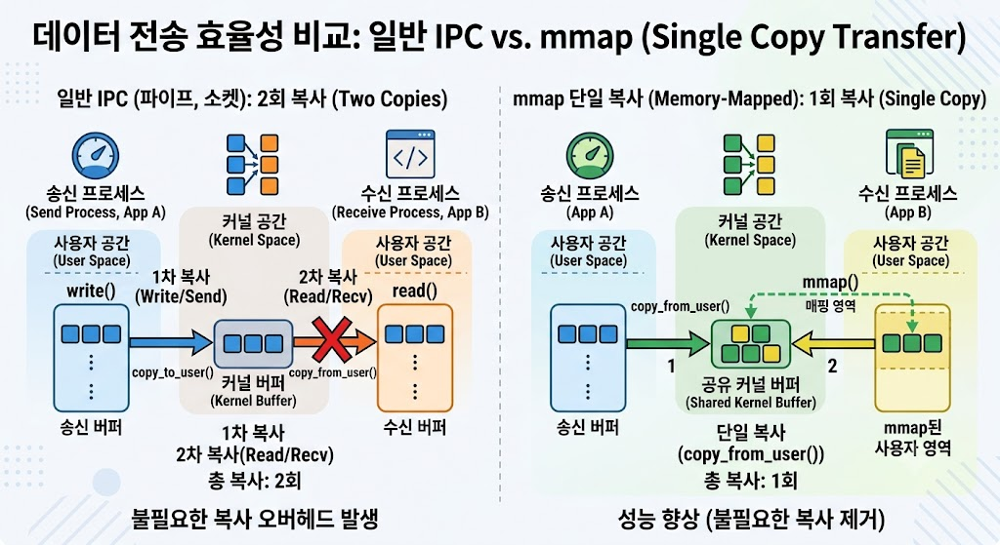

- 단일 복사 전송: 송신 측 데이터를 copy_from_user()로 커널 버퍼(Buffer)에 복사한 뒤, 수신 측의 mmap()된 영역에 직접 매핑 — 일반 IPC(pipe, socket)의 2회 복사 대비 효율적
- 프로세스 ID 추적: 커널이 트랜잭션(Transaction)에 송신자의 PID/UID를 자동 첨부 — 위변조 불가능한 인증
- 참조 카운팅: binder_ref / binder_node로 원격 객체의 수명을 자동 관리
- 사망 통지: 서버 프로세스가 종료되면 BR_DEAD_BINDER로 클라이언트에 즉시 통지

### Binder 트랜잭션 흐름
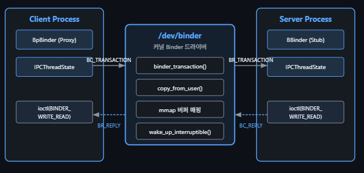

클라이언트가 Binder 요청을 보내고, 서버가 처리한 뒤 응답을 돌려주는 전체 흐름
```
1. 클라이언트가 Proxy 함수 호출
2. BpBinder가 Binder 트랜잭션 생성
3. IPCThreadState가 BC_TRANSACTION 준비
4. ioctl(BINDER_WRITE_READ)로 커널에 전달
5. Binder 드라이버가 대상 서버를 찾음
6. copy_from_user()로 데이터 복사
7. 서버 Binder 버퍼에 트랜잭션 배치
8. 대기 중인 서버 스레드를 깨움
9. 서버가 BR_TRANSACTION 수신
10. BBinder 또는 Stub이 실제 함수 실행
11. 서버가 BC_REPLY 전송
12. 커널이 클라이언트에 BR_REPLY 전달
13. 클라이언트가 결과를 받아 함수 호출 종료
```
```
클라이언트 측: Proxy
서버 측:      Stub

```
- BpBinder: Binder Proxy로 직접 드라이버를 다루는게 아니라 이걸로 Binder 드라이버를 다룬다. 일반 함수처럼 보이지만 내부적으로 Binder 트랜잭션으로 바꾼다.
- IPCThreadState: 현재 스레드의 Binder 통신 상태를 관리하는 사용자 공간 객체이다. 스레드별 Binder 명령과 ioctl 통신 관리를 한다.
- BC_TRANSACTION: 클라이언트가 커널에 요청 전송함.
- BR_TRANSACTION: 커널이 서버에 요청 도착 통지
- BBinder: 서버의 실제 Binder 객체 또는 Stub 기반
- BC_REPLY: 서버가 커널에 응답 전송
- BR_REPLY: 커널이 클라이언트에 응답 전달
- BBinder: Binder 서버 객체의 공통 기반 클래스
- Stub: 특정 AIDL 인터페이스 요청을 실제 함수 호출로 변환하는 서버 측 코드

### 예시
```c
//클라이언트가 이 함수를 호출했다 가정.
calculator.add(3, 5);
```

```
1. Proxy.add(3, 5) 호출
2. Proxy가 Parcel 생성
   data = [3, 5]
3. Proxy가 transaction code 전송
   code = TRANSACTION_add
4. Binder 드라이버가 서버로 전달
5. 서버 Stub.onTransact() 실행
6. Stub이 code 확인
   TRANSACTION_add
7. Stub이 Parcel에서 3, 5를 읽음
8. 실제 CalculatorService.add(3, 5) 호출
9. 결과 8을 reply Parcel에 기록
10. Binder가 reply를 클라이언트로 전달
11. Proxy가 8을 읽어 호출자에게 반환
```

### 핵심 자료구조
```c
/* drivers/android/binder_internal.h */
/* 각 프로세스가 /dev/binder를 open()하면 생성 */
struct binder_proc {
    struct hlist_node     proc_node;     /* 전역 프로세스 리스트 */
    struct rb_root        threads;       /* binder_thread RB-tree */
    struct rb_root        nodes;         /* binder_node RB-tree (서버 객체) */
    struct rb_root        refs_by_desc;  /* binder_ref (핸들→노드 매핑) */
    struct rb_root        refs_by_node;
    struct list_head     todo;          /* 처리 대기 작업 큐 */
    struct binder_alloc  alloc;         /* mmap 버퍼 관리 */
    pid_t                pid;
    struct task_struct   *tsk;
    ...
};
/* 단일 Binder 트랜잭션 */
struct binder_transaction {
    struct binder_work        work;
    struct binder_thread      *from;         /* 송신 스레드 */
    struct binder_proc        *to_proc;      /* 수신 프로세스 */
    struct binder_thread      *to_thread;    /* 수신 스레드 */
    struct binder_buffer      *buffer;       /* 데이터 버퍼 */
    unsigned int              code;          /* 트랜잭션 코드 */
    unsigned int              flags;
    struct binder_priority    priority;      /* 우선순위 상속 */
    kuid_t                    sender_euid;   /* 송신자 UID */
    ...
};
/* Binder 서비스 객체 (서버 측) */
struct binder_node {
    struct binder_work     work;
    struct rb_node         rb_node;       /* proc->nodes 트리 */
    struct hlist_head      refs;          /* 이 노드를 참조하는 binder_ref 목록 */
    binder_uintptr_t       ptr;           /* 유저스페이스 객체 포인터 */
    binder_uintptr_t       cookie;
    bool                   has_strong_ref;
    bool                   has_weak_ref;
    ...
};
```

### Binder 프로토콜
