# Android 커널
Android GKI 아키텍처, Binder IPC, 메모리 관리(Memory Management)(ashmem/lmkd), HAL 인터페이스, SELinux 정책, 부팅 과정(Boot Process), 프로세스(Process) 모델, 스토리지, 커널 디버깅(Debugging)과 보안까지 Android 플랫폼의 커널 레벨 종합 가이드.

## 핵심 요약
- GKI(Generic Kernel Image) — 공통 커널 이미지와 벤더 모듈을 분리하여 Android 기기 간 커널 파편화를 해소합니다.
- Binder IPC — Android의 핵심 프로세스 간 통신 메커니즘으로, 커널 드라이버(/dev/binder)가 직렬화(Serialization)·트랜잭션(Transaction)을 처리합니다.
- HAL(Hardware Abstraction Layer) — 커널 드라이버와 Android 프레임워크 사이의 인터페이스 계층으로, HIDL/AIDL을 통해 안정적 ABI를 보장합니다.
- Android 부팅 과정 — 부트로더(Bootloader) → 커널 → init → Zygote 순서로 진행되며, dm-verity/AVB가 무결성(Integrity)을 검증합니다.
- Android SELinux — 모든 프로세스와 파일에 보안 레이블을 부여하는 강제 접근 제어(MAC) 정책으로, Android 보안의 핵심입니다.
- LMKD/메모리 관리 — PSI(Pressure Stall Information) 기반 유저스페이스 메모리 킬러와 DMA-BUF 힙으로 Android 메모리를 관리합니다.
- pKVM(Protected KVM) — Android 가상화(Virtualization) 프레임워크로, 호스트 커널로부터도 게스트 메모리를 보호하는 기밀 컴퓨팅(Confidential Computing)을 제공합니다.

## 단계별 이해
1. 메인라인과 Android 커널 차이 파악 — Android가 Linux 메인라인에서 분기한 역사와 GKI 통합 과정을 먼저 이해합니다.
```
wakelocks, ashmem, ION 등 Android 전용 기능이 어떻게 메인라인에 통합되거나 대체되었는지 흐름을 따라가면 현재 구조를 파악할 수 있습니다.
왜? Android 커널이 메인라인과 별도 기능을 유지할 때마다 업스트림 보안 패치를 수동으로 백포트(backport)해야 하는 비용이 누적됩니다. 이 역사를 이해하면 GKI 구조의 동기가 명확해지고, 벤더 커널이 수백 개의 out-of-tree 패치를 갖게 된 이유를 납득할 수 있습니다.

* wakelock: 스마트폰이 함부로 절전 상태에 들어가지 못하게 막는 기능(백그라운드에서 CPU 실행을 위함)
* ashmem: Anonymous Shared Memory의 약자로, 프로세스들이 메모리를 공유하기 위한 Android 전용 방식
* ION 메모리 관리자: 카메라, GPU, 디스플레이 등 하드웨어 장치 간에 효율적인 메모리 공유와 할당을 담당하던 커널 프레임워크(서로 가상 주소가 다르니..)
```
2. GKI 아키텍처와 모듈 구조 학습 — 공통 커널 이미지(GKI)와 벤더 모듈 분리 구조, KMI(Kernel Module Interface) 안정성 보장 메커니즘을 학습합니다.
```
gki_defconfig로 공통 설정을 빌드하고, 벤더 훅(vendor hook)으로 SoC별 기능을 주입하는 방식을 실습합니다.
왜? 벤더 드라이버가 커널 내부 심볼에 직접 의존하면 커널 업그레이드 시 모든 드라이버를 재컴파일해야 합니다. KMI로 안정적인 인터페이스를 정의하면 벤더가 GKI 커널 버전과 독립적으로 드라이버를 배포할 수 있어 OTA(Over-The-Air) 업데이트 주기를 단축할 수 있습니다.
```

3. Binder IPC 동작 원리 분석 — ioctl() 기반 트랜잭션 흐름, BC_/BR_ 프로토콜, 공유 메모리 매핑(Mapping) 구조를 코드 수준에서 추적합니다.
```
adb shell service list와 /sys/kernel/debug/binder/를 통해 실제 바인더 통신을 관찰합니다.
왜? Android의 모든 서비스 호출(Camera, Audio, Wi-Fi 등)이 Binder를 통해 이루어집니다. Binder를 이해하지 않으면 시스템 서비스 지연(latency)이나 ANR(Application Not Responding) 문제의 원인을 커널 수준에서 추적할 수 없습니다.
```
4. 부팅·보안·메모리 서브시스템 연결 — dm-verity/AVB 부팅 검증, SELinux 정책 적용, LMKD 메모리 관리가 커널 수준에서 어떻게 연동되는지 통합 관점으로 분석합니다.
```
각 서브시스템의 커널 로그(dmesg)와 sysfs 인터페이스를 교차 확인하며 전체 그림을 완성합니다.
왜? 실제 제품에서 발생하는 문제는 대부분 서브시스템 경계에서 생깁니다. SELinux 정책 오류가 dm-verity 실패로 나타나거나, LMKD 설정 오류가 부팅 루프를 유발하는 등 통합 시각 없이는 원인 파악이 어렵습니다.
```
5. VTS/CTS로 호환성 검증 — GKI 호환성 테스트(VTS)와 Android 호환성 테스트(CTS)를 실행하여 커널 변경이 Android 플랫폼 요구사항을 충족하는지 확인합니다.
```Android CDD(Compatibility Definition Document)를 기준으로 커널 설정과 ABI 안정성을 점검합니다.
왜? GKI 호환성 요구사항을 충족하지 않으면 Android 인증을 받을 수 없어 Google Play Store 접근이 불가능합니다. VTS/CTS는 단순 테스트가 아닌 제품 출시의 관문입니다.
```

# Android 커널 개요
Android는 Linux 커널을 기반으로 하는 모바일/임베디드 운영체제입니다. 초기에는 메인라인 커널에서 크게 `분기(fork)`하여 다수의 `out-of-tree 패치(Patch)`를 유지했으나, Google의 지속적인 업스트리밍 노력으로 `GKI(Generic Kernel Image) 시대에는 메인라인과의 차이가 크게 줄었습니다.`

* out-of-tree 패치: 새 Linux 커널 + Android 패치들

## Android 소프트웨어 스택 구조
Android는 `5계층`으로 구성된 소프트웨어 스택입니다. 각 계층은 명확한 인터페이스를 통해 상위·하위 계층과 통신하며, `커널 개발자는 가장 아래 두 계층(HAL + 커널)을 주로 다룹니다.`


```
예시:
① 카메라 앱
    │
    ▼
② Android Framework
   (CameraManager)
    │
    ▼
③ Native Library
   (필요 시 이미지 처리, JNI 등)
    │
    ▼
④ HAL
   (camera.default.so)
    │
    ▼
⑤ Linux Kernel
   (카메라 드라이버)
    │
    ▼
카메라 센서(하드웨어)
```


### 업스트리밍 역사
Android가 독자적으로 유지하던 커널 기능들은 점진적으로 메인라인 Linux에 통합되거나 대체되었습니다.


### Android 버전별 커널 매핑(Mapping)


# GKI(Generic Kernel Image)
GKI는 Android 기기의 커널 파편화(Fragmentation) 문제를 해결하기 위한 Google의 전략입니다. `단일 커널 바이너리(GKI 커널)`가 모든 ARM64 디바이스에서 부팅되고, 벤더별 하드웨어 지원은 `로드 가능한 모듈`로 분리됩니다.

### GKI 등장 배경 — 커널 파편화 문제
GKI 이전 Android 생태계에서는 SoC 벤더(Qualcomm, MediaTek 등)마다 메인라인에서 수백~수천 개의 패치를 추가한 벤더 커널을 각기 유지했습니다. 이 구조는 세 가지 심각한 문제를 낳았습니다.


## GKI 아키텍처


`GKI 2.0 (Android 13+)`: GKI 1.0은 Android 11(커널 5.4)에 도입되었고, GKI 2.0은 Android 13(커널 5.10/5.15)부터 본격 적용되었습니다. GKI 2.0에서는 `벤더 확장을 가능한 한 로드 가능 모듈 형태로 분리해 KMI 경계를 지키는 방향`이 권장됩니다. KMI 심볼 리스트에 없는 커널 함수는 일반적으로 모듈에서 호출할 수 없습니다.

### KMI (Kernel Module Interface)
KMI: 벤더 모듈이 GKI 커널에서 `어떤 함수와 전역 데이터를 사용할 수 있는지 정한 인터페이스`

KMI는 GKI 커널이 벤더 모듈에 제공하는 안정적인 심볼 집합입니다. `LTS 커널의 수명 동안 KMI ABI가 유지되어`, 벤더 모듈을 GKI 커널과 독립적으로 업데이트할 수 있습니다.

```BASH
/* KMI 심볼 리스트 예시 (abi_gki_aarch64) */
/* 이 파일에 등록된 심볼만 벤더 모듈에서 사용 가능 */
[abi_symbol_list]
  alloc_chrdev_region
  __alloc_pages
  cdev_add
  class_create
  dma_buf_export
  device_register
  module_layout
  ...

/* ABI 모니터링: abigail 도구로 변경 감지 */
$ stgdiff --abi abi_prev.xml abi_curr.xml
```

### 커널 브랜치 구조


`android<Android 세대>-<Linux LTS 버전>`

### Bazel(Kleaf) 빌드 시스템(Build System)
GKI 커널은 전통적인 make 대신 Bazel(Kleaf)로 빌드합니다. Kleaf는 재현 가능한 빌드를 보장하고, 벤더 모듈과 GKI 커널을 별도로 빌드·결합할 수 있게 합니다. 

* Bazel: Bazel은 Google이 만든 범용 빌드 시스템(kbuild,make을 내부적으로는 쓰지만 상위 제어를 이걸로 함)
* Kleaf: Kleaf는 Android 커널을 Bazel로 빌드하기 위한 Bazel 규칙과 도구 모음

```BASH
# GKI 커널 빌드 (Bazel/Kleaf)
$ tools/bazel run //common:kernel_aarch64_dist -- --dist_dir=out/dist

# 벤더 모듈 빌드 (예: Pixel)
$ tools/bazel run //private/google-modules/soc/gs:slider_dist -- --dist_dir=out/dist

# gki_defconfig 기반 설정
$ tools/bazel run //common:kernel_aarch64_config -- menuconfig
```

## Binder IPC
Binder는 Android의 핵심 IPC 메커니즘으로, `프로세스 간 단일 복사(single-copy) 데이터 전송`, 호출자 PID/UID 추적, 참조 카운팅 기반 객체 수명 관리, 사망 통지(death notification) 기능을 제공합니다. 커널 드라이버 `drivers/android/binder.c`가 핵심 구현입니다.

### 왜 Unix IPC가 아닌 Binder인가?
Linux에는 이미 pipe, socket, shared memory 등 다양한 IPC 메커니즘이 있습니다. Android가 이를 쓰지 않고 별도 Binder 드라이버를 구현한 이유는 모바일 환경의 세 가지 요구사항 때문입니다.


일반 socket에서는 상대가 자신이 누구라고 주장하는 데이터를 메시지 안에 넣을 수 있다.
하지만 메시지 내용은 송신자가 만든 것이기 때문에 그대로 신뢰하면 안됨.
Binder에서는 커널 드라이버가 실제 트랜잭션을 보낸 프로세스의 PID와 UID를 알고 있다.


단일 복사의 원리: Binder는 수신 프로세스의 `mmap()` 영역을 커널 버퍼와 직접 매핑합니다. 송신자 데이터를 `copy_from_user()`로 커널 버퍼에 1회 복사하면, 수신자는 별도 `copy_to_user()` 없이 같은 물리(Physical) 페이지를 읽습니다.

```
클라이언트 프로세스
        ↓ Binder 요청
커널 Binder 드라이버
        ↓ 기존 서버 스레드를 깨움
서버 프로세스의 Binder 스레드
        ↓
서비스 함수 실행
```

## Binder 핵심 특성


- 단일 복사 전송: 송신 측 데이터를 copy_from_user()로 커널 버퍼(Buffer)에 복사한 뒤, 수신 측의 mmap()된 영역에 직접 매핑 — 일반 IPC(pipe, socket)의 2회 복사 대비 효율적
- 프로세스 ID 추적: 커널이 트랜잭션(Transaction)에 송신자의 PID/UID를 자동 첨부 — 위변조 불가능한 인증
- 참조 카운팅: binder_ref / binder_node로 원격 객체의 수명을 자동 관리
- 사망 통지: 서버 프로세스가 종료되면 BR_DEAD_BINDER로 클라이언트에 즉시 통지

### Binder 트랜잭션 흐름


클라이언트가 Binder 요청을 보내고, 서버가 처리한 뒤 응답을 돌려주는 전체 흐름
```
1. 클라이언트가 Proxy 함수 호출
2. BpBinder가 Binder 트랜잭션 생성
3. IPCThreadState가 BC_TRANSACTION 준비
4. ioctl(BINDER_WRITE_READ)로 커널에 전달
5. Binder 드라이버가 대상 서버를 찾음
6. copy_from_user()로 데이터 복사
7. 서버 Binder 버퍼에 트랜잭션 배치
8. 대기 중인 서버 스레드를 깨움
9. 서버가 BR_TRANSACTION 수신
10. BBinder 또는 Stub이 실제 함수 실행
11. 서버가 BC_REPLY 전송
12. 커널이 클라이언트에 BR_REPLY 전달
13. 클라이언트가 결과를 받아 함수 호출 종료
```
```
클라이언트 측: Proxy
서버 측:      Stub

```
- BpBinder: Binder Proxy로 직접 드라이버를 다루는게 아니라 이걸로 Binder 드라이버를 다룬다. 일반 함수처럼 보이지만 내부적으로 Binder 트랜잭션으로 바꾼다.
- IPCThreadState: 현재 스레드의 Binder 통신 상태를 관리하는 사용자 공간 객체이다. 스레드별 Binder 명령과 ioctl 통신 관리를 한다.
- BC_TRANSACTION: 클라이언트가 커널에 요청 전송함.
- BR_TRANSACTION: 커널이 서버에 요청 도착 통지
- BBinder: 서버의 실제 Binder 객체 또는 Stub 기반
- BC_REPLY: 서버가 커널에 응답 전송
- BR_REPLY: 커널이 클라이언트에 응답 전달
- BBinder: Binder 서버 객체의 공통 기반 클래스
- Stub: 특정 AIDL 인터페이스 요청을 실제 함수 호출로 변환하는 서버 측 코드

### 예시
```c
//클라이언트가 이 함수를 호출했다 가정.
calculator.add(3, 5);
```

```
1. Proxy.add(3, 5) 호출
2. Proxy가 Parcel 생성
   data = [3, 5]
3. Proxy가 transaction code 전송
   code = TRANSACTION_add
4. Binder 드라이버가 서버로 전달
5. 서버 Stub.onTransact() 실행
6. Stub이 code 확인
   TRANSACTION_add
7. Stub이 Parcel에서 3, 5를 읽음
8. 실제 CalculatorService.add(3, 5) 호출
9. 결과 8을 reply Parcel에 기록
10. Binder가 reply를 클라이언트로 전달
11. Proxy가 8을 읽어 호출자에게 반환
```

### 핵심 자료구조
```c
/* drivers/android/binder_internal.h */
/* 각 프로세스가 /dev/binder를 open()하면 생성 */
struct binder_proc {
    struct hlist_node     proc_node;     /* 전역 프로세스 리스트 */
    struct rb_root        threads;       /* binder_thread RB-tree */
    struct rb_root        nodes;         /* binder_node RB-tree (서버 객체) */
    struct rb_root        refs_by_desc;  /* binder_ref (핸들→노드 매핑) */
    struct rb_root        refs_by_node;
    struct list_head     todo;          /* 처리 대기 작업 큐 */
    struct binder_alloc  alloc;         /* mmap 버퍼 관리 */
    pid_t                pid;
    struct task_struct   *tsk;
    ...
};

/* 단일 Binder 트랜잭션 */
struct binder_transaction {
    struct binder_work        work;
    struct binder_thread      *from;         /* 송신 스레드 */
    struct binder_proc        *to_proc;      /* 수신 프로세스 */
    struct binder_thread      *to_thread;    /* 수신 스레드 */
    struct binder_buffer      *buffer;       /* 데이터 버퍼 */
    unsigned int              code;          /* 트랜잭션 코드 */
    unsigned int              flags;
    struct binder_priority    priority;      /* 우선순위 상속 */
    kuid_t                    sender_euid;   /* 송신자 UID */
    ...
};

/* Binder 서비스 객체 (서버 측) */
struct binder_node {
    struct binder_work     work;
    struct rb_node         rb_node;       /* proc->nodes 트리 */
    struct hlist_head      refs;          /* 이 노드를 참조하는 binder_ref 목록 */
    binder_uintptr_t       ptr;           /* 유저스페이스 객체 포인터 */
    binder_uintptr_t       cookie;
    bool                   has_strong_ref;
    bool                   has_weak_ref;
    ...
};
```

- binder_proc: 프로세스 하나를 관리, Binder를 쓰는 프로세스마다 하나씩 만듬.
- binder_thread: Binder 요청을 처리하는 스레드 관리
- binder_node: 서버 객체(BBinder)를 커널에서 표현
- binder_transaction: 한 번의 함수 호출 요청 자체

```
[ User Space ]
  (Client: 카메라 앱)                                   (Server: 카메라 서비스)
         |                                                    ^
         | ioctl() 호출                                       | 깨어남 (Wake up)
=========|====================================================|====================
[ Kernel Space : 바인더 드라이버 ]                              |
         |                                                    |
         v                                                    |
 +-----------------------+                            +-----------------------+
 |   binder_proc (앱)    |                            | binder_proc (서비스)  |
 |-----------------------|                            |-----------------------|
 | pid: 1024             |       (3) 타겟 프로세스      | pid: 500              |
 | tsk: 카메라 앱 task    |------------------------->  | alloc: 1-Copy 버퍼공간  |
 |                       |                            | nodes: [RB-Tree]      |
 +-----------------------+                            +-----------|-----------+
         |                                                        | (2) 서비스 객체
         | (1) 트랜잭션 생성                                      v
         v                                            +-----------------------+
 +-----------------------+      (4) 목적지 노드         |   binder_node (카메라)|
 |  binder_transaction   | -------------------------> |-----------------------|
 |-----------------------|                            | ptr: 0x7F88.. (유저)  |
 | from: 앱의 thread      |                            | cookie: 서비스 식별자 |
 | to_proc: 서비스 proc   |      (5) 데이터 전달         | has_strong_ref: true  |
 | buffer: "takePicture" | -------------------------> |                       |
 +-----------------------+                            +-----------------------+
 ```

1. 카메라 앱(Client)이 카메라를 켜달라고 요청합니다.
2. 커널은 `binder_transaction` 객체를 하나 생성합니다.
3. 커널은 카메라 서비스(Server)의 `binder_proc`을 찾고, 그 안에 등록된 카메라 서비스 `binder_node`를 목적지로 설정합니다.
4. 전송할 데이터(Parcel)를 `Server`의 `binder_proc->alloc`이 관리하는 버퍼에 1-Copy로 복사한 뒤, 이 버퍼의 `포인터`를 `binder_transaction의 buffer에 연결`합니다.
5. 서버의 스레드가 깨어나면 `todo 큐`에서 이 트랜잭션을 꺼내어 `ptr`에 적힌 유저 공간 주소를 보고 실제 `카메라 제어 코드`를 실행합니다.

### Binder 프로토콜
Binder는 `ioctl(BINDER_WRITE_READ)`를 통해 커널과 유저스페이스 간 명령/응답을 교환합니다. 명령은 `BC_*(유저→커널)`, 응답은 `BR_*(커널→유저)` 접두사를 사용합니다.
응답 교환은 모두 `binder_transaction`으로 사용합니다.

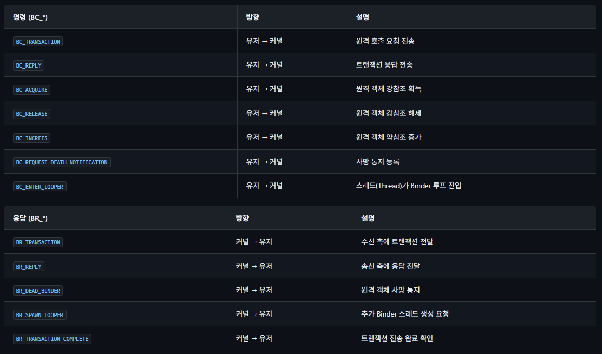

### mmap 버퍼와 단일 복사
주의 — 1MB 버퍼 제한: Binder 드라이버는 프로세스당 최대 `약 1MB`(1048576 - 4096 × 2 바이트)의 mmap 버퍼를 할당합니다. 대용량 데이터 전송 시에는 `ashmem/memfd를 파일 디스크립터(File Descriptor)로 전달하여 별도 공유 메모리를 사용`해야 합니다.

```c
/* Binder mmap — 수신 프로세스가 /dev/binder를 mmap() */
/* ProcessState.cpp (Android libbinder) */
#define BINDER_VM_SIZE  ((1 * 1024 * 1024) - sysconf(_SC_PAGE_SIZE) * 2)
void *vm = mmap(NULL, BINDER_VM_SIZE,
              PROT_READ, MAP_PRIVATE | MAP_NORESERVE,
              binder_fd, 0);

/* 단일 복사 메커니즘:
 * 1. 송신: copy_from_user()로 유저 데이터 → 커널 binder_buffer
 * 2. 커널이 binder_buffer의 물리 페이지를 수신 측 mmap 영역에 매핑
 * 3. 수신: mmap된 가상 주소에서 직접 데이터 접근 (추가 복사 없음) */
```

### binder_ioctl() 핵심 흐름
Binder 드라이버의 모든 통신은 `binder_ioctl()` 함수를 통해 이루어집니다. 가장 중요한 `BINDER_WRITE_READ` 명령의 처리 흐름을 살펴봅니다.

```c
/* drivers/android/binder.c — binder_ioctl() 핵심 흐름 */
static long binder_ioctl(
    struct file *filp,
    unsigned int cmd,
    unsigned long arg)
{
    struct binder_proc *proc = filp->private_data;
    struct binder_thread *thread;
    /* 현재 스레드의 binder_thread 가져오기/생성 */
    thread = binder_get_thread(proc);
    switch (cmd) {
    case BINDER_WRITE_READ:
        /* 쓰기 버퍼 처리: BC_* 명령 순차 실행 */
        if (bwr.write_size > 0)
            binder_thread_write(proc, thread,
                bwr.write_buffer, bwr.write_size,
                &bwr.write_consumed);
        /* 읽기 버퍼 처리: BR_* 응답 대기/수신 */
        if (bwr.read_size > 0)
            binder_thread_read(proc, thread,
                bwr.read_buffer, bwr.read_size,
                &bwr.read_consumed,
                filp->f_flags & O_NONBLOCK);
        break;
    case BINDER_SET_MAX_THREADS:
        /* Binder 스레드 풀 최대 크기 설정 */
        proc->max_threads = arg;
        break;
    case BINDER_VERSION:
        /* 드라이버 프로토콜 버전 반환 */
        break;
    }
    return 0;
}
/* binder_thread_write(): BC_TRANSACTION 처리 시 */
/* 1. binder_transaction() 호출 */
/* 2. 대상 프로세스의 binder_buffer 할당 (mmap 영역) */
/* 3. copy_from_user()로 데이터 복사 */
/* 4. flat_binder_object 변환 (fd/binder 참조) */
/* 5. 대상 스레드/프로세스 todo 리스트에 작업 추가 */
/* 6. wake_up_interruptible()로 대상 깨우기 */
```

**Binder 스레드 풀**: 각 프로세스는 `BINDER_SET_MAX_THREADS`로 설정한 수만큼의 Binder 스레드를 유지합니다. 모든 스레드가 트랜잭션 처리 중이면 커널이 `BR_SPAWN_LOOPER`를 보내 추가 스레드 생성을 요청합니다. Android의 기본 최대 스레드 수는 15입니다 (`ProcessState.cpp`에서 설정).

### Binder 디바이스 노드
Android는 보안 도메인 분리를 위해 3개의 Binder 디바이스를 사용합니다. Android 10+에서는 binderfs를 통해 동적으로 디바이스를 생성할 수 있습니다.

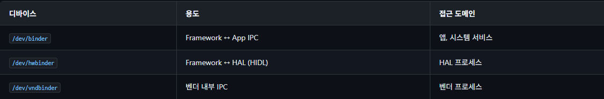

/dev/null,/dev/random,/dev/input/event0,/dev/binder 모두 커널 드라이버로 들어가는 입구다.
안에 ls -l 치면 `c`rw-rw-rw- 1 root root 511, 0 binder 이렇게 뜨는데 앞의 c가 장치 파일이라는 얘기다.

```BASH
/* binderfs 마운트 (Android 10+) */
# /dev/binderfs에 마운트하고 디바이스 동적 생성
$ mount -t binder binder /dev/binderfs
$ ls /dev/binderfs/
binder  hwbinder  vndbinder  binder-control

/* 커널 설정 */
CONFIG_ANDROID_BINDERFS=y
```

# Android 메모리 관리 커널 기법

## ashmem → memfd_create 전환
`ashmem(Anonymous Shared Memory)`은 Android 초기부터 사용된 공유 메모리 메커니즘으로, `파일 디스크립터 기반 공유`와 `ASHMEM_SET_PROT_MASK`로 권한 축소가 가능했습니다. 메인라인에서는 주로 `memfd_create()` 기반 경로(필요 시 sealing 조합)로 전환되었습니다.

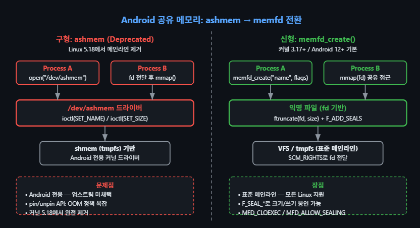
1. 구형: ashmem (과거 안드로이드 전용 방식)
작동 방식

1. 프로세스 A가 /dev/ashmem이라는 특수한 장치 파일을 open()하여 파일 디스크립터(fd)를 얻습니다.
2. ioctl 시스템 콜을 이용해 이 메모리의 이름과 크기를 설정합니다.
3. 이 fd를 다른 프로세스 B에게 전달하면, 프로세스 B는 이 fd를 가지고 mmap()을 호출하여 동일한 메모리 공간에 접근합니다.

`OOM 관리가 복잡`하고 리눅스 공식 커널에서 `표준으로 받아들인게 아님.`

2. 신형: memfd_create() (리눅스 표준 방식)
작동 방식

1. 안드로이드 12(커널 3.17 이상)부터는 장치 파일을 여는 대신, 리눅스 표준 시스템 콜인 memfd_create()를 직접 호출합니다.
2. 이 함수는 디스크에 저장되지 않는 오직 RAM에만 존재하는 '익명 파일(Anonymous File)'을 만들고 fd를 반환합니다.
3. ftruncate()로 크기를 지정하고, 통신 채널(Unix Domain Socket의 SCM_RIGHTS나 Binder 등)을 통해 fd를 프로세스 B에 넘겨주면 동일하게 mmap()으로 공유합니다.

`표준 + 보안에 좋음`

## lowmemorykiller → lmkd
초기 Android는 커널 내부 `lowmemorykiller 드라이버`로 메모리 부족 시 프로세스를 강제 종료했습니다. 이는 `OOM killer와 충돌`하고 `정책 유연성이 부족`하여, Android 10부터 유저스페이스 `lmkd` 데몬으로 전환되었습니다.

`PSI (Pressure Stall Information)`: 커널이 제공하는 최신 통계 기능(/proc/pressure/memory)을 모니터링합니다. 예를 들어 "시스템이 메모리 부족 때문에 1초 중 70밀리초 이상 버벅이고(stall) 있다" 같은 `실시간 압박 지표`를 감지합니다.

단순히 남은 메모리 양만 보고 자르는 것이 아니라, 시스템이 얼마나 실제로 숨넘어가는지(부하 상태)를 정교하게 측정해 앱을 스마트하게 종료합니다.

```BASH
/* 기존 커널 LMK (drivers/staging/android/lowmemorykiller.c, 제거됨)
 * /sys/module/lowmemorykiller/parameters/ 를 통해 임계값 설정 */

/* 현재: lmkd (userspace) — PSI(Pressure Stall Information) 기반 */
/* lmkd가 /proc/pressure/memory를 모니터링 */
# PSI 메모리 압력 트리거 예시:
# some 70000 1000000  → 1초 동안 70ms 이상 stall 시 이벤트

/* lmkd.rc 설정 */
service lmkd /system/bin/lmkd
    class core
    group root readproc
    capabilities DAC_OVERRIDE KILL IPC_LOCK SYS_NICE SYS_RESOURCE
    writepid /dev/cpuset/system-background/tasks
```

## DMA-BUF Heaps (ION 대체)
초기 Android는 `ION allocator(drivers/staging/android/ion/)`로 GPU·카메라·디스플레이 등 하드웨어 간 공유 버퍼를 할당했습니다. ION은 메인라인에 머물지 못하고 커널 5.6에서 DMA-BUF heaps(drivers/dma-buf/dma-heap.c)로 대체되었으며, ION 코드는 커널 5.11에서 완전 제거되었습니다.

사용 방식
1. 유저스페이스 프로그램(또는 벤더 모듈)이 /dev/dma_heap/system 같은 장치 파일을 open() 합니다.
2. ioctl에 DMA_HEAP_IOCTL_ALLOC 명령과 원하는 크기(len = 4096)를 담아 보냅니다.
3. 커널이 메모리를 할당한 뒤, 그에 대한 파일 디스크립터(fd)를 alloc.fd에 담아 돌려줍니다.

이 fd를 다른 하드웨어 드라이버나 프로세스에 넘겨주면, 메모리 복사 없이 안전하게 하드웨어 간 대용량 데이터 공유가 가능해집니다.
```c
/* drivers/dma-buf/dma-heap.c — DMA-BUF Heap 코어 API */
/* Heap 등록 (벤더 모듈이 호출) */
struct dma_heap *dma_heap_add(
    const struct dma_heap_export_info *exp_info);

/* 유저스페이스 할당 인터페이스 */
/* /dev/dma_heap/<heap_name> 을 open() 후 ioctl()로 버퍼 할당 */
struct dma_heap_allocation_data {
    __u64 len;          /* 요청 크기 */
    __u32 fd;           /* 반환: dma-buf fd */
    __u32 fd_flags;     /* O_CLOEXEC | O_RDWR */
    __u64 heap_flags;   /* 예약 */
};

/* ioctl 호출 */
int fd = open("/dev/dma_heap/system", O_RDWR);
struct dma_heap_allocation_data alloc = {
    .len = 4096,
    .fd_flags = O_CLOEXEC | O_RDWR,
};
ioctl(fd, DMA_HEAP_IOCTL_ALLOC, &alloc);
/* alloc.fd에 dma-buf 파일 디스크립터 반환 */
```

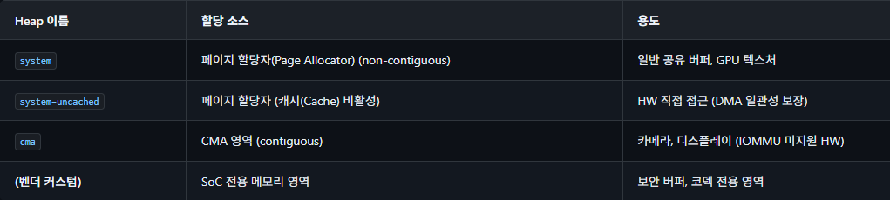

ION vs DMA-BUF Heaps: ION은 단일 /dev/ion 디바이스에서 heap ID로 구분했으나, DMA-BUF heaps는 `/dev/dma_heap/name` 으로 각 heap이 독립 디바이스 노드를 가집니다. 이 설계는 SELinux 정책으로 heap별 접근 제어(Access Control)를 가능하게 하고, 벤더 커스텀 heap을 GKI 모듈로 깔끔하게 분리할 수 있습니다.

### MGLRU와 Android
MGLRU + Android Go: Multi-Gen LRU(MGLRU, 커널 6.1+)는 전통적 active/inactive LRU 대비 페이지 에이징 정확도를 개선합니다. Android 계열 워크로드에서도 메모리 압박 상황에서 재클레임 효율을 높이는 방향으로 활용되고 있습니다. 구체 성능 수치와 기본 활성화 정책은 제품/브랜치별로 달라질 수 있으므로 해당 릴리스 문서를 확인해야 합니다. 관련 내용은 Page Cache — MGLRU 섹션을 참고하십시오.

# Android 부팅 과정 (커널 관점)
## 파티션 구조
Android 기기의 스토리지는 여러 전용 파티션으로 나뉘며, GKI 시대에는 커널 이미지와 벤더 모듈이 별도 파티션으로 분리됩니다.

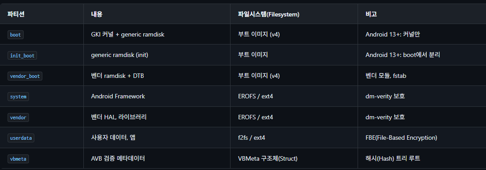

## 부팅 흐름
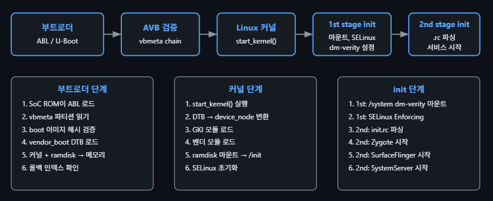

## AVB (Android Verified Boot)
AVB는 부팅 체인의 무결성(Integrity)을 보장합니다. 부트로더가 vbmeta 파티션의 서명을 검증하고, 각 파티션의 해시/해시 트리 루트를 확인합니다. 커널 레벨에서는 dm-verity가 런타임 시 블록 단위 검증을 수행합니다.

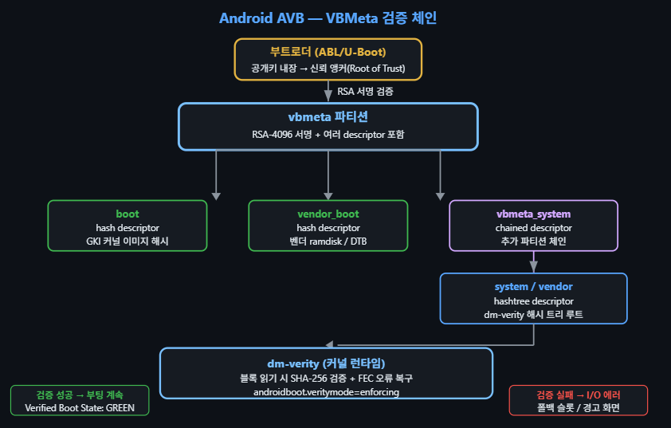


# HAL과 커널 인터페이스
## Project Treble — Framework/Vendor 분리
Android 8.0(Oreo)에서 도입된 Project Treble은 Android Framework과 벤더 구현을 명확히 분리합니다. 이 아키텍처 덕분에 Google이 Framework을 업데이트하더라도 벤더 HAL과 커널 드라이버를 수정할 필요가 없습니다.

VNDK(Vendor NDK): Framework이 벤더에 제공하는 안정적 네이티브 라이브러리 집합
VINTF(Vendor Interface): HAL 버전 매니페스트로 호환성 보장
/dev/hwbinder: Framework ↔ HAL 간 전용 Binder 도메인

## HIDL → AIDL 전환
Android 13부터 새로운 HAL은 반드시 Stable AIDL을 사용해야 합니다. HIDL(HAL Interface Definition Language)은 deprecated 상태이며, 기존 HIDL HAL도 점진적으로 AIDL로 마이그레이션 중입니다.

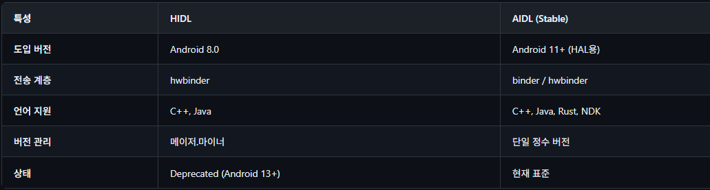

## HAL ↔ 커널 드라이버 매핑

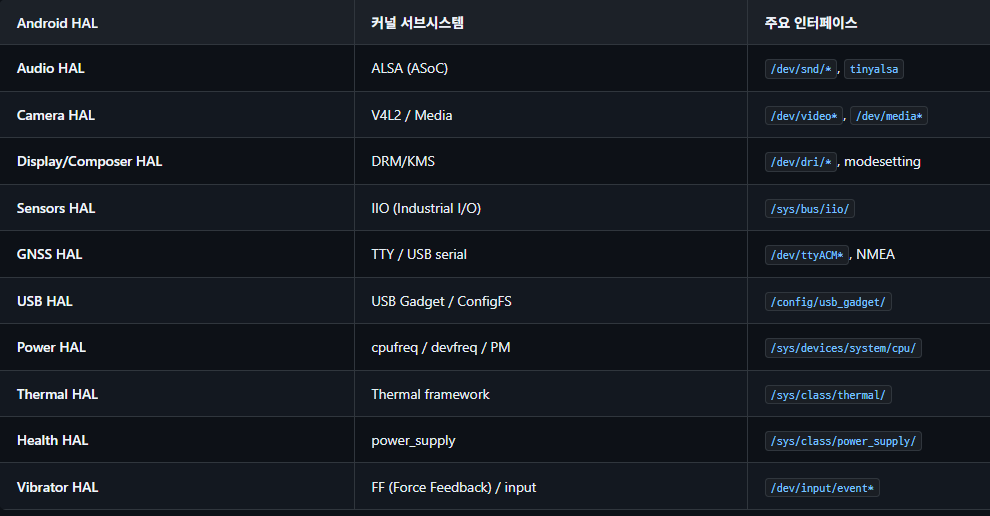

## Android SELinux 정책 (커널 관점)
Android는 SELinux Enforcing 모드를 필수로 요구합니다 (Android 5.0+). 커널의 SELinux LSM이 모든 시스템 콜(System Call)에서 접근 제어를 강제하며, Android 전용 정책으로 앱/서비스/HAL 간의 세밀한 격리(Isolation)를 구현합니다.

## 커널 SELinux 초기화
```c
/* Android init의 SELinux 초기화 흐름 */
/* system/core/init/selinux.cpp */

/* 1. 커널 커맨드라인: androidboot.selinux=enforcing */
/* 2. 1st stage init: /system/etc/selinux/precompiled_sepolicy 로드 */
selinux_android_load_policy();

/* 3. Enforcing 모드 강제 설정 */
security_setenforce(1);

/* 4. 파일 시스템 레이블링 확인 */
# restorecon -R /dev /sys /proc

/* CTS(Compatibility Test Suite)가 Enforcing 모드 검증 */
```

## Binder LSM 훅
SELinux는 Binder 전용 LSM 훅을 통해 프로세스 간 Binder 통신을 제어합니다.

```c
/* security/selinux/hooks.c — Binder 관련 LSM 훅 */
/* Binder 트랜잭션 권한 검사 */
static int selinux_binder_transaction(
    const struct cred *from,
    const struct cred *to)
{
    return avc_has_perm(from_sid, to_sid,
                        SECCLASS_BINDER, BINDER__CALL, NULL);
}
/* Binder 파일 디스크립터 전송 권한 검사 */
static int selinux_binder_transfer_file(
    const struct cred *from,
    const struct cred *to,
    const struct file *file)
{
    /* fd 전달 시 수신자에 대한 파일 접근 권한 검사 */
    ...
}
/* SELinux 정책 규칙 예시 (*.te 파일) */
# system_server가 surfaceflinger에 binder call 허용
# allow system_server surfaceflinger:binder { call transfer };
# neverallow: untrusted_app이 hal_camera_server에 직접 binder call 차단
# neverallow untrusted_app hal_camera_server:binder call;
```

# Android 프로세스 모델 (커널 관점)
## Android init 프로세스
Android의 PID 1 프로세스인 init은 일반 Linux의 systemd/SysVinit과 다르게 .rc 파일(Android Init Language)을 파싱하여 서비스를 시작합니다. Property 시스템(__system_property_*)은 공유 메모리 기반으로, /dev/__properties__를 통해 전 프로세스에 읽기 전용으로 노출됩니다.

```BASH
# init.rc 예시 (Android Init Language)
service surfaceflinger /system/bin/surfaceflinger
    class core animation
    user system
    group graphics drmrpc readproc
    capabilities SYS_NICE
    onrestart restart --only-if-running zygote
    task_profiles HighPerformance
    socket pdx/system/vr/display/client stream 0666 system graphics u:object_r:pdx_display_client_endpoint_socket:s0

# Property 트리거
on property:sys.boot_completed=1
    write /proc/sys/vm/dirty_expire_centisecs 200
    write /proc/sys/vm/dirty_background_ratio 5
```

## Zygote — fork() 기반 앱 생성
Zygote는 Android 앱 프로세스의 템플릿 프로세스입니다. ART(Android Runtime)와 공통 클래스를 미리 로드한 뒤, 앱 시작 요청 시 fork()로 빠르게 자식 프로세스를 생성합니다. 커널의 COW(Copy-On-Write) 메커니즘 덕분에 공유 가능한 페이지는 즉시 복사하지 않아 메모리 효율적입니다.

### fork() + CoW 메커니즘 동작 원리
일반적인 프로세스를 처음부터 시작하면 ART 런타임과 수천 개의 프레임워크 클래스를 매번 초기화해야 합니다. Zygote는 이 비용을 한 번만 지불하고, 이후 모든 앱에 공유합니다.

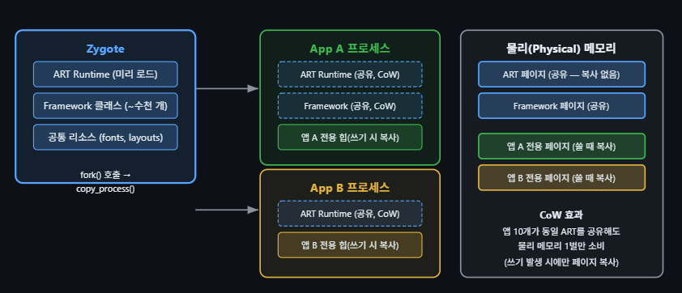

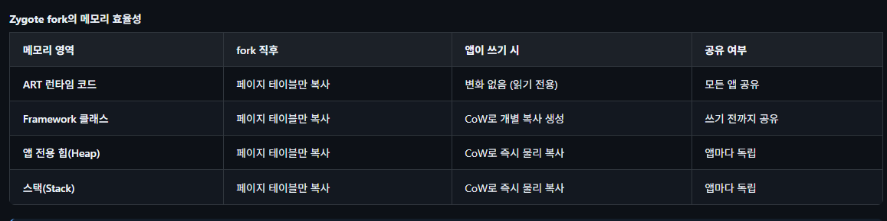

USAP (Unspecialized App Process, Android 10+): Zygote가 미리 fork()한 프로세스 풀을 유지합니다. 앱 시작 요청 시 풀에서 즉시 꺼내 사용하므로 fork() 비용을 없애고 cold start(콜드 스타트) 시간을 단축합니다.

```c
/* Zygote fork 흐름 (커널 관점) */
/* 1. Zygote가 ART, 프레임워크 클래스, 리소스를 미리 로드 */
/* 2. ActivityManagerService가 앱 시작 요청 */
/* 3. Zygote가 fork() 호출 */
pid = fork();  /* 커널: copy_process() → COW 페이지 테이블 복사 */
if (pid == 0) {
    /* 자식: 앱 프로세스 */
    setuid(app_uid);       /* 앱별 고유 UID 설정 */
    setgid(app_gid);
    prctl(PR_SET_SECCOMP); /* seccomp 필터 적용 */
    selinux_android_setcontext(uid, is_system, se_info, se_name);
    /* ART에서 앱 코드 실행 */
}

/* USAP (Unspecialized App Process) Pool — Android 10+ */
/* Zygote가 미리 fork()한 프로세스 풀을 유지 */
/* 앱 시작 시 fork() 비용 절약 → cold start 시간 단축 */
```

### Android cgroup 구성
cgroup v2 (Android 12+): Android 12부터 cgroup v2가 필수입니다. task_profiles.json이 cgroup 설정을 추상화하며, init이 .rc 파일의 task_profiles 지시어를 통해 서비스를 적절한 cgroup에 배치합니다.

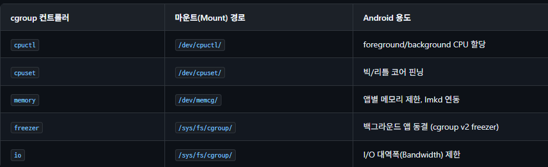

```BASH
# Android cgroup 계층 구조 (task_profiles.json 기반)
# foreground 앱: big 코어 + 높은 CPU 가중치
/dev/cpuset/foreground      → cpus: 0-7
/dev/cpuctl/foreground      → cpu.weight: 1024

# background 앱: little 코어 + 낮은 CPU 가중치
/dev/cpuset/background      → cpus: 0-3
/dev/cpuctl/background      → cpu.weight: 50

# UCLAMP: 스케줄러에 utilization 힌트 전달 (EAS 연동)
# foreground 앱의 최소 util을 설정하여 성능 보장
/dev/cpuctl/foreground/cpu.uclamp.min: 20
/dev/cpuctl/foreground/cpu.uclamp.max: 1024
```

# Energy Aware Scheduling (EAS)
모바일 SoC는 빅·미들·리틀 코어로 구성된 비대칭 멀티프로세싱(AMP) 아키텍처를 사용합니다. 커널의 EAS(Energy Aware Scheduling)는 성능 요구와 에너지 소비를 동시에 최적화하며, Android에서 배터리 수명과 성능 균형의 핵심입니다.

## 에너지 모델과 스케줄링
```c
/* kernel/sched/fair.c — EAS 핵심: find_energy_efficient_cpu() */
/* EAS는 태스크 배치 시 에너지 소비를 계산하여 */
/* 에너지 절약이 가능한 CPU를 선택합니다 */
static int find_energy_efficient_cpu(
    struct task_struct *p, int prev_cpu)
{
    struct perf_domain *pd;
    unsigned long best_delta = ULONG_MAX;
    int best_cpu = -1;
    /* 각 성능 도메인(빅/미들/리틀)을 순회 */
    for_each_pd(pd, root_domain) {
        unsigned long cur_energy, new_energy;
        /* 에너지 모델(EM)로 현재 에너지 계산 */
        cur_energy = compute_energy(p, -1, pd);
        /* 태스크를 이 도메인에 배치했을 때 에너지 */
        new_energy = compute_energy(p, cpu, pd);
        if (new_energy - cur_energy < best_delta) {
            best_delta = new_energy - cur_energy;
            best_cpu = cpu;
        }
    }
    return best_cpu;
}

/* 에너지 모델 등록 (SoC DT/ACPI에서) */
/* include/linux/energy_model.h */
struct em_perf_state {
    unsigned long frequency;  /* kHz */
    unsigned long power;      /* mW */
    unsigned long cost;       /* 정규화된 비용 */
};
```

## UCLAMP (Utilization Clamping)
UCLAMP은 태스크(Task)의 utilization 값에 최솟값(`uclamp.min`)과 최댓값(`uclamp.max`)을 설정하여, EAS와 cpufreq governor에 성능 힌트를 전달합니다. Android는 이를 통해 foreground 앱에는 높은 성능을, background 앱에는 전력 절약을 적용합니다.

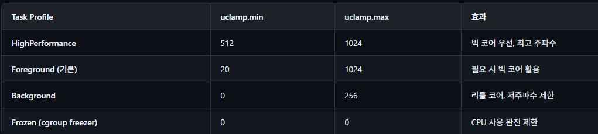

```c
/* Android Power HAL이 UCLAMP 설정 */
/* cgroup v2 경로로 uclamp 제어 */

# foreground 앱 부스트 (터치 이벤트 시)
write /dev/cpuctl/foreground/cpu.uclamp.min 256

# 부스트 해제 (터치 종료 후)
write /dev/cpuctl/foreground/cpu.uclamp.min 20

/* 커널 내부: 스케줄러가 uclamp 값 적용 */
/* kernel/sched/core.c */
static inline unsigned long uclamp_eff_value(
    struct task_struct *p,
    enum uclamp_id clamp_id)
{
    /* 태스크 고유값 + cgroup 제한값 중 더 제한적인 값 */
    struct uclamp_se uc_max = uclamp_tg_restrict(p, clamp_id);
    struct uclamp_se uc_eff = uclamp_eff_get(p, clamp_id);
    return min(uc_eff.value, uc_max.value);
}
```

# Thermal 관리
Android 기기의 Thermal HAL과 커널 thermal framework이 협력하여 발열을 제어합니다. 커널이 온도 센서를 모니터링하고 쓰로틀링 정책을 실행하며, Thermal HAL은 유저스페이스 수준의 추가 제어(프레임 레이트 감소, 밝기 조절 등)를 담당합니다. 
```c
/* drivers/thermal/thermal_core.c — 커널 thermal 프레임워크 */
/* thermal zone 등록 (SoC 드라이버) */
struct thermal_zone_device *thermal_zone_device_register_with_trips(
    const char *type,
    const struct thermal_trip *trips,
    int num_trips,
    void *devdata,
    const struct thermal_zone_device_ops *ops,
    ...);

/* Thermal trip 포인트 — 온도 임계값별 동작 정의 */
struct thermal_trip {
    int temperature;         /* 밀리도(m°C) 단위 */
    int hysteresis;          /* 해제 히스테리시스 */
    enum thermal_trip_type type; /* PASSIVE / ACTIVE / HOT / CRITICAL */
};

/* DT 예시: SoC thermal zone */
/*
thermal-zones {
    cpu-thermal {
        polling-delay-passive = <100>;
        polling-delay = <1000>;
        thermal-sensors = <&tsens 0>;
        trips {
            cpu_warm: cpu-warm { temperature = <65000>; type = "passive"; };
            cpu_hot:  cpu-hot  { temperature = <75000>; type = "passive"; };
            cpu_crit: cpu-crit { temperature = <95000>; type = "critical"; };
        };
        cooling-maps {
            map0 { trip = <&cpu_warm>; cooling-device = <&cpu0 1 3>; };
            map1 { trip = <&cpu_hot>;  cooling-device = <&cpu0 4 6>; };
        };
    };
};
*/
```

# Android 커널 디버깅
## tracing: atrace/systrace → perfetto
Android의 시스템 트레이싱은 커널 `ftrace` 인프라를 기반으로 합니다. `atrace`가 `ftrace`의 trace_marker에 이벤트를 기록하고, 커널 tracepoint도 함께 수집합니다. 현재 표준 도구는 `Perfetto`이며, 유저스페이스 + 커널 트레이스를 통합 수집합니다.

```BASH
# Perfetto로 커널 + 유저스페이스 통합 트레이스 수집
$ adb shell perfetto -o /data/misc/perfetto-traces/trace.pb -t 10s \
    -c - <<EOF
buffers: { size_kb: 65536 }
data_sources: {
    config {
        name: "linux.ftrace"
        ftrace_config {
            ftrace_events: "sched/sched_switch"
            ftrace_events: "sched/sched_wakeup"
            ftrace_events: "power/cpu_frequency"
            ftrace_events: "binder/binder_transaction"
            ftrace_events: "block/block_rq_issue"
            atrace_categories: "am"  # ActivityManager
            atrace_categories: "gfx" # Graphics
        }
    }
}
EOF
# ftrace Binder 트레이스포인트 (커널 내장)
# /sys/kernel/debug/tracing/events/binder/
# binder_transaction, binder_transaction_received,
# binder_lock, binder_locked, binder_unlock
```

Binder 트레이스 활용: Binder 지연(Latency) 문제를 분석할 때는 `binder_transaction`과 `binder_transaction_received` 이벤트의 시간차를 측정하면 커널 내 처리 지연과 대기 시간(Latency)을 구분할 수 있습니다. Perfetto UI에서 시각적으로 확인 가능합니다. 

# Android Thermal Mitigation
모바일 기기에서 열 관리(Thermal Management)는 성능과 사용자 경험에 직접 영향을 미칩니다. Android의 Thermal Mitigation은 커널 thermal_zone_device 프레임워크를 기반으로, Thermal HAL이 유저 공간 정책을 결정하고, 커널이 실제 주파수/전력 제한을 적용하는 2계층 구조입니다.

## Thermal HAL → 커널 프레임워크 흐름
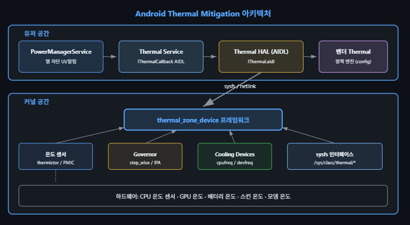

1. 하드웨어 & 커널 공간(물리적 제어)
커널은 실제 하드웨어 센서값을 읽고 즉각적인 `물리적 제한`을 가하는 역할을 합니다. 핵심은 파란색 박스인 `thermal_zone_device 프레임워크`입니다.

- 하드웨어 센서 & 온도 센서: CPU, GPU, 배터리 등에 부착된 물리적 온도 센서(Thermistor)들이 온도를 측정하여 프레임워크로 전달합니다.
- Governor (가버너): 온도가 올랐을 때 '어떻게 대응할지' 결정하는 커널 레벨의 알고리즘입니다. (예: step_wise는 온도가 오를 때마다 냉각 단계를 계단식으로 하나씩 올리는 방식입니다.)
- Cooling Devices (냉각 장치): 이름은 냉각 장치지만 선풍기 같은 쿨러가 아니라, 발열을 줄이기 위한 제어 장치입니다. cpufreq(CPU 주파수 제한), devfreq(디바이스 주파수 제한) 등을 통해 실제 칩셋의 클럭을 깎아내려 열 발생을 억제합니다.
- sysfs 인터페이스: 커널이 측정한 온도나 현재 상태를 유저 공간(/sys/class/thermal/* 파일 시스템 경로)에서 읽을 수 있게 창구를 열어줍니다.

2. 유저 공간 (정책 결정 및 사용자 경험)
커널이 밑단에서 클럭을 깎는다면, 유저 공간은 `제조사(Vendor)의 정책을 반영`하고 사용자에게 `알림`을 띄우는 역할을 합니다. (커널과 sysfs 및 netlink로 통신합니다.)

- Vendor Thermal (벤더 정책 엔진): 삼성이나 구글 같은 기기 제조사가 설정한 고유의 온도 관리 정책(Config)이 들어갑니다. "배터리 온도가 45도가 되면 어떤 조치를 취해라" 같은 구체적인 룰입니다.
- Thermal HAL (하드웨어 추상화 계층): 커널과 벤더 정책 사이에서 데이터를 주고받는 표준화된 통로(AIDL)입니다.
- Thermal Service & PowerManagerService: HAL에서 올라온 온도 경고 상태를 안드로이드 시스템(Java 단)에서 처리합니다. 만약 온도가 너무 높다면 "휴대전화 온도가 너무 높아 앱을 종료합니다"라는 UI 팝업을 띄우거나, 최악의 경우 기기 전원을 차단(Thermal Shutdown)하여 화재나 부품 손상을 막습니다.

## Thermal Zone 설정
```c
/* DT 기반 Thermal Zone 설정 예시 */
thermal-zones {
    cpu-thermal {
        polling-delay-passive = <100>; /* 수동 폴링 100ms */
        polling-delay = <1000>;         /* 능동 폴링 1초 */
        thermal-sensors = <&tsens 0>;
        trips {
            cpu_alert0: trip-alert0 {
                temperature = <75000>; /* 75°C — 경고 */
                hysteresis = <2000>;
                type = "passive";
            };
            cpu_alert1: trip-alert1 {
                temperature = <85000>; /* 85°C — 스로틀링 */
                hysteresis = <2000>;
                type = "passive";
            };
            cpu_crit: trip-critical {
                temperature = <110000>; /* 110°C — 강제 셧다운 */
                hysteresis = <1000>;
                type = "critical";
            };
        };
        cooling-maps {
            map0 {
                trip = <&cpu_alert0>;
                cooling-device = <&cpu0 0 3>; /* 쿨링 상태 0~3 */
            };
            map1 {
                trip = <&cpu_alert1>;
                cooling-device = <&cpu0 4 THERMAL_NO_LIMIT>;
            };
        };
    };
};
```

## Thermal Mitigation 정책
```BASH
# Android thermal 상태 확인
$ adb shell dumpsys thermalservice

# 현재 온도, 스로틀링 상태, 쿨링 디바이스 상태
# 커널 thermal zone 직접 확인
$ adb shell cat /sys/class/thermal/thermal_zone0/temp
72000  # 72.0°C (millidegree)

$ adb shell cat /sys/class/thermal/thermal_zone0/policy
step_wise

# 쿨링 디바이스 상태 (현재 스로틀링 레벨)
$ adb shell cat /sys/class/thermal/cooling_device0/cur_state
3  # 레벨 3 스로틀링 적용 중

$ adb shell cat /sys/class/thermal/cooling_device0/max_state
15 # 최대 15단계

# Thermal HAL AIDL 인터페이스 정보
$ adb shell dumpsys android.hardware.thermal.IThermal/default
# Temperature{type=CPU, name=cpu-0-0, value=72.3, status=THROTTLING}
# CoolingDevice{type=CPU, name=thermal-cpufreq-0, value=3}
```

# Android 성능 디버깅 실전
Android 커널 성능 문제를 진단할 때는 simpleperf(CPU 프로파일링(Profiling)), Perfetto(시스템 트레이싱), atrace(Android 트레이스), ftrace(커널 트레이스) 네 가지 도구를 상황에 맞게 조합합니다. 이 섹션에서는 각 도구의 커널 레벨 활용법을 다룹니다.

## simpleperf — CPU 프로파일링
```BASH
# simpleperf: Android 전용 perf 래퍼 (NDK 포함)
# 커널 PMU(Performance Monitoring Unit) 이벤트 사용

# 1. 시스템 전체 CPU 프로파일링 (10초)
$ adb shell simpleperf record -a --duration 10 -o /data/local/tmp/perf.data
# -a: all CPUs, --duration: 초 단위

# 2. 특정 프로세스 프로파일링
$ adb shell simpleperf record -p $(pidof system_server) \
    --call-graph dwarf --duration 5

# 3. 결과 분석 — 핫 함수
$ adb shell simpleperf report -i /data/local/tmp/perf.data \
    --sort comm,dso,symbol | head -30
# Overhead  Command          Shared Object       Symbol
# 8.23%     system_server    [kernel.kallsyms]   __schedule
# 5.12%     system_server    [kernel.kallsyms]   binder_ioctl
# 3.45%     surfaceflinger   libgui.so           ...

# 4. 하드웨어 이벤트 프로파일링
$ adb shell simpleperf stat -a --duration 5 \
    -e cache-misses,cache-references,instructions,cycles
# Performance counter statistics:
#   123,456,789  cache-misses     # 12.3% of cache-references
# 1,002,345,678  cache-references

# 5. Flamegraph 생성 (호스트에서)
$ adb pull /data/local/tmp/perf.data
$ simpleperf report-sample --protobuf -i perf.data -o perf.proto
$ pprof -flame perf.proto
```

## atrace —  Android 트레이스
```BASH
# atrace: Android 시스템 트레이스 수집
# 커널 ftrace 기반 — systrace와 동일한 백엔드

# 1. 사용 가능한 트레이스 카테고리
$ adb shell atrace --list_categories
gfx        - Graphics
input      - Input
view       - View System
sched      - CPU Scheduling
freq       - CPU Frequency
binder_driver - Binder Kernel driver
...

# 2. 5초간 스케줄링/Binder/GPU 트레이스 수집
$ adb shell atrace -a -t 5 sched freq binder_driver gfx \
    -o /data/local/tmp/atrace.txt

# 3. 압축 형태 수집 (Perfetto로 분석)
$ adb shell atrace --async_start -b 32768 sched freq binder_driver
# ... 시나리오 수행 ...
$ adb shell atrace --async_stop -o /data/local/tmp/trace.txt
$ adb pull /data/local/tmp/trace.txt

# 4. systrace (Python 래퍼, 호스트에서 실행)
$ python systrace.py -t 10 sched freq binder_driver gfx -o trace.html
```

## Perfetto 트레이스 설정
```BASH
# Perfetto 트레이스 설정 (text proto format)
# ui.perfetto.dev에서 시각화 가능
buffers {
  size_kb: 65536
  fill_policy: RING_BUFFER
}
data_sources {
  config {
    name: "linux.ftrace"
    ftrace_config {
      # 스케줄링 이벤트
      ftrace_events: "sched/sched_switch"
      ftrace_events: "sched/sched_wakeup"
      ftrace_events: "sched/sched_blocked_reason"
      # CPU 주파수
      ftrace_events: "power/cpu_frequency"
      ftrace_events: "power/suspend_resume"
      # Binder
      ftrace_events: "binder/binder_transaction"
      ftrace_events: "binder/binder_transaction_received"
      ftrace_events: "binder/binder_lock"
      # 메모리
      ftrace_events: "vmscan/mm_vmscan_direct_reclaim_begin"
      ftrace_events: "oom/oom_score_adj_update"
      # I/O
      ftrace_events: "block/block_rq_issue"
      ftrace_events: "block/block_rq_complete"
      buffer_size_kb: 16384
      drain_period_ms: 250
    }
  }
}
# 프로세스 정보 (심볼 해석용)
data_sources {
  config {
    name: "linux.process_stats"
    process_stats_config {
      scan_all_processes_on_start: true
      proc_stats_poll_ms: 1000
    }
  }
}
duration_ms: 10000  # 10초간 수집
```

## ftrace Android 설정
```BASH
# Android에서 ftrace 직접 사용
# debugfs가 마운트되어 있어야 함 (userdebug/eng 빌드)
# 1. 사용 가능한 트레이서 확인
$ adb shell cat /sys/kernel/debug/tracing/available_tracers
function_graph function nop

# 2. 스케줄러 이벤트 트레이스
$ adb shell "echo 1 > /sys/kernel/debug/tracing/events/sched/sched_switch/enable"
$ adb shell "echo 1 > /sys/kernel/debug/tracing/events/sched/sched_wakeup/enable"
$ adb shell "echo 1 > /sys/kernel/debug/tracing/tracing_on"

# 3. Binder 트레이스
$ adb shell "echo 1 > /sys/kernel/debug/tracing/events/binder/enable"

# 4. 특정 함수 트레이스 (function_graph)
$ adb shell "echo function_graph > /sys/kernel/debug/tracing/current_tracer"
$ adb shell "echo binder_ioctl > /sys/kernel/debug/tracing/set_graph_function"

# 5. 트레이스 읽기
$ adb shell cat /sys/kernel/debug/tracing/trace | head -50
#   system_server-1234  [002] .... 12345.678: binder_ioctl <-  ...
#   system_server-1234  [002] .... 12345.679: | binder_ioctl_write_read()
#   system_server-1234  [002] .... 12345.680: |   binder_thread_write()

# 6. 트레이스 중지 및 정리
$ adb shell "echo 0 > /sys/kernel/debug/tracing/tracing_on"
$ adb shell "echo nop > /sys/kernel/debug/tracing/current_tracer"
$ adb shell "echo > /sys/kernel/debug/tracing/trace"
```

## Systrace 분석 핵심 패턴
```BASH
# Perfetto/systrace에서 확인할 Android 커널 성능 패턴

# 패턴 1: Binder 병목
# — binder_transaction 시간이 16ms 초과 → UI 프레임 드롭
# — binder thread exhaustion: BR_SPAWN_LOOPER 빈발

# 패턴 2: Direct Reclaim 지연
# — mm_vmscan_direct_reclaim_begin → _end 구간이 수 ms
# — 해결: watermark_scale_factor 조정, MGLRU 활성화
$ adb shell "echo 150 > /proc/sys/vm/watermark_scale_factor"

# 패턴 3: CPU 주파수 부족
# — cpu_frequency 이벤트에서 고정된 낮은 주파수
# — thermal throttling 또는 EAS 문제
$ adb shell cat /sys/devices/system/cpu/cpu*/cpufreq/scaling_cur_freq

# 패턴 4: I/O 지연
# — block_rq_issue → block_rq_complete 구간 분석
# — f2fs GC 간섭, FUSE 오버헤드

# 패턴 5: Lock Contention
# — sched_blocked_reason 이벤트에서 binder_lock 빈발
$ adb shell simpleperf record -e sched:sched_stat_blocked -a --duration 5
```

### 팁
Perfetto의 ui.perfetto.dev 웹 UI에서 `SQL 쿼리`를 사용하면 대규모 트레이스에서도 빠르게 병목(Bottleneck)을 찾을 수 있습니다. 예: `SELECT ts, dur, name FROM slice WHERE name LIKE 'binder%' AND dur > 16000000` (16ms 초과 Binder 트랜잭션 검색). 관련 커널 트레이싱 상세는 ftrace/Tracepoints 문서를 참고하십시오. 