# 프로세스 관리
Linux 커널의 프로세스 관리 전반을 task_struct 생명주기 기준으로 다룹니다. fork/clone/execve 경로와 Copy-on-Write, PID 및 네임스페이스(Namespace), cgroup 제어와 스케줄링 클래스(Scheduling Class) 상호작용, 컨텍스트 스위칭(Context Switching)/시그널(Signal)/종료 처리, CPU affinity와 로드 밸런싱, 실전 트레이싱 포인트까지 심층적으로 정리합니다.

### 핵심 요약
- task_struct — 커널이 프로세스/스레드(Thread)를 관리하는 핵심 자료구조. 상태, PID, 메모리, 파일 정보를 모두 담습니다.
- fork() — 현재 프로세스를 복제하여 자식 프로세스를 생성합니다. Copy-on-Write로 효율적입니다.
- exec() — 프로세스의 메모리 이미지를 새 프로그램(ELF)으로 교체합니다.
- 컨텍스트 스위치 — CPU 레지스터(Register)를 저장/복원하여 다른 프로세스로 전환하는 과정입니다.
- 커널 스레드(Kernel Thread) — 사용자 공간(User Space) 없이 커널 내에서만 동작하는 스레드입니다 (kworker, kswapd 등).

#### 단계별 이해
1. task_struct 파악 — ps aux로 보이는 모든 프로세스는 커널 내부에서 task_struct 하나로 표현됩니다. -> /proc/#pid#/status에서 프로세스의 상태, 메모리, 스레드 정보를 확인할 수 있습니다.
2. fork 이해 — fork()는 부모의 페이지 테이블(Page Table)을 복사하되, 실제 메모리는 Write 시에만 복사합니다(CoW). -> 이 덕분에 fork는 매우 빠르고, 자식이 즉시 exec()하면 복사가 거의 발생하지 않습니다.
3. exec 이해 — execve()는 ELF 파일을 파싱하여 코드/데이터 세그먼트를 새로 매핑(Mapping)합니다. -> 기존 메모리 매핑은 모두 해제되고 새 프로그램의 진입점(Entry Point)(_start)부터 실행됩니다.
4. 프로세스 계층 — 모든 프로세스는 PID 1(init/systemd)을 루트로 하는 트리 구조를 형성합니다.
-> pstree 명령어로 프로세스 트리를 시각적으로 확인할 수 있습니다.

### 프로세스란 무엇인가
프로세스(Process)는 실행 중인 프로그램의 인스턴스(Instance)입니다. 하드 디스크나 SSD에 저장된 프로그램 파일(ELF 바이너리)은 정적인 코드 덩어리에 불과하지만, 이를 실행하는 순간 커널은 메모리를 할당하고 CPU 레지스터 상태, 열린 파일 목록, 네트워크 연결 등의 실행 환경을 구성하여 동적인 프로세스를 만들어 냅니다.

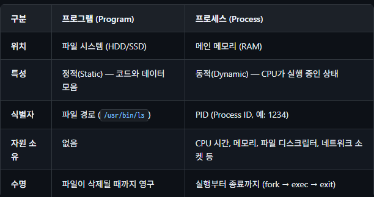

동일한 프로그램을 여러 번 실행하면 각각 독립된 프로세스가 생성됩니다. 예를 들어 sleep 100 &를 세 번 실행하면 같은 /usr/bin/sleep ELF 바이너리를 공유하지만, 완전히 독립된 세 개의 프로세스(다른 PID)가 생성됩니다. 각 프로세스는 서로의 메모리에 접근할 수 없으며, 하나가 크래시(Crash)해도 다른 프로세스에 영향을 주지 않습니다.

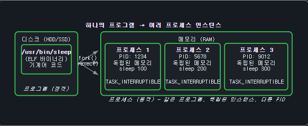

### 프로세스 계층 구조
Linux의 모든 프로세스는 부모-자식(Parent-Child) 관계를 가지며 트리 구조를 형성합니다. PID 1인 systemd가 사용자 공간의 최상위 프로세스이며, 시스템의 모든 사용자 프로세스는 fork()를 통해 이로부터 파생됩니다. PID 0는 부팅 시 커널이 직접 생성하는 swapper/idle 태스크입니다.

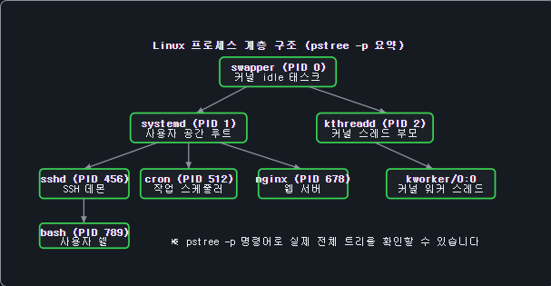

### 프로세스 직접 탐색하기
다음 명령어로 현재 시스템의 프로세스를 직접 확인할 수 있습니다.

```BASH
# 모든 프로세스 목록 (PID, CPU/메모리 사용률, 명령어)
ps aux
# 프로세스 계층 트리 (PID 포함)
pstree -p
# 현재 쉘 프로세스 정보 확인 ($$ = 현재 쉘 PID)
cat /proc/$$/status        # 상태, PID, PPID, 메모리 등
cat /proc/$$/maps          # 메모리 매핑 (코드/스택/힙/라이브러리)
cat /proc/$$/cmdline       # 실행 명령어
# 같은 프로그램의 여러 인스턴스 실행
sleep 100 &               # 백그라운드 실행 → 새 프로세스 생성
sleep 200 &
sleep 300 &
ps aux | grep sleep        # 같은 프로그램, 다른 PID 3개 확인
kill %1 %2 %3              # 생성된 프로세스 종료
```

프로세스 격리의 핵심: 각 프로세스는 독립된 가상 주소 공간을 가지므로, 한 프로세스가 다른 프로세스의 메모리를 직접 읽거나 쓸 수 없습니다. 이 격리 덕분에 하나의 프로그램이 크래시(Segmentation Fault)해도 다른 프로세스에 영향을 주지 않습니다. 커널만이 모든 프로세스의 메모리에 접근할 수 있으며, 이는 MMU(Memory Management Unit)와 페이지 테이블(Page Table)로 구현됩니다.

### task_struct 구조체(Struct) (Task Descriptor)
Linux 커널에서 프로세스(또는 스레드)를 표현하는 핵심 자료구조는 struct task_struct입니다. 이 구조체는 include/linux/sched.h에 정의되어 있으며, 커널이 프로세스를 관리하는 데 필요한 모든 정보를 담고 있습니다. 크기가 수 킬로바이트에 달하는 대형 구조체로, 프로세스의 상태, 스케줄링 정보, 메모리 디스크립터, 파일 디스크립터(File Descriptor) 테이블, 시그널 핸들러(Handler), credentials 등을 포함합니다.

#### 핵심 필드(Key Fields)
task_struct의 주요 필드들과 기능이다.

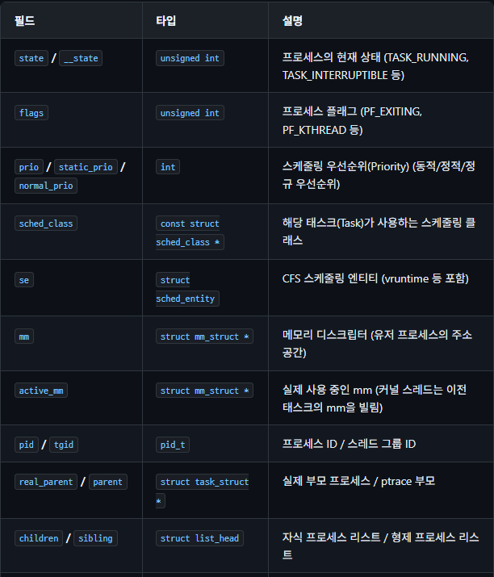

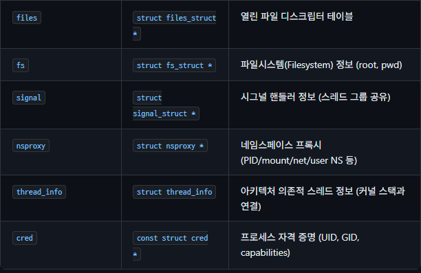

1. 프로세스의 상태 및 식별 정보
해당 프로세스가 누구인지, 지금 어떤 상태인지를 나타내는 가장 기본적인 정보들입니다.

- state / __state: 프로세스의 현재 상태를 나타냅니다 (예: TASK_RUNNING, TASK_INTERRUPTIBLE 등).
- flags: 프로세스 플래그를 나타내며, PF_EXITING이나 PF_KTHREAD 같은 상태값을 가집니다.
- pid / tgid: 프로세스를 식별하는 프로세스 ID와 스레드 그룹 ID를 나타냅니다.

2. 스케줄링 (CPU 할당)
운영체제가 수많은 프로세스 중 누구에게 CPU를 먼저, 얼마나 줄지 결정할 때 사용하는 필드들입니다.

- prio / static_prio / normal_prio: 동적, 정적, 정규 스케줄링 우선순위(Priority)를 의미합니다.
- sched_class: 해당 태스크(Task)가 사용하는 스케줄링 클래스를 나타냅니다.
- se: vruntime 등을 포함하는 CFS(Completely Fair Scheduler) 스케줄링 엔티티입니다.

3. 메모리 관리
프로세스가 사용하는 메모리 주소 공간을 관리합니다.

- mm: 유저 프로세스의 주소 공간을 나타내는 메모리 디스크립터입니다.
- active_mm: 실제 사용 중인 mm을 나타내며, 커널 스레드의 경우 이전 태스크의 mm을 빌려 사용합니다.

4. 프로세스 간의 관계 (가족 관계)
리눅스에서 프로세스는 부모가 자식을 복제(fork)하는 방식으로 생성되므로 족보가 존재합니다.

- real_parent / parent: 실제 부모 프로세스와 ptrace(디버깅 등에 사용) 부모 프로세스를 가리킵니다.
- children / sibling: 자식 프로세스 리스트와 형제 프로세스 리스트를 관리합니다.

5. 자원 및 시스템 권한
프로세스가 어떤 파일에 접근하고 어떤 권한을 가지는지 나타냅니다.

- files: 열린 파일 디스크립터 테이블을 관리합니다.
- fs: root나 pwd(현재 작업 디렉터리) 같은 파일시스템(Filesystem) 정보를 가지고 있습니다.
- signal: 스레드 그룹이 공유하는 시그널 핸들러 정보를 나타냅니다.
- nsproxy: PID, mount, net, user NS 등 네임스페이스 프록시를 관리합니다.
- thread_info: 커널 스택과 연결되는 아키텍처 의존적 스레드 정보를 담고 있습니다.
- cred: UID, GID, capabilities 등 프로세스의 자격 증명을 관리합니다.

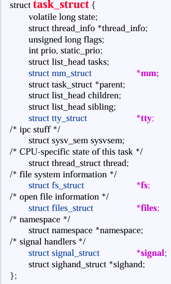

### task_struct 할당 (Allocation)
task_struct는 slab allocator를 통해 할당됩니다. 커널 초기화 시 task_struct 전용 kmem_cache가 생성되며, 새로운 프로세스 생성 시 alloc_task_struct_node()를 통해 할당합니다. 커널 스택은 별도로 할당되며, x86_64의 경우 기본 16KB(4페이지(Page))입니다. thread_info 구조체는 최근 커널에서 task_struct 내부에 임베딩되어 있습니다.

리눅스에서는 프로세스가 생성되고(fork) 죽는(exit) 일이 1초에도 수백 번씩 일어납니다. 즉, task_struct라는 거대한 구조체를 위한 메모리를 끊임없이 할당하고 해제해야 합니다.

문제점: 일반적인 malloc처럼 메모리를 그때그때 찾아서 할당해주면 너무 느리고, 메모리 공간이 조각조각 부서지는 '단편화'가 발생합니다.

해결책 (슬랩 할당자): 그래서 커널은 '미리 만들어둔 붕어빵 틀(객체 풀)'을 사용합니다. 부팅될 때 아예 task_struct 전용 메모리 공간(캐시)을 왕창 확보해 두고, 빈 task_struct 구조체들을 미리 쫙 만들어 둡니다.

kmem_cache: 이게 바로 그 '붕어빵 틀'의 이름입니다. 프로세스가 새로 생성되면 alloc_task_struct_node()라는 함수가 이 틀에서 미리 만들어진 빈 task_struct를 하나 쏙 빼서 줍니다. 속도가 엄청나게 빠르겠죠?

```c
/* task_struct 할당 - kernel/fork.c */
static struct kmem_cache *task_struct_cachep; // 붕어빵 틀을 가리킬 포인터 준비

void __init fork_init(void) {
    // 커널이 처음 부팅될 때 한 번만 실행되는 초기화 함수
    task_struct_cachep = kmem_cache_create("task_struct",
        arch_task_struct_size, align,
        SLAB_PANIC|SLAB_ACCOUNT, NULL); //task_struct 전용 캐시틀 만들라고 명령
}
/* 현재 프로세스의 task_struct에 접근 */
struct task_struct *current = get_current();
printk(KERN_INFO "PID: %d, comm: %s\\n",
       current->pid, current->comm); //pid, 이름 출력
```

ℹ️ current 매크로(Macro): current는 현재 CPU에서 실행 중인 프로세스의 task_struct 포인터를 반환하는 매크로입니다. x86_64에서는 per-CPU 변수인 current_task를 통해 접근하며, GS 세그먼트 레지스터를 활용합니다. GS 세그먼트 레지스터는 CPU의 각 코어 안에서 이 코어에서 돌고 있는 프로세스의 task_struct 메모리 주소를 몰래 적어둔다.

### 프로세스 상태 (Process States)
Linux 커널의 프로세스는 다음과 같은 상태를 가질 수 있으며, task_struct.__state 필드에 비트마스크로 저장됩니다.

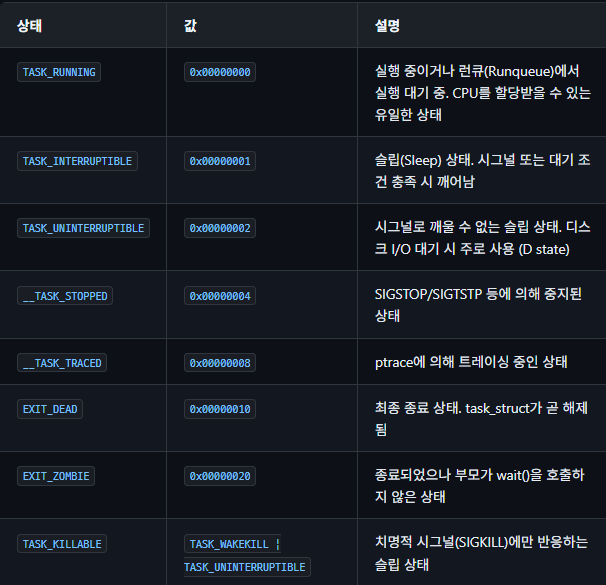

### 상태 전이 다이어그램 (State Transition Diagram)
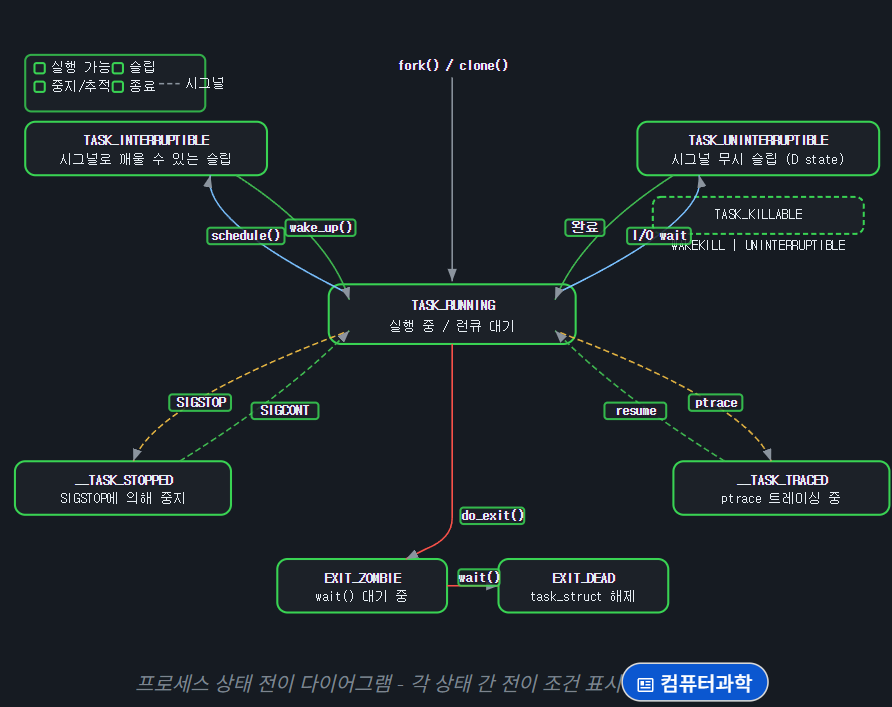

1. 프로세스의 탄생
fork() / clone(): 새로운 프로세스나 스레드가 생성되면 런큐에 들어가며 즉시 TASK_RUNNING 상태가 됩니다. 이제 CPU의 스케줄러가 차례를 주면 실행을 시작합니다.

2. 실행 중 잠시 멈춤 (Sleep 상태들)
프로세스가 실행되다가 키보드 입력을 기다리거나 하드 디스크에서 파일을 읽어와야 할 때, CPU를 계속 붙잡고 있으면 낭비이므로 스스로 대기 상태(Sleep)로 빠집니다. (schedule() 호출)

TASK_INTERRUPTIBLE (시그널로 깨울 수 있는 슬립): 가장 일반적인 대기 상태입니다. 사용자의 키보드 입력이나 네트워크 통신을 기다립니다. 중간에 강제 종료 시그널(Ctrl+C 등)을 받으면 바로 깨어나서 반응할 수 있습니다. 조건이 충족되면 wake_up()을 통해 다시 TASK_RUNNING으로 돌아갑니다.

TASK_UNINTERRUPTIBLE (시그널 무시 슬립): 디스크 I/O처럼 중간에 방해받으면 데이터가 꼬일 수 있는 아주 중요한 하드웨어 작업을 기다릴 때 빠지는 상태입니다. 이때는 밖에서 아무리 강제 종료(kill) 시그널을 보내도 무시하고, 오직 하드웨어 작업이 '완료'되어야만 TASK_RUNNING으로 돌아갑니다. (리눅스에서 시스템이 먹통이 될 때 자주 보이는 'D state'가 바로 이것입니다.)

TASK_KILLABLE: TASK_UNINTERRUPTIBLE의 단점을 보완한 상태로, 기본적으로 방해받지 않지만 치명적인 강제 종료 시그널(SIGKILL)만큼은 반응해서 죽을 수 있도록 타협한 상태입니다.

3. 외부의 개입에 의한 일시 정지 (Stopped / Traced)
__TASK_STOPPED: 실행 중 터미널에서 Ctrl+Z(SIGSTOP 시그널)를 누르는 등의 이유로 잠시 멈춰둔 상태입니다. 나중에 SIGCONT 시그널을 보내면 다시 TASK_RUNNING으로 돌아가 하던 일을 계속합니다.

__TASK_TRACED: 프로그램의 버그를 잡기 위해 디버거(예: gdb)를 연결했을 때(ptrace) 빠지는 상태입니다. 개발자가 한 줄씩 코드를 실행하고 살펴볼 수 있게 해 줍니다.

4. 프로세스의 죽음 (종료 처리)
프로세스가 할 일을 다 마쳤거나 치명적인 오류로 인해 do_exit() 함수를 호출하며 죽을 때의 과정입니다.

EXIT_ZOMBIE: 프로세스는 죽어서 메모리와 자원을 다 반납했지만, 뼈대인 task_struct 자체는 아직 남아있는 상태입니다. 부모 프로세스에게 "나 죽었어, 종료 코드(Exit status) 확인해 줘"라고 보고하기 위해 남겨진 껍데기입니다.

EXIT_DEAD: 부모 프로세스가 wait() 시스템 콜을 호출하여 자식의 종료 코드를 확인하고 수거해 가면, 비로소 task_struct 메모리마저 완전히 해제되며 시스템에서 영구적으로 사라집니다.

⚠️ D state 주의: TASK_UNINTERRUPTIBLE(D state)인 프로세스는 kill -9로도 종료시킬 수 없습니다. 이 상태가 장기간 지속되면 시스템 문제를 의심해야 합니다. 커널 5.14 이후에는 TASK_KILLABLE을 적극 활용하여 이 문제를 완화하고 있습니다.

### 커널 스택과 주소 공간 (Kernel Stack and Address Space)
모든 프로세스(Process)는 사용자 공간 스택과 별도로 커널 스택(Kernel Stack)을 갖습니다. 커널 스택은 시스템 콜(System Call), 인터럽트(Interrupt) 처리 등 커널 모드 실행 시 사용되며, 프로세스의 가상 주소 공간(Virtual Address Space) 레이아웃은 메모리 보호와 효율적 관리를 위해 엄격히 구분됩니다.

### 커널 스택 레이아웃 (Kernel Stack Layout)
커널 스택의 크기는 아키텍처에 따라 다르며, x86_64에서는 THREAD_SIZE가 16KB(4페이지), 32비트에서는 8KB(2페이지)입니다. 초기 Linux 커널에서는 thread_info 구조체가 스택 하단에 위치했지만, 현대 커널(4.9+)에서는 thread_info가 task_struct에 임베드(embed)되어 보안이 강화되었습니다.

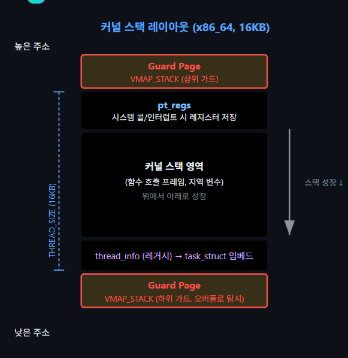

CONFIG_VMAP_STACK이 활성화되면 커널 스택은 vmalloc 영역에 할당되며, 스택 양 끝에 가드 페이지(Guard Page)가 배치됩니다. 스택 오버플로(Stack Overflow) 발생 시 가드 페이지 접근으로 페이지 폴트(Page Fault)가 발생하여 즉시 탐지할 수 있습니다.

```c
/* arch/x86/kernel/traps.c - 스택 오버플로 탐지 */
static void handle_stack_overflow(const char *message,
                                  struct pt_regs *regs,
                                  unsigned long fault_address)
{
    pr_emerg("BUG: stack-protector: %s", message);
    die("stack-protector", regs, 0);
}
/* CONFIG_VMAP_STACK: vmalloc 기반 스택 할당 */
/* 스택 양 끝에 guard page → 오버플로 시 page fault → 즉시 탐지 */
```

ℹ️ VMAP_STACK 이전: CONFIG_VMAP_STACK 이전에는 물리적으로 연속된 페이지에 스택을 할당했기 때문에, 오버플로 시 인접 메모리를 조용히 덮어쓰는 심각한 보안 취약점(Vulnerability)이 발생할 수 있었습니다. 현대 커널에서는 VMAP_STACK이 기본으로 활성화됩니다.

### 프로세스 주소 공간 레이아웃 (Process Address Space Layout)
x86_64에서 프로세스는 48비트(또는 5-level 페이징 시 57비트) 가상 주소 공간을 사용합니다. 사용자 공간과 커널 공간(Kernel Space)은 정규 주소 구멍(Canonical Hole)으로 분리되며, ASLR(Address Space Layout Randomization)을 통해 주요 영역의 시작 주소가 무작위화됩니다.

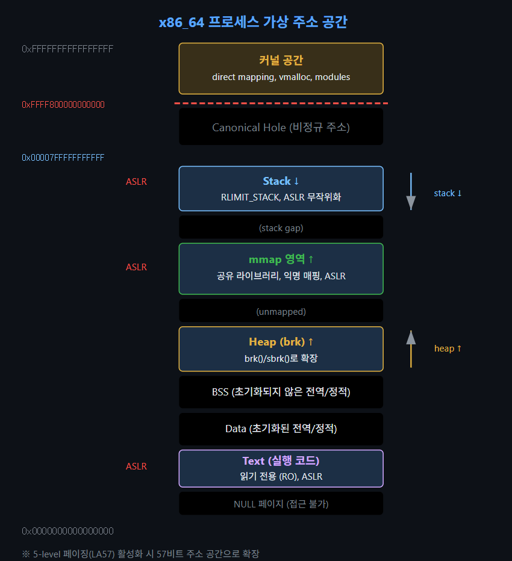

만약 멀티 스레드로 보조 스레드 여러개가 있을 때는 mmap()을 통해서 mmap 영역에 새로운 스레드가 사용할 크기만큼의 메모리를 익명 매핑으로 할당받는다.

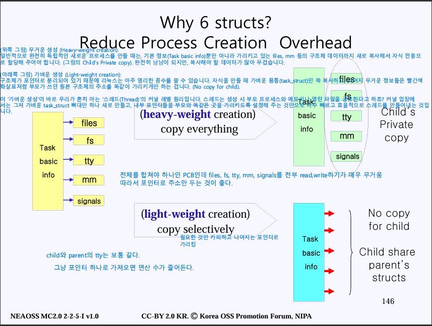

프로세스 제어 블록(PCB) = 프로세스 구조체 = task_struct

### mm_struct — 프로세스 메모리 디스크립터
프로세스의 전체 가상 주소 공간은 mm_struct로 기술됩니다. 
이 구조체는 "하나의 프로세스가 가지는 전체 가상 주소 공간의 청사진(설계도)"입니다. 커널의 task_struct(프로세스 제어 블록)는 자신이 사용할 메모리 공간을 알기 위해 이 mm_struct를 가리키는 포인터를 가지고 있습니다.

이 구조체는 페이지 테이블(Page Table) 루트, 각 영역(text, data, heap, stack)의 범위, 그리고 VMA(Virtual Memory Area) 관리 트리를 포함합니다.

```c
/* include/linux/mm_types.h - mm_struct 핵심 필드 */
struct mm_struct {
    struct maple_tree mm_mt;     /* VMA 관리 (6.1+, 기존 rb_tree 대체): 병렬 처리, 캐시 효율 좋음 */
    unsigned long mmap_base;     /* mmap 시작 주소 */
    unsigned long task_size;     /* 사용자 주소 공간 크기 */
    pgd_t *pgd;                  /* 페이지 글로벌 디렉토리 */
    atomic_t mm_users;           /* 사용자 수 (스레드) */
    atomic_t mm_count;           /* 참조 수 (active_mm 포함) */
    //영역별 시작/끝 주소
    unsigned long start_code, end_code;    /* .text 영역 */
    unsigned long start_data, end_data;    /* .data 영역 */
    unsigned long start_brk, brk;          /* heap 영역 */
    unsigned long start_stack;             /* 스택 시작 */
    unsigned long arg_start, arg_end;      /* argv 영역 */
    unsigned long env_start, env_end;      /* envp 영역 */
};
```

### VMA — 가상 메모리(Virtual Memory) 영역 (Virtual Memory Area)
각 연속된 가상 주소(Virtual Address) 범위는 vm_area_struct(VMA)로 표현됩니다. 텍스트 세그먼트, 데이터 세그먼트, 힙, 스택, mmap된 파일, 공유 라이브러리(Shared Library) 등이 각각 별도의 VMA로 관리됩니다. 커널 6.1부터는 VMA 검색에 메이플 트리(Maple Tree)를 사용하여 성능이 향상되었습니다.

mm_struct가 전체 숲을 본다면, VMA는 숲 속의 나무 한 그루 한 그루를 의미합니다. 프로세스 내에 연속된 가상 주소 공간의 덩어리(Chunk) 하나하나를 표현합니다. 스택 영역 하나, 힙 영역 하나, 로드된 libc.so 공유 라이브러리 하나하나가 전부 개별적인 VMA 객체로 관리됩니다.

```c
/* include/linux/mm_types.h - vm_area_struct 핵심 필드 */
struct vm_area_struct {
    unsigned long vm_start;      /* VMA 시작 가상 주소 */
    unsigned long vm_end;        /* VMA 끝 가상 주소 (exclusive) */
    pgoff_t vm_pgoff;            /* 파일 매핑 시 오프셋 */
    struct file *vm_file;        /* 매핑된 파일 (NULL이면 익명) */
    vm_flags_t vm_flags;         /* VM_READ, VM_WRITE, VM_EXEC 등 */
    const struct vm_operations_struct *vm_ops;
};
```
#### 예시
상황: C 프로그램에서 malloc(10MB)를 호출하여 아주 큰 배열을 만들고, 거기에 값을 쓰는 상황입니다.

1단계: 메모리 요청 (건축 허가받기)
유저가 10MB라는 큰 메모리를 요청하면, C 라이브러리(glibc)는 내부적으로 mmap() 시스템 콜을 호출하여 커널에 도움을 요청합니다.

1. 커널의 진입: 커널은 현재 실행 중인 프로세스의 task_struct를 통해 이 프로세스의 mm_struct를 꺼내 봅니다.
2. 새로운 VMA 생성: 10MB짜리 새로운 가상 메모리 구역을 만들기 위해 새로운 vm_area_struct(VMA) 객체를 하나 생성합니다.
- vm_start: 0x7F...0000 (시작 주소)
- vm_end: 0x7F...0000 + 10MB (끝 주소)
- vm_flags: VM_READ | VM_WRITE (읽기/쓰기 권한 부여)
3. 장부(Maple Tree)에 등록: 방금 만든 이 VMA 객체를 mm_struct 안에 있는 메이플 트리(mm_mt)에 예쁘게 끼워 넣습니다.
4. 결과 반환: 커널은 유저에게 "자, 0x7F...0000부터 10MB 쓰면 돼!" 하고 주소를 반환합니다.

💡 핵심 포인트 (지연 할당): 이 시점에서는 단 1바이트의 실제 물리 메모리(RAM)도 할당되지 않았습니다. 오직 커널의 가상 장부(mm_struct의 VMA)에 "이 구역은 이 프로세스 꺼야"라고 선만 그어둔 것입니다. (마치 부동산 계약서만 쓰고 건물은 아직 안 지은 상태)

2단계: 실제 메모리 접근 (건물 착공 시도)
이제 유저 프로그램이 반환받은 배열의 첫 번째 칸에 데이터를 쓰려고 시도합니다.
arr[0] = 100; (이때 arr의 주소가 0x7F...0000 이라고 가정합니다.)

1. CPU의 당황: CPU가 해당 가상 주소에 데이터를 쓰려고 mm_struct의 pgd(페이지 테이블 루트)를 뒤져서 물리 주소를 찾으려 합니다.
2. 페이지 폴트 발생: 하지만 1단계에서 물리 메모리는 하나도 안 줬기 때문에, 페이지 테이블은 텅 비어 있습니다. CPU는 즉시 실행을 멈추고 "페이지 폴트(Page Fault)!"라는 하드웨어 인터럽트를 발생시켜 커널을 긴급 호출합니다.

3단계: 커널의 수습 (VMA와 mm_struct의 통합 작업)
호출된 커널의 페이지 폴트 핸들러가 사태를 수습하기 시작합니다. 여기서 두 구조체가 완벽하게 협력합니다.

1. 합법적 접근인지 확인 (VMA 검색): 커널은 CPU가 에러를 낸 주소(0x7F...0000)를 들고, 프로세스의 mm_struct 안에 있는 메이플 트리(mm_mt)를 미친 듯이 검색합니다.

- "혹시 시작 주소와 끝 주소(vm_start ~ vm_end) 사이에 이 에러 주소가 포함된 VMA가 있나?"

2. VMA 발견 및 권한 체크: 다행히 1단계에서 만들어둔 VMA가 딱 검색됩니다! 커널은 해당 VMA의 vm_flags를 확인합니다.

- "쓰기(VM_WRITE) 권한이 있는 VMA네. 악의적인 접근이나 스택 오버플로가 아니라 합법적인 접근이구나!"
- (만약 여기서 VMA를 못 찾거나 가드 페이지였다면, 커널은 SIGSEGV를 날려 프로그램을 죽여버립니다.)

3. 물리 메모리 매핑: 합법적인 접근임을 확인한 커널은 그제야 실제 물리 메모리(RAM)에서 빈 페이지(4KB) 한 장을 가져옵니다.
4. 페이지 테이블(pgd) 업데이트: 방금 가져온 물리 주소와, 에러가 났던 가상 주소를 연결하도록 mm_struct의 pgd가 가리키는 페이지 테이블 장부를 업데이트합니다.

4단계: 재실행 (건물 완공 후 입주)
모든 처리가 끝난 커널은 CPU에게 "이제 실제 메모리 연결해 뒀으니 아까 하던 거 마저 해!" 하고 제어권을 돌려줍니다.

1. CPU는 아까 실패했던 arr[0] = 100; 명령을 다시 실행합니다.
2. 이번에는 페이지 테이블(pgd)에 실제 물리 주소가 예쁘게 적혀 있으므로, RAM에 무사히 숫자 100을 기록하고 다음 코드로 넘어갑니다.

🌟 요약하자면

이 모든 과정은 눈 깜짝할 새(마이크로초 단위)에 벌어집니다.
VMA는 "이 주소가 정말 네 영토가 맞는지, 권한은 있는지"를 확인하는 법적 등기부등본 역할을 하고,

mm_struct는 그 등기부등본들(VMA)을 트리(mm_mt)로 관리하면서, 실제 땅(물리 메모리)으로 가는 길안내 지도(pgd)까지 총괄하는 종합 관리소 역할을 합니다.

### mm_users vs mm_count
ℹ️ mm_users vs mm_count: mm_users는 사용자 공간을 공유하는 스레드 수입니다. mm_count는 mm_struct 자체의 참조 수로, mm_users(양수면 1로 카운트)와 active_mm을 사용하는 lazy TLB 커널 스레드를 합산합니다. mm_users가 0이 되면 주소 공간(페이지 테이블, VMA)이 해제되고, mm_count가 0이 되면 mm_struct 자체가 해제됩니다.

=> mm_users가 0이 되어 내용물이 싹 비워졌다고 해서, 껍데기인 mm_struct 구조체 자체를 커널 메모리에서 바로 지워버리면 안 되는 경우가 있습니다.

Lazy TLB 커널 스레드 때문입니다. 커널 내부에서만 도는 백그라운드 스레드들(예: 디스크 동기화 스레드 등)은 자기만의 mm_struct가 없습니다. 그래서 컨텍스트 스위칭 효율을 위해, 방금 전까지 실행되던 유저 프로세스의 mm_struct를 잠시 '빌려서(active_mm)' 사용합니다.

따라서 커널 스레드가 아직 이 구조체를 참조하고 있다면 mm_count는 1 이상을 유지하게 되고, 이 값마저 완전히 0이 되어야 비로소 mm_struct 껍데기 객체 자체를 커널 메모리(Slab allocator)에서 최종적으로 소멸시킵니다.

## 프로세스 생성 (Process Creation)
Linux에서 새로운 프로세스는 항상 기존 프로세스를 복제하여 생성됩니다. 최초의 프로세스(PID 0, swapper/idle)만 커널 부팅 시 정적으로 생성되고, 이후 PID 1(init/systemd) 등은 모두 fork 계열 시스템 콜(System Call)을 통해 생성됩니다.

### fork() 시스템 콜
fork()는 호출한 프로세스의 거의 완전한 복사본을 생성합니다. 커널 내부에서는 kernel_clone() 함수(과거 do_fork())를 통해 처리됩니다. 주요 처리 과정은 다음과 같습니다:

1. task_struct 할당: dup_task_struct()로 새로운 task_struct와 커널 스택을 할당합니다.
2. 리소스 복제: copy_files(), copy_fs(), copy_sighand(), copy_signal(), copy_mm(), copy_namespaces() 등을 호출하여 각 리소스를 복제합니다.
3. 스케줄러 초기화: sched_fork()로 새 태스크의 스케줄링 정보를 초기화합니다.
4. PID 할당: alloc_pid()로 새 PID를 할당합니다.
5. 런큐 추가: wake_up_new_task()로 새 프로세스를 런큐에 넣습니다.

```c
/* kernel/fork.c - kernel_clone() 핵심 흐름 (간략화) */
pid_t kernel_clone(struct kernel_clone_args *args)
{
    struct task_struct *p;
    pid_t nr;
    /* 1. task_struct + 커널 스택 복제 */
    p = copy_process(NULL, 0, args);
    if (IS_ERR(p))
        return PTR_ERR(p);
    /* 2. PID 가져오기 */
    nr = pid_vnr(get_task_pid(p, PIDTYPE_PID));
    /* 3. 새 프로세스를 런큐에 넣고 실행 가능하게 만듦 */
    wake_up_new_task(p);
    return nr;
}
```

### vfork() / clone() / clone3()
Linux는 프로세스 생성을 위해 여러 시스템 콜을 제공하며, 내부적으로는 모두 kernel_clone()을 호출합니다.

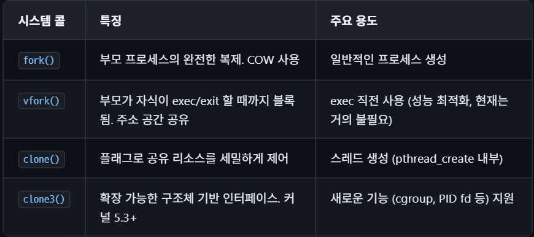

```c
/* clone() 호출 시 주요 플래그 */
#define CLONE_VM        0x00000100  /* 주소 공간 공유 */
#define CLONE_FS        0x00000200  /* 파일시스템 정보 공유 */
#define CLONE_FILES     0x00000400  /* 파일 디스크립터 테이블 공유 */
#define CLONE_SIGHAND   0x00000800  /* 시그널 핸들러 공유 */
#define CLONE_THREAD    0x00010000  /* 같은 스레드 그룹 */
#define CLONE_NEWNS     0x00020000  /* 새 마운트 네임스페이스 */
#define CLONE_NEWPID    0x20000000  /* 새 PID 네임스페이스 */
/* 스레드 생성 시 사용되는 플래그 조합 (glibc pthread_create) */
const int thread_flags = CLONE_VM | CLONE_FS | CLONE_FILES |
                         CLONE_SIGHAND | CLONE_THREAD |
                         CLONE_SYSVSEM | CLONE_SETTLS |
                         CLONE_PARENT_SETTID | CLONE_CHILD_CLEARTID;
```

### Copy-on-Write (COW) 메커니즘
Copy-on-Write는 fork()의 효율성을 크게 높이는 핵심 메커니즘입니다. fork() 시점에 부모와 자식은 같은 물리 페이지를 공유하되, 페이지 테이블 엔트리를 읽기 전용(Read-Only)으로 표시합니다. 이후 둘 중 하나가 해당 페이지에 쓰기를 시도하면 페이지 폴트(page fault)가 발생하고, 커널이 해당 페이지를 복사한 뒤 쓰기를 허용합니다.

COW의 핵심 처리 흐름:

1. fork() 시 copy_mm() -> dup_mmap()에서 부모의 페이지 테이블을 복제합니다.
2. copy_present_pte()에서 쓰기 가능 페이지를 읽기 전용으로 변경하고, 참조 카운트(Reference Count)를 증가시킵니다.
3. 쓰기 시 페이지 폴트 -> do_wp_page()에서 COW 처리를 수행합니다.
4. 참조 카운트가 1이면 복사 없이 쓰기 권한만 복원하고, 2 이상이면 새 페이지를 할당하여 복사합니다.

💡COW의 장점: 대부분의 fork() 호출은 직후에 exec()를 수행하여 주소 공간을 완전히 교체합니다. COW 덕분에 이런 fork-exec 패턴에서 불필요한 메모리 복사가 발생하지 않아 성능이 크게 향상됩니다.

### Android 프로세스 모델
안드로이드 기기에서 돌아가는 수많은 앱(카카오톡, 유튜브, 게임 등)은 겉보기엔 다 다르지만, 사실 내부적으로는 '안드로이드 런타임(ART)'과 '공통 프레임워크 클래스(UI 컴포넌트 등)'라는 거대한 공통 기반 위에서 동작합니다.

만약 안드로이드가 전통적인 fork() + exec() 방식을 썼다면, 앱을 켤 때마다 exec()로 메모리를 다 날려버리고, 수십~수백 MB에 달하는 런타임과 공통 클래스를 디스크에서 메모리로 다시 똑같이 불러와야 했을 것입니다. 이는 심각한 메모리 낭비와 앱 실행 속도 저하(버벅거림)를 유발합니다.

그래서 구글의 엔지니어들은 Zygote(수정란)라는 특별한 프로세스 패턴을 고안해 냈습니다.

#### 가장 먼저 실행되어 미리 로드하는 Zygote
Zygote는 안드로이드 기기가 부팅될 때 가장 먼저 실행되어, 모든 앱이 공통으로 사용하는 거대한 라이브러리와 런타임(ART)을 자신의 메모리에 미리 다 올려놓고(Pre-load) 대기하는 특별한 프로세스입니다.

사용자가 스마트폰에서 특정 앱의 아이콘을 터치하면 다음과 같은 일이 벌어집니다.

1단계 (fork() 호출): Zygote가 스스로를 fork() 하여 자식 프로세스를 만듭니다. 이때 image_bf9a16.png에서 배운 COW(Copy-On-Write) 메커니즘 덕분에 자식은 Zygote가 미리 로드해둔 거대한 프레임워크 메모리를 1바이트의 복사도 없이 순식간에 공유받게 됩니다.

2단계 (보안 설정): 올려주신 코드 내용처럼 setuid, prctl, selinux 등을 호출하여 자식 프로세스의 권한을 해당 앱 전용으로 변경합니다. (이른바 앱 샌드박싱 적용)

3단계 (exec() 생략 및 앱 실행): 이곳이 핵심입니다! 자식 프로세스는 exec()를 절대 호출하지 않습니다. 대신, 이미 공유받아 완성되어 있는 안드로이드 런타임(ART) 위에서, 방금 사용자가 클릭한 앱의 고유한 코드(APK/DEX)만을 동적으로 얹어서(Load) 실행해 버립니다.

```c
/* Zygote fork 흐름 (커널 관점) */
/* Zygote: ART + 프레임워크 클래스 미리 로드된 상태 */
pid = fork();  /* copy_process() → COW 페이지 테이블 복사 */
if (pid == 0) {
    /* 자식: 앱 프로세스 */
    setuid(app_uid);       /* 앱별 고유 UID (앱 샌드박스) */
    prctl(PR_SET_SECCOMP); /* seccomp 필터 */
    selinux_android_setcontext(...); /* SELinux 컨텍스트 전환 */
    /* exec() 없이 ART에서 바로 앱 코드 실행 → COW 페이지 공유 유지 */
}
```

#### 장점
일반적인 fork-exec 패턴과 달리 Zygote는 exec()를 호출하지 않으므로, 부모와 공유하는 COW 페이지(ART, 프레임워크 코드)가 장기간 유지되어 메모리 절약 효과가 큽니다. Android 10+에서는 USAP(Unspecialized App Process) 풀을 미리 fork하여 cold start 시간을 더욱 단축합니다. 자세한 내용은 Android 커널 — Zygote를 참고하십시오.

exec()를 생략함으로써 안드로이드는 데스크탑 리눅스에서는 상상하기 힘든 효율을 달성합니다.

1. 극단적인 메모리 절약 (RAM 다이어트): 수십 개의 앱을 동시에 켜놓아도, 무거운 공통 프레임워크 코드는 물리 메모리(RAM)에 딱 1개만 존재합니다. 모든 앱 프로세스가 Zygote의 원본 메모리를 COW로 공유하고 있기 때문입니다. 앱들이 각자 자신만의 변수나 데이터를 수정(Write)할 때만 페이지 복사가 일어나므로 메모리 사용량이 획기적으로 줄어듭니다.

2. 번개 같은 앱 실행 속도 (Cold Start 단축): 무거운 런타임 환경을 처음부터 다시 구축할 필요 없이, 이미 완성된 환경을 통째로 복사(fork)받고 바로 시작하므로 앱이 즉시 켜집니다.

(참고) 최신 안드로이드(10 이상)에서는 여기서 한발 더 나아가 USAP (Unspecialized App Process)라는 기능을 도입했습니다. 사용자가 앱을 켜기도 전에 미리 권한 설정까지 끝낸 빈 껍데기 자식 프로세스들을 풀(Pool)로 만들어두어, 터치 반응 속도를 극한까지 끌어올렸습니다.

#### fork() + exec() 흐름 시각화
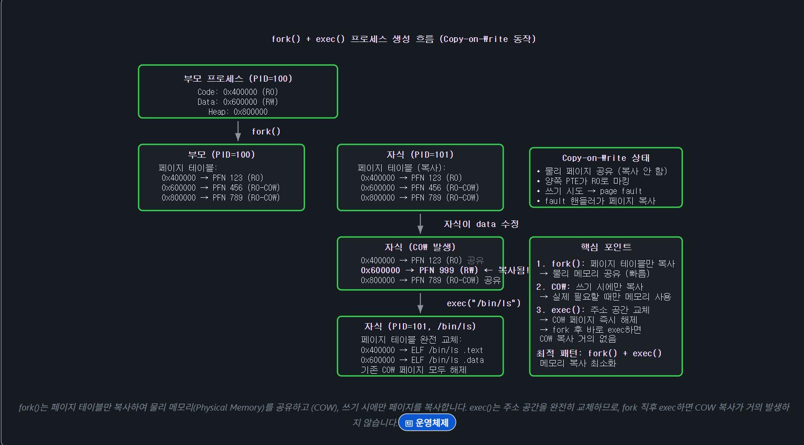

### exec() 계열과 ELF 로딩 (exec and ELF Loading)
exec() 계열 시스템 콜은 현재 프로세스의 주소 공간을 새로운 프로그램으로 대체합니다. 커널 내부에서는 do_execveat_common()을 통해 처리됩니다. Linux에서 사용자 공간 프로그램의 표준 실행 파일 형식은 ELF(Executable and Linkable Format)이며, 커널은 fs/binfmt_elf.c에서 이를 처리합니다.

#### exec() 내부 처리 흐름
execve() 시스템 콜이 호출되면 커널은 다음 단계를 수행합니다:

1. 파일 열기 및 권한 검사: do_open_execat()으로 실행 파일을 열고, 실행 권한을 확인합니다.
2. binfmt 핸들러 탐색: search_binary_handler()에서 등록된 바이너리 형식 핸들러를 순회하며, 파일 매직 넘버를 확인하여 적절한 핸들러를 선택합니다.
3. 기존 주소 공간 해제: exec_mmap()에서 기존 mm_struct를 새 것으로 교체합니다. 이 시점에서 기존 메모리 매핑이 모두 해제됩니다.
4. ELF 세그먼트 매핑: load_elf_binary()에서 PT_LOAD 세그먼트를 새 주소 공간에 매핑합니다.
5. 동적 링커(Linker) 로드: 동적 링크 실행 파일이면 PT_INTERP에 지정된 동적 링커(ld-linux.so)를 함께 로드합니다.
6. 스택/auxv 설정: create_elf_tables()에서 argv, envp, auxiliary vector를 사용자 스택에 배치합니다.
7. 진입점 설정: 레지스터를 초기화하고, ELF 진입점(또는 동적 링커의 진입점)으로 점프합니다.

```c
/* fs/exec.c - do_execveat_common() 핵심 흐름 (간략화) */
static int do_execveat_common(int fd, struct filename *filename,
                              struct user_arg_ptr argv,
                              struct user_arg_ptr envp, int flags)
{
    struct linux_binprm *bprm;
    int retval;
    bprm = alloc_bprm(fd, filename, flags);
    /* 1. 실행 파일 열기 */
    retval = bprm_execve(bprm);
    /* bprm_execve 내부: */
    /*   → do_open_execat()     : 파일 열기 + 권한 검사 */
    /*   → prepare_binprm()     : 매직 넘버 읽기, credentials 계산 */
    /*   → exec_binprm()        : search_binary_handler() 호출 */
    /*     → load_elf_binary()  : ELF 파싱 + 주소 공간 구축 */
    /*       → exec_mmap()      : 기존 mm 해제, 새 mm 할당 */
    /*       → elf_map()        : PT_LOAD 세그먼트 매핑 */
    /*       → create_elf_tables() : auxv/argv/envp 스택 배치 */
    /*       → START_THREAD()   : 진입점으로 IP 설정 */
    return retval;
}
/* ELF auxiliary vector 주요 항목 */
/* AT_PHDR    — ELF 프로그램 헤더 테이블 주소 */
/* AT_ENTRY   — ELF 진입점 주소 */
/* AT_BASE    — 동적 링커 로드 주소 */
/* AT_RANDOM  — 16바이트 난수 (stack canary 등에 사용) */
/* AT_EXECFN  — 실행 파일명 */
```

ℹ️ ELF 상세 문서: ELF 포맷의 전체 구조(헤더, 세그먼트, 섹션, 심볼 테이블(Symbol Table), 재배치(Relocation), 동적 링킹(Dynamic Linking), GOT/PLT, TLS, 코어 덤프(Core Dump), 커널 모듈(Kernel Module) ELF, binfmt 핸들러, 심볼 버저닝, .eh_frame/DWARF, 링커 스크립트, 보안 강화)에 대한 심층 분석은 ELF (Executable and Linkable Format) 페이지를 참고하십시오.

### exec() 보안 처리
exec() 실행 시 커널은 여러 보안 관련 처리를 수행합니다:

1. SUID/SGID 처리: 실행 파일에 setuid/setgid 비트가 설정되어 있으면, prepare_binprm()에서 프로세스의 effective UID/GID를 파일 소유자의 것으로 변경합니다.
2. Capabilities 계산: cap_bprm_creds_from_file()에서 파일의 security xattr과 SUID 비트를 기반으로 새로운 capability 세트를 계산합니다.
3. LSM 검사: security_bprm_check()을 통해 SELinux, AppArmor 등 LSM 모듈이 실행을 허용하는지 확인합니다.
4. close-on-exec: O_CLOEXEC 플래그가 설정된 파일 디스크립터를 모두 닫습니다.
5. 시그널 핸들러 초기화: 사용자 정의 시그널 핸들러가 모두 SIG_DFL로 초기화됩니다 (핸들러 코드가 있던 주소 공간이 사라지므로).

⚠️ SUID와 ptrace: SUID 실행 파일을 exec()할 때 해당 프로세스가 ptrace 중이면, 보안상 SUID 비트가 무시됩니다. 이는 디버거가 권한 상승된 프로세스를 제어하는 것을 방지합니다. /proc/sys/kernel/yama/ptrace_scope로 ptrace 접근 범위를 추가로 제한할 수 있습니다.

### 스케줄링 개요 (Scheduling Overview)
 Linux 커널 스케줄러는 schedule() → __schedule() → pick_next_task() 경로를 통해 다음 실행할 태스크를 선택합니다. 스케줄러는 sched_class 계층 구조(stop → deadline → rt → fair → idle)를 순회하며, 각 클래스의 정책에 따라 우선순위가 결정됩니다.

일반 프로세스는 **EEVDF(Earliest Eligible Virtual Deadline First)** 알고리즘(v6.6+, 이전 CFS)으로 공정하게 CPU 시간을 분배받고, 실시간(Real-time) 태스크는 SCHED_FIFO/SCHED_RR/SCHED_DEADLINE 정책으로 우선 처리됩니다. 커널의 선점(Preemption) 모델(NONE/VOLUNTARY/FULL/RT/LAZY)은 응답성과 처리량(Throughput)의 트레이드오프를 결정하며, 로드 밸런싱은 sched_domain 계층을 통해 CPU 간 부하를 균등하게 분산합니다.

### 스케줄러가 필요한 이유 — 시분할(Time-Sharing)
CPU 코어 하나는 동시에 하나의 태스크만 실행할 수 있습니다. 그러나 현대 운영체제는 수십~수백 개의 프로세스를 동시에 실행되는 것처럼 보이게 해야 합니다. 스케줄러는 각 프로세스에게 타임슬라이스(Time Slice)라 불리는 짧은 CPU 사용 시간을 순서대로 배분합니다. 타임슬라이스(약 1~50ms)가 매우 짧기 때문에 사용자 눈에는 여러 프로그램이 동시에 실행되는 것처럼 보입니다.

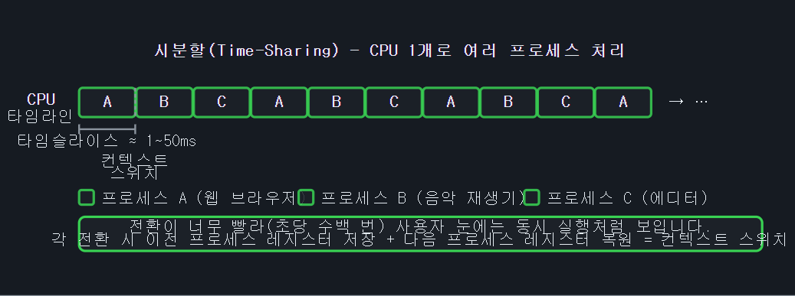

스케줄러는 단순한 라운드로빈(Round-Robin)이 아니라, 각 프로세스의 가상 실행 시간(vruntime)을 추적하여 가장 적게 실행된 프로세스에 CPU를 먼저 줍니다. I/O 작업 중인 프로세스는 CPU를 자발적으로 반납하고 대기 상태(TASK_INTERRUPTIBLE)로 전환되었다가 I/O 완료 시 다시 런큐(Runqueue)에 올라와 스케줄 됩니다.

ℹ️ 스케줄링 상세 문서: 프로세스 스케줄링의 각 주제는 전용 페이지에서 심층적으로 다룹니다.

- 프로세스 스케줄러 — sched_class 계층(프로세스들의 직급, 객체지향으로 다양한 성격의 프로세스 관리), 런큐(대기줄), sched_ext, 디버깅(Debugging), 커널 설정
- CFS/EEVDF 스케줄러 상세 — vruntime 수식, PELT 부하 추적, 로드 밸런싱 심층, cgroup 대역폭(Bandwidth)
- preempt_count & 선점 모델 — 선점 카운터, PREEMPT_DYNAMIC, 선점 모델 비교
- Real-Time Linux & PREEMPT_RT — RT 스케줄링 정책, sleeping spinlock, PI chain
- cpusets & CPU Isolation — CPU Affinity, isolcpus, nohz_full, HPC/RT 격리(Isolation) : 특정 작업이 중요할 경우 문맥 교환조차 아까워서(고성능 게임) 특정 CPU에 다른 프로그램이 접근하지 못하게 격리시켜 버린다.
- Context Switching — __switch_to(), 레지스터/TLB/FPU 전환 비용

### 컨텍스트 스위칭 (Context Switch)
컨텍스트 스위칭은 현재 실행 중인 태스크를 다른 태스크로 전환하는 과정입니다. context_switch() 함수에서 수행되며, 크게 두 단계로 나뉩니다.

💡 책갈피 비유: 컨텍스트 스위치는 책을 읽다가 책갈피를 끼우고 다른 책을 꺼내는 것과 같습니다. 책갈피(저장된 레지스터)에는 "몇 쪽의 어느 줄을 읽고 있었는지(PC, Program Counter)", "어디서 메모하고 있었는지(Stack Pointer)", "머릿속에 기억하고 있던 숫자들(범용 레지스터)"이 담깁니다. 나중에 그 책으로 돌아오면 책갈피를 보고 정확히 그 자리부터 이어서 읽을 수 있습니다.

CPU 레지스터는 현재 프로세스의 실행 상태 전부를 담습니다. 스케줄러가 다른 프로세스로 전환해야 할 때:

1. 현재 프로세스 저장: CPU 레지스터 전체(PC, SP, 범용 레지스터 등)를 현재 프로세스의 커널 스택에 저장합니다.
2. 다음 프로세스 복원: 다음 프로세스의 커널 스택에서 레지스터를 복원하면, CPU는 마치 그 프로세스가 계속 실행되던 것처럼 이어서 실행합니다.

커널 내부에서 이 과정은 다음 두 단계로 구현됩니다:

1. 주소 공간 전환: switch_mm_irqs_off()에서 페이지 테이블(CR3 레지스터)을 새 태스크의 것으로 교체합니다. 커널 스레드 간 전환이면 이 단계를 건너뜁니다.
2. 레지스터/스택 전환: switch_to()에서 커널 스택 포인터, 프로그램 카운터, 범용 레지스터 등을 전환합니다. 이 작업은 아키텍처 의존적인 어셈블리(Assembly) 코드로 구현됩니다.

## 컨텍스트 스위칭 과정 다이어그램
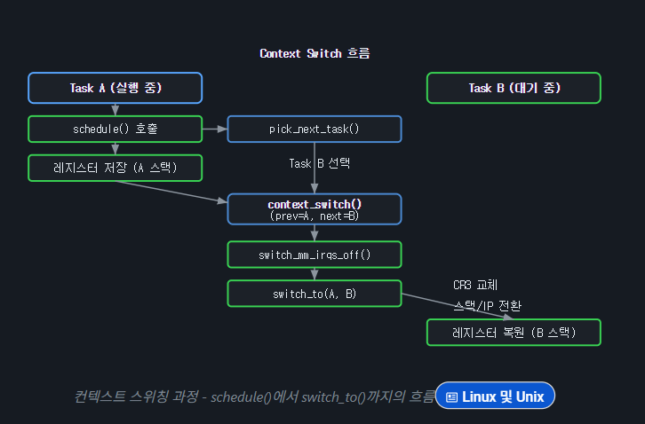

```c
/* kernel/sched/core.c - context_switch() 핵심 (간략화) */
static void context_switch(struct rq *rq,
    struct task_struct *prev, struct task_struct *next)
{
    /* 1. 주소 공간 전환 */
    if (!next->mm) {
        /* 커널 스레드: 이전 태스크의 mm을 빌림 (lazy TLB) */
        next->active_mm = prev->active_mm;
    } else {
        /* 유저 프로세스: 페이지 테이블 전환 */
        switch_mm_irqs_off(prev->active_mm, next->mm, next);
    }
    /* 2. 레지스터 + 스택 전환 (아키텍처 의존) */
    switch_to(prev, next, prev);
    /* 이 시점부터 next 태스크의 컨텍스트에서 실행 */
    finish_task_switch(prev);
}
```

ℹ️ Lazy TLB: 커널 스레드는 자체 유저 주소 공간이 없으므로(mm == NULL), 이전 태스크의 mm을 빌려 사용합니다. 이를 통해 불필요한 TLB flush를 방지하여 성능을 향상시킵니다.

# 스레드
Linux에서 스레드는 프로세스와 본질적으로 같은 객체입니다. 둘 다 task_struct로 표현되며, 스레드는 같은 스레드 그룹에 속한 task_struct들이 주소 공간, 파일 디스크립터, 시그널 핸들러 등을 공유하는 것일 뿐입니다.

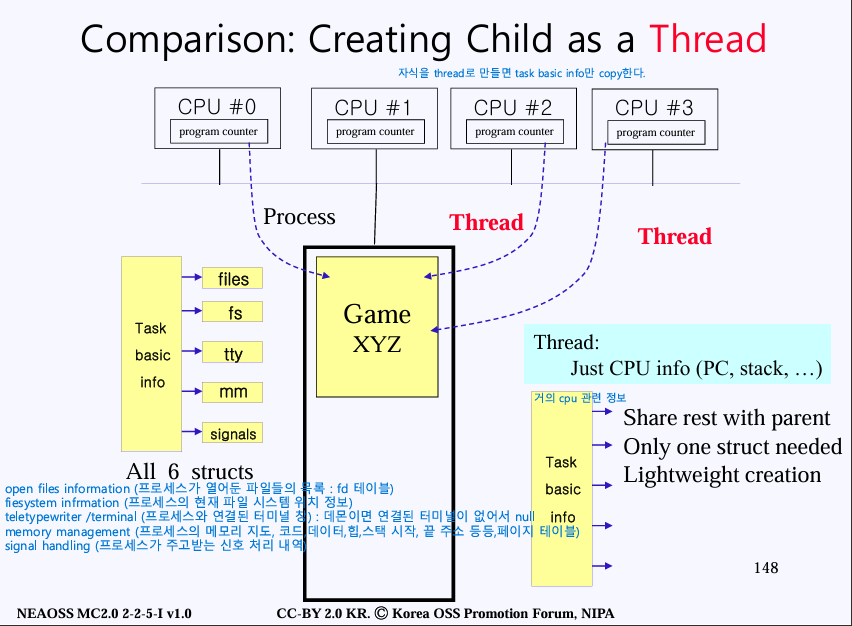

### 커널 스레드 (Kernel Threads)
커널 스레드는 유저 공간 주소 공간 없이(mm == NULL) 커널 공간(Kernel Space)에서만 실행되는 태스크입니다. kthreadd(PID 2)가 모든 커널 스레드의 부모이며, kthread_create()/kthread_run() API로 생성합니다. 대표적으로 ksoftirqd, kworker, migration, kswapd 등이 있습니다.

### PID / TID 관계 (PID and TID Relationship)
Linux에서 PID와 TID의 관계는 다음과 같습니다:

- TID (Thread ID): task_struct.pid 필드. 각 태스크(스레드)마다 고유합니다. gettid() 시스템 콜로 확인 가능합니다.
- PID (Process ID): task_struct.tgid (Thread Group ID) 필드. 같은 프로세스의 모든 스레드는 동일한 tgid를 가집니다. getpid()는 tgid를 반환합니다.
- 메인 스레드의 경우 pid == tgid이고, 추가 스레드는 pid != tgid입니다.

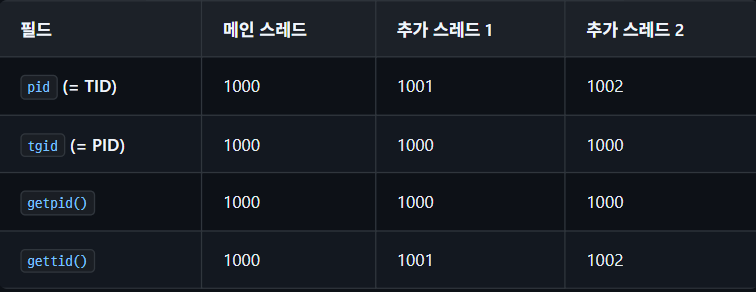

💡 PID 네임스페이스: PID는 네임스페이스에 따라 다른 값을 가질 수 있습니다. 컨테이너(Container) 안에서 PID 1로 보이는 프로세스가 호스트에서는 전혀 다른 PID를 가집니다. task_struct 내부의 struct pid는 각 네임스페이스 수준별 PID 번호를 보관합니다.

### 스레드와 프로세스의 리소스 공유 (Resource Sharing between Threads and Processes)
Linux에서 스레드(Thread)는 본질적으로 프로세스와 동일한 task_struct로 표현되며, clone() 시스템 콜에 전달하는 CLONE_* 플래그에 따라 어떤 리소스를 공유할지 결정됩니다. fork()는 대부분의 리소스를 복사하고, pthread_create()는 내부적으로 clone(CLONE_VM | CLONE_FS | CLONE_FILES | CLONE_SIGHAND | CLONE_THREAD, ...)를 호출하여 주소 공간, 파일 디스크립터, 시그널 핸들러 등을 공유합니다.

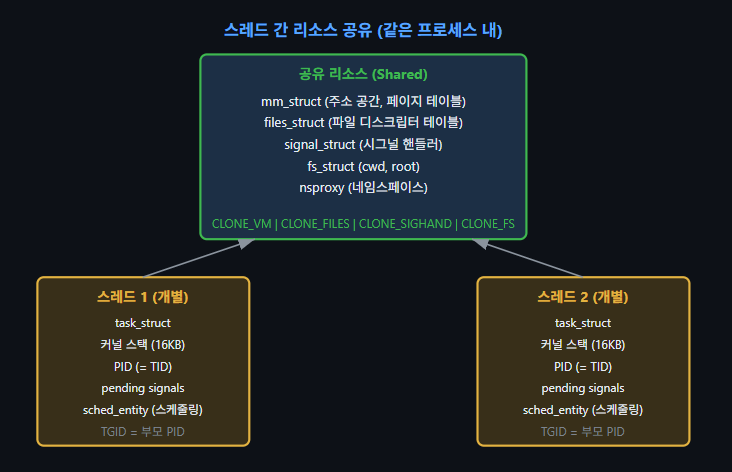

##### pid(=tid)의 의미
커널 내부의 pid (이미지의 PID (= TID) 부분):
커널이 각각의 Task(스레드)를 구분하기 위해 부여한 진짜 고유 번호입니다. 즉, 커널 소스 코드에 적힌 task_struct->pid는 유저가 생각하는 프로세스 ID가 아니라, 각각의 스레드를 식별하는 스레드 ID(TID)로 동작합니다. 이미지에서 PID (= TID)라고 적어둔 것은 바로 이 뜻입니다. "커널 구조체의 pid 필드가 곧 너희들이 아는 TID 역할을 한다"는 것이죠.

커널 내부의 tgid (Thread Group ID):
그렇다면 여러 스레드를 묶어서 "하나의 프로세스"로 묶어주는 진짜 Process ID 역할은 누가 할까요? 바로 tgid라는 필드입니다.
어떤 프로세스가 처음 생성될 때(메인 스레드), 메인 스레드의 커널 pid 값을 자신의 tgid로 설정합니다. 이후 pthread_create로 서브 스레드들을 만들면, 서브 스레드들은 자신만의 고유한 커널 pid를 새로 발급받지만, tgid만큼은 메인 스레드의 것을 똑같이 복사해서 공유합니다.

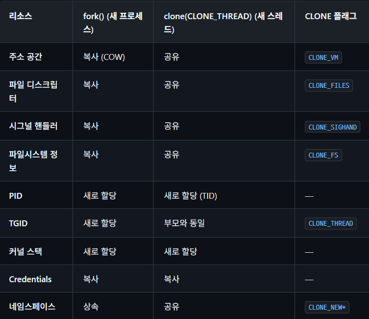

💡 TGID와 getpid(): 사용자 공간에서 getpid()가 반환하는 값은 실제로 tgid(Thread Group ID)입니다. 같은 프로세스의 모든 스레드는 동일한 tgid를 공유합니다. 개별 스레드의 고유 ID(TID)를 얻으려면 gettid()를 사용해야 합니다. 커널 내부에서 task_struct->pid는 TID이고, task_struct->tgid가 사용자 공간의 PID에 해당합니다.

## 프로세스 그룹과 세션 (Process Groups and Sessions)
리눅스에서 프로세스들은 프로세스 그룹(Process Group)과 세션(Session)이라는 계층적 구조로 조직됩니다. 이 구조는 터미널 기반의 잡 컨트롤(Job Control)과 시그널 전달의 핵심 메커니즘입니다.

### 프로세스 그룹 (Process Group)
프로세스 그룹은 관련된 프로세스들의 집합입니다. 셸에서 파이프라인(Pipeline)으로 연결된 명령들(ls | grep foo | sort)은 하나의 프로세스 그룹을 형성합니다. 프로세스 그룹은 PGID(Process Group ID)로 식별되며, 그룹의 첫 번째 프로세스(그룹 리더)의 PID가 PGID가 됩니다.

### 세션 (Session)
세션은 하나 이상의 프로세스 그룹의 집합으로, 제어 터미널(Controlling Terminal)과 연결됩니다. 사용자가 터미널에 로그인하면 셸이 새 세션을 생성하고, 이 셸이 세션 리더(Session Leader)가 됩니다. 세션에는 하나의 포그라운드 프로세스 그룹(Foreground Process Group)과 여러 백그라운드 프로세스 그룹(Background Process Group)이 존재할 수 있습니다.

포그라운드 프로세스 그룹만이 제어 터미널에서 입력을 읽을 수 있으며, 백그라운드 프로세스 그룹이 터미널 입력을 시도하면 SIGTTIN 시그널을 받아 중지됩니다.

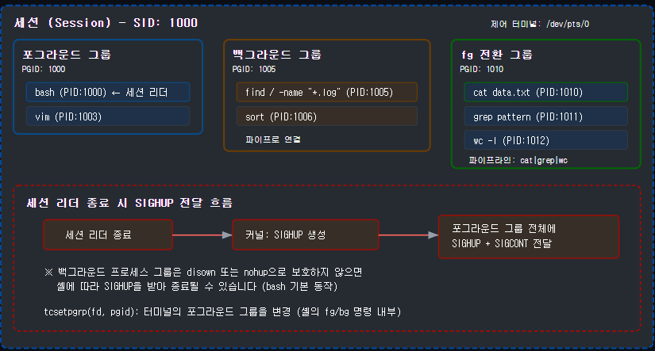

#### 관련 시스템 콜
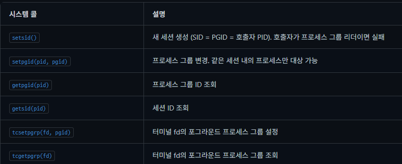

#### 커널 내부 구현
```c
/* kernel/sys.c - setsid() 핵심 구현 (간략화) */
pid_t setsid(void)
{
    struct task_struct *group_leader = current->group_leader;
    struct pid *sid;
    /* 현재 프로세스가 프로세스 그룹 리더이면 실패 (-EPERM) */
    if (group_leader->pid == group_leader->tgid &&
        !list_empty(&group_leader->pids[PIDTYPE_PGID].pid_list))
        return -EPERM;
    /* 새 세션 생성: SID = PGID = PID */
    sid = task_pid(group_leader);
    group_leader->signal->leader = 1;
    set_special_pids(sid);  /* PGID와 SID 모두 설정 */
    /* 제어 터미널 분리 */
    group_leader->signal->tty = NULL;
    return pid_vnr(sid);  /* 네임스페이스 상대 PID 반환 */
}
/* kernel/sys.c - setpgid() 핵심 (간략화) */
long do_setpgid(pid_t pid, pid_t pgid)
{
    /* 같은 세션 내의 프로세스만 대상 가능 */
    /* exec()를 이미 호출한 자식에 대해서는 실패 */
    /* 세션 리더의 PGID는 변경 불가 */
    /* pgid == 0이면 대상 PID를 PGID로 사용 */
    change_pid(p, PIDTYPE_PGID, find_vpid(pgid));
    return 0;
}
```

💡 데몬(Daemon) 프로세스 생성 패턴: 서비스 프로세스를 터미널에서 완전히 분리하려면 "이중 fork" 패턴을 사용합니다.
```c
/* 데몬 프로세스 생성 — 이중 fork 패턴 */
pid_t pid = fork();
if (pid > 0) exit(0);    /* 1단계: 부모 종료 → 고아가 됨 */

setsid();                   /* 2단계: 새 세션 생성 (터미널 분리) */

pid = fork();               /* 3단계: 다시 fork */
if (pid > 0) exit(0);    /* 세션 리더 종료 → 터미널 재획득 방지 */

chdir("/");               /* 작업 디렉터리를 루트로 */
umask(0);                  /* 파일 생성 마스크 초기화 */

/* stdin/stdout/stderr → /dev/null 리다이렉트 */
int fd = open("/dev/null", O_RDWR);
dup2(fd, STDIN_FILENO);
dup2(fd, STDOUT_FILENO);
dup2(fd, STDERR_FILENO);
if (fd > 2) close(fd);
```

현대 시스템에서는 systemd가 데몬 관리를 담당하므로, 직접 이 패턴을 구현할 필요는 줄었지만, 커널 관점에서 세션과 프로세스 그룹의 동작 원리를 이해하는 데 중요합니다.

## 시그널 전달 메커니즘 (Signal Delivery Mechanism)
시그널(Signal)은 프로세스 간 또는 커널과 프로세스 간의 비동기 알림 메커니즘입니다. 리눅스 커널에서 시그널의 생성부터 핸들러 실행, 컨텍스트 복원까지의 전체 전달 경로를 살펴봅니다.

### 시그널 생성 (Signal Generation)
시그널은 다양한 경로로 생성됩니다:

- 사용자 공간: kill(), tkill(), tgkill(), raise() 시스템 콜
- 커널 내부: 하드웨어 예외(SIGSEGV, SIGFPE), 타이머(Timer) 만료(SIGALRM), 파이프 닫힘(SIGPIPE)
- 터미널 드라이버: Ctrl+C(SIGINT), Ctrl+\(SIGQUIT), Ctrl+Z(SIGTSTP)

### 시그널 대기열 (Signal Pending)
시그널은 두 가지 대기열에 저장됩니다:

- 스레드별 대기열 (task_struct->pending): tkill()이나 tgkill()로 특정 스레드에 보낸 시그널
- 프로세스(공유) 대기열 (signal_struct->shared_pending): kill()로 프로세스에 보낸 시그널. 아무 스레드나 처리 가능

표준 시그널(1~31)은 비트마스크로 관리되므로 동일 시그널이 중복 대기되지 않습니다. 반면 실시간 시그널(RT Signal, SIGRTMIN~SIGRTMAX)은 큐에 개별 항목으로 저장되어 여러 개가 누적되고, 부가  데이터(siginfo_t)도 전달할 수 있습니다.

### 시그널 전달 흐름
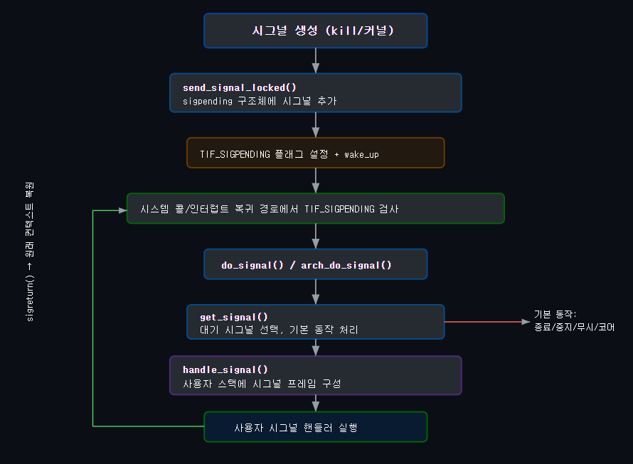

### send_signal() 핵심 구현
```c
/* kernel/signal.c - send_signal_locked() 핵심 (간략화) */
static int send_signal_locked(int sig, struct kernel_siginfo *info,
                              struct task_struct *t,
                              enum pid_type type)
{
    struct sigpending *pending;
    struct sigqueue *q;
    /* 스레드별 vs 프로세스(공유) 시그널 대기열 선택 */
    pending = (type != PIDTYPE_PID) ?
              &t->signal->shared_pending : &t->pending;
    /* 표준 시그널: 이미 대기 중이면 무시 (중복 방지) */
    if (sig < SIGRTMIN && sigismember(&pending->signal, sig))
        goto out;
    /* sigset 비트마스크에 시그널 비트 설정 */
    sigaddset(&pending->signal, sig);
    /* RT 시그널이거나 siginfo가 있는 경우: sigqueue 할당하여 큐잉 */
    if (sig >= SIGRTMIN || info != SEND_SIG_NOINFO) {
        q = __sigqueue_alloc(sig, t, GFP_ATOMIC, override_rlimit);
        if (q) {
            list_add_tail(&q->list, &pending->list);
            q->info = *info;  /* siginfo 복사 */
        }
    }
out:
    /* TIF_SIGPENDING 설정 및 대상 프로세스 깨우기 */
    signal_wake_up(t, sig == SIGKILL);
    return 0;
}
```


